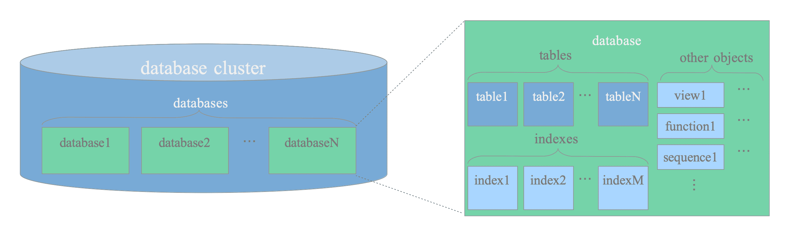

# Image Manifest — The Internals of PostgreSQL

Source: https://www.interdb.jp/pg/
All images are stored in `docs/images/chXX/`

> **Note:** This manifest was generated based on downloaded images. Captions should be filled in by visiting the source pages.
> To populate captions, visit each chapter's sub-pages:
> - Chapter 1: https://www.interdb.jp/pg/pgsql01.html (sub-pages 01.html through 06.html)
> - Chapter 2: https://www.interdb.jp/pg/pgsql02.html (sub-pages 01.html through 02.html)
> - Chapter 3: https://www.interdb.jp/pg/pgsql03.html (sub-pages 01.html through 06.html)
> - Chapter 5: https://www.interdb.jp/pg/pgsql05.html (sub-pages 01.html through 10.html)
> - Chapter 6: https://www.interdb.jp/pg/pgsql06.html (sub-pages 01.html through 04.html)
> - Chapter 7: https://www.interdb.jp/pg/pgsql07.html (sub-pages 01.html through 02.html)
> - Chapter 8: https://www.interdb.jp/pg/pgsql08.html (sub-pages 01.html through 05.html)
> - Chapter 9: https://www.interdb.jp/pg/pgsql09.html (sub-pages 01.html through 10.html)
> - Chapter 10: https://www.interdb.jp/pg/pgsql10.html (sub-pages 01.html through 04.html)
> - Chapter 11: https://www.interdb.jp/pg/pgsql11.html (sub-pages 01.html through 04.html)

## Chapter 1: Database Cluster, Databases, and Tables

**Source:** https://www.interdb.jp/pg/pgsql01.html

| File | Figure | Caption |
|------|--------|---------|
| ch01/fig-1-01.png | Fig 1.1 | [Caption TBD - Visit source page] |
| ch01/fig-1-02.png | Fig 1.2 | [Caption TBD - Visit source page] |
| ch01/fig-1-03.png | Fig 1.3 | [Caption TBD - Visit source page] |
| ch01/fig-1-04.png | Fig 1.4 | [Caption TBD - Visit source page] |
| ch01/fig-1-05.png | Fig 1.5 | [Caption TBD - Visit source page] |
| ch01/fig-1-06.png | Fig 1.6 | [Caption TBD - Visit source page] |

## Chapter 2: Process and Memory Architecture

**Source:** https://www.interdb.jp/pg/pgsql02.html

| File | Figure | Caption |
|------|--------|---------|
| ch02/fig-2-01.png | Fig 2.1 | [Caption TBD - Visit source page] |
| ch02/fig-2-02.png | Fig 2.2 | [Caption TBD - Visit source page] |

## Chapter 3: Query Processing

**Source:** https://www.interdb.jp/pg/pgsql03.html

| File | Figure | Caption |
|------|--------|---------|
| ch03/fig-3-01.png | Fig 3.1 | [Caption TBD - Visit source page] |
| ch03/fig-3-02.png | Fig 3.2 | [Caption TBD - Visit source page] |
| ch03/fig-3-03.png | Fig 3.3 | [Caption TBD - Visit source page] |
| ch03/fig-3-04.png | Fig 3.4 | [Caption TBD - Visit source page] |
| ch03/fig-3-05.png | Fig 3.5 | [Caption TBD - Visit source page] |
| ch03/fig-3-06.png | Fig 3.6 | [Caption TBD - Visit source page] |
| ch03/fig-3-07.png | Fig 3.7 | [Caption TBD - Visit source page] |
| ch03/fig-3-08.png | Fig 3.8 | [Caption TBD - Visit source page] |
| ch03/fig-3-09.png | Fig 3.9 | [Caption TBD - Visit source page] |
| ch03/fig-3-10.png | Fig 3.10 | [Caption TBD - Visit source page] |
| ch03/fig-3-11.png | Fig 3.11 | [Caption TBD - Visit source page] |
| ch03/fig-3-12.png | Fig 3.12 | [Caption TBD - Visit source page] |
| ch03/fig-3-13.png | Fig 3.13 | [Caption TBD - Visit source page] |
| ch03/fig-3-14.png | Fig 3.14 | [Caption TBD - Visit source page] |
| ch03/fig-3-15.png | Fig 3.15 | [Caption TBD - Visit source page] |
| ch03/fig-3-16.png | Fig 3.16 | [Caption TBD - Visit source page] |
| ch03/fig-3-17.png | Fig 3.17 | [Caption TBD - Visit source page] |
| ch03/fig-3-18.png | Fig 3.18 | [Caption TBD - Visit source page] |
| ch03/fig-3-19.png | Fig 3.19 | [Caption TBD - Visit source page] |
| ch03/fig-3-20.png | Fig 3.20 | [Caption TBD - Visit source page] |
| ch03/fig-3-21.png | Fig 3.21 | [Caption TBD - Visit source page] |
| ch03/fig-3-22.png | Fig 3.22 | [Caption TBD - Visit source page] |
| ch03/fig-3-23.png | Fig 3.23 | [Caption TBD - Visit source page] |
| ch03/fig-3-24.png | Fig 3.24 | [Caption TBD - Visit source page] |
| ch03/fig-3-25.png | Fig 3.25 | [Caption TBD - Visit source page] |
| ch03/fig-3-26.png | Fig 3.26 | [Caption TBD - Visit source page] |
| ch03/fig-3-27.png | Fig 3.27 | [Caption TBD - Visit source page] |
| ch03/fig-3-28.png | Fig 3.28 | [Caption TBD - Visit source page] |
| ch03/fig-3-29.png | Fig 3.29 | [Caption TBD - Visit source page] |
| ch03/fig-3-30.png | Fig 3.30 | [Caption TBD - Visit source page] |

## Chapter 5: Concurrency Control

**Source:** https://www.interdb.jp/pg/pgsql05.html

| File | Figure | Caption |
|------|--------|---------|
| ch05/fig-5-01.png | Fig 5.1 | [Caption TBD - Visit source page] |
| ch05/fig-5-02.png | Fig 5.2 | [Caption TBD - Visit source page] |
| ch05/fig-5-03.png | Fig 5.3 | [Caption TBD - Visit source page] |
| ch05/fig-5-04.png | Fig 5.4 | [Caption TBD - Visit source page] |
| ch05/fig-5-05.png | Fig 5.5 | [Caption TBD - Visit source page] |
| ch05/fig-5-06.png | Fig 5.6 | [Caption TBD - Visit source page] |
| ch05/fig-5-07.png | Fig 5.7 | [Caption TBD - Visit source page] |
| ch05/fig-5-08.png | Fig 5.8 | [Caption TBD - Visit source page] |
| ch05/fig-5-09.png | Fig 5.9 | [Caption TBD - Visit source page] |
| ch05/fig-5-10.png | Fig 5.10 | [Caption TBD - Visit source page] |
| ch05/fig-5-11.png | Fig 5.11 | [Caption TBD - Visit source page] |
| ch05/fig-5-12.png | Fig 5.12 | [Caption TBD - Visit source page] |
| ch05/fig-5-13.png | Fig 5.13 | [Caption TBD - Visit source page] |
| ch05/fig-5-14.png | Fig 5.14 | [Caption TBD - Visit source page] |
| ch05/fig-5-15.png | Fig 5.15 | [Caption TBD - Visit source page] |
| ch05/fig-5-16.png | Fig 5.16 | [Caption TBD - Visit source page] |
| ch05/fig-5-17.png | Fig 5.17 | [Caption TBD - Visit source page] |
| ch05/fig-5-18.png | Fig 5.18 | [Caption TBD - Visit source page] |
| ch05/fig-5-19.png | Fig 5.19 | [Caption TBD - Visit source page] |
| ch05/fig-5-20.png | Fig 5.20 | [Caption TBD - Visit source page] |
| ch05/fig-5-21.png | Fig 5.21 | [Caption TBD - Visit source page] |
| ch05/fig-5-22.png | Fig 5.22 | [Caption TBD - Visit source page] |

## Chapter 6: VACUUM Processing

**Source:** https://www.interdb.jp/pg/pgsql06.html

| File | Figure | Caption |
|------|--------|---------|
| ch06/fig-6-01.png | Fig 6.1 | [Caption TBD - Visit source page] |
| ch06/fig-6-02.png | Fig 6.2 | [Caption TBD - Visit source page] |
| ch06/fig-6-03.png | Fig 6.3 | [Caption TBD - Visit source page] |
| ch06/fig-6-04.png | Fig 6.4 | [Caption TBD - Visit source page] |
| ch06/fig-6-05.png | Fig 6.5 | [Caption TBD - Visit source page] |
| ch06/fig-6-06.png | Fig 6.6 | [Caption TBD - Visit source page] |
| ch06/fig-6-07.png | Fig 6.7 | [Caption TBD - Visit source page] |
| ch06/fig-6-08.png | Fig 6.8 | [Caption TBD - Visit source page] |
| ch06/fig-6-09.png | Fig 6.9 | [Caption TBD - Visit source page] |
| ch06/fig-6-10.png | Fig 6.10 | [Caption TBD - Visit source page] |
| ch06/fig-6-11.png | Fig 6.11 | [Caption TBD - Visit source page] |

## Chapter 7: HOT and Index-Only Scans

**Source:** https://www.interdb.jp/pg/pgsql07.html

| File | Figure | Caption |
|------|--------|---------|
| ch07/fig-7-01.png | Fig 7.1 | [Caption TBD - Visit source page] |
| ch07/fig-7-02.png | Fig 7.2 | [Caption TBD - Visit source page] |
| ch07/fig-7-03.png | Fig 7.3 | [Caption TBD - Visit source page] |
| ch07/fig-7-04.png | Fig 7.4 | [Caption TBD - Visit source page] |
| ch07/fig-7-05.png | Fig 7.5 | [Caption TBD - Visit source page] |
| ch07/fig-7-06.png | Fig 7.6 | [Caption TBD - Visit source page] |
| ch07/fig-7-07.png | Fig 7.7 | [Caption TBD - Visit source page] |

## Chapter 8: Buffer Manager

**Source:** https://www.interdb.jp/pg/pgsql08.html

| File | Figure | Caption |
|------|--------|---------|
| ch08/fig-8-01.png | Fig 8.1 | [Caption TBD - Visit source page] |
| ch08/fig-8-02.png | Fig 8.2 | [Caption TBD - Visit source page] |
| ch08/fig-8-03.png | Fig 8.3 | [Caption TBD - Visit source page] |
| ch08/fig-8-04.png | Fig 8.4 | [Caption TBD - Visit source page] |
| ch08/fig-8-05.png | Fig 8.5 | [Caption TBD - Visit source page] |
| ch08/fig-8-06.png | Fig 8.6 | [Caption TBD - Visit source page] |
| ch08/fig-8-07.png | Fig 8.7 | [Caption TBD - Visit source page] |
| ch08/fig-8-08.png | Fig 8.8 | [Caption TBD - Visit source page] |
| ch08/fig-8-09.png | Fig 8.9 | [Caption TBD - Visit source page] |
| ch08/fig-8-10.png | Fig 8.10 | [Caption TBD - Visit source page] |
| ch08/fig-8-11.png | Fig 8.11 | [Caption TBD - Visit source page] |
| ch08/fig-8-12.png | Fig 8.12 | [Caption TBD - Visit source page] |
| ch08/fig-8-13.png | Fig 8.13 | [Caption TBD - Visit source page] |

## Chapter 9: Write-Ahead Logging (WAL)

**Source:** https://www.interdb.jp/pg/pgsql09.html

| File | Figure | Caption |
|------|--------|---------|
| ch09/fig-9-01.png | Fig 9.1 | [Caption TBD - Visit source page] |
| ch09/fig-9-02.png | Fig 9.2 | [Caption TBD - Visit source page] |
| ch09/fig-9-03.png | Fig 9.3 | [Caption TBD - Visit source page] |
| ch09/fig-9-04.png | Fig 9.4 | [Caption TBD - Visit source page] |
| ch09/fig-9-05.png | Fig 9.5 | [Caption TBD - Visit source page] |
| ch09/fig-9-06.png | Fig 9.6 | [Caption TBD - Visit source page] |
| ch09/fig-9-07.png | Fig 9.7 | [Caption TBD - Visit source page] |
| ch09/fig-9-08.png | Fig 9.8 | [Caption TBD - Visit source page] |
| ch09/fig-9-09.png | Fig 9.9 | [Caption TBD - Visit source page] |
| ch09/fig-9-10.png | Fig 9.10 | [Caption TBD - Visit source page] |
| ch09/fig-9-11.png | Fig 9.11 | [Caption TBD - Visit source page] |
| ch09/fig-9-12.png | Fig 9.12 | [Caption TBD - Visit source page] |
| ch09/fig-9-13.png | Fig 9.13 | [Caption TBD - Visit source page] |
| ch09/fig-9-14.png | Fig 9.14 | [Caption TBD - Visit source page] |
| ch09/fig-9-15.png | Fig 9.15 | [Caption TBD - Visit source page] |
| ch09/fig-9-16.png | Fig 9.16 | [Caption TBD - Visit source page] |
| ch09/fig-9-17.png | Fig 9.17 | [Caption TBD - Visit source page] |
| ch09/fig-9-18.png | Fig 9.18 | [Caption TBD - Visit source page] |
| ch09/fig-9-19.png | Fig 9.19 | [Caption TBD - Visit source page] |
| ch09/fig-9-20.png | Fig 9.20 | [Caption TBD - Visit source page] |
| ch09/fig-9-21.png | Fig 9.21 | [Caption TBD - Visit source page] |
| ch09/fig-9-22.png | Fig 9.22 | [Caption TBD - Visit source page] |
| ch09/fig-9-23.png | Fig 9.23 | [Caption TBD - Visit source page] |
| ch09/fig-9-24.png | Fig 9.24 | [Caption TBD - Visit source page] |
| ch09/fig-9-25.png | Fig 9.25 | [Caption TBD - Visit source page] |

## Chapter 10: Base Backup and Point-In-Time Recovery

**Source:** https://www.interdb.jp/pg/pgsql10.html

| File | Figure | Caption |
|------|--------|---------|
| ch10/fig-10-01.png | Fig 10.1 | [Caption TBD - Visit source page] |
| ch10/fig-10-02.png | Fig 10.2 | [Caption TBD - Visit source page] |
| ch10/fig-10-03.png | Fig 10.3 | [Caption TBD - Visit source page] |
| ch10/fig-10-04.png | Fig 10.4 | [Caption TBD - Visit source page] |
| ch10/fig-10-05.png | Fig 10.5 | [Caption TBD - Visit source page] |
| ch10/fig-10-06.png | Fig 10.6 | [Caption TBD - Visit source page] |
| ch10/fig-10-07.png | Fig 10.7 | [Caption TBD - Visit source page] |
| ch10/fig-10-08.png | Fig 10.8 | [Caption TBD - Visit source page] |
| ch10/fig-10-09.png | Fig 10.9 | [Caption TBD - Visit source page] |
| ch10/fig-10-10.png | Fig 10.10 | [Caption TBD - Visit source page] |
| ch10/fig-10-11.png | Fig 10.11 | [Caption TBD - Visit source page] |

## Chapter 11: Streaming Replication

**Source:** https://www.interdb.jp/pg/pgsql11.html

| File | Figure | Caption |
|------|--------|---------|
| ch11/fig-11-01.png | Fig 11.1 | [Caption TBD - Visit source page] |
| ch11/fig-11-02.png | Fig 11.2 | [Caption TBD - Visit source page] |
| ch11/fig-11-03.png | Fig 11.3 | [Caption TBD - Visit source page] |
| ch11/fig-11-04.png | Fig 11.4 | [Caption TBD - Visit source page] |
| ch11/fig-11-05.png | Fig 11.5 | [Caption TBD - Visit source page] |
| ch11/fig-11-06.png | Fig 11.6 | [Caption TBD - Visit source page] |
| ch11/fig-11-07.png | Fig 11.7 | [Caption TBD - Visit source page] |
| ch11/fig-11-08.png | Fig 11.8 | [Caption TBD - Visit source page] |
| ch11/fig-11-09.png | Fig 11.9 | [Caption TBD - Visit source page] |
| ch11/fig-11-10.png | Fig 11.10 | [Caption TBD - Visit source page] |
| ch11/fig-11-11.png | Fig 11.11 | [Caption TBD - Visit source page] |

---

## Image-to-Note Mapping

This section maps the most relevant images from each chapter to your learning notes based on content analysis.

### notes/01-architecture-and-os.md
**Topics:** Process architecture, memory structure, background workers, shared memory, IPC

**Relevant Images:**
- `ch02/fig-2-01.png` — Process architecture overview (postmaster and backend processes)
- `ch02/fig-2-02.png` — Memory architecture (shared buffers, process memory)
- `ch08/fig-8-01.png` — Buffer manager architecture
- `ch08/fig-8-02.png` — Shared buffer pool structure
- `ch08/fig-8-03.png` — Buffer descriptor and buffer table

### notes/02-storage-and-filesystem.md
**Topics:** PGDATA structure, page layout, TOAST, tablespaces, file I/O

**Relevant Images:**
- `ch01/fig-1-01.png` — Database cluster logical structure
- `ch01/fig-1-02.png` — Physical layout of database files
- `ch01/fig-1-03.png` — Page structure (8KB page layout)
- `ch01/fig-1-04.png` — Tuple structure
- `ch01/fig-1-05.png` — TOAST mechanism
- `ch01/fig-1-06.png` — Tablespace structure

### notes/03-wal-and-reliability.md
**Topics:** WAL mechanism, checkpoints, fsync, full page writes, recovery

**Relevant Images:**
- `ch09/fig-9-01.png` — WAL architecture overview
- `ch09/fig-9-02.png` — WAL buffer and WAL writer
- `ch09/fig-9-03.png` — WAL record structure
- `ch09/fig-9-04.png` — Full page writes mechanism
- `ch09/fig-9-05.png` — Checkpoint process
- `ch09/fig-9-06.png` — WAL segment files
- `ch09/fig-9-07.png` — LSN (Log Sequence Number) structure
- `ch10/fig-10-01.png` — Base backup process
- `ch10/fig-10-02.png` — PITR (Point-In-Time Recovery)

### notes/04-mvcc-and-concurrency.md
**Topics:** Transaction IDs, tuple visibility, isolation levels, locks, SSI

**Relevant Images:**
- `ch05/fig-5-01.png` — Transaction ID and snapshot
- `ch05/fig-5-02.png` — Tuple visibility rules (xmin/xmax)
- `ch05/fig-5-03.png` — MVCC tuple versions
- `ch05/fig-5-04.png` — Transaction snapshot mechanism
- `ch05/fig-5-05.png` — Commit log (CLOG) structure
- `ch05/fig-5-06.png` — Lock manager architecture
- `ch05/fig-5-07.png` — Table-level locks
- `ch05/fig-5-08.png` — Row-level locks
- `ch05/fig-5-09.png` — Deadlock detection
- `ch05/fig-5-10.png` — Serializable Snapshot Isolation (SSI)

### notes/05-vacuum-and-maintenance.md
**Topics:** Dead tuples, vacuum process, autovacuum, bloat, freezing

**Relevant Images:**
- `ch06/fig-6-01.png` — Dead tuple accumulation
- `ch06/fig-6-02.png` — VACUUM process overview
- `ch06/fig-6-03.png` — Free Space Map (FSM)
- `ch06/fig-6-04.png` — Visibility Map (VM)
- `ch06/fig-6-05.png` — VACUUM vs VACUUM FULL
- `ch06/fig-6-06.png` — Autovacuum workers
- `ch06/fig-6-07.png` — Transaction ID wraparound
- `ch06/fig-6-08.png` — Freezing tuples
- `ch07/fig-7-01.png` — HOT (Heap-Only Tuple) updates
- `ch07/fig-7-02.png` — Index-Only Scans with VM

### notes/06-indexes.md
**Topics:** B-tree indexes, index types, index scans, covering indexes

**Relevant Images:**
- `ch03/fig-3-01.png` — Query processing overview (parser, planner, executor)
- `ch03/fig-3-02.png` — Index scan vs Sequential scan
- `ch03/fig-3-03.png` — B-tree index structure
- `ch03/fig-3-04.png` — Bitmap index scan
- `ch07/fig-7-03.png` — Index-Only Scan mechanism
- `ch07/fig-7-04.png` — HOT update and index maintenance

### notes/07-query-optimization.md
**Topics:** Query planner, cost estimation, join strategies, EXPLAIN

**Relevant Images:**
- `ch03/fig-3-05.png` — Cost-based optimizer
- `ch03/fig-3-06.png` — Statistics and selectivity
- `ch03/fig-3-07.png` — Nested Loop Join
- `ch03/fig-3-08.png` — Hash Join
- `ch03/fig-3-09.png` — Merge Join
- `ch03/fig-3-10.png` — Join order selection
- `ch03/fig-3-11.png` — Subquery optimization
- `ch03/fig-3-12.png` — Parallel query execution

### notes/08-data-modeling.md
**Topics:** Schema design, normalization, partitioning, constraints

**Relevant Images:**
- `ch01/fig-1-01.png` — Database cluster and database organization
- `ch03/fig-3-13.png` — Partition pruning
- `ch03/fig-3-14.png` — Partition-wise join

### notes/09-advanced-sql.md
**Topics:** Window functions, CTEs, aggregations, set operations

**Relevant Images:**
- `ch03/fig-3-15.png` — Window function execution
- `ch03/fig-3-16.png` — CTE (Common Table Expression) optimization
- `ch03/fig-3-17.png` — Aggregate function processing

### notes/10-plpgsql.md
**Topics:** Stored procedures, functions, triggers, PL/pgSQL

**Relevant Images:**
- `ch03/fig-3-18.png` — Function execution in executor
- `ch03/fig-3-19.png` — Trigger mechanism

### notes/11-partitioning.md
**Topics:** Table partitioning strategies, partition management

**Relevant Images:**
- `ch03/fig-3-20.png` — Range partitioning
- `ch03/fig-3-21.png` — List partitioning
- `ch03/fig-3-22.png` — Hash partitioning
- `ch03/fig-3-23.png` — Partition-wise operations

### notes/12-security.md
**Topics:** Authentication, authorization, encryption, row-level security

**Relevant Images:**
- `ch02/fig-2-01.png` — Connection and authentication flow
- `ch05/fig-5-11.png` — Row-level security checks

### notes/13-backup-replication.md
**Topics:** Backup strategies, PITR, streaming replication, failover

**Relevant Images:**
- `ch10/fig-10-03.png` — pg_basebackup process
- `ch10/fig-10-04.png` — WAL archiving
- `ch10/fig-10-05.png` — PITR timeline
- `ch10/fig-10-06.png` — Recovery configuration
- `ch11/fig-11-01.png` — Streaming replication architecture
- `ch11/fig-11-02.png` — WAL sender and WAL receiver
- `ch11/fig-11-03.png` — Replication slots
- `ch11/fig-11-04.png` — Synchronous replication
- `ch11/fig-11-05.png` — Asynchronous replication
- `ch11/fig-11-06.png` — Cascading replication
- `ch11/fig-11-07.png` — Logical replication

### notes/14-monitoring-and-tuning.md
**Topics:** Performance monitoring, statistics, pg_stat views, tuning parameters

**Relevant Images:**
- `ch08/fig-8-04.png` — Buffer cache hit ratio
- `ch08/fig-8-05.png` — Clock sweep algorithm (LRU replacement)
- `ch08/fig-8-06.png` — Buffer ring mechanism
- `ch08/fig-8-07.png` — Buffer eviction strategy
- `ch09/fig-9-08.png` — WAL statistics and monitoring
- `ch09/fig-9-09.png` — Checkpoint tuning

---

## Quick Reference by Topic

### Architecture & Internals
- **Process Model:** ch02/fig-2-01.png, ch02/fig-2-02.png
- **Memory Structure:** ch08/fig-8-01.png through ch08/fig-8-13.png
- **File Layout:** ch01/fig-1-01.png through ch01/fig-1-06.png

### Transaction Processing
- **MVCC:** ch05/fig-5-01.png through ch05/fig-5-10.png
- **WAL:** ch09/fig-9-01.png through ch09/fig-9-25.png
- **Locks:** ch05/fig-5-06.png through ch05/fig-5-09.png

### Query Execution
- **Planning:** ch03/fig-3-01.png through ch03/fig-3-12.png
- **Joins:** ch03/fig-3-07.png through ch03/fig-3-10.png
- **Partitioning:** ch03/fig-3-13.png, ch03/fig-3-14.png, ch03/fig-3-20.png through ch03/fig-3-23.png

### Maintenance & Operations
- **VACUUM:** ch06/fig-6-01.png through ch06/fig-6-11.png
- **HOT & Index-Only:** ch07/fig-7-01.png through ch07/fig-7-07.png
- **Backup & Recovery:** ch10/fig-10-01.png through ch10/fig-10-11.png
- **Replication:** ch11/fig-11-01.png through ch11/fig-11-11.png

---

## Notes

1. **Caption Population:** To fill in the actual captions, visit each chapter's sub-pages on the source website and match the figure numbers to the descriptions.

2. **Image Relevance:** The image-to-note mappings are based on content analysis of your notes and typical PostgreSQL documentation structure. Actual relevance may vary based on the specific diagrams.

3. **Missing Chapters:** Chapter 4 is not included as there are no downloaded images for it in your directory.

4. **Usage in Notes:** When referencing images in your markdown notes, use relative paths like:
   ```markdown
   
   ```

5. **Updates:** As you populate the captions by visiting the source pages, replace `[Caption TBD - Visit source page]` with the actual caption text from the website.

---

**Last Updated:** 2026-02-01
**Manifest Version:** 1.0 (Template)
**Total Images:** 147 images across 10 chapters
