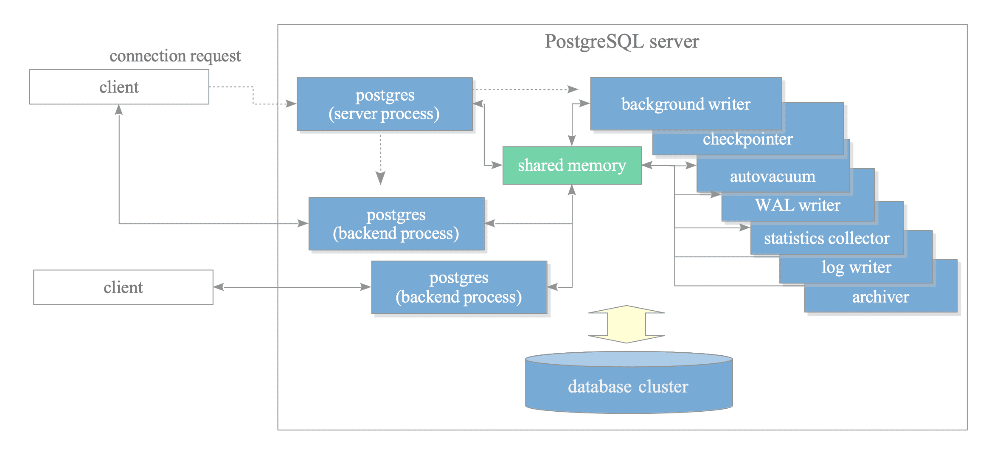
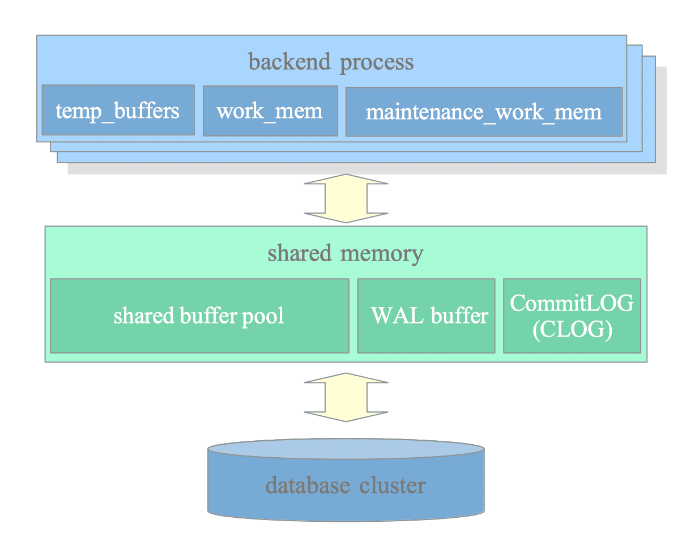

# PostgreSQL 아키텍처와 OS 프로세스 모델

## 한줄 요약

PostgreSQL은 클라이언트 요청마다 postmaster가 fork()로 독립적인 백엔드 프로세스를 생성하는 멀티프로세스 아키텍처를 사용하며, 공유 메모리와 IPC를 통해 프로세스 간 통신을 수행합니다.

> 📖 이 노트의 다이어그램은 [The Internals of PostgreSQL](https://www.interdb.jp/pg/)에서 가져왔습니다.

## 실습 환경

이 노트의 모든 실습은 `docker/` 디렉토리의 환경을 사용합니다.

```bash
# 실습 환경 시작
cd docker && docker compose up -d

# PostgreSQL 접속
docker exec -it pg17-lab psql -U labuser -d ecommerce

# 컨테이너 셸 접속 (OS 레벨 실습용)
docker exec -it pg17-lab bash
```

주요 설정값 (`docker/postgresql.conf`):
- `shared_buffers = 128MB`
- `max_connections = 100`
- `work_mem = 4MB`
- `log_statement = 'all'`

---

## 왜 알아야 하는가

### 성능 문제 진단의 출발점

프로덕션 환경에서 갑자기 응답이 느려졌을 때, `ps aux | grep postgres`로 프로세스 목록을 확인하면 수백 개의 백엔드 프로세스가 보일 수 있습니다. 이것이 정상인지, 문제인지 판단하려면 PostgreSQL의 프로세스 모델을 이해해야 합니다.

### 리소스 설정의 근거

`shared_buffers` 설정값이 OS 공유 메모리 한계를 초과하면 PostgreSQL이 시작조차 되지 않습니다. `shmmax`, `shmall` 같은 OS 커널 파라미터와 PostgreSQL 설정의 관계를 알아야 적절히 튜닝할 수 있습니다.

### 멀티테넌시 환경 설계

이커머스 플랫폼에서 동시 접속자 1만 명을 처리해야 한다면, 각각에 백엔드 프로세스를 할당할 것인가? Connection pooling을 쓸 것인가? 아키텍처를 이해해야 올바른 설계가 가능합니다.

### 장애 격리와 안정성

한 쿼리가 메모리를 과도하게 사용해도 다른 세션은 영향을 받지 않습니다. 프로세스 기반 아키텍처가 주는 격리 효과를 이해하면 시스템의 안정성을 더 잘 보장할 수 있습니다.

---

## 1. 클라이언트 요청 처리 전체 흐름

```
[클라이언트 애플리케이션]
         |
         | TCP/IP (5432) 또는 Unix Domain Socket
         v
    [postmaster 프로세스]
         |
         | fork() 시스템 콜
         v
    [postgres 백엔드 프로세스]
         |
         | 1. Parser (구문 분석)
         v
         | 2. Rewriter (규칙 적용)
         v
         | 3. Planner (실행 계획 생성)
         v
         | 4. Executor (실행)
         v
    [결과 반환]
```

### 단계별 상세 설명

**1단계: 클라이언트 연결**
- 클라이언트가 TCP 5432 포트 또는 Unix socket으로 연결 요청
- postmaster 프로세스가 listen() 상태로 대기 중

**2단계: 백엔드 프로세스 생성**
- postmaster가 fork() 시스템 콜로 자식 프로세스 생성
- 새 프로세스는 클라이언트와 1:1 매핑
- 인증 수행 (pg_hba.conf 규칙 적용)

**3단계: 쿼리 처리 파이프라인**
- **Parser**: SQL 문자열을 파싱 트리로 변환
- **Rewriter**: 뷰, 규칙 등을 적용해 쿼리 재작성
- **Planner**: 통계 정보를 바탕으로 최적 실행 계획 생성
- **Executor**: 실제로 데이터 접근 및 연산 수행

**4단계: 결과 반환 및 세션 유지**
- 결과를 클라이언트에 전송
- 연결이 유지되는 동안 백엔드 프로세스는 계속 살아있음
- 클라이언트가 연결을 끊으면 프로세스 종료

### ✅ 직접 확인: 쿼리 파이프라인 추적

```sql
-- Parser → Planner 결과를 EXPLAIN으로 확인
EXPLAIN (VERBOSE, COSTS)
SELECT u.email, COUNT(o.order_id) AS order_count
FROM users u
LEFT JOIN orders o ON u.user_id = o.user_id
WHERE u.created_at > CURRENT_DATE - INTERVAL '30 days'
GROUP BY u.email
HAVING COUNT(o.order_id) > 5
ORDER BY order_count DESC
LIMIT 10;

-- Executor까지 포함한 실제 실행 (ANALYZE 추가)
EXPLAIN (ANALYZE, BUFFERS, VERBOSE)
SELECT u.email, COUNT(o.order_id) AS order_count
FROM users u
LEFT JOIN orders o ON u.user_id = o.user_id
WHERE u.created_at > CURRENT_DATE - INTERVAL '30 days'
GROUP BY u.email
HAVING COUNT(o.order_id) > 5
ORDER BY order_count DESC
LIMIT 10;
```

---

## 2. OS 관점: 프로세스 모델


*PostgreSQL 프로세스 아키텍처 (postmaster, backend, background workers)*

> **🔍 그림 해설**
>
> PostgreSQL의 프로세스 구조를 호텔에 비유하면 이해하기 쉽습니다. 가장 중앙에 있는 postmaster는 호텔의 프런트 데스크 직원과 같습니다. 손님(클라이언트)이 도착하면 프런트 직원이 직접 서비스를 제공하는 것이 아니라, 각 손님마다 전담 집사(backend process)를 배정합니다. 이렇게 하면 한 손님의 문제가 다른 손님에게 영향을 주지 않죠. 그림 주변에 보이는 background writer, checkpointer, WAL writer 같은 프로세스들은 호텔의 유지보수 직원들입니다. 청소부(autovacuum)는 주기적으로 불필요한 것들을 정리하고, 보안 카메라 담당자(logger)는 모든 활동을 기록하며, 백업 발전기 관리자(WAL writer)는 만약의 사고에 대비합니다. 이들은 모두 shared memory라는 공용 게시판을 통해 정보를 공유합니다. 이런 구조 덕분에 한 세션에서 문제가 생겨도 전체 시스템이 멈추지 않습니다.

### postmaster의 역할

postmaster는 PostgreSQL의 "마스터" 프로세스로, 다음 역할을 수행합니다:

1. **서버 시작 시 초기화**
   - 공유 메모리 할당
   - 시스템 카탈로그 검증
   - 백그라운드 워커 프로세스 시작

2. **연결 수락 및 분배**
   - 클라이언트 연결을 listen
   - 각 연결마다 fork()로 백엔드 생성

3. **프로세스 감시**
   - 자식 프로세스 상태 모니터링
   - 비정상 종료 감지 및 복구

### ✅ 직접 확인: 프로세스 목록과 트리

컨테이너 셸에서:
```bash
# PostgreSQL 프로세스 목록
ps aux | grep postgres

# 프로세스 트리 (부모-자식 관계 확인)
ps auxf | grep postgres
```

예상 출력:
```
postgres     1  ...  postgres
postgres    10  ...  postgres: checkpointer
postgres    11  ...  postgres: background writer
postgres    12  ...  postgres: walwriter
postgres    13  ...  postgres: autovacuum launcher
postgres    14  ...  postgres: logical replication launcher
```

SQL로도 확인:
```sql
-- 현재 연결된 모든 프로세스
SELECT
    pid,
    backend_type,
    usename,
    application_name,
    client_addr,
    state,
    backend_start
FROM pg_stat_activity
ORDER BY backend_start;
```

### fork() 기반 프로세스 생성

PostgreSQL이 각 연결마다 새 프로세스를 fork하는 이유:

**장점:**
1. **메모리 격리**: 한 세션의 메모리 오버플로우가 다른 세션에 영향 없음
2. **크래시 격리**: 한 백엔드가 죽어도 다른 세션은 계속 동작
3. **보안**: 각 프로세스는 독립적인 주소 공간을 가짐
4. **이식성**: POSIX 표준으로 다양한 OS에서 동일하게 동작

**단점:**
1. **메모리 오버헤드**: 각 프로세스마다 최소 수 MB 사용
2. **컨텍스트 스위칭 비용**: 프로세스 전환은 스레드보다 무거움
3. **생성 비용**: fork()는 상대적으로 느림 (connection pooling으로 완화)

### 왜 쓰레드가 아닌 프로세스인가?

PostgreSQL이 처음 개발된 1990년대에는:
- 멀티스레딩이 OS마다 구현이 달랐음
- POSIX threads 표준이 불안정했음
- fork()가 더 안정적이고 이식성이 높았음

현재도 프로세스 모델을 유지하는 이유:
- **안정성**: 30년간 검증된 아키텍처
- **격리성**: 프로세스 격리가 주는 안전성
- **확장성**: 대부분 시나리오에서 충분한 성능
- **변경 비용**: 스레드 모델로 전환하려면 전체 재작성 필요

### ✅ 직접 확인: fork()로 백엔드 생성 관찰

**터미널 1** (컨테이너 셸 — 모니터링):
```bash
watch -n 1 'ps aux | grep "postgres:" | grep -v grep | wc -l'
```

**터미널 2** (호스트에서 — 다중 연결 생성):
```bash
# 5개 연결을 동시에 열고 각각 60초 대기
for i in $(seq 1 5); do
    docker exec pg17-lab psql -U labuser -d ecommerce -c "SELECT pg_sleep(60);" &
done
```

**터미널 3** (psql 안에서 — SQL로 확인):
```sql
SELECT pid, state, query
FROM pg_stat_activity
WHERE query LIKE '%pg_sleep%';
```

터미널 1에서 프로세스 수가 5개 늘어나는 것을 확인할 수 있습니다. 60초 후 연결이 끊기면 다시 줄어듭니다.

---

## 3. Background Workers 상세

PostgreSQL을 하나의 **식당**으로 비유하면 이해가 쉽습니다. postmaster는 매니저, backend process는 각 테이블 담당 웨이터입니다. 그런데 식당이 돌아가려면 웨이터만으로는 안 됩니다. 주방 뒤에서 묵묵히 일하는 사람들이 있는데, 그것이 background workers입니다. 이들이 각자의 주기로 동작하면서 backend process가 클라이언트 쿼리 처리에만 집중할 수 있게 합니다.

### checkpointer — "장부 정리 담당"

**하는 일:** 메모리(shared_buffers)에서 수정된 데이터(더티 페이지)를 디스크에 써주는 프로세스

**왜 필요한가:**
PostgreSQL은 성능을 위해 데이터를 바로 디스크에 쓰지 않습니다. 먼저 메모리에 수정하고 나중에 한꺼번에 디스크에 씁니다. 이 "한꺼번에 디스크에 쓰는 시점"이 checkpoint입니다. checkpoint가 없으면 서버가 비정상 종료될 때 WAL로부터 복구해야 하는 양이 너무 많아집니다.

> 편의점 알바가 매 거래마다 금고에 돈을 넣는 게 아니라, 일정 시간마다 계산대 돈을 모아서 금고에 넣는 것과 같습니다.

**트레이드오프:**
- checkpoint가 너무 자주 → 디스크 I/O 부하 증가
- checkpoint가 너무 드물 → 크래시 복구 시간 증가

**현재 실습 환경 설정** (`docker/postgresql.conf`):
```
checkpoint_timeout = 5min          -- 이 간격마다 checkpoint 발생
max_wal_size = 1GB                 -- WAL이 이 크기를 넘어도 checkpoint 발생
checkpoint_completion_target = 0.9 -- 체크포인트를 간격의 90%에 걸쳐 분산
```

**checkpoint는 한 번에 몰아서 쓰지 않는다:**

`checkpoint_completion_target = 0.9`는 다음 checkpoint까지 남은 시간의 90%, 즉 **4분 30초에 걸쳐 분산해서 쓴다**는 뜻입니다.

```
0분        4분30초    5분
|────쓰기 분산────|    |다음 checkpoint 시작
```

만약 분산 없이 한꺼번에 쓰면 디스크 I/O가 순간 폭증해서 그 시점에 실행 중인 쿼리들이 전부 느려집니다. 이것이 "checkpoint spike" 문제입니다.

**checkpoint가 발생하는 두 가지 조건:**

1. **시간 기반**: `checkpoint_timeout`(5분) 경과
2. **WAL 크기 기반**: WAL 파일 누적량이 `max_wal_size`(1GB) 초과

둘 중 먼저 해당되는 조건에서 checkpoint가 시작됩니다. 쓰기가 많은 워크로드에서는 5분이 안 되어도 WAL이 1GB를 넘으면 바로 발생합니다.

**"전부" 쓰는 건 맞는가?**

checkpoint 시점에 더티 페이지 전부를 디스크에 씁니다. 다만 bgwriter가 평소에 일부를 미리 써둔 상태이므로 실제로 checkpoint 때 써야 할 양은 줄어들어 있고, `completion_target` 덕분에 시간에 걸쳐 분산됩니다. 그래서 checkpointer와 bgwriter가 협력하는 구조입니다 — bgwriter가 평소에 조금씩 치워두고, checkpointer가 주기적으로 나머지를 마무리합니다.

### background writer (bgwriter) — "미리미리 정리하는 사람"

**하는 일:** checkpointer가 한꺼번에 쓰기 전에, 조금씩 미리 더티 페이지를 디스크에 써두는 프로세스

**왜 필요한가:**
checkpoint 시점에 수천 개의 더티 페이지를 한꺼번에 쓰면 디스크 I/O가 폭증합니다 (이걸 "checkpoint spike"라 합니다). bgwriter가 평소에 조금씩 써두면 checkpoint 때 부담이 줄어듭니다.

> 설거지를 한꺼번에 하면 힘드니까, 틈틈이 몇 개씩 씻어두는 것과 같습니다.

**checkpointer와의 차이:**

| | checkpointer | bgwriter |
|---|---|---|
| 언제 | 주기적 또는 WAL 초과 시 | 상시 조금씩 |
| 목적 | 복구 지점 확보 | I/O 부하 분산 |
| 대상 | 모든 더티 페이지 | 일부 더티 페이지 |

**bgwriter 관련 설정 파라미터:**

| 파라미터 | 기본값 | 역할 |
|----------|--------|------|
| `bgwriter_delay` | 200ms | bgwriter가 깨어나는 주기 |
| `bgwriter_lru_maxpages` | 100 | 한 번 깨어날 때 최대로 쓸 페이지 수 |
| `bgwriter_lru_multiplier` | 2.0 | 최근 사용량 기반 예측 배수 |

동작 흐름:
```
bgwriter 루프:

  sleep(200ms)  ←── bgwriter_delay
       │
       ▼
  "최근 라운드에서 backend들이 직접 쓴 페이지가 몇 개지?"
       │
       ▼
  쓸 페이지 수 = 최근_사용량 × bgwriter_lru_multiplier(2.0)
  단, bgwriter_lru_maxpages(100)를 넘지 않음
       │
       ▼
  더티 페이지를 그만큼 디스크에 쓰기
       │
       ▼
  다시 sleep(200ms) ...
```

- `bgwriter_delay`: 줄이면 더 자주 깨어나서 I/O를 잘게 분산하지만, CPU 오버헤드 증가
- `bgwriter_lru_maxpages`: 한 라운드 상한. 0으로 설정하면 bgwriter 사실상 비활성화
- `bgwriter_lru_multiplier`: 2.0이면 최근 수요의 2배를 미리 써둠. 1.0이면 딱 최근 수요만큼만 쓰고, 수요가 늘면 backend가 직접 써야 하는 상황 발생

**backend가 직접 쓰는 상황 — 왜 나쁜가:**

shared_buffers가 가득 찬 상태에서 새 페이지를 읽어야 하면, 빈 버퍼를 만들기 위해 backend 프로세스가 직접 더티 페이지를 디스크에 flush합니다. 이건 사용자 쿼리 도중에 발생하므로 latency가 튑니다.

```
이상적: bgwriter가 미리 써둠 → backend는 빈 버퍼를 바로 사용 → 빠름
최  악: bgwriter가 부족하게 써둠 → backend가 직접 flush → 쿼리 느려짐
```

**✅ 직접 확인: bgwriter 통계로 튜닝 판단하기**

```sql
-- ⚠️ PostgreSQL 17: pg_stat_bgwriter에는 bgwriter 고유 통계만 남아 있음
SELECT buffers_clean,       -- bgwriter가 쓴 페이지 수
       maxwritten_clean,    -- bgwriter_lru_maxpages 한도에 걸려 멈춘 횟수
       buffers_alloc,       -- 새로 할당된 버퍼 수
       stats_reset
FROM pg_stat_bgwriter;

-- ⚠️ PostgreSQL 16+: buffers_backend는 pg_stat_bgwriter에서 제거됨
--   backend가 직접 쓴 페이지는 pg_stat_io에서 확인
SELECT backend_type, writes, fsyncs
FROM pg_stat_io
WHERE backend_type = 'client backend'
  AND context = 'normal';
```

판단 기준:
- `maxwritten_clean`이 계속 증가 → `bgwriter_lru_maxpages`를 올리기 (100 → 200)
- `pg_stat_io`에서 `client backend`의 `writes`가 높음 → bgwriter가 충분히 못 치우고 있음 → `bgwriter_lru_maxpages` 올리거나 `bgwriter_delay` 줄이기

### WAL writer — "블랙박스 기록 담당"

**하는 일:** WAL(Write-Ahead Log) 버퍼의 내용을 WAL 파일(디스크)에 써주는 프로세스

**WAL이란:**
데이터를 실제로 변경하기 **전에** "이런 변경을 할 것이다"를 먼저 로그에 기록하는 것입니다. 서버가 갑자기 죽어도 이 로그를 보고 복구할 수 있습니다.

> 비행기 블랙박스처럼, 무슨 일이 있었는지 항상 기록해두는 역할입니다. 사고(크래시)가 나면 이걸 보고 복원합니다.

**WAL 파일은 실제로 존재하는 파일이다:**

디스크의 `pg_wal/` 디렉토리에 16MB짜리 파일들로 쌓입니다.

```
$PGDATA/pg_wal/
├── 000000010000000000000001   (16MB)
├── 000000010000000000000002   (16MB)
├── 000000010000000000000003   (16MB)
└── ...
```

**UPDATE 한 줄이 실행될 때의 전체 흐름:**

```
1. UPDATE users SET name = 'kim' WHERE id = 1;

2. [WAL 버퍼] (메모리)
   "id=1의 name을 'kim'으로 바꿀 것이다" ← 먼저 여기에 기록

3. [WAL 파일] (디스크 pg_wal/)
   WAL writer가 버퍼 내용을 디스크에 씀 ← 커밋 시 반드시 여기까지 완료

4. [shared_buffers] (메모리)
   실제 데이터 페이지를 메모리에서 수정

5. [데이터 파일] (디스크 base/)
   checkpointer/bgwriter가 나중에 디스크에 씀
```

핵심은 **3번이 5번보다 먼저**라는 것입니다. 실제 데이터는 아직 디스크에 안 썼더라도, "무엇을 바꿨는지" 로그가 디스크에 먼저 기록되어 있으니 크래시가 나도 복구할 수 있습니다.

**왜 데이터 파일에 바로 안 쓰고 WAL을 거치는가:**

데이터 파일은 테이블마다 다른 위치에 흩어져 있어서 랜덤 I/O가 발생합니다. 반면 WAL은 하나의 파일에 순서대로 append만 하니까 **순차 I/O**라서 훨씬 빠릅니다. 그래서 커밋할 때 WAL만 디스크에 쓰고, 실제 데이터 파일은 나중에 checkpointer가 한꺼번에 씁니다. 빠른 것(WAL)으로 안전성을 확보하고, 느린 것(데이터 파일)은 나중에 몰아서 처리하는 전략입니다.

**WAL 버퍼 → WAL 파일 사이에서 크래시가 나면?**

WAL 파일에 쓰기 전에 크래시가 나면 그 데이터는 유실됩니다. 그리고 이것은 **의도된 동작**입니다.

```
BEGIN;
UPDATE users SET name = 'kim' WHERE id = 1;
COMMIT;
```

| 크래시 시점 | 상태 | 결과 |
|---|---|---|
| COMMIT 전 | WAL 버퍼에만 있음 | 유실됨. 하지만 클라이언트도 `COMMIT OK`를 받지 못했으므로 트랜잭션이 없었던 것과 같음 |
| COMMIT 중 (WAL 쓰기 도중) | WAL 파일에 불완전하게 기록됨 | 복구 시 불완전한 레코드는 무시됨. 트랜잭션이 없었던 것과 같음 |
| COMMIT 완료 후 | WAL 파일에 완전히 기록됨, 데이터 파일은 아직 안 씀 | 복구 시 WAL을 읽어서 데이터 파일에 다시 반영 (redo). 데이터 보존됨 |

핵심 원칙: PostgreSQL이 클라이언트에게 `COMMIT OK`를 보내는 시점은 **WAL이 디스크에 완전히 기록된 후**입니다.

- `COMMIT OK`를 받았다 → WAL 파일에 써졌다 → 복구 가능
- `COMMIT OK`를 못 받았다 → 유실되더라도 클라이언트는 성공으로 간주하지 않음

클라이언트 입장에서 "성공했다고 들었는데 데이터가 없다"는 상황은 절대 발생하지 않습니다. 이것이 WAL의 핵심 보장입니다.

COMMIT 전에는 아직 롤백될 수 있는 데이터입니다. 확정되지 않은 것을 매번 디스크에 쓰는 건 낭비이므로, 메모리에만 두다가 COMMIT 시점에 한 번에 디스크로 flush합니다.

**왜 별도 프로세스(WAL writer)가 필요한가:**

각 backend가 커밋할 때마다 직접 WAL을 디스크에 쓰면 (fsync) 느립니다. WAL writer가 주기적으로 모아서 써주면 각 backend의 커밋 대기 시간이 줄어듭니다. "버퍼의 내용을 파일에 써준다"는 것은 메모리(WAL 버퍼)에 있는 로그를 디스크(WAL 파일)에 쓰는 것입니다. 매번 디스크에 직접 쓰면 느리니까, 먼저 메모리 버퍼에 모아뒀다가 WAL writer가 주기적으로 또는 커밋 시점에 디스크로 flush합니다.

**WAL writer가 쓰는 곳은 pg_wal/이다:**

WAL writer는 오직 `pg_wal/`(로그 파일)에만 씁니다. 실제 테이블 데이터 파일(`base/`)에 쓰는 건 checkpointer와 bgwriter입니다.

```
WAL writer    → pg_wal/  (로그)     "무엇을 바꿨는지" 기록
bgwriter      → base/    (데이터)   더티 페이지를 미리 정리
checkpointer  → base/    (데이터)   모든 더티 페이지를 주기적으로 flush
```

**WAL writer 관련 파라미터:**

| 파라미터 | 기본값 | 역할 |
|----------|--------|------|
| `wal_writer_delay` | 200ms | WAL writer가 깨어나는 주기 |
| `wal_writer_flush_after` | 1MB | 이만큼 쌓이면 OS에 flush(fsync) 요청 |

동작 흐름:

```
WAL writer 루프:

  sleep(200ms)  ←── wal_writer_delay
       │
       ▼
  WAL 버퍼에 디스크에 안 쓴 데이터가 있나?
       │
       ├─ 있다 → 커널 버퍼에 write
       │         누적량 ≥ wal_writer_flush_after(1MB)?
       │           ├─ Yes → OS에 fsync 요청 (물리 디스크까지)
       │           └─ No  → write만 하고 fsync는 나중에
       │
       └─ 없다 → 바로 다시 sleep
```

write와 fsync의 차이:
- `write` → 커널 버퍼에 전달 (빠름, 아직 물리 디스크에 안 닿았을 수 있음)
- `fsync` → 커널 버퍼를 물리 디스크까지 밀어냄 (느림, 진짜 안전)

**그런데 COMMIT 시에는 WAL writer를 기다리지 않는다:**

`synchronous_commit = on`(기본값)이면 COMMIT하는 backend가 직접 WAL을 fsync합니다. WAL writer의 200ms 주기와 무관합니다.

```
일반 쓰기 (COMMIT 전):
  backend → WAL 버퍼에 기록 → WAL writer가 나중에 pg_wal/에 씀

COMMIT 시 (synchronous_commit = on):
  backend → WAL 버퍼에 COMMIT 레코드 기록 → 직접 fsync → 클라이언트에 OK
```

즉 WAL writer의 주된 역할은 **커밋되지 않은 WAL 데이터를 미리 써두는 것**입니다. COMMIT의 안전성(durability)은 backend가 직접 보장합니다.

**synchronous_commit = off일 때만 WAL writer가 유일한 기록자가 된다:**

```
synchronous_commit = on  (기본값)
  → COMMIT 시 backend가 직접 fsync
  → WAL writer delay와 무관
  → 안전하지만 COMMIT마다 fsync 비용 발생

synchronous_commit = off
  → COMMIT 시 fsync 안 하고 바로 OK 반환
  → WAL writer가 200ms 후에 써줄 때까지 디스크에 없을 수 있음
  → 최대 wal_writer_delay(200ms)치 트랜잭션 유실 가능
  → 로그, 통계, 이벤트 등 유실 감수 가능한 데이터에 사용
```

**WAL writer 파라미터를 튜닝해야 하는 경우는 거의 없다:**

WAL 관련 성능 문제가 생기면 WAL writer 파라미터보다 다른 설정이 답인 경우가 대부분입니다.

```
증상                         | 원인/해결
-----------------------------|----------------------------------------
COMMIT이 느리다              | pg_wal을 별도 NVMe SSD에 분리
                             | (WAL writer 문제 아님, backend가 직접 fsync하므로)
WAL 생성량이 너무 많다       | wal_compression = on
                             | full_page_writes 확인 (checkpoint 직후 WAL 폭증)
비핵심 데이터 INSERT가 느리다 | synchronous_commit = off 고려
                             | 이때 wal_writer_delay가 유실 허용 범위 결정
복제 지연이 크다             | 대부분 네트워크 문제 (WAL writer 문제 아님)
```

`wal_writer_delay`와 `wal_writer_flush_after`는 기본값(200ms, 1MB)으로 두는 것이 일반적입니다.

### autovacuum launcher / worker — "청소부"

**하는 일:**
1. **dead tuple 정리** — UPDATE/DELETE 하면 이전 버전의 행이 바로 삭제되지 않고 남아있음 (MVCC 때문). 이걸 정리
2. **통계 갱신 (ANALYZE)** — planner가 좋은 실행 계획을 세우려면 "이 테이블에 행이 몇 개고, 값 분포가 어떤지" 알아야 함. 이 통계를 갱신
3. **Transaction ID wraparound 방지** — PostgreSQL의 트랜잭션 ID는 32비트(약 42억). 다 쓰면 데이터가 "미래에서 온 것"으로 보여서 사라짐. 이를 방지

**왜 이전 버전이 남아있는가 — MVCC 간략 설명:**

MVCC(Multi-Version Concurrency Control)란 데이터를 수정할 때 기존 버전을 덮어쓰지 않고 새 버전을 만드는 방식입니다. 이렇게 하면 읽기와 쓰기가 서로 블로킹하지 않습니다.

```
-- UPDATE users SET name = 'kim' WHERE id = 1; (트랜잭션 200번)
-- UPDATE는 내부적으로 DELETE + INSERT

행 A: { id=1, name='park', xmin=100, xmax=200 }  ← dead tuple (이전 버전)
행 B: { id=1, name='kim',  xmin=200, xmax=0 }    ← 새 버전 (유효)
```

- `xmin`: 이 행을 INSERT한 트랜잭션 ID
- `xmax`: 이 행을 DELETE/UPDATE한 트랜잭션 ID (0이면 유효)

이전 버전(행 A)은 바로 삭제되지 않습니다. 아직 이 행을 읽고 있는 다른 트랜잭션이 있을 수 있기 때문입니다. 아무도 더 이상 참조하지 않게 되면 autovacuum이 해당 공간을 재사용 가능하도록 정리합니다.

> MVCC에 대한 상세 내용은 `notes/04-transactions-and-mvcc.md`에서 다룹니다.

```sql
-- dead tuple 수 확인
SELECT relname, n_live_tup, n_dead_tup
FROM pg_stat_user_tables WHERE relname = 'users';

-- xmin, xmax 직접 확인
SELECT xmin, xmax, ctid, * FROM users WHERE user_id = 1;
```

**autovacuum을 끄거나 제대로 안 돌면:**
- 테이블 크기가 계속 커짐 (bloat)
- 쿼리 성능이 점점 떨어짐
- 최악의 경우 wraparound로 DB가 읽기 전용 모드로 전환됨

**launcher vs worker:**
- **launcher**: 어떤 테이블을 청소할지 판단하고 worker를 띄우는 관리자 (항상 1개)
- **worker**: 실제로 VACUUM/ANALYZE를 수행하는 프로세스 (최대 `autovacuum_max_workers`개)

> launcher는 청소 스케줄을 짜는 팀장, worker는 실제로 걸레 들고 닦는 사람입니다.

**현재 실습 환경 설정** (`docker/postgresql.conf`):
```
autovacuum = on
autovacuum_max_workers = 3
autovacuum_vacuum_scale_factor = 0.2
```

#### Transaction ID Wraparound — autovacuum이 반드시 막아야 하는 재앙

> — [PostgreSQL 17: Preventing Transaction ID Wraparound Failures](https://www.postgresql.org/docs/17/routine-vacuuming.html#VACUUM-FOR-WRAPAROUND)

**왜 wraparound가 발생하는가:**

PostgreSQL의 트랜잭션 ID(XID)는 **32비트 부호 없는 정수**(약 42억)입니다. 하지만 MVCC에서 "이 트랜잭션이 과거인가 미래인가"를 판단하기 위해 **순환 비교**를 합니다. 즉, 현재 XID를 기준으로 약 21억 개의 과거와 21억 개의 미래만 구분합니다.

```
              21억 (과거)        현재          21억 (미래)
XID: ───────────────────────────┼───────────────────────────→
                                │
     이 범위의 트랜잭션은         │  이 범위의 트랜잭션은
     "과거" = 데이터가 보임       │  "미래" = 데이터가 안 보임
```

만약 어떤 행의 `xmin`(생성 XID)이 너무 오래되어 현재 XID와 21억 이상 차이가 나면, 그 행은 갑자기 **"미래의 트랜잭션이 만든 것"**으로 인식되어 보이지 않게 됩니다. 이것이 **wraparound**입니다.

```
xmin=100, 현재 XID=100 → age=0 (방금 생성)
xmin=100, 현재 XID=1,000,000 → age=999,900 (과거 = 정상)
xmin=100, 현재 XID=2,147,483,748 → age=2,147,483,648 (= 2^31)
  → 21억을 넘음 → "미래"로 간주 → 데이터 사라짐!
```

**Freezing — 해결 방법:**

VACUUM이 오래된 행의 `xmin`을 특별한 "frozen" XID로 교체합니다. Frozen된 행은 "모든 트랜잭션에서 항상 과거"로 취급되어 wraparound와 무관해집니다.

```
VACUUM 전: xmin=100 (age가 계속 증가 중, 위험)
VACUUM 후: xmin=FrozenXID (영원히 과거로 고정, 안전)
```

**관련 파라미터:**

| 파라미터 | 기본값 | 역할 |
|----------|--------|------|
| `vacuum_freeze_min_age` | 5천만 | 이 나이 이상된 XID를 freeze 대상으로 |
| `vacuum_freeze_table_age` | 1.5억 | 테이블의 relfrozenxid가 이 나이 넘으면 aggressive vacuum (전체 페이지 스캔) |
| `autovacuum_freeze_max_age` | 2억 | 이 나이 넘으면 autovacuum을 끄더라도 **강제 anti-wraparound vacuum 실행** |
| `vacuum_failsafe_age` | 16억 | 최후의 수단. 이 나이에 도달하면 인덱스 정리 등을 건너뛰고 freeze만 전력 수행 |

> — [PostgreSQL 17: autovacuum_freeze_max_age](https://www.postgresql.org/docs/17/runtime-config-autovacuum.html)
> — [PostgreSQL 17: vacuum_failsafe_age](https://www.postgresql.org/docs/17/runtime-config-client.html)

```
XID age 진행:

0 ──────── 5천만 ──── 1.5억 ──── 2억 ──── 16억 ──── 21억
           │          │          │         │          │
     freeze 대상   aggressive  강제       failsafe   wraparound
     (일반 VACUUM)  vacuum    anti-wrap    발동        = 데이터 유실
                   (전페이지)  (autovacuum              DB 읽기전용
                              끄더라도)
```

**최악의 시나리오 — DB가 읽기 전용이 된다:**

wraparound가 300만 트랜잭션 이내로 다가오면 PostgreSQL은 새로운 XID 할당을 거부합니다:

```
WARNING:  database "mydb" must be vacuumed within 39985967 transactions

→ 무시하면:

ERROR:  database is not accepting commands that assign new XIDs
        to avoid wraparound data loss in database "mydb"
HINT:   Execute a database-wide VACUUM in that database.
```

> 이 상태에서는 INSERT, UPDATE, DELETE가 모두 실패합니다. 읽기만 가능합니다.
> — [PostgreSQL 17: Transaction ID Wraparound Warnings](https://www.postgresql.org/docs/17/routine-vacuuming.html#VACUUM-FOR-WRAPAROUND)

**✅ 직접 확인: wraparound 모니터링**

```sql
-- ① 데이터베이스별 frozen XID 나이 (가장 먼저 확인할 지표)
SELECT
    datname,
    age(datfrozenxid) AS xid_age,
    round(age(datfrozenxid)::numeric / 2000000000 * 100, 2) AS pct_to_wraparound,
    datfrozenxid
FROM pg_database
ORDER BY age(datfrozenxid) DESC;
```

| 컬럼 | 의미 | 이 값이 높으면? |
|------|------|----------------|
| `xid_age` | DB에서 가장 오래된 frozen 되지 않은 XID의 나이 | 2억에 근접하면 anti-wraparound vacuum이 발동해야 정상. 10억 이상이면 위험 |
| `pct_to_wraparound` | wraparound까지 남은 비율 (%) | 50% 넘으면 즉시 조사 필요 |

```sql
-- ② 테이블별 frozen XID 나이 (어떤 테이블이 문제인지 특정)
SELECT
    c.oid::regclass AS table_name,
    age(c.relfrozenxid) AS xid_age,
    pg_size_pretty(pg_total_relation_size(c.oid)) AS total_size,
    greatest(age(c.relfrozenxid), age(t.relfrozenxid)) AS age_incl_toast
FROM pg_class c
LEFT JOIN pg_class t ON c.reltoastrelid = t.oid
WHERE c.relkind IN ('r', 'm')
ORDER BY age(c.relfrozenxid) DESC
LIMIT 20;
```

| 컬럼 | 의미 | 판단 |
|------|------|------|
| `xid_age` | 이 테이블의 relfrozenxid 나이 | `autovacuum_freeze_max_age`(2억)에 가까우면 autovacuum이 제때 못 돌고 있는 것 |
| `age_incl_toast` | TOAST 테이블 포함한 나이 | TOAST도 별도로 freeze 필요. TOAST만 오래된 경우도 있음 |

```sql
-- ③ autovacuum이 마지막으로 돈 시각 (제때 돌고 있는지 확인)
SELECT
    relname,
    age(relfrozenxid) AS xid_age,
    last_autovacuum,
    last_vacuum,
    n_dead_tup,
    autovacuum_count,
    vacuum_count
FROM pg_stat_user_tables
ORDER BY age(relfrozenxid) DESC
LIMIT 20;
```

| 컬럼 | 의미 | 판단 |
|------|------|------|
| `last_autovacuum` | 마지막 자동 vacuum 시각 | NULL이면 한 번도 안 돈 것. xid_age가 높은데 NULL이면 위험 |
| `autovacuum_count` | 자동 vacuum 실행 횟수 | 0이면 autovacuum이 이 테이블에 도달하지 못하고 있음 |
| `n_dead_tup` | dead tuple 수 | autovacuum 판단 기준. 높으면 vacuum이 밀리고 있을 가능성 |

```sql
-- ④ 현재 실행 중인 vacuum 확인
SELECT
    pid,
    query,
    age(now(), query_start) AS duration,
    wait_event_type,
    wait_event
FROM pg_stat_activity
WHERE query LIKE '%vacuum%' OR query LIKE '%VACUUM%'
ORDER BY query_start;

-- ⑤ autovacuum 관련 파라미터 현재 값 확인
SELECT name, setting, unit, short_desc
FROM pg_settings
WHERE name LIKE '%freeze%' OR name LIKE '%autovacuum_freeze%'
ORDER BY name;
```

**상황별 판단과 대응:**

```
xid_age가 2억 미만이고 autovacuum이 주기적으로 돌고 있음
  → 정상. 모니터링만 유지

xid_age가 2억에 근접하는 테이블이 있음
  → autovacuum이 해당 테이블에 도달 못하고 있음
  → 원인: 테이블이 너무 크거나, autovacuum_max_workers가 부족하거나,
    다른 테이블의 dead tuple 정리에 worker가 점유됨
  → 수동 VACUUM 실행: VACUUM VERBOSE <table_name>;

xid_age가 2억을 넘어서 anti-wraparound vacuum이 강제 발동
  → 이 vacuum은 중단할 수 없고, I/O를 많이 사용
  → 프로덕션에서 갑자기 느려지는 원인이 될 수 있음
  → 사전 예방이 핵심: autovacuum이 제때 돌도록 설정 조정

WARNING 로그가 출력됨 ("must be vacuumed within N transactions")
  → 즉시 수동 VACUUM 실행 (superuser로)
  → prepared transactions, 오래된 복제 슬롯, idle in transaction 세션 정리

ERROR: database is not accepting commands that assign new XIDs
  → 긴급 상황. 아래 순서로 복구:
  → 1) pg_prepared_xacts에서 오래된 prepared transaction COMMIT/ROLLBACK
  → 2) pg_stat_activity에서 age(backend_xid)가 큰 세션 종료
  → 3) pg_stat_replication에서 오래된 복제 슬롯 삭제
  → 4) superuser로 VACUUM 실행 (VACUUM FULL 사용 금지!)
```

> **VACUUM FULL을 사용하면 안 되는 이유:** VACUUM FULL은 새로운 XID를 소비하므로, XID가 고갈된 상태에서 실행하면 상황을 악화시킵니다.
> VACUUM FREEZE도 불필요합니다. 일반 VACUUM이면 충분합니다.
> — [PostgreSQL 17: Preventing Transaction ID Wraparound Failures](https://www.postgresql.org/docs/17/routine-vacuuming.html#VACUUM-FOR-WRAPAROUND)

**대용량 트래픽 환경에서의 예방 설정:**

```sql
-- 대규모 테이블에 테이블별 storage parameter로 조정
-- (전역 설정을 바꾸지 않고 특정 테이블만 더 자주 freeze)
ALTER TABLE orders SET (autovacuum_freeze_max_age = 100000000);  -- 1억 (기본 2억보다 일찍)
ALTER TABLE event_logs SET (autovacuum_freeze_max_age = 100000000);

-- autovacuum 워커 수 올리기 (큰 테이블이 많으면)
-- postgresql.conf
-- autovacuum_max_workers = 5  (기본 3)

-- anti-wraparound vacuum의 I/O 부담 줄이기 (checkpoint spread와 동일 원리)
-- vacuum_cost_delay = 2ms (기본 2ms, 너무 올리면 vacuum이 느려짐)
-- vacuum_cost_limit = 200 (기본 200, 올리면 vacuum이 빨라지지만 I/O 부담)
```

### logical replication launcher — "복제 관리자"

**하는 일:** 논리 복제(logical replication) 구독을 관리하는 프로세스

**논리 복제란:**
테이블 단위로 "이 테이블의 변경사항을 다른 DB로 보내줘"를 설정하는 것입니다. 물리 복제(streaming replication)가 디스크 블록 단위 복사라면, 논리 복제는 "INSERT/UPDATE/DELETE를 행 단위로 전달"합니다.

**언제 필요한가:**
- 서로 다른 PostgreSQL 버전 간 복제 (메이저 버전 업그레이드 시)
- 특정 테이블만 선택적으로 복제
- 양방향 복제가 필요할 때

복제를 안 쓰더라도 이 프로세스는 기본으로 떠 있으며, 리소스는 거의 사용하지 않습니다.

### logger (logging collector) — "CCTV 담당"

**하는 일:** 모든 로그 메시지를 파일로 기록

`logging_collector = on`이면 뜨는 프로세스입니다. 에러, 슬로우 쿼리, 접속 기록 등을 로그 파일에 씁니다.

### 면접 답변 예시

> "PostgreSQL의 background worker들은 각각 명확한 역할이 있습니다. checkpointer와 bgwriter는 메모리의 변경사항을 디스크에 쓰는 역할인데, checkpointer는 주기적으로 복구 지점을 만들고, bgwriter는 그 부담을 줄이기 위해 평소에 조금씩 써둡니다. WAL writer는 트랜잭션 안전성을 보장하는 WAL 로그를 디스크에 기록하고, autovacuum은 MVCC로 인해 남는 dead tuple을 정리하면서 통계도 갱신합니다. 이런 프로세스들이 각자의 주기로 동작하면서 backend process가 클라이언트 쿼리 처리에만 집중할 수 있게 해줍니다."

### ✅ 직접 확인: 백그라운드 워커 모니터링

#### pg_stat_checkpointer — checkpointer 통계

```sql
-- ⚠️ PostgreSQL 17 신규 뷰. 16 이하에서는 pg_stat_bgwriter에 포함되어 있었음.
SELECT
    num_timed AS timed_checkpoints,
    num_requested AS requested_checkpoints,
    write_time,
    sync_time,
    buffers_written,
    stats_reset
FROM pg_stat_checkpointer;
```

| 컬럼 | 의미 | 이 값이 높으면? |
|------|------|----------------|
| `num_timed` | `checkpoint_timeout`에 의해 시간 도래로 발생한 checkpoint 횟수 | 정상적인 주기적 checkpoint |
| `num_requested` | WAL 크기 초과(`max_wal_size`) 등으로 강제 발생한 checkpoint 횟수 | **이 값이 `num_timed`보다 높으면** 쓰기 부하가 크다는 신호. `max_wal_size`를 올리거나 `checkpoint_timeout`을 줄여서 주기적 checkpoint가 먼저 발생하도록 유도 |
| `write_time` | checkpoint에서 파일 쓰기(write)에 소비된 총 시간 (ms) | 디스크 I/O 부하 파악. `sync_time`과 함께 보기 |
| `sync_time` | checkpoint에서 fsync에 소비된 총 시간 (ms) | **이 값이 `write_time`보다 크면** 디스크가 fsync 요청을 처리하지 못하고 있음. 더 빠른 디스크(SSD/NVMe) 필요 |
| `buffers_written` | checkpointer가 디스크에 쓴 총 페이지 수 | checkpoint 한 번당 평균 쓰기량 = `buffers_written / (num_timed + num_requested)` |

**상황별 판단:**

```
num_requested >> num_timed
  → 쓰기가 많아서 WAL이 max_wal_size를 자주 넘김
  → max_wal_size를 올리기 (1GB → 2GB)

sync_time >> write_time
  → 디스크 fsync 병목
  → pg_wal을 별도 SSD에 분리하거나 더 빠른 디스크 사용

buffers_written / (num_timed + num_requested) 이 매우 크다
  → checkpoint 한 번에 쓰는 양이 많음
  → checkpoint_timeout을 줄여서 더 자주, 더 적게 쓰기
```

#### pg_stat_bgwriter — bgwriter 통계

```sql
-- ⚠️ PostgreSQL 17: checkpoint 관련 컬럼 제거, bgwriter 고유 통계만 남음
SELECT
    buffers_clean,
    maxwritten_clean,
    buffers_alloc,
    stats_reset
FROM pg_stat_bgwriter;
```

| 컬럼 | 의미 | 이 값이 높으면? |
|------|------|----------------|
| `buffers_clean` | bgwriter가 디스크에 쓴 페이지 수 | bgwriter가 일을 하고 있다는 뜻. 정상 |
| `maxwritten_clean` | bgwriter가 `bgwriter_lru_maxpages` 한도에 걸려 **중단된 횟수** | **이 값이 계속 증가하면** bgwriter가 한 라운드에 충분히 못 쓰고 있음. `bgwriter_lru_maxpages`를 올리기 (100 → 200) |
| `buffers_alloc` | 새로 할당된 버퍼 수 | shared_buffers 사용량의 지표. 매우 높으면 shared_buffers가 부족할 수 있음 |

**backend가 직접 쓴 페이지 확인 (PG16+):**

```sql
-- buffers_backend가 pg_stat_bgwriter에서 제거되어 pg_stat_io로 이동
SELECT backend_type, writes, fsyncs
FROM pg_stat_io
WHERE backend_type = 'client backend'
  AND context = 'normal';
```

| 컬럼 | 의미 | 이 값이 높으면? |
|------|------|----------------|
| `writes` | backend가 직접 디스크에 쓴 횟수 | **bgwriter가 미리 치워두지 못해서** backend가 빈 버퍼를 만들기 위해 직접 flush한 것. 쿼리 latency에 직접 영향. `bgwriter_lru_maxpages` 올리거나 `bgwriter_delay` 줄이기 |
| `fsyncs` | backend가 직접 fsync한 횟수 | 위와 동일한 문제. 더 심각한 상태 |

**상황별 판단:**

```
maxwritten_clean 증가 추세
  → bgwriter_lru_maxpages 올리기 (100 → 200)

pg_stat_io의 client backend writes가 높음
  → bgwriter가 부족하게 써두고 있음
  → bgwriter_lru_maxpages 올리기 + bgwriter_delay 줄이기 (200ms → 100ms)

buffers_clean ≈ 0 이고 client backend writes도 낮음
  → 쓰기 부하가 적은 정상 상태
```

#### pg_stat_activity — autovacuum 워커 확인

```sql
SELECT pid, query_start, state, query
FROM pg_stat_activity
WHERE backend_type = 'autovacuum worker';
```

| 컬럼 | 의미 | 확인 포인트 |
|------|------|------------|
| `pid` | autovacuum worker 프로세스 ID | 동시에 여러 개 보이면 여러 테이블을 병렬 정리 중 (최대: `autovacuum_max_workers`) |
| `query_start` | 현재 작업 시작 시각 | 너무 오래 전이면 큰 테이블에서 오래 걸리고 있는 것. `autovacuum_work_mem` 올리기 고려 |
| `state` | 현재 상태 | `active`면 정리 중 |
| `query` | 실행 중인 VACUUM 쿼리 | 어떤 테이블을 정리하는지 확인 가능 |

autovacuum을 강제로 트리거해서 관찰:

```sql
-- 대량 삭제로 dead tuple 생성
CREATE TABLE vacuum_test (id INT, data TEXT);
INSERT INTO vacuum_test SELECT i, repeat('x', 100) FROM generate_series(1, 10000) i;
DELETE FROM vacuum_test WHERE id % 2 = 0;

-- 잠시 후 autovacuum worker가 나타나는지 확인
SELECT pid, query FROM pg_stat_activity WHERE backend_type = 'autovacuum worker';

-- 정리
DROP TABLE vacuum_test;
```

#### WAL 통계 확인

```sql
-- WAL 생성량 및 쓰기 통계 (PG14+)
SELECT
    wal_records,
    wal_fpi,
    wal_bytes,
    pg_size_pretty(wal_bytes) AS wal_bytes_pretty,
    wal_buffers_full,
    wal_write,
    wal_sync,
    wal_write_time,
    wal_sync_time,
    stats_reset
FROM pg_stat_wal;
```

| 컬럼 | 의미 | 이 값이 높으면? |
|------|------|----------------|
| `wal_records` | 생성된 WAL 레코드 수 | 쓰기 트랜잭션 양의 지표 |
| `wal_fpi` | Full Page Image 수 | checkpoint 직후 급증하는 것이 정상. 지속적으로 높으면 checkpoint가 너무 자주 발생하는 것 |
| `wal_bytes` | 생성된 WAL 총 바이트 | `wal_compression = on`으로 줄일 수 있음 |
| `wal_buffers_full` | WAL 버퍼가 가득 차서 디스크에 강제로 쓴 횟수 | **이 값이 높으면** `wal_buffers`가 부족. 올리기 (기본: shared_buffers/32, 최대 64MB 권장) |
| `wal_write` | WAL을 디스크에 쓴(write) 횟수 | 쓰기 빈도 지표 |
| `wal_sync` | WAL을 디스크에 fsync한 횟수 | `wal_sync_time`과 함께 디스크 성능 판단 |
| `wal_write_time` | WAL write에 소비된 총 시간 (ms) | `track_wal_io_timing = on`이어야 기록됨 |
| `wal_sync_time` | WAL fsync에 소비된 총 시간 (ms) | **높으면** pg_wal 디스크가 느린 것. 별도 NVMe 분리 고려 |

**상황별 판단:**

```
wal_buffers_full이 계속 증가
  → wal_buffers 올리기 (기본값은 보통 충분하지만 대량 쓰기 시 부족할 수 있음)

wal_fpi가 전체 wal_records의 큰 비율
  → checkpoint가 너무 자주 발생하거나, full_page_writes 때문
  → checkpoint_timeout 올리거나 max_wal_size 올리기

wal_sync_time이 매우 높음
  → pg_wal을 별도 빠른 디스크에 분리
  → 또는 synchronous_commit = off 고려 (비핵심 데이터에 한해)
```

---

## 4. OS 관점: 공유 메모리


*PostgreSQL 메모리 아키텍처 (shared memory vs local memory)*

> **🔍 그림 해설**
>
> 이 그림은 PostgreSQL이 메모리를 어떻게 나누어 사용하는지 보여줍니다. 사무실 건물을 떠올려 보세요. 각 직원(backend process)은 자신만의 책상(local memory)을 가지고 있습니다. work_mem은 정렬이나 계산을 할 때 사용하는 개인 메모장이고, temp_buffers는 임시로 뭔가를 적어두는 포스트잇 같은 것입니다. 하지만 회사 전체가 함께 사용하는 공간도 있습니다. shared_buffers는 모든 직원이 함께 보는 공용 서류 캐비닛입니다. 여기에는 자주 참조하는 데이터 페이지들이 저장되어 있어서, 매번 디스크에서 읽어오지 않아도 됩니다. WAL buffer는 모든 변경사항을 기록하는 공용 메모장이고, commit log(CLOG)는 어떤 트랜잭션이 완료되었는지 기록하는 공용 체크리스트입니다.

### 세그먼트와 페이지 — 용어 정리

**가상 메모리 페이지:**

OS는 물리 메모리(RAM)를 일정한 크기의 조각으로 나눠서 관리합니다. 이 조각 하나가 **페이지**이고, Linux에서는 기본 **4KB**입니다. 프로세스마다 메모리 전체를 통째로 할당하면 낭비가 심하므로, 4KB 단위로 잘라서 필요한 만큼만 할당하고 안 쓰는 부분은 디스크로 내보낼 수(swap) 있습니다.

```
물리 메모리 (RAM 16GB)
┌──────┬──────┬──────┬──────┬─── ...
│ 4KB  │ 4KB  │ 4KB  │ 4KB  │
│페이지│페이지│페이지│페이지│
└──────┴──────┴──────┴──────┴─── ...
```

**공유 메모리 세그먼트:**

세그먼트는 **여러 프로세스가 함께 접근할 수 있는 연속된 메모리 영역**입니다. 일반적으로 각 프로세스는 자기만의 메모리 공간을 가지고 있어서 다른 프로세스의 메모리를 볼 수 없습니다. 하지만 PostgreSQL은 backend 프로세스들이 shared_buffers 같은 데이터를 공유해야 하므로, OS에 "이 메모리 영역은 여러 프로세스가 함께 쓸 수 있게 해줘"라고 요청해서 만드는 것이 공유 메모리 세그먼트입니다.

```
프로세스 A (backend)     프로세스 B (backend)     프로세스 C (bgwriter)
┌─────────────┐         ┌─────────────┐         ┌─────────────┐
│ 개인 메모리  │         │ 개인 메모리  │         │ 개인 메모리  │
│ (work_mem)  │         │ (work_mem)  │         │  (work_mem) │
└──────┬──────┘         └──────┬──────┘         └──────┬──────┘
       │                       │                       │
       └───────────┬───────────┴───────────────────────┘
                   │
                   ▼
    ┌──────────────────────────────┐
    │   공유 메모리 세그먼트         │
    │                              │
    │  shared_buffers (128MB)      │  ← 모든 프로세스가 같은 영역을 봄
    │  WAL buffers                 │
    │  CLOG buffers                │
    │  Lock tables                 │
    └──────────────────────────────┘
```

**"페이지"라는 단어가 두 가지 의미로 쓰인다:**

| 용어 | 맥락 | 크기 | 의미 |
|---|---|---|---|
| 페이지 (page) | OS 가상 메모리 | 4KB (Linux 기본) | 메모리 관리 최소 단위 |
| 페이지/블록 (page/block) | PostgreSQL 데이터 | 8KB (기본) | 테이블/인덱스 데이터 저장 단위 |

이 공유 메모리 섹션에서 `shmall`의 페이지는 OS 페이지(4KB)를 말하고, `shared_buffers`나 `EXPLAIN BUFFERS`에서 말하는 페이지는 PostgreSQL 블록(8KB)입니다.

### shared_buffers가 올라가는 구조

```
┌─────────────────────────────────────┐
│        OS 물리 메모리 (RAM)          │
├─────────────────────────────────────┤
│                                     │
│  ┌───────────────────────────────┐ │
│  │   System V Shared Memory      │ │
│  │                               │ │
│  │  ┌─────────────────────────┐ │ │
│  │  │   shared_buffers        │ │ │
│  │  │  (PostgreSQL 버퍼 풀)    │ │ │
│  │  │                         │ │ │
│  │  │  - 데이터 페이지 캐시    │ │ │
│  │  │  - 인덱스 페이지 캐시    │ │ │
│  │  │  - Buffer descriptors   │ │ │
│  │  │  - Lock tables          │ │ │
│  │  └─────────────────────────┘ │ │
│  │                               │ │
│  │  + WAL buffers                │ │
│  │  + CLOG buffers               │ │
│  └───────────────────────────────┘ │
│                                     │
│  + 각 백엔드 프로세스 메모리          │
│    (work_mem, maintenance_work_mem) │
└─────────────────────────────────────┘
```

### shared_buffers의 실제 동작 — 페이지가 올라오고 밀려나는 과정

위 다이어그램은 메모리 레이아웃이고, 실제로 중요한 것은 **shared_buffers가 캐시로서 어떻게 동작하는가**입니다.

**shared_buffers는 디스크 데이터의 "캐시"다:**

디스크에 있는 테이블/인덱스 전체를 메모리에 올리는 게 아닙니다. 쿼리가 요청한 페이지(8KB 블록)만 **필요할 때** 올라옵니다.

```
SELECT * FROM users WHERE id = 42;

① shared_buffers에 users 테이블의 해당 페이지가 있나? (버퍼 태그로 검색)
     │
     ├─ 있다 (buffer hit)  → 메모리에서 바로 읽기 (수 μs)
     │
     └─ 없다 (buffer miss) → 디스크에서 읽어서 shared_buffers에 올림 (수 ms)
                              비어있는 버퍼 슬롯을 찾아서 거기에 적재
```

**버퍼 히트율이 핵심 지표다:**

```sql
-- 버퍼 히트율 확인
SELECT
    sum(heap_blks_hit) AS hit,
    sum(heap_blks_read) AS read,
    round(
        sum(heap_blks_hit)::numeric /
        nullif(sum(heap_blks_hit) + sum(heap_blks_read), 0), 4
    ) AS hit_ratio
FROM pg_statio_user_tables;

-- hit_ratio > 0.99 → 99% 이상 메모리에서 해결 → 정상
-- hit_ratio < 0.90 → 디스크 읽기가 많음 → shared_buffers 부족 가능
```

**페이지가 밀려나는 과정 — Clock Sweep 알고리즘:**

shared_buffers가 가득 차면 새 페이지를 올리기 위해 기존 페이지를 쫓아내야 합니다. PostgreSQL은 **Clock Sweep**(시계 바늘 알고리즘)을 사용합니다.

```
shared_buffers (예: 16,384개 슬롯 = 128MB / 8KB)

    시계 바늘 →
    ┌────┬────┬────┬────┬────┬────┬────┐
    │ P1 │ P2 │ P3 │ P4 │ P5 │ P6 │... │
    │ u=3│ u=0│ u=1│ u=0│ u=2│ u=0│    │
    └────┴────┴────┴────┴────┴────┴────┘
      ↑
      시계 바늘이 순회하며:
        u > 0 → usage_count -= 1, 건너뜀 (기회 한 번 더)
        u = 0 → 이 페이지를 쫓아냄 (victim)
```

- 페이지에 접근할 때마다 `usage_count`가 올라감 (최대 5)
- 자주 접근하는 페이지는 usage_count가 높아서 오래 살아남음
- 한 번만 읽힌 페이지는 usage_count = 1이라 금방 쫓겨남
- 쫓겨나는 페이지가 더티(수정됨)면 → 디스크에 먼저 쓰고 쫓아냄
- 클린(수정 안 됨)이면 → 바로 쫓아냄

> 비유: 도서관 열람석. 자리가 꽉 차면 가장 오래 안 쓰인 자리를 비우는데, "최근에 봤어요" 표시(usage_count)가 있으면 한 번 더 기회를 줍니다.

**✅ 직접 확인: pg_buffercache로 shared_buffers 내부를 엑스레이 찍기**

> `pg_buffercache`는 shared_buffers의 **모든 슬롯 상태**를 한 행씩 보여주는 확장입니다.
> 어떤 테이블의 어떤 블록이 몇 번째 슬롯에 올라와 있는지, usage_count는 얼마인지, 더티인지까지 볼 수 있습니다.
> — [PostgreSQL 17: pg_buffercache](https://www.postgresql.org/docs/17/pgbuffercache.html)

```sql
-- 확장 설치 (한 번만)
CREATE EXTENSION IF NOT EXISTS pg_buffercache;
```

**pg_buffercache 뷰의 컬럼:**

| 컬럼 | 타입 | 의미 |
|------|------|------|
| `bufferid` | integer | 버퍼 슬롯 번호 (1 ~ shared_buffers 개수). shared_buffers의 "좌석 번호" |
| `relfilenode` | oid | 이 슬롯에 올라온 테이블/인덱스의 파일 노드. `pg_class`와 조인해서 테이블명을 알 수 있음 |
| `reldatabase` | oid | 이 페이지가 속한 데이터베이스 OID. 0이면 공유 시스템 카탈로그 |
| `relforknumber` | smallint | fork 번호. 0=main(데이터), 1=FSM(여유 공간 맵), 2=VM(visibility map) |
| `relblocknumber` | bigint | 테이블/인덱스 파일 내의 **블록 번호**. "이 테이블의 몇 번째 8KB 블록인지" |
| `isdirty` | boolean | 수정되었지만 아직 디스크에 안 쓰인 상태 (더티 페이지) |
| `usagecount` | smallint | Clock Sweep의 핵심. 0~5. 접근할 때마다 올라가고, sweep 때마다 내려감 |
| `pinning_backends` | integer | 현재 이 버퍼를 사용 중인(pin한) backend 수. 0보다 크면 쫓아낼 수 없음 |

```sql
-- ① 개별 슬롯 상태 들여다보기 — "shared_buffers의 좌석 배치표"
SELECT
    b.bufferid,
    c.relname AS table_name,
    b.relblocknumber AS block_no,
    CASE b.relforknumber
        WHEN 0 THEN 'main'
        WHEN 1 THEN 'fsm'
        WHEN 2 THEN 'vm'
    END AS fork,
    b.isdirty,
    b.usagecount,
    b.pinning_backends
FROM pg_buffercache b
LEFT JOIN pg_class c
    ON b.relfilenode = pg_relation_filenode(c.oid)
    AND b.reldatabase IN (0, (SELECT oid FROM pg_database WHERE datname = current_database()))
WHERE c.relname IS NOT NULL
ORDER BY b.bufferid
LIMIT 30;
```

예상 출력:

```
 bufferid | table_name | block_no | fork | isdirty | usagecount | pinning_backends
----------+------------+----------+------+---------+------------+------------------
        1 | users      |        0 | main | f       |          5 |                0
        2 | users      |        1 | main | f       |          3 |                0
        3 | orders     |        0 | main | t       |          2 |                0
        4 | orders     |        1 | main | t       |          1 |                0
        5 | users_pkey |        0 | main | f       |          5 |                0
      ...
```

**읽는 법:**
- 슬롯 1번에 `users` 테이블의 0번째 블록이 올라와 있고, usagecount=5 (매우 자주 접근), 클린 상태
- 슬롯 3번에 `orders` 테이블의 0번째 블록이 올라와 있고, 더티 (수정됨, 아직 디스크에 안 씀)
- 인덱스(`users_pkey`)도 shared_buffers에 올라온다

```sql
-- ② 테이블별 버퍼 점유 현황 — "누가 자리를 많이 차지하고 있나?"
SELECT
    c.relname AS object_name,
    c.relkind AS type,  -- r=테이블, i=인덱스, t=TOAST
    count(*) AS buffers,
    pg_size_pretty(count(*) * 8192) AS buffer_size,
    round(100.0 * count(*) / (SELECT setting::int FROM pg_settings WHERE name = 'shared_buffers'), 1)
        AS pct_of_total,
    round(avg(b.usagecount), 2) AS avg_usage,
    count(*) FILTER (WHERE b.isdirty) AS dirty_buffers
FROM pg_buffercache b
JOIN pg_class c
    ON b.relfilenode = pg_relation_filenode(c.oid)
    AND b.reldatabase IN (0, (SELECT oid FROM pg_database WHERE datname = current_database()))
GROUP BY c.relname, c.relkind
ORDER BY buffers DESC
LIMIT 15;
```

| 컬럼 | 이걸 보면 알 수 있는 것 |
|------|------------------------|
| `buffers` / `pct_of_total` | 이 테이블이 shared_buffers의 몇 %를 차지하는지. 한 테이블이 50% 이상이면 다른 테이블이 밀려나는 원인 |
| `avg_usage` | 평균 usagecount. 높으면 자주 접근되는 핫 테이블. 낮으면 한 번 풀 스캔으로 올라와서 자리만 차지하는 것일 수 있음 |
| `dirty_buffers` | 아직 디스크에 안 쓰인 수정된 페이지 수. 높으면 checkpoint/bgwriter가 처리할 양이 많다는 뜻 |
| `type` | r=테이블, i=인덱스. 인덱스가 버퍼를 많이 차지하면 불필요한 인덱스가 캐시를 잡아먹고 있을 수 있음 |

```sql
-- ③ usage_count 분포 — Clock Sweep이 잘 동작하는지
SELECT
    usagecount,
    count(*) AS buffers,
    round(100.0 * count(*) / sum(count(*)) OVER (), 1) AS pct
FROM pg_buffercache
WHERE reldatabase IS NOT NULL  -- 사용 중인 슬롯만
GROUP BY usagecount
ORDER BY usagecount;
```

예상 출력:

```
 usagecount | buffers | pct
------------+---------+------
          0 |     120 |  0.7
          1 |    3500 | 21.4
          2 |    2800 | 17.1
          3 |    2200 | 13.4
          4 |    1800 | 11.0
          5 |    5964 | 36.4
```

**읽는 법:**
- `usagecount=5` 비율이 높다 → 핫 데이터가 많아서 캐시에 오래 살아남음. 정상
- `usagecount=0~1` 비율이 대부분이다 → 데이터가 한 번 읽히고 버려짐. shared_buffers 대비 워킹셋이 너무 크거나 풀 스캔이 많음
- 빈 슬롯(`reldatabase IS NULL`)이 많다 → shared_buffers가 아직 다 안 찬 상태 (서버 시작 직후)

```sql
-- ④ pg_buffercache_summary() — 전체 요약 (PG16+)
SELECT * FROM pg_buffercache_summary();
```

```
 buffers_used | buffers_unused | buffers_dirty | buffers_pinned | usagecount_avg
--------------+----------------+---------------+----------------+----------------
        15800 |            584 |          2340 |              5 |           3.21
```

| 컬럼 | 의미 |
|------|------|
| `buffers_used` | 데이터가 올라와 있는 슬롯 수 |
| `buffers_unused` | 아직 비어있는 슬롯 수. 서버 운영 후 오래 지나면 거의 0 |
| `buffers_dirty` | 더티 페이지 수. checkpoint/bgwriter가 처리해야 할 양 |
| `buffers_pinned` | 현재 누군가 사용 중인 슬롯 수 |
| `usagecount_avg` | 전체 평균 usagecount. 3 이상이면 캐시가 효율적으로 동작 중 |

```sql
-- ⑤ pg_buffercache_usage_counts() — usagecount별 집계 (PG16+)
SELECT * FROM pg_buffercache_usage_counts();
```

```
 usage_count | buffers | dirty | pinned
-------------+---------+-------+--------
           0 |     120 |    15 |      0
           1 |    3500 |   800 |      1
           2 |    2800 |   600 |      2
           3 |    2200 |   400 |      1
           4 |    1800 |   300 |      0
           5 |    5964 |   225 |      1
```

**읽는 법:**
- `usagecount=0`인데 `dirty`가 많다 → 한 번 수정되고 다시 접근 안 된 페이지. bgwriter가 곧 디스크에 쓸 대상
- `usagecount=5`인데 `dirty`가 적다 → 자주 읽히지만 수정은 드문 데이터 (읽기 위주 테이블)

```sql
-- ⑥ 특정 테이블이 shared_buffers에 얼마나 올라와 있는지 확인
-- "orders 테이블의 캐시 상태가 궁금할 때"
SELECT
    b.relblocknumber AS block_no,
    b.isdirty,
    b.usagecount,
    b.pinning_backends
FROM pg_buffercache b
JOIN pg_class c
    ON b.relfilenode = pg_relation_filenode(c.oid)
    AND b.reldatabase = (SELECT oid FROM pg_database WHERE datname = current_database())
WHERE c.relname = 'orders'
ORDER BY b.relblocknumber;
```

**이걸로 알 수 있는 것:**
- 이 테이블의 블록 중 몇 개가 메모리에 올라와 있는지 (전체 블록 수는 `pg_class.relpages`로 확인)
- 어떤 블록이 더티인지, usagecount가 높은지
- 테이블의 앞부분만 올라와 있는지, 고르게 분포되어 있는지

```sql
-- 테이블의 전체 블록 수 대비 캐시에 올라온 비율
SELECT
    c.relname,
    c.relpages AS total_blocks,
    count(b.bufferid) AS cached_blocks,
    round(100.0 * count(b.bufferid) / greatest(c.relpages, 1), 1) AS cache_pct
FROM pg_class c
LEFT JOIN pg_buffercache b
    ON b.relfilenode = pg_relation_filenode(c.oid)
    AND b.reldatabase = (SELECT oid FROM pg_database WHERE datname = current_database())
WHERE c.relkind = 'r' AND c.relpages > 0
GROUP BY c.relname, c.relpages
ORDER BY c.relpages DESC
LIMIT 10;
```

```
 relname    | total_blocks | cached_blocks | cache_pct
------------+--------------+---------------+-----------
 event_logs |        12000 |          2400 |      20.0
 orders     |         6500 |          6500 |     100.0  ← 전부 캐시에!
 users      |         1200 |          1200 |     100.0
 products   |          400 |           400 |     100.0
```

**상황별 판단:**

```
cache_pct = 100% → 테이블 전체가 메모리에 상주. 빠름
cache_pct < 50%  → 테이블의 절반 이상이 디스크에만 있음.
                   자주 접근하는 테이블이라면 shared_buffers 부족
                   가끔 풀 스캔하는 큰 테이블이라면 정상

특정 테이블의 avg_usage가 낮고 buffers는 많음
  → 풀 스캔 쿼리가 캐시를 오염시킨 것
  → 해당 쿼리를 찾아서 인덱스 추가 또는 파티셔닝 고려

dirty_buffers가 전체의 30% 이상
  → checkpoint/bgwriter가 쓰기를 따라가지 못하고 있음
  → bgwriter_lru_maxpages 올리기, checkpoint_completion_target 확인
```

**Double Buffering — shared_buffers와 OS page cache의 이중 캐싱:**

PostgreSQL의 shared_buffers와 Linux 커널의 page cache가 **같은 데이터를 이중으로 캐싱**합니다.

```
쿼리가 페이지를 읽을 때:

  디스크 → [OS page cache] → [shared_buffers] → 쿼리 결과
             커널이 자동        PostgreSQL이
             관리하는 캐시       관리하는 캐시

  같은 8KB 페이지가 양쪽에 복사본으로 존재할 수 있음
```

이것이 **shared_buffers를 RAM의 25% 정도로 권장**하는 이유입니다:

```
RAM = 16GB일 때:

  shared_buffers = 4GB  (25%)  → OS page cache에 ~10GB 여유 → 효율적
  shared_buffers = 12GB (75%) → OS page cache에 ~2GB 여유  → 비효율적

shared_buffers를 너무 크게 잡으면:
  - OS page cache 공간 부족 → 디스크 I/O 증가
  - Clock Sweep 순회 시간 증가 → victim 찾는 데 오래 걸림
  - checkpoint 때 써야 할 더티 페이지가 많아짐
```

> 단, 전용 DB 서버이고 데이터셋이 매우 클 때는 40%까지도 가능합니다. 핵심은 OS page cache에 충분한 여유를 남기는 것입니다.

**effective_cache_size — 플래너에게 주는 힌트:**

```sql
-- effective_cache_size = shared_buffers + OS page cache (예상치)
-- 기본값: 4GB
SHOW effective_cache_size;
```

이 값은 **실제 메모리를 할당하지 않습니다**. 플래너에게 "전체 캐시(shared_buffers + OS page cache)가 이 정도 크기야"라고 알려주는 힌트입니다.

```
effective_cache_size가 크면:
  → 플래너: "디스크 읽기가 캐시에서 해결될 확률이 높겠군"
  → Index Scan을 더 선호 (랜덤 I/O 비용을 낮게 봄)

effective_cache_size가 작으면:
  → 플래너: "캐시 미스가 많겠군, 디스크 읽기가 비쌀 거야"
  → Seq Scan을 더 선호 (순차 I/O가 더 안전)
```

```sql
-- 적절한 설정: RAM의 50~75%
-- RAM 16GB → effective_cache_size = 8~12GB
-- (shared_buffers 4GB + OS page cache 예상 4~8GB)
ALTER SYSTEM SET effective_cache_size = '12GB';
SELECT pg_reload_conf();
```

### System V Shared Memory vs mmap

PostgreSQL은 전통적으로 **System V Shared Memory**를 사용했습니다:

```c
// PostgreSQL 내부 코드 (단순화)
int shmid = shmget(key, size, IPC_CREAT | 0600);
void *addr = shmat(shmid, NULL, 0);
```

**System V 공유 메모리의 특징:**
- 커널이 관리하는 영구적인 메모리 영역
- 프로세스가 죽어도 남아있음 (명시적으로 삭제 필요)
- `ipcs`, `ipcrm` 명령으로 관리

**최근 PostgreSQL은 mmap도 지원:**
- 더 현대적인 방식
- 파일을 메모리에 매핑
- 프로세스 종료 시 자동 정리

### shmmax와 shmall 설정

> 💡 Docker 환경에서는 `shm_size: "256m"` (docker-compose.yml)으로 공유 메모리 상한을 설정합니다. 실제 Linux 서버에서는 아래 커널 파라미터를 직접 조정해야 합니다.

**Linux에서 확인:**
```bash
# 최대 단일 공유 메모리 세그먼트 크기 (bytes)
cat /proc/sys/kernel/shmmax

# 시스템 전체 공유 메모리 페이지 수
cat /proc/sys/kernel/shmall

# 페이지 크기 확인
getconf PAGE_SIZE
```

**설정 계산:**
- `shared_buffers = 4GB`를 사용하려면
- `shmmax >= 4GB + 약간의 오버헤드` 필요
- `shmall >= shmmax / PAGE_SIZE`

**영구 설정 (/etc/sysctl.conf):**
```
kernel.shmmax = 17179869184  # 16GB
kernel.shmall = 4194304      # 16GB / 4096
```

### ✅ 직접 확인: 공유 메모리

컨테이너 셸에서:
```bash
# System V 공유 메모리 세그먼트
ipcs -m

# 세마포어
ipcs -s
```

SQL로 확인:

```sql
-- ① 메모리 설정 한눈에 보기
SELECT
    name,
    setting,
    unit,
    pg_size_pretty(setting::bigint *
        CASE unit WHEN '8kB' THEN 8192 WHEN 'kB' THEN 1024 WHEN 'MB' THEN 1048576 ELSE 1 END
    ) AS size
FROM pg_settings
WHERE name IN ('shared_buffers', 'work_mem', 'maintenance_work_mem', 'wal_buffers', 'effective_cache_size');
```

**이걸로 뭘 판단하나:**
- `shared_buffers`가 RAM의 25% 수준인지 확인 (Docker 실습: 128MB, 프로덕션: RAM의 25%)
- `work_mem`이 너무 크지 않은지 확인 (동시 접속 × 연산 수로 곱해지므로)
- `effective_cache_size`가 RAM의 50~75%인지 확인 (플래너 힌트)
- `wal_buffers`가 기본값(shared_buffers/32)으로 충분한지 확인

```sql
-- ② 버퍼 풀 히트율 — shared_buffers가 충분한가?
SELECT
    sum(heap_blks_read) AS disk_read,
    sum(heap_blks_hit) AS buffer_hit,
    CASE WHEN sum(heap_blks_hit) + sum(heap_blks_read) > 0
        THEN round(sum(heap_blks_hit)::numeric / (sum(heap_blks_hit) + sum(heap_blks_read)), 4)
        ELSE 0
    END AS hit_ratio
FROM pg_statio_user_tables;
```

> `pg_statio_user_tables`는 사용자 테이블의 I/O 통계를 보여주는 뷰입니다. 서버 시작 또는 `pg_stat_reset()` 이후의 누적값입니다.
> — [PostgreSQL 17: pg_statio_all_tables](https://www.postgresql.org/docs/17/monitoring-stats.html#MONITORING-PG-STATIO-ALL-TABLES)

**pg_statio_user_tables 전체 컬럼:**

| 컬럼 | 의미 | 높으면? | 주로 보는 상황 |
|------|------|---------|---------------|
| `heap_blks_read` | 테이블 데이터를 **디스크에서** 읽은 블록 수 | shared_buffers에 없어서 디스크를 탄 횟수. 높으면 캐시 미스가 많다는 뜻 | shared_buffers 부족 여부 판단 |
| `heap_blks_hit` | 테이블 데이터를 **shared_buffers에서** 읽은 블록 수 | 캐시에서 해결된 횟수. 높을수록 좋음 | hit / (hit + read) = 히트율 |
| `idx_blks_read` | 이 테이블의 **모든 인덱스**를 디스크에서 읽은 블록 수 | 인덱스가 캐시에 못 올라오고 있음 | 인덱스 크기가 shared_buffers 대비 너무 큰지 확인 |
| `idx_blks_hit` | 이 테이블의 **모든 인덱스**를 shared_buffers에서 읽은 블록 수 | 인덱스 캐시 히트. 높을수록 좋음 | 인덱스별 상세는 pg_statio_user_indexes에서 확인 |
| `toast_blks_read` | **TOAST 테이블**을 디스크에서 읽은 블록 수 | 큰 값(TEXT, JSONB 등)이 TOAST에 저장되어 있고 자주 디스크를 탐 | 큰 컬럼 접근이 느릴 때 |
| `toast_blks_hit` | TOAST 테이블을 shared_buffers에서 읽은 블록 수 | TOAST 캐시 히트 | toast_blks_read와 비교 |
| `tidx_blks_read` | **TOAST 인덱스**를 디스크에서 읽은 블록 수 | TOAST 인덱스가 캐시에 없음 | 거의 볼 일 없지만, TOAST 접근이 느릴 때 확인 |
| `tidx_blks_hit` | TOAST 인덱스를 shared_buffers에서 읽은 블록 수 | TOAST 인덱스 캐시 히트 | 위와 동일 |

**실무에서 자주 보는 조합:**

```
heap 히트율 = heap_blks_hit / (heap_blks_hit + heap_blks_read)
  → 테이블 데이터 자체의 캐시 효율

idx 히트율 = idx_blks_hit / (idx_blks_hit + idx_blks_read)
  → 인덱스의 캐시 효율. 인덱스는 자주 접근되므로 보통 heap보다 높아야 정상

toast 히트율 = toast_blks_hit / (toast_blks_hit + toast_blks_read)
  → TOAST 데이터 캐시 효율. JSONB, TEXT 컬럼이 많은 테이블에서 확인
```

**판단 기준:**

```
hit_ratio ≥ 0.99 → 99% 이상 메모리에서 해결. shared_buffers 충분
hit_ratio 0.90~0.99 → 디스크 읽기가 좀 있음. 워크로드에 따라 허용 가능
hit_ratio < 0.90 → 디스크 I/O가 많음. shared_buffers 증가 고려
```

```sql
-- ③ 테이블별 히트율 — 어떤 테이블이 캐시를 못 타는지 찾기
SELECT
    schemaname,
    relname AS table_name,
    heap_blks_read AS disk_read,
    heap_blks_hit AS buffer_hit,
    CASE WHEN heap_blks_hit + heap_blks_read > 0
        THEN round(heap_blks_hit::numeric / (heap_blks_hit + heap_blks_read), 4)
        ELSE 0
    END AS heap_hit_ratio,
    idx_blks_read AS idx_disk_read,
    idx_blks_hit AS idx_buffer_hit,
    CASE WHEN idx_blks_hit + idx_blks_read > 0
        THEN round(idx_blks_hit::numeric / (idx_blks_hit + idx_blks_read), 4)
        ELSE 0
    END AS idx_hit_ratio,
    toast_blks_read AS toast_disk_read,
    toast_blks_hit AS toast_buffer_hit
FROM pg_statio_user_tables
WHERE heap_blks_read + heap_blks_hit > 0
ORDER BY heap_blks_read DESC
LIMIT 10;
```

**이걸로 뭘 판단하나:**

| 패턴 | 의미 | 대응 |
|------|------|------|
| 특정 테이블만 `heap_hit_ratio`가 낮음 | 그 테이블이 shared_buffers보다 훨씬 크거나, Seq Scan이 자주 발생 | EXPLAIN으로 풀 스캔 쿼리 찾기, 인덱스 추가 고려 |
| 모든 테이블의 `heap_hit_ratio`가 낮음 | shared_buffers 자체가 부족 | shared_buffers 증가 (RAM의 25~40%) |
| `heap_hit_ratio`는 높은데 `idx_hit_ratio`가 낮음 | 인덱스가 캐시에서 자주 밀려남 | 불필요한 인덱스 정리, 또는 shared_buffers 증가 |
| `toast_disk_read`가 높음 | 큰 컬럼(JSONB, TEXT)이 자주 디스크에서 읽힘 | 필요한 컬럼만 SELECT, 또는 STORAGE EXTERNAL → EXTENDED 확인 |

```sql
-- ④ 인덱스별 캐시 히트율 — 어떤 인덱스가 문제인지 특정
-- pg_statio_user_indexes는 인덱스 하나하나의 I/O 통계를 보여줌
SELECT
    schemaname,
    relname AS table_name,
    indexrelname AS index_name,
    idx_blks_read AS disk_read,
    idx_blks_hit AS buffer_hit,
    CASE WHEN idx_blks_hit + idx_blks_read > 0
        THEN round(idx_blks_hit::numeric / (idx_blks_hit + idx_blks_read), 4)
        ELSE 0
    END AS hit_ratio
FROM pg_statio_user_indexes
WHERE idx_blks_read + idx_blks_hit > 0
ORDER BY idx_blks_read DESC
LIMIT 10;
```

> — [PostgreSQL 17: pg_statio_all_indexes](https://www.postgresql.org/docs/17/monitoring-stats.html#MONITORING-PG-STATIO-ALL-INDEXES)

**이걸로 뭘 판단하나:**
- `disk_read`가 높은 인덱스 → 이 인덱스가 shared_buffers에 상주하지 못하고 자주 쫓겨남
- 자주 쓰이는 인덱스인데 `hit_ratio`가 낮다 → shared_buffers 증가 필요
- 거의 안 쓰이는 인덱스인데 `hit_ratio`가 높다 → 불필요한 인덱스가 캐시를 차지. `pg_stat_user_indexes`의 `idx_scan`이 0에 가까운지 확인하고 삭제 고려

```sql
-- ⑤ shared_buffers 내부 들여다보기 — 어떤 테이블이 버퍼를 많이 차지하는가?
-- (pg_buffercache 확장 필요)
CREATE EXTENSION IF NOT EXISTS pg_buffercache;

SELECT
    c.relname AS table_name,
    count(*) AS buffers,
    pg_size_pretty(count(*) * 8192) AS buffer_size,
    round(100.0 * count(*) / (SELECT setting::int FROM pg_settings WHERE name = 'shared_buffers'), 1)
        AS pct_of_shared_buffers
FROM pg_buffercache b
JOIN pg_class c ON b.relfilenode = c.relfilenode
WHERE b.reldatabase = (SELECT oid FROM pg_database WHERE datname = current_database())
GROUP BY c.relname
ORDER BY buffers DESC
LIMIT 10;
```

**이걸로 뭘 판단하나:**
- 특정 테이블이 shared_buffers의 대부분을 차지하고 있다면 다른 테이블이 밀려나는 원인
- 자주 안 쓰이는 큰 테이블이 버퍼를 점유하고 있다면 풀 스캔 쿼리가 캐시를 오염시킨 것

**상황별 종합 판단:**

```
전체 히트율이 낮고, 특정 테이블이 버퍼를 독점
  → 그 테이블에 대한 풀 스캔 쿼리를 개선 (인덱스 추가, 파티셔닝)

전체 히트율이 낮고, 모든 테이블이 고르게 분포
  → shared_buffers 자체가 부족. 증가시키되 RAM의 25~40%를 넘지 않도록

전체 히트율은 높은데 특정 쿼리만 느림
  → 그 쿼리가 접근하는 테이블/인덱스의 개별 히트율 확인
  → EXPLAIN (ANALYZE, BUFFERS)로 해당 쿼리의 버퍼 사용량 확인

인덱스 히트율만 낮음
  → 인덱스가 너무 크거나 너무 많음. 불필요한 인덱스 정리 고려
```

---

## 5. OS 관점: IPC (Inter-Process Communication)

### 세마포어 (Semaphores)

**세마포어란:** 카운터 기반의 동기화 도구입니다. "지금 이 자원을 몇 개까지 동시에 쓸 수 있는가"를 숫자로 관리합니다.

```
세마포어 값 = 3 (동시에 3개 프로세스 허용)

프로세스 A: wait() → 값 2로 감소 → 진입
프로세스 B: wait() → 값 1로 감소 → 진입
프로세스 C: wait() → 값 0으로 감소 → 진입
프로세스 D: wait() → 값 0이라 대기... 블로킹

프로세스 A: signal() → 값 1로 증가
프로세스 D: → 값 0으로 감소 → 진입 가능
```

**왜 뮤텍스가 아닌 세마포어인가:**

| | 뮤텍스 (Mutex) | 세마포어 (Semaphore) |
|---|---|---|
| 기본 범위 | **같은 프로세스 내** 스레드 간 동기화 | **서로 다른 프로세스** 간 동기화 가능 |
| 소유권 | 잠근 스레드만 풀 수 있음 | 누구나 signal 가능 |
| 카운터 | 1 (잠김/풀림) | N개 (동시에 N개 허용 가능) |

PostgreSQL은 멀티프로세스 아키텍처이므로 프로세스 경계를 넘을 수 있는 세마포어가 필요합니다. 뮤텍스는 기본적으로 같은 프로세스 안의 스레드 간에서만 동작합니다.

**PostgreSQL에서 필요한 세마포어 수:**

프로세스(연결)당 세마포어 1개를 할당합니다. 각 프로세스는 자신의 세마포어를 통해 "잠들기(sleep)"와 "깨어나기(wake)"를 수행합니다.

```
필요한 세마포어 수 = max_connections           (100)
                   + autovacuum_max_workers    (3)
                   + max_wal_senders           (10, 기본값)
                   + max_worker_processes      (8, 기본값)
                   + 7 (내부 프로세스용)
                   = 128개
```

**왜 128개인가 — 각 항목의 의미:**

| 항목 | 기본값 | 누가 쓰는가 |
|------|--------|------------|
| `max_connections` | 100 | 클라이언트 backend 프로세스. 동시 접속 100명이면 최대 100개 프로세스 |
| `autovacuum_max_workers` | 3 | autovacuum worker 프로세스. 동시에 최대 3개 테이블 정리 |
| `max_wal_senders` | 10 | WAL을 replica에 보내는 sender 프로세스 |
| `max_worker_processes` | 8 | parallel query worker, logical replication worker 등 |
| 내부 프로세스 | 7 | checkpointer, bgwriter, walwriter, autovacuum launcher, logical replication launcher, archiver, logger |

각 프로세스가 락을 기다려야 할 때 자기 세마포어에서 `wait()` (sleep) 하고, 락이 풀리면 다른 프로세스가 `signal()` (wake) 해줍니다. 그래서 프로세스 수만큼 세마포어가 필요합니다.

```
backend A가 락을 기다리는 상황:

  backend A: 락 획득 시도 → 실패
           → 자기 세마포어(sem[42])에서 wait() → sleep 상태

  backend B: 락 해제
           → "누가 기다리고 있지?" → backend A 발견
           → backend A의 세마포어(sem[42])에 signal() → A 깨어남
```

**왜 19개씩 세트로 묶는가:**

System V 세마포어는 개별적으로 생성할 수 없고, **세트(set) 단위**로만 생성됩니다. `semget()` 시스템 콜 한 번에 "세마포어 N개짜리 세트 하나"를 할당받습니다.

PostgreSQL은 한 세트에 **20개**를 넣되, 마지막 1개는 매직넘버 검증용으로 사용합니다:

```
세마포어 세트 구조 (20개/세트):

┌────────────────────────────────────────────────────┬──────────┐
│ sem[0]  sem[1]  sem[2]  ...  sem[17]  sem[18]      │ sem[19]  │
│ ←──────── 프로세스용 세마포어 19개 ──────────→       │ 매직넘버  │
└────────────────────────────────────────────────────┴──────────┘

매직넘버(PGSemaMagic): 이 세트가 PostgreSQL이 만든 것인지 검증.
  - 시작 시: 매직넘버 기록
  - 종료 시: 매직넘버 확인 후 정리
  - 다른 프로그램의 세마포어를 실수로 삭제하는 것을 방지
```

왜 하필 19개인가? PostgreSQL 소스코드(`src/backend/port/sysv_sema.c`)에서 `SEMAS_PER_SET = 20`으로 정의되어 있고, 이 중 1개가 매직넘버로 쓰이므로 실제 사용 가능한 건 19개입니다. 20은 대부분의 OS에서 `SEMMSL`(세트당 최대 세마포어 수) 기본값 이하이므로 커널 설정 없이도 동작합니다.

```
128개 세마포어가 필요할 때:

세트 1: [sem 0~18]   + magic  = 19개 사용
세트 2: [sem 19~37]  + magic  = 19개 사용
세트 3: [sem 38~56]  + magic  = 19개 사용
세트 4: [sem 57~75]  + magic  = 19개 사용
세트 5: [sem 76~94]  + magic  = 19개 사용
세트 6: [sem 95~113] + magic  = 19개 사용
세트 7: [sem 114~127]+ magic  = 14개 사용 (나머지 5개는 빈 슬롯)

→ 총 7세트 = ceil(128 / 19)
```

**플랫폼별 차이 (공식 문서):**

- **Linux**: POSIX 세마포어 사용 → 커널 파라미터 제한 없음, 별도 설정 불필요
- **macOS, 이전 FreeBSD 등**: System V 세마포어 사용 → `SEMMNI`(최대 세트 수), `SEMMNS`(전체 세마포어 수) 커널 파라미터 조정 필요

> 현대 Linux에서는 POSIX 세마포어를 사용하므로 위의 세트 구조를 신경 쓸 필요가 없습니다. 하지만 macOS에서 개발하거나, Docker 없이 직접 설치할 때 `FATAL: could not create semaphores` 에러가 나면 이 구조를 알아야 원인을 파악할 수 있습니다.

**세마포어의 역할 — 프로세스를 재우고 깨우는 메커니즘:**

세마포어 자체가 직접 데이터를 보호하는 게 아니라, 프로세스를 sleep/wake 시키는 기반입니다. PostgreSQL은 그 위에 여러 계층의 락을 구축합니다.

### 락(Lock) 계층 구조

PostgreSQL은 세마포어 위에 4단계 락 계층을 두고 있습니다. 아래로 갈수록 가볍고 짧게 잡고, 위로 갈수록 무겁고 오래 잡습니다.

**1단계: SpinLock — "문 앞에서 제자리 뛰기"**

가장 가벼운 락입니다. 락을 못 잡으면 sleep하지 않고 CPU에서 계속 루프를 돌면서(busy-wait) 기다립니다.

```
프로세스 A: 락 잡음 → 아주 짧은 작업 (변수 하나 수정) → 락 해제
프로세스 B: 못 잡음 → while(잠김) { 계속 확인... } → 잡음!
```

- 용도: 공유 변수 하나를 원자적으로 수정할 때 (몇 마이크로초)
- 특징: 대기 중에도 CPU를 놓지 않음. 오래 잡으면 CPU 낭비
- 비유: 화장실 문 앞에서 "아직인가? 아직인가?" 계속 노크하는 것

**현업에서 SpinLock이 문제가 되는 시나리오:**

SpinLock은 SQL 레벨에서 직접 관찰할 수 없습니다. `pg_locks`에도 나타나지 않습니다. PostgreSQL 내부 C 코드에서만 사용되며, 문제가 되면 **CPU 사용률**로만 감지됩니다.

```
시나리오: 블랙프라이데이 트래픽 급증

  평소: 50개 커넥션 → shared_buffers 버퍼 디스크립터 접근 시 SpinLock 경합 거의 없음
  피크: 500개 커넥션이 동시에 같은 인기 상품 페이지 조회
       → 모든 백엔드가 shared_buffers에서 같은 버퍼 슬롯의 usage_count를 올리려 함
       → SpinLock 경합 → CPU 100%인데 쿼리 처리량(TPS)은 오히려 감소

  증상:
  - top/htop: postgres 프로세스들이 CPU 100% 사용
  - 쿼리 자체는 단순한 SELECT인데 응답이 느림
  - pg_stat_activity에 wait_event가 안 보임 (SpinLock은 wait event로 기록되지 않음)
  - perf top (리눅스): s_lock, SpinLockAcquire 함수에 CPU 시간 집중
```

```
왜 CPU 코어 수와 관련이 있는가 — SpinLock의 busy-wait 특성:

  SpinLock은 "내 차례가 올 때까지 CPU를 놓지 않겠다"는 전략입니다.
  이 전략이 잘 작동하려면, 락 보유자와 대기자가 동시에 실행될 수 있어야 합니다.

  코어가 충분할 때 (active 4개, 코어 4개):
    코어 0: 프로세스 A → SpinLock 잡음 → 작업 중 (마이크로초)
    코어 1: 프로세스 B → SpinLock 대기 (busy-wait) → 자기 전용 코어에서 돌고 있음
    → A가 작업 끝내면 B가 즉시 락 획득 (마이크로초 이내)
    → 각 프로세스가 전용 코어를 보유하므로 서로 방해하지 않음

  코어가 부족할 때 (active 200개, 코어 4개):
    코어 0: 프로세스 A → SpinLock 잡음 → 작업 중...
    코어 0: 프로세스 B, C, D, E... → OS 스케줄러가 같은 코어를 시분할

    악순환 발생:
    1) A가 SpinLock을 잡은 상태에서 OS가 A를 CPU에서 내림 (preemption)
    2) B가 코어를 받음 → SpinLock 대기 → busy-wait 루프 시작
    3) B는 CPU를 소모하면서 돌지만, A가 CPU를 다시 받아야 락을 풀 수 있음
    4) B가 CPU를 점유하고 있어서 A가 스케줄링이 안 됨
    5) B의 타임슬라이스가 끝날 때까지 A는 실행 못 함
    → "락을 잡은 프로세스가 실행을 못 해서 락을 못 풀고,
       대기 프로세스는 CPU만 태우는" 역전 현상

  정상: busy-wait 시간 마이크로초 (코어 충분)
  비정상: busy-wait 시간 밀리초~수십 밀리초 (코어 부족, CPU 헛돌림)

  기준: active 백엔드 수가 CPU 코어 수의 2~3배를 넘으면 SpinLock 경합 시작
```

```
왜 DBA가 직접 손댈 일은 거의 없는가:

  1. SpinLock은 PostgreSQL 내부에서 마이크로초 단위로 잡고 풀므로 정상 상황에서는 경합 자체가 발생하지 않음
  2. 문제가 되는 경우는 대부분 "커넥션 수가 CPU 코어 수 대비 과도하게 많을 때"
  3. 해결책: SpinLock 자체를 튜닝하는 게 아니라 커넥션 풀링(PgBouncer)으로 동시 커넥션을 줄이는 것
  4. PostgreSQL 소스에서 SpinLock을 건드리는 일은 코어 개발자 영역

  정리: SpinLock 문제 = "커넥션이 너무 많다"는 신호 → PgBouncer 도입이 정답
```

```
SpinLock 문제 해결 단계:

  ① 진단: "정말 SpinLock 문제인가?"
     -- CPU가 높은데 pg_stat_activity에 wait_event가 없다면 SpinLock 의심
     SELECT count(*) AS active_backends,
            count(*) FILTER (WHERE wait_event IS NULL AND state = 'active') AS no_wait_active
     FROM pg_stat_activity
     WHERE backend_type = 'client backend';
     -- no_wait_active가 CPU 코어 수보다 훨씬 많으면 → SpinLock 경합 가능성

     -- 현재 커넥션 수 vs 설정 확인
     SELECT count(*) AS current_connections,
            (SELECT setting::int FROM pg_settings WHERE name = 'max_connections') AS max_conn
     FROM pg_stat_activity;

  ② 즉시 조치: 불필요한 커넥션 정리
     -- idle 상태가 오래된 커넥션 종료
     SELECT pg_terminate_backend(pid)
     FROM pg_stat_activity
     WHERE state = 'idle'
       AND query_start < now() - interval '10 minutes'
       AND backend_type = 'client backend';

  ③ 근본 해결: PgBouncer 도입
     -- PgBouncer는 애플리케이션과 PostgreSQL 사이에 위치하는 커넥션 풀러
     -- 애플리케이션 커넥션 1000개 → PgBouncer → PostgreSQL 실제 커넥션 50개

     -- pgbouncer.ini 핵심 설정:
     [pgbouncer]
     pool_mode = transaction          -- 트랜잭션 단위로 커넥션 재활용
     default_pool_size = 20           -- DB당 풀 크기 (CPU 코어 수 × 2 기준)
     max_client_conn = 1000           -- 클라이언트 최대 커넥션
     max_db_connections = 50          -- PostgreSQL에 실제 열리는 최대 커넥션

     -- 권장: max_connections를 줄이고 PgBouncer가 관리하도록 변경
     -- postgresql.conf: max_connections = 100 (PgBouncer용)
     -- 애플리케이션은 PgBouncer의 포트(6432)로 접속

  ④ 예방 설정:
     -- postgresql.conf
     max_connections = 100            -- PgBouncer 없이는 CPU코어수 × 4 이하 권장
     -- PgBouncer 사용 시 PostgreSQL 자체 커넥션은 낮게 유지
```

**2단계: LWLock (Lightweight Lock) — "shared_buffers 내부 교통정리"**

shared_buffers 안의 개별 버퍼 페이지 접근을 동기화합니다. SpinLock보다 오래 잡을 수 있고, 못 잡으면 sleep합니다.

```
프로세스 A: LWLock(Shared) 잡음 → 버퍼 페이지 읽기
프로세스 B: LWLock(Shared) 잡음 → 같은 페이지 읽기 (동시에 가능!)
프로세스 C: LWLock(Exclusive) 요청 → A, B가 끝날 때까지 sleep
```

- 용도: 버퍼 페이지 읽기/쓰기, WAL 버퍼 접근, 카탈로그 캐시 등
- 특징: **Shared 모드(읽기)는 여러 프로세스가 동시에 잡을 수 있고, Exclusive 모드(쓰기)는 혼자만 가능**
- 비유: 도서관 열람실. 읽기는 여러 명이 동시에 가능하지만, 책 내용을 수정하려면 혼자 독점해야 함

**현업에서 LWLock이 문제가 되는 시나리오:**

LWLock은 `pg_stat_activity.wait_event_type = 'LWLock'`으로 관찰할 수 있습니다. 실제 프로덕션에서 가장 흔하게 마주치는 내부 경합입니다.

```
시나리오 1: 대량 INSERT → WALInsertLock 경합

  상황: 야간 배치 ETL이 event_logs에 초당 수만 건 INSERT
  원인: 모든 INSERT는 WAL 레코드를 WAL 버퍼에 써야 함
       → WAL 버퍼 쓰기에 WALInsertLock(Exclusive) 필요
       → 동시에 100개 백엔드가 INSERT하면 WALInsertLock 경합 발생

  확인 방법:
  SELECT wait_event, count(*)
  FROM pg_stat_activity
  WHERE wait_event_type = 'LWLock' AND state = 'active'
  GROUP BY wait_event ORDER BY count DESC;

  결과 예시:
   wait_event    | count
  ---------------+-------
   WALInsertLock |    47    ← 47개 백엔드가 WAL 쓰기 대기 중

  해결 단계:

  ① 진단 확인
     SELECT wait_event, count(*) FROM pg_stat_activity
     WHERE wait_event_type = 'LWLock' AND state = 'active'
     GROUP BY wait_event ORDER BY count DESC;
     -- WALInsertLock이 상위에 있으면 이 시나리오

  ② 현재 wal_buffers 확인
     SHOW wal_buffers;
     -- 기본값 -1 = shared_buffers의 1/32 (자동 계산)
     -- shared_buffers = 256MB면 wal_buffers = 8MB

  ③ postgresql.conf 수정
     wal_buffers = 64MB              -- 대량 INSERT 워크로드면 64MB까지 증가
     -- WAL 세그먼트 크기(기본 16MB)보다 크게 설정해도 됨

     commit_delay = 10               -- 마이크로초. COMMIT 시 이 시간만큼 대기하며
                                     -- 다른 트랜잭션의 WAL도 함께 flush (group commit)
     commit_siblings = 5             -- commit_delay가 적용되려면 최소 5개 트랜잭션이 동시 활성

  ④ 설정 반영
     SELECT pg_reload_conf();        -- wal_buffers는 재시작 필요, commit_delay는 reload로 반영

  ⑤ 개선 확인: 동일 모니터링 쿼리로 WALInsertLock 대기 수 감소 확인
```

```
시나리오 2: shared_buffers 부족 → BufferMapping 경합

  상황: 쇼핑몰 상품 검색이 수백 개 테이블/인덱스 페이지를 탐색
       shared_buffers가 작아서 캐시 미스가 빈번
       → 디스크에서 읽어온 페이지를 버퍼에 넣으려면 BufferMapping LWLock 필요
       → 빈 슬롯을 찾기 위해 Clock Sweep이 돌면서 추가 경합

  확인 방법:
  SELECT wait_event, count(*)
  FROM pg_stat_activity
  WHERE wait_event_type = 'LWLock' AND state = 'active'
  GROUP BY wait_event ORDER BY count DESC;

  결과 예시:
   wait_event         | count
  --------------------+-------
   BufferMapping      |    23
   buffer_content     |    11

  해결 단계:

  ① 현재 캐시 히트율 확인
     SELECT
         sum(heap_blks_hit) AS hit,
         sum(heap_blks_read) AS read,
         round(sum(heap_blks_hit)::numeric /
               nullif(sum(heap_blks_hit) + sum(heap_blks_read), 0) * 100, 2) AS hit_ratio
     FROM pg_statio_user_tables;
     -- 99% 미만이면 shared_buffers 부족 의심

  ② 현재 shared_buffers 확인
     SHOW shared_buffers;
     -- 전체 RAM의 25%가 기본 권장값

  ③ postgresql.conf 수정 (재시작 필요)
     shared_buffers = 2GB             -- 8GB RAM 서버 기준
     -- 또는 RAM의 25~40% (OS 페이지 캐시도 고려)
     effective_cache_size = 6GB       -- 플래너 힌트: shared_buffers + OS 캐시 합산 추정

  ④ 재시작 후 캐시 히트율 재확인 → 99% 이상이면 BufferMapping 경합 해소
```

```
시나리오 3: 체크포인트 중 buffer_content 경합

  상황: 체크포인트가 dirty page를 디스크에 쓰는 중
       → 해당 페이지의 buffer_content LWLock을 Exclusive로 잡음
       → 같은 시간에 그 페이지를 읽으려는 SELECT가 대기

  증상: 체크포인트 시점마다 주기적으로 응답시간 증가 (5분마다 스파이크)

  해결 단계:

  ① 체크포인트 빈도와 소요 시간 확인
     SELECT checkpoints_timed, checkpoints_req,
            checkpoint_write_time, checkpoint_sync_time
     FROM pg_stat_checkpointer;
     -- checkpoints_req가 많으면 WAL이 빨리 차서 강제 체크포인트 발생 중
     -- checkpoint_write_time이 checkpoint 간격에 비해 크면 I/O 부하

  ② postgresql.conf 수정
     checkpoint_completion_target = 0.9   -- 이미 0.9면 max_wal_size 조정
     max_wal_size = 4GB                   -- 기본 1GB → 4GB로 늘리면 체크포인트 간격이 길어짐
     min_wal_size = 1GB                   -- WAL 파일 재활용 최소 크기

  ③ bgwriter 설정도 함께 조정 (dirty page를 미리 정리해서 체크포인트 부하 분산)
     bgwriter_lru_maxpages = 200          -- 기본 100 → 200
     bgwriter_lru_multiplier = 4.0        -- 기본 2.0 → 4.0 (더 적극적으로 미리 쓰기)

  ④ 설정 반영: SELECT pg_reload_conf();
     -- max_wal_size, bgwriter 설정은 reload로 반영

  ⑤ 검증: 체크포인트 주기 전후 응답시간 비교 (pg_stat_statements의 mean_exec_time)
```

```sql
-- LWLock 경합 실시간 모니터링 쿼리 (프로덕션 필수)
SELECT
    wait_event,
    count(*) AS waiting_count,
    array_agg(pid ORDER BY query_start) AS waiting_pids
FROM pg_stat_activity
WHERE wait_event_type = 'LWLock'
  AND state = 'active'
GROUP BY wait_event
ORDER BY count DESC;
```

```
핵심 정리:
  - LWLock 문제 = "PostgreSQL 내부 자원에 대한 경합" → 설정 튜닝으로 해결
  - SpinLock과 달리 pg_stat_activity에서 어떤 LWLock인지 정확히 보임
  - WALInsertLock → WAL 관련 설정 확인
  - BufferMapping/buffer_content → shared_buffers 크기 확인
  - lock_manager → 동시 트랜잭션 수가 과도한지 확인
```

**3단계: 행 락 (Row Lock) — "이 행은 내가 수정 중"**

특정 행(tuple)에 대한 동시 수정을 방지합니다. SQL의 `FOR UPDATE`, `FOR SHARE`로 명시적으로 잡거나, UPDATE/DELETE 시 자동으로 잡힙니다.

```sql
-- 세션 A
BEGIN;
SELECT * FROM users WHERE user_id = 1 FOR UPDATE;  -- user_id=1 행에 락
-- 아직 커밋 안 함

-- 세션 B
UPDATE users SET username = 'test' WHERE user_id = 1;  -- 대기... (A가 끝날 때까지)
UPDATE users SET username = 'test' WHERE user_id = 2;  -- 즉시 실행 (다른 행)
```

- 용도: UPDATE, DELETE, SELECT FOR UPDATE
- 특징: **행 단위이므로 다른 행은 영향 없음**. 테이블 전체를 잠그지 않음
- 비유: 엑셀 공유 문서에서 특정 셀을 편집 중이면 그 셀만 잠기고, 다른 셀은 자유롭게 편집 가능

**현업에서 행 락이 문제가 되는 시나리오:**

행 락은 가장 직접적으로 비즈니스 로직과 연결됩니다. 개발자가 가장 많이 마주치는 락입니다.

```
시나리오 1: 이커머스 재고 차감 경쟁 (Race Condition)

  상황: 인기 한정판 상품, 재고 10개
       1000명이 동시에 "구매하기" 클릭

  잘못된 코드 (행 락 없음):
    SELECT stock FROM products WHERE id = 42;     -- stock = 10
    -- 애플리케이션에서 stock > 0 확인
    UPDATE products SET stock = stock - 1 WHERE id = 42;
    → 1000명 모두 stock=10을 읽고, 모두 stock > 0이라 판단
    → 1000번 차감 → stock = -990 (overselling 발생!)

  올바른 코드 (FOR UPDATE):
    BEGIN;
    SELECT stock FROM products WHERE id = 42 FOR UPDATE;  -- 행 락 획득
    -- 이 시점에 다른 트랜잭션은 이 행의 FOR UPDATE/UPDATE에서 대기
    -- stock > 0 확인 후
    UPDATE products SET stock = stock - 1 WHERE id = 42;
    COMMIT;
    → 한 번에 하나의 트랜잭션만 재고를 확인+차감
    → stock = 0이 되면 나머지 999명은 "품절" 응답을 받음

  더 나은 코드 (원자적 UPDATE):
    UPDATE products SET stock = stock - 1
    WHERE id = 42 AND stock > 0
    RETURNING stock;
    -- RETURNING이 행을 반환하지 않으면 → 품절
    -- UPDATE 자체가 행 락을 잡으므로 SELECT FOR UPDATE 불필요
    -- 하지만 비즈니스 로직이 복잡하면 (결제 확인 후 차감 등) FOR UPDATE 필요

  프로덕션에서 재고 경합이 발생했을 때 진단:

    -- 같은 행에 대기 중인 트랜잭션 확인
    SELECT blocked.pid, blocked.query,
           age(now(), blocked.query_start) AS wait_time,
           blocking.pid AS blocking_pid
    FROM pg_stat_activity blocked
    JOIN pg_locks bl ON blocked.pid = bl.pid AND NOT bl.granted
    JOIN pg_locks kl ON bl.relation = kl.relation
        AND bl.tuple = kl.tuple AND kl.granted
    JOIN pg_stat_activity blocking ON kl.pid = blocking.pid
    WHERE blocked.pid != blocking.pid;

    이 쿼리가 하는 일: "행 락을 기다리는 프로세스"와 "그 락을 잡고 있는 프로세스"를 짝지어 보여줌

    ── SELECT 절 (결과 컬럼) ──────────────────────────────────────

    blocked.pid                          -- 대기 중인 프로세스의 PID
                                         -- 이 백엔드가 행 락을 못 잡아서 멈춰있음
    blocked.query                        -- 대기 중인 프로세스가 실행하려는 쿼리
                                         -- 예: UPDATE products SET stock = stock - 1 WHERE id = 42
    age(now(), blocked.query_start)      -- 이 쿼리가 대기하기 시작한 이후 경과 시간
        AS wait_time                     -- 예: 00:00:03.5 → 3.5초 대기 중
                                         -- 이 값이 크면 → 락 보유자가 트랜잭션을 너무 오래 잡고 있음
    blocking.pid                         -- 락을 잡고 있는 프로세스의 PID
        AS blocking_pid                  -- 이 백엔드가 행 락을 보유 중이라 다른 프로세스가 대기

    ── FROM / JOIN 절 (어떻게 짝짓는가) ──────────────────────────

    pg_stat_activity blocked             -- "대기 중인 프로세스" 정보 (쿼리, 시작 시간 등)

    JOIN pg_locks bl                     -- "대기 중인 락" (bl = blocked lock)
      ON blocked.pid = bl.pid            --   이 프로세스의 락 요청을 찾음
      AND NOT bl.granted                 --   granted = false → 아직 락을 못 잡은 상태

    JOIN pg_locks kl                     -- "블로킹하는 락" (kl = blocking lock)
      ON bl.relation = kl.relation       --   같은 테이블에 대한 락이고
      AND bl.tuple = kl.tuple            --   같은 행(tuple)에 대한 락이면서
      AND kl.granted                     --   granted = true → 이 락은 이미 획득된 상태
                                         --   → "같은 행에서, 하나는 잡고 있고 하나는 대기 중"

    JOIN pg_stat_activity blocking       -- "블로킹하는 프로세스" 정보
      ON kl.pid = blocking.pid           --   락을 잡고 있는 프로세스의 상세 정보

    ── WHERE 절 ───────────────────────────────────────────────────

    WHERE blocked.pid != blocking.pid    -- 자기 자신을 블로킹하는 것은 제외
                                         -- (한 프로세스가 같은 행에 여러 락을 가질 수 있음)

    ── 결과 예시 ──────────────────────────────────────────────────

     pid  |                    query                    | wait_time | blocking_pid
    ------+---------------------------------------------+-----------+--------------
     5678 | UPDATE products SET stock=stock-1 WHERE ... | 00:00:03  | 1234
     9012 | UPDATE products SET stock=stock-1 WHERE ... | 00:00:02  | 1234
    → PID 1234가 행 락을 잡고 있어서 5678, 9012가 대기 중
    → wait_time이 길면 PID 1234의 트랜잭션이 뭘 하는지 확인:
      SELECT query, state, age(now(), xact_start) FROM pg_stat_activity WHERE pid = 1234;

    ── 핵심 포인트 ────────────────────────────────────────────────

    pg_locks의 tuple 컬럼:
      - relation = 테이블 OID (어떤 테이블인지)
      - page = 테이블 파일 내 페이지 번호
      - tuple = 페이지 내 행 번호
      - 이 3개가 합쳐져서 "정확히 어떤 행"인지 식별
      - bl.tuple = kl.tuple로 JOIN → "같은 행을 놓고 경쟁하는 프로세스"를 찾음

    granted 컬럼:
      - true = 락을 이미 획득한 상태 (블로킹하는 쪽)
      - false = 락을 요청했지만 아직 못 잡은 상태 (대기하는 쪽)
      - NOT bl.granted AND kl.granted → 대기자와 보유자를 구분하는 핵심 조건

    -- 대기 시간이 길면 → 트랜잭션이 행 락을 잡은 채 외부 API 호출 중일 가능성
    -- 해결: 외부 API 호출을 트랜잭션 밖으로 빼기
    -- 패턴: BEGIN → FOR UPDATE → 상태 변경 → COMMIT → 그 다음 외부 API 호출
```

```
시나리오 2: 결제 이중 처리 방지

  상황: 사용자가 결제 버튼을 빠르게 2번 클릭
       또는 PG(Payment Gateway)에서 웹훅이 2번 도착

  잘못된 코드:
    SELECT status FROM orders WHERE id = 1001;  -- status = 'pending'
    -- 두 요청 모두 'pending'을 읽음
    UPDATE orders SET status = 'paid' WHERE id = 1001;
    -- 두 번 결제 처리됨!

  올바른 코드 (방법 1 — FOR UPDATE):
    BEGIN;
    SELECT status FROM orders WHERE id = 1001 FOR UPDATE;
    -- 첫 번째 요청이 행 락 획득
    -- 두 번째 요청은 여기서 대기
    IF status = 'pending' THEN
      UPDATE orders SET status = 'paid' WHERE id = 1001;
      -- 결제 API 호출...
    END IF;
    COMMIT;
    -- 두 번째 요청이 재개되면 status = 'paid' → 결제 처리 건너뜀

  올바른 코드 (방법 2 — 원자적 UPDATE, FOR UPDATE 불필요):
    UPDATE orders SET status = 'processing', updated_at = now()
    WHERE id = 1001 AND status = 'pending'
    RETURNING id;
    -- 첫 번째 요청: 1행 업데이트됨 (RETURNING으로 id 반환) → 결제 진행
    -- 두 번째 요청: WHERE 조건 불일치 (이미 'processing') → 0행 → 결제 건너뜀
    -- UPDATE 자체가 행 락을 잡으므로 두 요청이 동시에 실행되더라도 안전

  올바른 코드 (방법 3 — Advisory Lock + 멱등성 키):
    -- 결제 요청마다 idempotency_key를 발급 (UUID)
    SELECT pg_try_advisory_xact_lock(hashtext('payment:1001'));
    -- true → 진행, false → 이미 처리 중 → 건너뜀
    -- 트랜잭션 끝나면 자동 해제

  어떤 방법을 선택할까?
    - 단순한 상태 전환 → 방법 2 (원자적 UPDATE, 코드가 가장 간단)
    - 상태 확인 후 복잡한 로직이 필요 → 방법 1 (FOR UPDATE)
    - 외부 API 호출 포함 (트랜잭션이 길어질 수 있음) → 방법 3 (Advisory Lock)
```

```
FOR UPDATE의 3가지 변형 — 잠긴 행을 만났을 때의 동작 차이:

  ┌─────────────────────────────────────────────────────────────────────┐
  │ FOR UPDATE            │ 잠긴 행을 만나면 → 대기 (락이 풀릴 때까지) │
  │ FOR UPDATE NOWAIT     │ 잠긴 행을 만나면 → 즉시 에러 발생          │
  │ FOR UPDATE SKIP LOCKED│ 잠긴 행을 만나면 → 건너뛰고 다음 행으로    │
  └─────────────────────────────────────────────────────────────────────┘

  FOR UPDATE (기본):
    worker A: SELECT ... WHERE status='pending' LIMIT 1 FOR UPDATE;
              → task 1번 행 락 획득 → 결과: id = 1
    worker B: SELECT ... WHERE status='pending' LIMIT 1 FOR UPDATE;
              → task 1번 행 락 시도 → A가 잡고 있음 → 대기... (블로킹)
              → A가 COMMIT해야 B가 진행됨
    문제: worker 5대면 4대가 줄 서서 대기. 병렬 처리 불가.

  FOR UPDATE NOWAIT:
    worker A: SELECT ... WHERE status='pending' LIMIT 1 FOR UPDATE NOWAIT;
              → task 1번 행 락 획득 → 결과: id = 1
    worker B: SELECT ... WHERE status='pending' LIMIT 1 FOR UPDATE NOWAIT;
              → task 1번 행 락 시도 → A가 잡고 있음
              → ERROR: could not obtain lock on row in relation "tasks"
    문제: 에러 처리가 필요하고, 다른 행을 자동으로 가져가지 못함.

  FOR UPDATE SKIP LOCKED:
    worker A: SELECT ... WHERE status='pending' LIMIT 1 FOR UPDATE SKIP LOCKED;
              → task 1번 → 아무도 안 잡고 있음 → 행 락 획득 → 결과: id = 1
    worker B: SELECT ... WHERE status='pending' LIMIT 1 FOR UPDATE SKIP LOCKED;
              → task 1번 → A가 잡고 있음 → 건너뜀 (대기도 에러도 없음!)
              → task 2번 → 아무도 안 잡고 있음 → 행 락 획득 → 결과: id = 2
    worker C: → task 1번 건너뜀, task 2번 건너뜀 → task 3번 획득 → 결과: id = 3
    5개 worker가 동시에 실행해도 각각 다른 행을 즉시 가져감. 대기 시간 0.

  SKIP LOCKED 내부 동작 (행 하나를 만날 때마다):
    1) WHERE 조건 확인 → 맞으면 다음 단계
    2) 행 락 시도 (비블로킹)
    3a) 성공 → 결과에 포함
    3b) 실패 (다른 트랜잭션이 보유) → 결과에서 제외, 즉시 다음 행으로
    4) LIMIT 개수만큼 모이면 종료

  어떤 상황에 어떤 변형을 쓰는가:
    - FOR UPDATE: "반드시 그 행이 필요" → 재고 차감 (id=42 상품)
    - FOR UPDATE NOWAIT: "잠긴 상태면 실패로 처리" → 즉시 에러 반환이 필요할 때
    - FOR UPDATE SKIP LOCKED: "아무 행이나 하나면 됨" → 작업 큐, 좌석 예매
```

```
시나리오 3: 대기열/작업 큐 (Job Queue)

  상황: worker 5대가 동시에 tasks 테이블에서 미처리 작업을 가져감

  잘못된 코드:
    SELECT id FROM tasks WHERE status = 'pending' LIMIT 1;
    -- 5개 worker가 모두 같은 task를 가져감!
    UPDATE tasks SET status = 'processing' WHERE id = <가져온 id>;

  올바른 코드:
    BEGIN;
    SELECT id FROM tasks
    WHERE status = 'pending'
    ORDER BY created_at
    LIMIT 1
    FOR UPDATE SKIP LOCKED;  -- ★ 핵심: 잠긴 행은 건너뜀
    -- worker A: task 1번 획득
    -- worker B: task 1번은 잠김 → 건너뜀 → task 2번 획득
    -- worker C: task 3번 획득... (각각 다른 작업)
    UPDATE tasks SET status = 'processing' WHERE id = <가져온 id>;
    COMMIT;

  FOR UPDATE SKIP LOCKED:
    - PG 9.5+에서 사용 가능
    - 다른 트랜잭션이 잠근 행은 결과에서 제외
    - 대기하지 않으므로 큐 처리에 최적
    - Redis 없이 PostgreSQL만으로 작업 큐를 구현할 수 있는 핵심 기능

  완전한 큐 패턴 (프로덕션용):
    -- 1) 작업 가져오기 + 상태 변경을 하나의 CTE로
    WITH next_task AS (
      SELECT id FROM tasks
      WHERE status = 'pending'
        AND scheduled_at <= now()          -- 예약 시간이 지난 것만
        AND retry_count < 3                -- 재시도 3회 미만만
      ORDER BY priority DESC, created_at   -- 우선순위 높은 것 먼저
      LIMIT 1
      FOR UPDATE SKIP LOCKED
    )
    UPDATE tasks SET
      status = 'processing',
      started_at = now(),
      worker_id = 'worker-A'              -- 어떤 워커가 처리 중인지 기록
    FROM next_task
    WHERE tasks.id = next_task.id
    RETURNING tasks.*;

    -- 2) 처리 완료
    UPDATE tasks SET status = 'completed', finished_at = now()
    WHERE id = <task_id>;

    -- 3) 실패 시 재시도 가능하도록
    UPDATE tasks SET
      status = 'pending',
      retry_count = retry_count + 1,
      last_error = '에러 메시지',
      scheduled_at = now() + interval '1 minute' * power(2, retry_count)  -- 지수 백오프
    WHERE id = <task_id>;

  필수 인덱스:
    CREATE INDEX idx_tasks_queue ON tasks(priority DESC, created_at)
    WHERE status = 'pending';
    -- partial index: 'pending' 상태만 인덱싱 → 인덱스 크기 최소화
    -- SKIP LOCKED 쿼리가 이 인덱스를 타야 성능이 나옴
```

```
시나리오 4: 좌석 예매 시스템

  상황: 콘서트 좌석 500석, 동시 접속 3000명

  올바른 패턴:
    BEGIN;
    SELECT seat_id FROM seats
    WHERE concert_id = 7 AND status = 'available' AND section = 'A'
    ORDER BY seat_number
    LIMIT 1
    FOR UPDATE SKIP LOCKED;

    -- 좌석을 잡았으면 5분 임시 예약 (lock_timeout 대신 애플리케이션 타이머)
    UPDATE seats SET status = 'reserved', reserved_by = 'user_123',
                     reserved_at = now()
    WHERE seat_id = <선택된 좌석>;
    COMMIT;

  포인트:
    - FOR UPDATE: 같은 좌석을 두 명이 동시에 잡지 못하게 함
    - SKIP LOCKED: 이미 다른 사람이 보고 있는 좌석은 건너뜀 → 대기 없음
    - 임시 예약 + 타임아웃: 결제 안 하면 다시 available로 복귀 (별도 크론잡)

  만료된 임시 예약 해제 (크론잡 또는 pg_cron):
    UPDATE seats SET status = 'available', reserved_by = NULL, reserved_at = NULL
    WHERE status = 'reserved'
      AND reserved_at < now() - interval '5 minutes';
    -- 1분마다 실행하여 5분 지난 임시 예약을 해제

  동시성 문제 예방 핵심:
    -- 잘못된 코드 (TOCTOU 취약점):
    SELECT status FROM seats WHERE seat_id = 100;  -- 'available' 확인
    -- 여기서 다른 트랜잭션이 먼저 예약할 수 있음!
    UPDATE seats SET status = 'reserved' WHERE seat_id = 100;

    -- 올바른 코드 (원자적 처리):
    UPDATE seats SET status = 'reserved', reserved_by = 'user_123', reserved_at = now()
    WHERE seat_id = 100 AND status = 'available'
    RETURNING seat_id;
    -- RETURNING이 비어있으면 → 이미 예약됨 → 사용자에게 "이미 선택된 좌석" 안내
```

```
행 락에서 반드시 알아야 할 점:

  1. SELECT (일반)은 행 락에 영향을 받지 않음 (MVCC 덕분에 이전 버전을 읽음)
  2. 행 락은 pg_locks에 직접 나타나지 않을 수 있음 (tuple 헤더의 xmax로 구현)
     → pg_locks에 'tuple' locktype이 보이는 건 "대기 중인 프로세스"만
  3. 인덱스가 없으면 WHERE 조건에 해당하는 행을 찾기 위해 Seq Scan
     → 스캔 중 만난 모든 행에 잠깐 락을 걸었다 풀 수 있음 (성능 저하)
     → FOR UPDATE에 사용하는 컬럼에 반드시 인덱스 필요
  4. FOR UPDATE SKIP LOCKED는 큐 패턴의 핵심. Redis 대체 가능
```

**4단계: 테이블 락 (Table Lock) — "이 테이블에 대한 접근 규칙"**

테이블 전체에 대한 동시 접근을 조율합니다. 8가지 모드가 있으며, 일반 쿼리에서는 가장 약한 락이 자동으로 걸립니다.

**테이블 락은 개발자가 직접 거는 게 아닙니다.** SQL을 실행하면 PostgreSQL이 내부적으로 알맞은 테이블 락을 자동으로 겁니다. 아래 표의 "상황"은 "이 SQL을 실행하면 이 락이 자동으로 걸린다"는 의미이고, "블로킹"은 "그 락이 유지되는 동안 다른 세션에서 해당 작업을 시도하면 대기한다"는 의미입니다.

```
예시 흐름:

  1) 세션 A: BEGIN; SELECT * FROM users WHERE id = 1;
     → PostgreSQL이 자동으로 users 테이블에 AccessShareLock 획득
     → 트랜잭션이 끝날 때까지 (COMMIT 또는 ROLLBACK) 이 락을 보유

  2) 이 락이 유지되는 동안, 다른 세션이 users 테이블에 대해:
     SELECT → 가능 (AccessShareLock끼리 충돌하지 않음)
     UPDATE → 가능 (RowExclusiveLock은 AccessShareLock과 충돌하지 않음)
     DROP TABLE → 불가능! (AccessExclusiveLock이 필요한데 AccessShareLock과 충돌)
                  → 세션 A가 COMMIT할 때까지 대기

  3) 세션 A: COMMIT;
     → AccessShareLock 해제
     → 대기 중이던 DROP TABLE이 즉시 실행됨
```

> 예외: `LOCK TABLE users IN ACCESS EXCLUSIVE MODE;` 처럼 수동으로 락을 걸 수도 있지만, 프로덕션에서 거의 사용하지 않습니다. — [PostgreSQL 17: LOCK](https://www.postgresql.org/docs/17/sql-lock.html)

| 상황 | 걸리는 락 | 허용 | 블로킹 |
|---|---|---|---|
| `SELECT` | AccessShareLock | 다른 SELECT, UPDATE 모두 허용 | `DROP TABLE`만 막음 |
| `UPDATE` | RowExclusiveLock | 다른 SELECT 허용 | `ALTER TABLE`, `DROP TABLE` 막음 |
| `ALTER TABLE` | AccessExclusiveLock | **모든 접근 차단** | SELECT까지 막음 |

- 핵심: 일반적인 SELECT와 UPDATE는 서로 블로킹하지 않음 (MVCC 덕분)
- 위험한 순간: `ALTER TABLE`이나 `DROP TABLE`은 모든 접근을 막으므로 프로덕션에서 주의

**왜 SELECT와 UPDATE는 서로 블로킹하지 않는가 — MVCC의 동작 원리:**

대부분의 DB에서 "읽기와 쓰기가 충돌하지 않는다"는 건 당연하지 않습니다.
MySQL(InnoDB)도 MVCC를 쓰지만, PostgreSQL의 구현 방식이 다릅니다.

```
핵심 개념: PostgreSQL은 UPDATE 시 기존 행을 덮어쓰지 않고, 새 버전을 만든다

  테이블 users의 물리적 구조 (힙 파일):

  UPDATE 전:
  ┌─────────────────────────────────────────────┐
  │ 슬롯 1: (xmin=100, xmax=0)   name='김철수' │  ← 유효한 행 (xmax=0 = 아직 삭제 안 됨)
  │ 슬롯 2: (비어있음)                          │
  └─────────────────────────────────────────────┘

  세션 A가 UPDATE users SET name = '김영희' WHERE id = 1; 실행하면:
  ┌─────────────────────────────────────────────┐
  │ 슬롯 1: (xmin=100, xmax=200) name='김철수' │  ← 구 버전 (xmax=200으로 "삭제 표시")
  │ 슬롯 2: (xmin=200, xmax=0)   name='김영희' │  ← 신 버전 (새로 삽입됨)
  └─────────────────────────────────────────────┘

  기존 행을 수정한 게 아니라:
  1) 기존 행의 xmax에 자기 트랜잭션 ID(200)를 기록 → "나에 의해 무효화됨"
  2) 새 행을 삽입하고 xmin에 자기 트랜잭션 ID(200)를 기록 → "나에 의해 생성됨"
```

```
이 구조 덕분에 SELECT와 UPDATE가 동시에 가능한 이유:

  시간순:
  T1) 세션 B: BEGIN; (트랜잭션 ID = 150에서 스냅샷 획득)
  T2) 세션 A: UPDATE users SET name = '김영희' WHERE id = 1; (트랜잭션 ID = 200)
      → 슬롯 1에 xmax=200 기록, 슬롯 2에 새 버전 생성
  T3) 세션 B: SELECT name FROM users WHERE id = 1;

  세션 B의 SELECT가 보는 것:
    슬롯 1: xmin=100 (B의 스냅샷 150보다 작으므로 커밋 확인됨 → 보임)
            xmax=200 (B의 스냅샷 150보다 크므로 아직 보이지 않음 → 삭제 안 된 것으로 취급)
            → 결과: name='김철수' (구 버전)

    슬롯 2: xmin=200 (B의 스냅샷 150보다 크므로 아직 보이지 않음)
            → 이 행은 존재하지 않는 것으로 취급

  결과: 세션 B는 '김철수'를 읽음 (UPDATE 이전 상태)
  → SELECT가 UPDATE를 기다릴 필요가 전혀 없음!
  → 각자 다른 "버전"을 보기 때문에 물리적으로 충돌이 발생하지 않음
```

```
다른 DB와의 차이 (왜 PostgreSQL이 특별한가):

  MySQL InnoDB의 MVCC:
    - UPDATE 시 행을 제자리에서 덮어씀 (in-place update)
    - 구 버전은 UNDO 로그에 보관
    - SELECT는 UNDO 로그에서 구 버전을 "재구성"해서 읽음
    - UNDO 로그가 길어지면 읽기 성능 저하

  PostgreSQL의 MVCC:
    - UPDATE 시 새 행을 힙에 삽입 (기존 행은 그대로 둠)
    - 구 버전과 신 버전이 모두 같은 테이블에 존재
    - SELECT는 xmin/xmax를 보고 자기 스냅샷에 맞는 버전을 직접 읽음
    - 별도의 UNDO 로그 없음 → 읽기 일관성이 더 단순

  PostgreSQL의 대가:
    - dead tuple (구 버전)이 테이블에 남음 → VACUUM으로 정리 필요
    - 테이블 bloat 발생 가능 → autovacuum 튜닝이 중요한 이유
```

```
테이블 락 수준에서 정리:

  SELECT  → AccessShareLock        (가장 약한 락)
  UPDATE  → RowExclusiveLock       (중간 락)

  이 두 락은 PostgreSQL의 락 충돌 매트릭스에서 충돌하지 않음:
  https://www.postgresql.org/docs/17/explicit-locking.html#LOCKING-TABLES

  왜 충돌하지 않게 설계했는가:
    → MVCC 덕분에 읽기와 쓰기가 다른 버전을 보므로 물리적 충돌이 없기 때문
    → 만약 MVCC가 없었다면 SELECT도 행의 현재 값을 읽어야 하므로
      UPDATE가 행을 수정하는 동안 SELECT가 대기해야 함 (= 읽기-쓰기 블로킹)

  유일하게 SELECT를 막는 것:
    → AccessExclusiveLock (ALTER TABLE, DROP TABLE, VACUUM FULL)
    → 테이블의 물리적 구조 자체를 바꾸는 작업이라 버전 분리가 불가능
```

**현업에서 테이블 락이 문제가 되는 시나리오:**

테이블 락은 **서비스 장애로 직결**되는 경우가 가장 많습니다. 개발자보다 DBA, DevOps 관점에서 중요합니다.

```
시나리오 1: 배포 중 마이그레이션이 서비스를 멈추는 사고

  상황: 금요일 오후 배포. Django/Rails 마이그레이션에 ALTER TABLE 포함
       orders 테이블에 discount 컬럼 추가

  사고 발생 과정:
    13:00:00  마이그레이션 시작: ALTER TABLE orders ADD COLUMN discount numeric;
              → AccessExclusiveLock 요청
              → 근데 세션 X가 orders에 SELECT 중 (AccessShareLock 보유)
    13:00:00  ALTER TABLE 대기 시작 (세션 X가 끝날 때까지)
    13:00:01  새로운 SELECT 유입 → ALTER TABLE 뒤에 줄을 섬 → 대기
    13:00:02  새로운 INSERT 유입 → ALTER TABLE 뒤에 줄을 섬 → 대기
    ...
    13:00:10  수백 개 쿼리가 큐에 쌓임 → 커넥션 풀 고갈 → 서비스 다운

  이 사고의 핵심:
    ALTER TABLE은 자기 앞의 모든 트랜잭션이 끝나기를 기다림
    + ALTER TABLE 뒤에 들어오는 모든 쿼리도 줄을 섬 (공정한 큐)
    = "선행 트랜잭션 1개"가 "전체 서비스"를 멈출 수 있음

  해결 단계:

  ① 사고 발생 시 즉시 대응
     -- 마이그레이션이 대기 중이라면 먼저 마이그레이션을 취소
     -- 대기 중인 ALTER TABLE의 pid 확인
     SELECT pid, query, state, wait_event
     FROM pg_stat_activity
     WHERE query ILIKE '%ALTER TABLE%' AND state = 'active';
     -- 해당 pid 취소 (CANCEL은 현재 쿼리만 취소, TERMINATE은 세션 종료)
     SELECT pg_cancel_backend(<ALTER TABLE의 pid>);
     -- → 큐에 쌓인 SELECT들이 즉시 처리됨

  ② 블로킹하는 세션 찾기
     SELECT pid, state, query, age(now(), xact_start) AS tx_duration
     FROM pg_stat_activity
     WHERE state = 'idle in transaction'
     ORDER BY xact_start;
     -- idle in transaction 상태이고 오래된 세션이 원인

  ③ 안전한 마이그레이션 재실행
     SET lock_timeout = '3s';           -- 3초 안에 락을 못 잡으면 자동 실패
     ALTER TABLE orders ADD COLUMN discount numeric;
     -- ERROR: canceling statement due to lock timeout → 서비스에 영향 없이 실패
     -- 성공할 때까지 반복 시도 (스크립트로 자동화 가능)
     RESET lock_timeout;

  ④ 예방 설정 (postgresql.conf)
     idle_in_transaction_session_timeout = '5min'   -- 방치된 트랜잭션 자동 종료
     lock_timeout = '10s'                           -- 기본값으로 설정 (모든 DDL에 적용)
     log_lock_waits = on                            -- 락 대기 시 로그 기록
     deadlock_timeout = '1s'                        -- 이 시간 후 대기 로그 기록 시작
```

```
시나리오 2: CREATE INDEX가 테이블 쓰기를 수 시간 차단

  상황: orders 테이블 5억 행. order_date 컬럼에 인덱스 추가 필요

  위험한 방법:
    CREATE INDEX idx_orders_date ON orders(order_date);
    → ShareLock 획득 (INSERT/UPDATE/DELETE 모두 블로킹)
    → 5억 행 인덱스 빌드에 2시간
    → 2시간 동안 주문 불가!

  안전한 방법:
    CREATE INDEX CONCURRENTLY idx_orders_date ON orders(order_date);
    → ShareUpdateExclusiveLock 획득 (DML 블로킹 없음!)
    → 시간은 더 걸리지만 (3시간) 서비스 중단 없음
    → 주의: 트랜잭션 블록 안에서 사용 불가, 실패 시 INVALID 인덱스 남음

  CONCURRENTLY 실패 시 정리:
    DROP INDEX CONCURRENTLY IF EXISTS idx_orders_date;
    -- INVALID 상태의 인덱스는 쿼리 플래너가 사용하지 않지만 쓰기 시 유지 비용 발생

  해결 단계 (대형 테이블 인덱스 추가 프로세스):

  ① 사전 확인: 이미 비슷한 인덱스가 있는지
     SELECT indexname, indexdef FROM pg_indexes
     WHERE tablename = 'orders';

  ② CONCURRENTLY로 생성 (트랜잭션 블록 밖에서 실행)
     -- psql에서 직접 실행 (BEGIN/COMMIT 없이)
     SET maintenance_work_mem = '1GB';    -- 인덱스 빌드 전용 메모리 (크게 설정)
     CREATE INDEX CONCURRENTLY idx_orders_date ON orders(order_date);
     -- 진행 상황 확인 (다른 세션에서):
     SELECT phase, blocks_total, blocks_done,
            round(100.0 * blocks_done / nullif(blocks_total, 0), 1) AS pct
     FROM pg_stat_progress_create_index;

  ③ 생성 후 INVALID 확인
     SELECT indexname, indexdef FROM pg_indexes
     WHERE tablename = 'orders' AND indexname = 'idx_orders_date';
     -- pg_index에서 indisvalid 확인
     SELECT indexrelid::regclass, indisvalid
     FROM pg_index WHERE indexrelid = 'idx_orders_date'::regclass;
     -- indisvalid = false면 INVALID → DROP 후 재생성

  ④ 기존 인덱스 교체 시 (인덱스 리빌드)
     -- 새 인덱스를 먼저 CONCURRENTLY로 생성
     CREATE INDEX CONCURRENTLY idx_orders_date_new ON orders(order_date);
     -- 기존 인덱스 삭제
     DROP INDEX CONCURRENTLY idx_orders_date;
     -- 새 인덱스 이름 변경
     ALTER INDEX idx_orders_date_new RENAME TO idx_orders_date;
```

```
시나리오 3: VACUUM FULL이 피크 시간에 실행

  상황: event_logs 테이블 bloat 심각 (실제 데이터 10GB, 테이블 크기 40GB)
       누군가 VACUUM FULL event_logs; 실행

  문제:
    VACUUM FULL → AccessExclusiveLock 획득 → SELECT도 블로킹
    → 테이블 전체를 새로 쓰므로 30GB+ I/O
    → 완료까지 수십 분 ~ 수 시간
    → 그동안 event_logs에 대한 모든 쿼리 차단

  해결 단계:

  ① bloat 수준 진단 (VACUUM FULL이 정말 필요한지 판단)
     SELECT
         schemaname || '.' || relname AS table_name,
         pg_size_pretty(pg_total_relation_size(relid)) AS total_size,
         n_dead_tup,
         n_live_tup,
         round(n_dead_tup::numeric / nullif(n_live_tup + n_dead_tup, 0) * 100, 1) AS dead_pct
     FROM pg_stat_user_tables
     WHERE n_dead_tup > 10000
     ORDER BY n_dead_tup DESC;
     -- dead_pct가 20% 이상이면 bloat 의심
     -- 하지만 일반 VACUUM으로 dead tuple은 정리됨. 문제는 "빈 공간이 OS에 반환되지 않는 것"

  ② 일반 VACUUM으로 충분한 경우 (대부분의 경우)
     VACUUM VERBOSE event_logs;
     -- dead tuple은 정리되고 빈 공간은 재활용 가능 상태가 됨
     -- 테이블 파일 크기는 줄지 않지만, 새 INSERT가 빈 공간을 재활용
     -- AccessExclusiveLock을 잡지 않으므로 서비스 중단 없음

  ③ 파일 크기까지 줄여야 할 때 → pg_repack 사용 (온라인, 락 최소화)
     -- pg_repack 설치
     CREATE EXTENSION pg_repack;

     -- 실행 (psql이 아닌 OS 쉘에서)
     pg_repack -d ecommerce -t event_logs --no-superuser-check
     -- 내부 동작: 새 테이블에 데이터 복사 → 마지막에 순간적으로 테이블 교체
     -- AccessExclusiveLock은 테이블 교체 순간 (밀리초)에만 잡힘
     -- 서비스 중단 거의 없음

  ④ VACUUM FULL이 불가피한 경우 (pg_repack 사용 불가 시)
     -- 반드시 점검 시간에 실행
     -- 진행 상황 모니터링 (다른 세션에서):
     SELECT phase, heap_blks_total, heap_blks_scanned,
            round(100.0 * heap_blks_scanned / nullif(heap_blks_total, 0), 1) AS pct
     FROM pg_stat_progress_cluster;  -- VACUUM FULL도 이 뷰에 표시

  ⑤ 근본 예방: autovacuum 튜닝
     -- 특정 테이블에 공격적 autovacuum 설정
     ALTER TABLE event_logs SET (
       autovacuum_vacuum_scale_factor = 0.01,    -- 기본 0.2 → 0.01 (1%만 변경되어도 VACUUM)
       autovacuum_vacuum_cost_delay = 2           -- 기본 2ms, I/O 스로틀링
     );
     -- bloat가 쌓이기 전에 autovacuum이 처리하게 하는 것이 핵심
```

```
시나리오 4: idle in transaction이 DDL을 무기한 블로킹

  상황: 개발자가 DBeaver에서 BEGIN 후 SELECT 실행, 점심 먹으러 감
       그 사이 CI/CD 파이프라인이 마이그레이션 시도

  과정:
    11:30  개발자: BEGIN; SELECT * FROM users; (결과 확인 후 커밋 안 함)
           → users에 AccessShareLock 유지
    12:00  CI/CD: ALTER TABLE users ADD COLUMN phone text;
           → AccessExclusiveLock 필요 → 개발자의 AccessShareLock에 의해 대기
    12:01  모든 users 테이블 쿼리 대기 시작 → 서비스 장애

  해결 단계:

  ① 즉시 대응: 범인 세션 찾기
     SELECT pid, usename, client_addr, state,
            age(now(), xact_start) AS tx_age,
            left(query, 80) AS last_query
     FROM pg_stat_activity
     WHERE state = 'idle in transaction'
     ORDER BY xact_start;

     -- 결과 예시:
      pid  | usename | client_addr  | state               | tx_age   | last_query
     ------+---------+--------------+---------------------+----------+-----------
      1234 | dev_kim | 192.168.1.50 | idle in transaction | 00:32:15 | SELECT * FROM users

  ② 해당 세션 종료
     -- 부드러운 종료 (현재 트랜잭션 롤백)
     SELECT pg_terminate_backend(1234);

     -- 그래도 안 끝나면 (매우 드묾)
     -- OS 레벨: kill -9 <PID>  (최후의 수단)

  ③ 대기 중이던 ALTER TABLE 재실행
     SET lock_timeout = '5s';
     ALTER TABLE users ADD COLUMN phone text;
     RESET lock_timeout;

  ④ 예방 설정 (postgresql.conf)
     idle_in_transaction_session_timeout = '5min'    -- 방치된 트랜잭션 자동 종료 (필수!)
     log_lock_waits = on                             -- 락 대기 시 로그에 기록
     statement_timeout = '30s'                       -- 개별 쿼리 최대 실행 시간 (용도에 맞게 조정)

  ⑤ 애플리케이션 레벨 예방
     -- 커넥션 풀 설정에서 idle 타임아웃 설정
     -- PgBouncer: server_idle_timeout = 300
     -- HikariCP (Java): idleTimeout = 300000
     -- SQLAlchemy (Python): pool_recycle = 300
     -- 개발 도구(DBeaver 등)에서 auto-commit ON이 기본인지 확인
```

```
테이블 락 현업 체크리스트:

  마이그레이션 배포 시:
  ✓ SET lock_timeout 설정했는가?
  ✓ ALTER TABLE이 포함되면 트래픽 적은 시간에 실행하는가?
  ✓ 장시간 트랜잭션이 없는지 확인했는가? (pg_stat_activity 조회)
  ✓ CREATE INDEX는 CONCURRENTLY를 사용하는가?
  ✓ VACUUM FULL 대신 pg_repack 사용을 검토했는가?

  설정 확인:
  ✓ idle_in_transaction_session_timeout이 설정되어 있는가?
  ✓ statement_timeout이 합리적인 값인가?
  ✓ log_lock_waits = on으로 락 대기가 로그에 남는가?
```

**전체 그림 — 락들이 협력하는 구조:**

```
SELECT * FROM users WHERE user_id = 1;

1. [테이블 락]  AccessShareLock on users      ← DROP TABLE 방지
2. [LWLock]    shared_buffers에서 해당 페이지 찾기 (Shared 모드)
3. [SpinLock]  버퍼 디스크립터 상태 확인 (마이크로초)
4. 데이터 반환

UPDATE users SET name = 'kim' WHERE user_id = 1;

1. [테이블 락]  RowExclusiveLock on users     ← ALTER TABLE 방지
2. [행 락]     user_id=1 행에 exclusive lock  ← 다른 UPDATE 방지
3. [LWLock]    버퍼 페이지 수정 (Exclusive 모드)
4. [SpinLock]  WAL 버퍼 포인터 갱신 (마이크로초)
5. WAL 기록 → 완료
```

**면접 답변 예시:**

> "PostgreSQL의 락은 4단계 계층으로 되어 있습니다. 가장 아래에는 SpinLock이 있어서 공유 변수 수정 같은 마이크로초 단위 작업을 busy-wait으로 동기화합니다. 그 위에 LWLock이 있어서 shared_buffers 내부의 버퍼 페이지 접근을 Shared/Exclusive 모드로 제어합니다. 행 락은 특정 행의 동시 수정을 방지하되 다른 행에는 영향을 주지 않고, 테이블 락은 DDL과 DML 간의 충돌을 조율합니다. 일반적인 SELECT와 UPDATE는 서로 블로킹하지 않는데, 이는 MVCC 덕분입니다. 이 모든 락의 기반에는 OS 세마포어가 있어서 프로세스를 sleep/wake 시키는 역할을 합니다."

### ✅ 실습: 눈으로 보는 Lock 계층

> 이 실습은 터미널(psql) 2개를 동시에 열어서 진행합니다.
> 두 세션이 서로 어떻게 블로킹하는지 `pg_locks`로 직접 관찰합니다.
>
> — [PostgreSQL 17: Explicit Locking](https://www.postgresql.org/docs/17/explicit-locking.html)
> — [PostgreSQL 17: pg_locks View](https://www.postgresql.org/docs/17/view-pg-locks.html)

**준비: 터미널 2개 열기**

```bash
# 터미널 1 (세션 A)
docker exec -it pg17-lab psql -U labuser -d ecommerce

# 터미널 2 (세션 B)
docker exec -it pg17-lab psql -U labuser -d ecommerce
```

#### 실습 1: 테이블 락 8가지 모드 — SELECT와 ALTER TABLE의 충돌

**테이블 락은 8가지 모드가 있고, 모드 간 충돌 관계가 정해져 있습니다.**

> — [PostgreSQL 17: Table-Level Locks](https://www.postgresql.org/docs/17/explicit-locking.html#LOCKING-TABLES)

아래 8가지 모드는 위에서 아래로 갈수록 강해집니다. 강한 락일수록 더 많은 작업을 블로킹합니다.

> — [PostgreSQL 17: Table-Level Locks](https://www.postgresql.org/docs/17/explicit-locking.html#LOCKING-TABLES)
> 참고: ROW가 포함된 모드 이름은 "행 락을 걸 의도가 있다"는 뜻이지, 실제로 행을 잠그는 건 아닙니다. 테이블 락은 모두 테이블 전체에 걸리는 락입니다.

**① AccessShareLock — 가장 약한 락**

```
거는 SQL: SELECT
충돌 대상: AccessExclusiveLock만 충돌
못 하는 것: DROP TABLE, TRUNCATE, VACUUM FULL, 대부분의 ALTER TABLE

예시 상황:
  - 사용자가 상품 목록 페이지를 조회 (SELECT * FROM products)
  - 리포트 쿼리가 30초간 실행 중
  → 이 동안 INSERT/UPDATE/DELETE 모두 가능. DROP TABLE만 불가.

왜 이 락이 필요한가:
  SELECT 중에 테이블이 DROP되면 읽고 있던 데이터가 사라짐.
  그래서 "테이블이 삭제되지 않게" 최소한의 보호만 함.

"대부분의 ALTER TABLE"이 불가능하다는 것의 의미:
  대부분의 ALTER TABLE은 AccessExclusiveLock을 요구하므로 SELECT와 충돌합니다.

  AccessExclusiveLock이 필요한 ALTER TABLE (SELECT 중이면 블로킹):
    - ADD COLUMN                    컬럼 추가
    - DROP COLUMN                   컬럼 삭제
    - ALTER COLUMN TYPE             컬럼 타입 변경
    - RENAME COLUMN                 컬럼 이름 변경
    - RENAME TABLE                  테이블 이름 변경
    - SET NOT NULL / DROP NOT NULL  NULL 제약 변경

  AccessExclusiveLock이 필요하지 않은 ALTER TABLE (SELECT와 충돌 안 함):
    - ALTER COLUMN SET DEFAULT      기본값 변경 (ShareUpdateExclusiveLock)
    - VALIDATE CONSTRAINT           제약 조건 검증 (ShareUpdateExclusiveLock)
    - ADD FOREIGN KEY NOT VALID     FK 추가, 검증 생략 (ShareRowExclusiveLock)

  → 프로덕션에서 무중단 마이그레이션을 하려면
    "어떤 ALTER TABLE이 AccessExclusiveLock인지" 반드시 확인해야 함
```

**② RowShareLock — 행 잠금 의도 선언**

```
거는 SQL: SELECT FOR UPDATE, SELECT FOR NO KEY UPDATE, SELECT FOR SHARE, SELECT FOR KEY SHARE
충돌 대상: ExclusiveLock, AccessExclusiveLock
못 하는 것: REFRESH MATERIALIZED VIEW CONCURRENTLY, DROP TABLE, TRUNCATE

예시 상황:
  - 재고 차감 전 SELECT FOR UPDATE로 행을 잠그려 할 때
    → 테이블에 RowShareLock, 해당 행에 행 락이 동시에 걸림
  - 결제 처리 전 주문 행을 FOR UPDATE로 잠글 때

왜 이 락이 필요한가:
  "이 테이블에서 곧 특정 행을 잠글 것"이라는 의도를 선언.
  테이블 구조가 바뀌면(EXCLUSIVE 이상) 행 락이 의미를 잃으므로 이를 방지.
```

**③ RowExclusiveLock — 데이터 수정 의도**

```
거는 SQL: INSERT, UPDATE, DELETE, MERGE
충돌 대상: ShareLock, ShareRowExclusiveLock, ExclusiveLock, AccessExclusiveLock
못 하는 것: CREATE INDEX (일반), CREATE TRIGGER, DROP TABLE, ALTER TABLE

예시 상황:
  - 사용자가 주문을 생성 (INSERT INTO orders ...)
  - 상품 가격을 수정 (UPDATE products SET price = ...)
  - 오래된 로그 삭제 (DELETE FROM event_logs WHERE ...)
  → 이 동안 다른 세션의 SELECT, INSERT, UPDATE, DELETE 모두 가능!
  → CREATE INDEX (일반)만 불가. CREATE INDEX CONCURRENTLY는 가능.

왜 이 락이 필요한가:
  "데이터를 수정하는 중"이므로, 이 테이블에 인덱스를 빌드하거나
  트리거를 생성하면 일관성이 깨질 수 있어서 이를 방지.
  하지만 다른 DML(INSERT/UPDATE/DELETE)과는 충돌하지 않음
  → 행 락이 행 수준에서 충돌을 관리하기 때문.
```

**④ ShareUpdateExclusiveLock — 유지보수 작업용**

```
거는 SQL: VACUUM (FULL 아닌), ANALYZE, CREATE INDEX CONCURRENTLY,
         ALTER TABLE VALIDATE CONSTRAINT, 일부 ALTER TABLE (열 기본값 변경 등)
충돌 대상: ShareUpdateExclusiveLock(자기 자신), ShareLock, ShareRowExclusiveLock,
          ExclusiveLock, AccessExclusiveLock
못 하는 것: 같은 테이블에 동시에 VACUUM 2개, CREATE INDEX CONCURRENTLY 2개

예시 상황:
  - autovacuum이 orders 테이블을 VACUUM 중
    → 다른 세션의 SELECT, INSERT, UPDATE, DELETE 모두 가능
    → 하지만 같은 테이블에 또 다른 VACUUM은 불가 (자기 자신과 충돌)
  - CREATE INDEX CONCURRENTLY 실행 중
    → DML 블로킹 없이 인덱스 빌드. 하지만 동시에 또 다른 CONCURRENTLY 인덱스 빌드는 불가

왜 이 락이 필요한가:
  VACUUM이 dead tuple을 정리하는 동안 또 다른 VACUUM이 같은 테이블을 건드리면
  충돌 발생. "동시에 같은 유지보수 작업이 겹치는 것"을 방지.
  DML은 허용하므로 서비스 중단 없음.
```

**⑤ ShareLock — 데이터 변경 차단, 읽기는 허용**

```
거는 SQL: CREATE INDEX (CONCURRENTLY 아닌)
충돌 대상: RowExclusiveLock, ShareUpdateExclusiveLock, ShareRowExclusiveLock,
          ExclusiveLock, AccessExclusiveLock
못 하는 것: INSERT, UPDATE, DELETE, VACUUM, 다른 CREATE INDEX

예시 상황:
  - CREATE INDEX idx_orders_date ON orders(order_date);
    → 인덱스 빌드 중 테이블 데이터가 변경되면 인덱스 일관성이 깨짐
    → 그래서 모든 DML을 차단하고 읽기만 허용
    → 5억 행 테이블이면 빌드에 수 시간 → 그동안 INSERT/UPDATE 전부 블로킹!

왜 이 락이 필요한가:
  인덱스는 테이블 데이터의 정렬된 참조.
  빌드 중 데이터가 바뀌면 인덱스에 반영이 안 됨.
  → 빌드 완료까지 데이터 변경을 전면 차단.
  이것이 프로덕션에서 CREATE INDEX CONCURRENTLY를 써야 하는 이유.
```

**⑥ ShareRowExclusiveLock — 동시 변경 완전 차단**

```
거는 SQL: CREATE TRIGGER, 일부 ALTER TABLE (외래 키 추가 등)
충돌 대상: RowExclusiveLock, ShareUpdateExclusiveLock, ShareLock,
          ShareRowExclusiveLock(자기 자신), ExclusiveLock, AccessExclusiveLock
못 하는 것: INSERT, UPDATE, DELETE, VACUUM, CREATE INDEX, 같은 테이블에 CREATE TRIGGER

예시 상황:
  - CREATE TRIGGER audit_trigger ON orders ...
    → 트리거 생성 중 DML이 실행되면 "트리거 적용 전 데이터"와 "적용 후 데이터"가 섞임
    → 모든 DML 차단
  - ALTER TABLE orders ADD FOREIGN KEY (user_id) REFERENCES users(id);
    → 기존 데이터의 FK 유효성 검사 + 제약 생성이 원자적으로 이뤄져야 하므로 DML 차단

왜 이 락이 필요한가:
  트리거나 제약 조건은 "모든 DML에 영향"을 주는 규칙 변경.
  규칙을 바꾸는 동안 DML이 실행되면 일관성이 보장되지 않음.
```

**⑦ ExclusiveLock — 읽기(SELECT)만 허용**

```
거는 SQL: REFRESH MATERIALIZED VIEW CONCURRENTLY
충돌 대상: RowShareLock 이상 모든 락 (AccessShareLock만 허용)
못 하는 것: SELECT FOR UPDATE, INSERT, UPDATE, DELETE, VACUUM, CREATE INDEX, ALTER TABLE 등

예시 상황:
  - REFRESH MATERIALIZED VIEW CONCURRENTLY mv_daily_sales;
    → materialized view를 새 데이터로 갱신하는 동안
    → 기존 뷰 데이터에 대한 SELECT는 가능 (오래된 데이터를 읽음)
    → 하지만 원본 테이블에 대한 DML은 차단하지 않음 (원본 테이블이 아닌 뷰에 걸림)

왜 이 락이 필요한가:
  CONCURRENTLY 갱신은 뷰의 기존 데이터를 유지하면서 새 데이터로 교체.
  교체 중에 다른 세션이 뷰를 수정하면 충돌하므로 뷰에 대한 쓰기를 차단.
  하지만 SELECT는 허용 → CONCURRENTLY가 아닌 REFRESH는 AccessExclusiveLock을 걸어
  SELECT도 막으므로, CONCURRENTLY를 써야 서비스 중단이 없음.
```

**⑧ AccessExclusiveLock — 가장 강한 락 (모든 접근 차단)**

```
거는 SQL: DROP TABLE, TRUNCATE, ALTER TABLE (대부분), VACUUM FULL, REINDEX
충돌 대상: 모든 락 모드와 충돌 (AccessShareLock 포함)
못 하는 것: SELECT도 포함한 모든 쿼리

예시 상황:
  - DROP TABLE old_logs;
    → 테이블 자체를 삭제하므로 아무도 접근하면 안 됨
  - ALTER TABLE users ADD COLUMN phone text;
    → 테이블 카탈로그 구조 변경. SELECT도 막아야 일관된 구조를 보장
  - TRUNCATE orders;
    → 모든 행을 즉시 삭제 (DELETE와 달리 행 단위가 아닌 파일 통째로 비움)
  - VACUUM FULL bloated_table;
    → 테이블을 새로 쓰므로 물리적 파일이 교체됨. 모든 접근 차단 필수

왜 이 락이 필요한가:
  테이블의 물리적 구조(파일, 카탈로그)를 바꾸는 작업.
  MVCC로도 보호할 수 없음 — 행의 여러 버전이 아닌 테이블 자체가 변경되기 때문.
  이것이 프로덕션에서 ALTER TABLE이 위험한 이유.
```

**8가지 모드 충돌 매트릭스 요약:**

```
                        AS   RS   RE   SUE   S   SRE   E   AE
AccessShare (AS)         -    -    -    -    -    -    -    X
RowShare (RS)            -    -    -    -    -    -    X    X
RowExclusive (RE)        -    -    -    -    X    X    X    X
ShareUpdateExcl (SUE)    -    -    -    X    X    X    X    X
Share (S)                -    -    X    X    -    X    X    X
ShareRowExcl (SRE)       -    -    X    X    X    X    X    X
Exclusive (E)            -    X    X    X    X    X    X    X
AccessExclusive (AE)     X    X    X    X    X    X    X    X

X = 충돌 (뒤에 온 쪽이 대기), - = 공존 가능
대각선을 기준으로 대칭 (A가 B를 막으면, B도 A를 막음)
```

**핵심 정리:**
- `AccessExclusiveLock`만이 `SELECT`를 블로킹합니다
- 일반 DML끼리(`INSERT`/`UPDATE`/`DELETE`)는 테이블 락 수준에서 절대 충돌하지 않음 (모두 `RowExclusiveLock`이고, 이 모드끼리는 공존 가능)
- 행 수준의 충돌은 테이블 락이 아닌 **행 락**(3단계)이 처리함

```
왜 DML끼리(INSERT/UPDATE/DELETE) 테이블 락에서 충돌하지 않는가:

  매트릭스에서 RowExclusive(RE) 행과 RE 열이 만나는 곳은 "-" (공존 가능)

  이유: PostgreSQL의 락은 2단계로 나뉘어 동작하기 때문

  ┌──────────────────────────────────────────────────────────────────┐
  │ 테이블 락 (RowExclusiveLock)                                    │
  │  → "이 테이블에서 데이터를 수정할 예정이다"라는 의도 선언       │
  │  → 테이블 구조 변경(ALTER, DROP)을 막는 게 목적                 │
  │  → 다른 DML이 같은 테이블을 수정하는 건 상관없음               │
  │                                                                  │
  │ 행 락 (Row Lock)                                                │
  │  → "이 특정 행을 수정 중이다"라는 실제 잠금                    │
  │  → 같은 행을 수정하는 다른 트랜잭션을 막는 게 목적             │
  │  → 다른 행은 영향 없음                                         │
  └──────────────────────────────────────────────────────────────────┘

  구체적인 예시:

  세션 A: UPDATE orders SET status = 'paid' WHERE id = 1;
    → 테이블 락: orders에 RowExclusiveLock (ALTER TABLE 방지용)
    → 행 락: id=1 행에 FOR UPDATE 행 락

  세션 B: INSERT INTO orders (user_id, total) VALUES (5, 30000);
    → 테이블 락: orders에 RowExclusiveLock (ALTER TABLE 방지용)
    → RowExclusiveLock끼리 충돌 안 함 → 테이블 락 즉시 획득
    → 새 행을 삽입하므로 id=1과 행 락 충돌 없음 → 즉시 실행

  세션 C: DELETE FROM orders WHERE id = 2;
    → 테이블 락: orders에 RowExclusiveLock → 즉시 획득
    → 행 락: id=2 행 → id=1과 다른 행이므로 충돌 없음 → 즉시 실행

  세션 D: UPDATE orders SET status = 'cancelled' WHERE id = 1;
    → 테이블 락: orders에 RowExclusiveLock → 즉시 획득
    → 행 락: id=1 행 → 세션 A가 잡고 있음 → 여기서 대기!
    → 테이블 락은 통과했지만, 행 락에서 블로킹됨

  정리:
    - 테이블 락은 "이 테이블의 구조를 보호"하는 거친 필터 (DDL 차단)
    - 행 락은 "이 행의 데이터를 보호"하는 세밀한 필터 (DML 충돌 관리)
    - DML끼리 테이블 락에서 충돌하면 같은 테이블에 동시 쓰기가 불가능
      → 성능이 심각하게 저하됨 (테이블 하나에 한 번에 하나의 DML만 가능)
    - 그래서 PostgreSQL은 테이블 락에서 DML을 통과시키고,
      실제 충돌은 행 락에서 "필요한 행만" 처리하도록 설계
    - 이것이 PostgreSQL이 높은 동시성을 지원하는 핵심 설계
```

```sql
-- 세션 A: SELECT가 테이블에 어떤 락을 거는지 관찰
BEGIN;
SELECT * FROM users WHERE id = 1;
-- 커밋하지 말고 유지

-- 세션 B: 현재 걸린 락 확인
SELECT
    l.locktype,
    l.relation::regclass AS table_name,
    l.mode,
    l.granted,
    a.pid,
    a.query
FROM pg_locks l
JOIN pg_stat_activity a ON l.pid = a.pid
WHERE l.relation IS NOT NULL
  AND a.datname = 'ecommerce'
ORDER BY l.relation::regclass::text, l.mode;
```

예상 출력:

```
 locktype | table_name | mode             | granted | pid  | query
----------+------------+------------------+---------+------+------
 relation | users      | AccessShareLock  | t       | 1234 | SELECT ...
```

```sql
-- 세션 B: ALTER TABLE 시도 (AccessExclusiveLock 필요)
ALTER TABLE users ADD COLUMN test_col text;
-- → 대기 상태! 세션 A의 AccessShareLock과 충돌

-- 세션 A에서 확인: 블로킹 상황 관찰
SELECT
    blocked.pid AS blocked_pid,
    blocked.query AS blocked_query,
    blocking.pid AS blocking_pid,
    blocking.query AS blocking_query
FROM pg_stat_activity blocked
JOIN pg_locks bl ON blocked.pid = bl.pid AND NOT bl.granted  -- 대기 중인 락
JOIN pg_locks kl ON bl.relation = kl.relation AND kl.granted  -- 그 자원을 잡고 있는 락
JOIN pg_stat_activity blocking ON kl.pid = blocking.pid
WHERE blocked.pid != blocking.pid;
```

```sql
-- 정리: 세션 A
ROLLBACK;
-- → 세션 B의 ALTER TABLE이 즉시 실행됨

-- 세션 B: 컬럼 제거
ALTER TABLE users DROP COLUMN IF EXISTS test_col;
```

**교훈:** 프로덕션에서 `ALTER TABLE`을 실행하면, 열려있는 모든 `SELECT` 트랜잭션이 끝날 때까지 대기합니다. 그 동안 새로운 `SELECT`도 큐에 쌓입니다. 이것이 "DDL이 서비스를 멈추는" 상황입니다.

#### 실습 2: 행 락 4가지 모드 — FOR UPDATE vs FOR SHARE

> — [PostgreSQL 17: Row-Level Locks](https://www.postgresql.org/docs/17/explicit-locking.html#LOCKING-ROWS)

**행 락 충돌 매트릭스:**

```
요청 \ 기존          FOR KEY SHARE  FOR SHARE  FOR NO KEY UPDATE  FOR UPDATE
FOR KEY SHARE              -            -              -              X
FOR SHARE                  -            -              X              X
FOR NO KEY UPDATE          -            X              X              X
FOR UPDATE                 X            X              X              X

X = 충돌 (대기), - = 공존 가능
```

```sql
-- 세션 A: FOR UPDATE로 행 잠금
BEGIN;
SELECT * FROM users WHERE id = 1 FOR UPDATE;
-- user_id=1 행에 가장 강한 행 락

-- 세션 B: 같은 행에 다양한 모드 시도

-- 1) 일반 SELECT → 즉시 성공 (행 락은 읽기를 막지 않음, MVCC)
SELECT * FROM users WHERE id = 1;

-- 2) FOR SHARE → 대기! (FOR UPDATE와 충돌)
SELECT * FROM users WHERE id = 1 FOR SHARE;
-- Ctrl+C로 취소

-- 3) 다른 행은? → 즉시 성공 (행 락은 해당 행에만 적용)
SELECT * FROM users WHERE id = 2 FOR UPDATE;

-- 4) UPDATE도 대기
UPDATE users SET username = 'test' WHERE id = 1;
-- Ctrl+C로 취소

-- 세션 A
ROLLBACK;
```

```sql
-- FOR SHARE는 여러 세션이 동시에 잡을 수 있다

-- 세션 A
BEGIN;
SELECT * FROM users WHERE id = 1 FOR SHARE;

-- 세션 B
BEGIN;
SELECT * FROM users WHERE id = 1 FOR SHARE;
-- → 즉시 성공! FOR SHARE끼리는 공존 가능

-- 세션 B에서 UPDATE 시도
UPDATE users SET username = 'test' WHERE id = 1;
-- → 대기! FOR SHARE가 걸린 행은 수정 불가

-- 정리
-- 세션 A: ROLLBACK;
-- 세션 B: ROLLBACK;
```

#### 실습 3: pg_locks로 락 상태 실시간 관찰

```sql
-- 유용한 락 모니터링 쿼리 (즐겨찾기 해두기)

-- ① 현재 모든 테이블 락 보기
SELECT
    l.locktype,
    l.relation::regclass AS table_name,
    l.mode,
    l.granted,
    l.pid,
    a.state,
    left(a.query, 60) AS query
FROM pg_locks l
JOIN pg_stat_activity a ON l.pid = a.pid
WHERE l.locktype = 'relation'
  AND l.relation IS NOT NULL
  AND a.datname = 'ecommerce'
ORDER BY l.granted, l.relation::regclass::text;

-- ② 대기 중인 락만 보기 (누가 누구를 블로킹하는지)
SELECT
    blocked.pid AS waiting_pid,
    blocked.query AS waiting_query,
    age(now(), blocked.query_start) AS waiting_since,
    blocking.pid AS blocking_pid,
    blocking.query AS blocking_query,
    bl.mode AS waiting_for_lock
FROM pg_locks bl
JOIN pg_stat_activity blocked ON bl.pid = blocked.pid
JOIN pg_locks kl ON bl.locktype = kl.locktype
    AND bl.relation IS NOT DISTINCT FROM kl.relation
    AND bl.page IS NOT DISTINCT FROM kl.page
    AND bl.tuple IS NOT DISTINCT FROM kl.tuple
    AND bl.transactionid IS NOT DISTINCT FROM kl.transactionid
    AND bl.pid != kl.pid
JOIN pg_stat_activity blocking ON kl.pid = blocking.pid
WHERE NOT bl.granted AND kl.granted;

-- ③ 행 락 보기 (tuple 단위)
SELECT
    l.locktype,
    l.relation::regclass AS table_name,
    l.page,
    l.tuple,
    l.pid,
    l.mode,
    l.granted
FROM pg_locks l
WHERE l.locktype = 'tuple';
```

#### 실습 4: 데드락 발생시키고 관찰하기

> — [PostgreSQL 17: Deadlocks](https://www.postgresql.org/docs/17/explicit-locking.html#LOCKING-DEADLOCKS)

```sql
-- 데드락: 두 세션이 서로의 자원을 기다리는 교착 상태

-- 세션 A
BEGIN;
UPDATE users SET username = username WHERE id = 1;  -- id=1 행 잠금
-- (아직 커밋하지 않음)

-- 세션 B
BEGIN;
UPDATE users SET username = username WHERE id = 2;  -- id=2 행 잠금
-- (아직 커밋하지 않음)

-- 세션 A: id=2도 필요 → 세션 B가 잡고 있어서 대기
UPDATE users SET username = username WHERE id = 2;
-- 대기 중...

-- 세션 B: id=1도 필요 → 세션 A가 잡고 있어서 대기 → 데드락!
UPDATE users SET username = username WHERE id = 1;
-- ERROR:  deadlock detected
-- DETAIL:  Process 1234 waits for ShareLock on transaction 5678; blocked by process 9012.
--          Process 9012 waits for ShareLock on transaction 1234; blocked by process 5678.
```

PostgreSQL은 `deadlock_timeout`(기본 1초) 후에 데드락을 감지하고 한쪽 트랜잭션을 강제 중단합니다.

```sql
-- 데드락 감지 타임아웃 확인
SHOW deadlock_timeout;  -- 기본: 1s

-- 정리
-- 세션 A: ROLLBACK;
-- 세션 B: ROLLBACK;
```

**데드락 예방 원칙 (공식 문서):**
- 여러 테이블/행을 업데이트할 때 **항상 같은 순서**로 잠금 (예: id 오름차순)
- 가장 제한적인 락을 **먼저** 획득
- 트랜잭션을 짧게 유지 (사용자 입력 대기 중에 트랜잭션 열어두지 않기)

#### 실습 5: Advisory Lock — 애플리케이션 레벨 잠금

> — [PostgreSQL 17: Advisory Locks](https://www.postgresql.org/docs/17/explicit-locking.html#ADVISORY-LOCKS)

Advisory Lock은 PostgreSQL이 자동으로 거는 게 아니라, **애플리케이션이 명시적으로 거는 사용자 정의 잠금**입니다. 임의의 숫자를 키로 사용합니다.

```sql
-- 사용 예: "주문 처리 #1001은 한 번에 하나의 워커만 처리"

-- 세션 A: 주문 1001번 처리 시작
SELECT pg_advisory_lock(1001);
-- 주문 처리 로직...
-- (세션이 끝나거나 명시적 unlock 전까지 유지)

-- 세션 B: 같은 주문 1001번 처리 시도
SELECT pg_advisory_lock(1001);
-- → 대기! 세션 A가 풀어줄 때까지

-- pg_locks에서 advisory lock 확인
SELECT locktype, objid, mode, granted, pid
FROM pg_locks
WHERE locktype = 'advisory';
```

```
 locktype | objid | mode          | granted | pid
----------+-------+---------------+---------+------
 advisory | 1001  | ExclusiveLock | t       | 1234  ← 세션 A (잡고 있음)
 advisory | 1001  | ExclusiveLock | f       | 5678  ← 세션 B (대기 중)
```

```sql
-- 논블로킹 버전: 잠금 실패 시 대기하지 않고 false 반환
SELECT pg_try_advisory_lock(1001);
-- → false (이미 잡혀있음)

-- 트랜잭션 레벨 advisory lock (COMMIT/ROLLBACK 시 자동 해제)
BEGIN;
SELECT pg_advisory_xact_lock(2002);
-- 작업...
COMMIT;  -- 자동 해제

-- 세션 레벨은 명시적 해제 필요
SELECT pg_advisory_unlock(1001);

-- 현재 세션의 모든 advisory lock 해제
SELECT pg_advisory_unlock_all();
```

**Advisory Lock을 쓰는 실무 상황:**
- 크론잡이 동시에 두 번 실행되는 것 방지
- 특정 리소스(주문, 결제)를 하나의 워커만 처리하도록 보장
- 테이블 기반 잠금 플래그 대신 사용 (bloat 없음, 더 빠름)

#### 실습 6: 프로덕션 위험 상황 재현 — ALTER TABLE이 SELECT를 막는 케이스

```sql
-- 이 시나리오가 실무에서 가장 많이 발생하는 락 문제

-- 세션 A: 오래 걸리는 트랜잭션 (실수로 BEGIN 후 방치)
BEGIN;
SELECT count(*) FROM orders;
-- 커밋을 깜빡함... orders 테이블에 AccessShareLock이 걸린 상태

-- 세션 B: 배포 중 마이그레이션 실행
ALTER TABLE orders ADD COLUMN discount numeric DEFAULT 0;
-- → 대기! AccessExclusiveLock이 필요한데 세션 A의 AccessShareLock이 블로킹

-- 세션 C: 일반 사용자 쿼리
SELECT * FROM orders WHERE id = 1;
-- → 이것도 대기! ALTER TABLE이 큐에 있어서 뒤에 온 SELECT도 막힘
```

```
시간순:
  세션 A: BEGIN → SELECT (AccessShareLock 획득)
  세션 B: ALTER TABLE → 대기 (AccessExclusiveLock 필요, A에 의해 블로킹)
  세션 C: SELECT → 대기 (AccessShareLock이지만, B의 대기 뒤에 줄을 섬)

→ 결과: 서비스 전체가 멈춤
```

```sql
-- 이 상황을 발견하는 쿼리
SELECT
    a.pid,
    a.state,
    age(now(), a.query_start) AS duration,
    a.query,
    l.mode,
    l.granted
FROM pg_stat_activity a
JOIN pg_locks l ON a.pid = l.pid
WHERE l.relation = 'orders'::regclass
ORDER BY a.query_start;

-- 해결: 오래된 트랜잭션을 종료
-- 세션 A에서: ROLLBACK;
-- 또는 강제로: SELECT pg_terminate_backend(<세션A의 pid>);

-- 정리
-- 모든 세션: ROLLBACK;
ALTER TABLE orders DROP COLUMN IF EXISTS discount;
```

**교훈과 예방법:**
- `idle in transaction` 상태의 세션을 모니터링 (`idle_in_transaction_session_timeout` 설정)
- DDL은 `lock_timeout`을 짧게 설정하고 실행: `SET lock_timeout = '5s';`
- `CREATE INDEX CONCURRENTLY` 사용 (ShareLock 대신 ShareUpdateExclusiveLock → DML 블로킹 없음)

### 시그널 (Signals)

postmaster와 백엔드 간 통신에 시그널을 사용합니다.

**주요 시그널:**
- `SIGTERM`: 정상 종료 (smart shutdown)
- `SIGINT`: 빠른 종료 (fast shutdown)
- `SIGQUIT`: 즉시 종료 (immediate shutdown)
- `SIGHUP`: 설정 재로드
- `SIGUSR1`: 체크포인트 요청

### ✅ 직접 확인: 설정 재로드

```sql
-- SQL에서 설정 재로드 (SIGHUP과 동일한 효과)
SELECT pg_reload_conf();

-- 재로드 후 설정 확인
SHOW work_mem;
```

---

## 6. 쿼리 처리 파이프라인 상세

### Parser (구문 분석기)

**입력:** SQL 문자열
**출력:** Parse Tree (파싱 트리)

```sql
SELECT u.username, COUNT(o.order_id)
FROM users u
JOIN orders o ON u.user_id = o.user_id
WHERE o.created_at > '2024-01-01'
GROUP BY u.username;
```

**파싱 트리 구조 (단순화):**
```
SelectStmt
├─ targetList: [u.username, COUNT(o.order_id)]
├─ fromClause
│  ├─ RangeVar: users (alias: u)
│  └─ JoinExpr
│     ├─ left: orders (alias: o)
│     └─ condition: u.user_id = o.user_id
├─ whereClause: o.created_at > '2024-01-01'
└─ groupClause: [u.username]
```

**검증 사항:**
- 문법 오류
- 테이블/컬럼 존재 여부
- 타입 호환성
- 권한 확인

### Rewriter (재작성기)

**역할:**
- 뷰를 실제 테이블 쿼리로 변환
- 규칙(RULE) 적용
- 파티션 프루닝 정보 추가

**예시: 뷰 확장**
```sql
-- 뷰 정의
CREATE VIEW active_users AS
SELECT * FROM users WHERE is_active = true;

-- 쿼리
SELECT * FROM active_users WHERE email = 'user1@example.com';

-- 재작성 후 (내부적으로)
SELECT * FROM users
WHERE is_active = true AND email = 'user1@example.com';
```

### Planner (실행 계획기)

**고려 사항:**

1. **통계 정보**
   - 테이블 행 수 (pg_class.reltuples)
   - 컬럼 분포 (pg_stats)
   - 인덱스 선택도

2. **비용 계산** — 현재 실습 환경 값 (`docker/postgresql.conf`):
   - `random_page_cost = 1.1` (SSD 환경)
   - `effective_io_concurrency = 200` (SSD 병렬 I/O)

3. **조인 전략**
   - Nested Loop: 작은 테이블 × 인덱스 조회
   - Hash Join: 중간 크기 테이블
   - Merge Join: 정렬된 데이터

### Executor (실행기)

**실행 모델:**
```
1. ExecInit: 리소스 할당, 인덱스 열기
2. ExecProcNode: 다음 튜플 가져오기 (재귀적 호출)
3. ExecEnd: 리소스 정리
```

**메모리 사용:**

- `work_mem` (현재 4MB): 정렬, 해시 작업
- `temp_buffers`: 임시 테이블

**work_mem은 "프로세스당"이 아니라 "연산당"이다:**

`work_mem = 4MB`는 하나의 backend 프로세스에 4MB가 아니라, **하나의 정렬/해시 연산에 4MB**입니다. 쿼리 하나에 여러 연산이 있으면 각각 `work_mem`만큼 사용합니다.

```
work_mem = 4MB

SELECT * FROM orders JOIN users ON ... ORDER BY ... GROUP BY ...
                          │              │            │
                      Hash Join        Sort      HashAggregate
                        4MB            4MB           4MB

→ 이 쿼리 하나가 최대 12MB 사용 (4MB × 3개 연산)
```

`work_mem`을 초과하면 디스크에 임시 파일을 만들어서 처리합니다 (느려짐). EXPLAIN ANALYZE에서 `Sort Method: external merge Disk`가 보이면 `work_mem`이 부족한 것입니다.

**왜 위험한가 — 곱셈 효과:**

```
work_mem = 256MB (너무 크게 설정)
동시 접속: 100명
각 쿼리에 정렬 2개씩

최악의 경우: 256MB × 2 × 100 = 50GB → OOM killer 발동
```

`shared_buffers`는 서버 전체에서 한 번만 잡히지만, `work_mem`은 **연산 수 × 동시 접속 수**로 곱해집니다.

**실무 패턴 — 전역은 보수적으로, 세션 단위로 올리기:**

```sql
-- postgresql.conf에서는 보수적으로 (기본값 유지)
-- work_mem = '4MB'

-- 무거운 분석 쿼리를 실행하는 세션에서만 올림
SET work_mem = '256MB';
SELECT ... ORDER BY ... GROUP BY ...;  -- 이 쿼리만 혜택
RESET work_mem;

-- 또는 트랜잭션 단위로
BEGIN;
SET LOCAL work_mem = '256MB';
SELECT ...;
COMMIT;  -- work_mem 자동 원복
```

### ✅ 직접 확인: Rewriter 동작

```sql
-- 뷰 생성
CREATE VIEW active_users AS
SELECT * FROM users WHERE is_active = true;

-- 뷰에 대한 쿼리 계획을 보면 rewriter가 뷰를 풀어낸 것을 확인
EXPLAIN SELECT * FROM active_users WHERE email = 'user1@example.com';
-- Filter에 is_active = true AND email = '...' 둘 다 나타남

DROP VIEW active_users;
```

---

## 7. 프로세스 메모리 레이아웃

각 PostgreSQL 백엔드 프로세스는 다음과 같은 메모리 구조를 가집니다:

```
┌─────────────────────────────────┐  높은 주소
│     커널 공간 (Kernel Space)     │
├─────────────────────────────────┤
│     스택 (Stack)                 │  ← 함수 호출, 로컬 변수
│         ↓                        │
│                                  │
│     힙 (Heap)                    │  ← malloc으로 할당
│         ↑                        │
├─────────────────────────────────┤
│     BSS (초기화 안 된 데이터)     │
│     Data (초기화된 전역 변수)     │
│     Text (실행 코드)              │
├─────────────────────────────────┤
│  공유 메모리 매핑 영역            │  ← shared_buffers 접근
└─────────────────────────────────┘  낮은 주소
```

### ✅ 직접 확인: 프로세스 메모리 사용량

컨테이너 셸에서:
```bash
# postmaster 메모리
PID=$(pgrep -o postgres)
cat /proc/$PID/status | grep -E 'VmSize|VmRSS|VmData'

# 백엔드 프로세스 메모리
BACKEND_PID=$(pgrep -P $PID | head -1)
cat /proc/$BACKEND_PID/status | grep -E 'VmSize|VmRSS|VmData'
```

- **VmSize**: 가상 메모리 전체 크기
- **VmRSS**: 실제 물리 메모리 사용량
- **VmData**: 힙 영역 크기

---

## 8. 실무 모니터링 쿼리

### 오래 실행 중인 쿼리 찾기

```sql
SELECT
    pid,
    now() - query_start AS duration,
    usename,
    state,
    substring(query, 1, 100) AS query_snippet
FROM pg_stat_activity
WHERE state = 'active'
  AND query_start < now() - interval '5 minutes'
ORDER BY duration DESC;
```

### idle in transaction 찾기 (위험!)

```sql
SELECT
    pid,
    now() - state_change AS idle_duration,
    usename,
    substring(query, 1, 100) AS query_snippet
FROM pg_stat_activity
WHERE state = 'idle in transaction'
  AND state_change < now() - interval '1 minute'
ORDER BY idle_duration DESC;

-- 이런 세션은 락을 잡고 있을 수 있어 위험
-- 필요시 종료:
-- SELECT pg_terminate_backend(pid);
```

### 락 대기 분석

```sql
SELECT
    blocked_locks.pid AS blocked_pid,
    blocked_activity.usename AS blocked_user,
    blocking_locks.pid AS blocking_pid,
    blocking_activity.usename AS blocking_user,
    substring(blocked_activity.query, 1, 80) AS blocked_statement,
    substring(blocking_activity.query, 1, 80) AS blocking_statement
FROM pg_catalog.pg_locks blocked_locks
JOIN pg_catalog.pg_stat_activity blocked_activity ON blocked_activity.pid = blocked_locks.pid
JOIN pg_catalog.pg_locks blocking_locks
    ON blocking_locks.locktype = blocked_locks.locktype
    AND blocking_locks.database IS NOT DISTINCT FROM blocked_locks.database
    AND blocking_locks.relation IS NOT DISTINCT FROM blocked_locks.relation
    AND blocking_locks.page IS NOT DISTINCT FROM blocked_locks.page
    AND blocking_locks.tuple IS NOT DISTINCT FROM blocked_locks.tuple
    AND blocking_locks.virtualxid IS NOT DISTINCT FROM blocked_locks.virtualxid
    AND blocking_locks.transactionid IS NOT DISTINCT FROM blocked_locks.transactionid
    AND blocking_locks.classid IS NOT DISTINCT FROM blocked_locks.classid
    AND blocking_locks.objid IS NOT DISTINCT FROM blocked_locks.objid
    AND blocking_locks.objsubid IS NOT DISTINCT FROM blocked_locks.objsubid
    AND blocking_locks.pid != blocked_locks.pid
JOIN pg_catalog.pg_stat_activity blocking_activity ON blocking_activity.pid = blocking_locks.pid
WHERE NOT blocked_locks.granted;
```

### 프로세스 강제 종료

```sql
-- 우아한 종료 (현재 쿼리만 취소)
SELECT pg_cancel_backend(1234);

-- 강제 종료 (세션 자체 종료)
SELECT pg_terminate_backend(1234);

-- 특정 사용자의 모든 세션 종료
SELECT pg_terminate_backend(pid)
FROM pg_stat_activity
WHERE usename = 'labuser' AND pid != pg_backend_pid();
```

### ✅ 직접 확인: 프로세스 격리 테스트

**세션 1:**
```sql
BEGIN;
SELECT * FROM users WHERE user_id = 1 FOR UPDATE;
-- 커밋하지 않고 대기
```

**세션 2:**
```sql
-- 같은 행 업데이트 시도 (블로킹됨)
UPDATE users SET username = 'test_update' WHERE user_id = 1;
```

**세션 3** (모니터링):
```sql
-- 락 대기 상황 확인
SELECT
    blocked.pid AS blocked_pid,
    blocked.state,
    substring(blocked.query, 1, 60) AS blocked_query,
    blocking.pid AS blocking_pid,
    blocking.state,
    substring(blocking.query, 1, 60) AS blocking_query
FROM pg_stat_activity blocked
JOIN pg_locks blocked_locks ON blocked.pid = blocked_locks.pid AND NOT blocked_locks.granted
JOIN pg_locks blocking_locks
    ON blocking_locks.relation = blocked_locks.relation
    AND blocking_locks.pid != blocked_locks.pid
    AND blocking_locks.granted
JOIN pg_stat_activity blocking ON blocking.pid = blocking_locks.pid;
```

세션 1에서 `ROLLBACK;`을 실행하면 세션 2의 UPDATE가 즉시 진행됩니다.

---

## 9. 실무 팁

### Connection Pooling은 필수

**문제:**
- 웹 애플리케이션에서 각 요청마다 새 연결 생성
- fork() 오버헤드 + 인증 오버헤드
- 수천 개 동시 연결 시 메모리 고갈

**해결 — 애플리케이션 레벨:**
```javascript
// Node.js에서 pg-pool 사용
const { Pool } = require('pg');
const pool = new Pool({
  host: 'localhost',
  database: 'ecommerce',
  user: 'labuser',
  password: 'labpass',
  max: 20,                    // 최대 20개 연결 유지
  idleTimeoutMillis: 30000,
  connectionTimeoutMillis: 2000,
});

const result = await pool.query('SELECT * FROM users WHERE user_id = $1', [userId]);
```

**해결 — 외부 풀러 (PgBouncer):**
```ini
# pgbouncer.ini
[databases]
ecommerce = host=localhost port=5432 dbname=ecommerce

[pgbouncer]
pool_mode = transaction
max_client_conn = 1000
default_pool_size = 20
```

### max_connections 설정 전략

**공식:**
```
max_connections = (available_ram - shared_buffers - OS) / work_mem
```

현재 실습 환경 (Docker 메모리 제한 1GB):
- shared_buffers: 128MB
- OS + 기타: ~200MB
- work_mem: 4MB
- → 최대 약 170개, 현재 설정: `max_connections = 100`

### idle in transaction 방지

```sql
-- 10분 이상 idle in transaction 상태면 자동 종료
ALTER DATABASE ecommerce SET idle_in_transaction_session_timeout = '10min';
```

### 장애 대응: 프로세스가 너무 많을 때

```bash
# 1. 상황 파악
docker exec pg17-lab psql -U labuser -d ecommerce -c \
  "SELECT state, COUNT(*) FROM pg_stat_activity GROUP BY state;"

# 2. idle 세션이 많다면 → 애플리케이션 연결 풀 문제
# 3. active가 많다면 → 슬로우 쿼리 확인
docker exec pg17-lab psql -U labuser -d ecommerce -c \
  "SELECT pid, substring(query,1,80) FROM pg_stat_activity WHERE state = 'active' AND query_start < now() - interval '1 minute';"
```

### ✅ 직접 확인: pgbench 스트레스 테스트

컨테이너 셸에서:
```bash
# pgbench용 테이블 초기화
pgbench -i -s 10 -U labuser ecommerce

# 10개 클라이언트, 10초 실행
pgbench -c 10 -T 10 -U labuser ecommerce
```

실행 중에 다른 터미널에서:
```bash
# 프로세스 수 증가 확인
ps aux | grep "postgres:" | grep -v grep | wc -l
```

```sql
-- SQL로 동시 접속 수 확인
SELECT COUNT(*) FROM pg_stat_activity WHERE backend_type = 'client backend';
```

---

## 참고 링크

### 공식 문서 (PostgreSQL 17)

1. **Server Setup and Operation**
   https://www.postgresql.org/docs/17/runtime.html

2. **Internals - Overview of PostgreSQL Internals**
   https://www.postgresql.org/docs/17/overview.html

3. **Monitoring Database Activity**
   https://www.postgresql.org/docs/17/monitoring.html

### 추천 도서

- "PostgreSQL 14 Internals" by Egor Rogov
- "The Internals of PostgreSQL" by Hironobu Suzuki
  https://www.interdb.jp/pg/

### 도구

- **PgBouncer**: Connection pooler — https://www.pgbouncer.org/
- **pg_top**: 실시간 프로세스 모니터링 — https://pg_top.gitlab.io/

## 다이어그램 참조

```
diagrams/01-process-architecture.drawio
```

다이어그램 내용:
1. postmaster → 백엔드 fork 흐름
2. 백그라운드 워커 프로세스들의 역할
3. 공유 메모리 구조
4. 쿼리 처리 파이프라인 (Parser → Rewriter → Planner → Executor)
