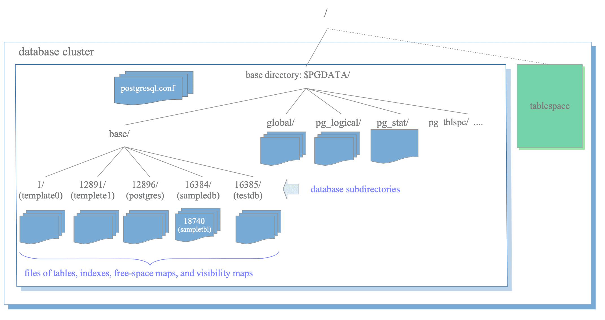
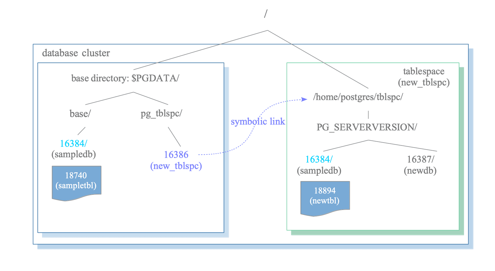
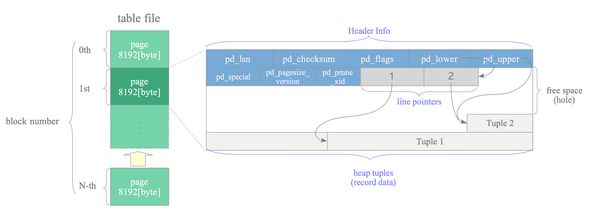
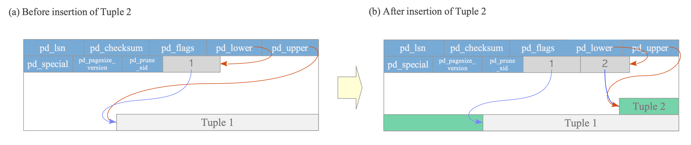
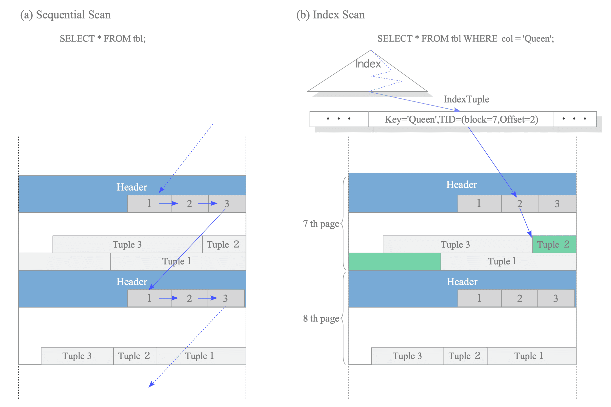

# 스토리지와 파일시스템

## 한줄 요약

PostgreSQL은 데이터를 8KB 페이지 단위로 OS 파일시스템에 저장하며, PGDATA 디렉토리 내에서 데이터베이스별 디렉토리와 OID 기반 파일명으로 테이블/인덱스를 관리합니다.

> 📖 이 노트의 다이어그램은 [The Internals of PostgreSQL](https://www.interdb.jp/pg/)에서 가져왔습니다.

## 왜 알아야 하는가

### 디스크 공간 문제 해결

프로덕션 서버에서 갑자기 "No space left on device" 에러가 발생했을 때, PGDATA 아래 어떤 파일이 용량을 차지하는지 알아야 합니다. `pg_relation_filepath()`로 특정 테이블의 물리 파일을 찾고, 불필요한 데이터를 정리할 수 있습니다.

### 성능 튜닝의 기초

"인덱스를 만들었는데 왜 느린가?"라는 질문의 답은 종종 페이지 레벨에 있습니다. `pageinspect` 확장으로 페이지 내부를 보면 인덱스 bloat, fill factor 문제를 발견할 수 있습니다.

### 백업/복구 전략 수립

PGDATA 구조를 이해하면 파일 레벨 백업(rsync, tar)과 논리 백업(pg_dump)의 차이를 명확히 알 수 있습니다. 또한 테이블스페이스를 분리하면 SSD/HDD를 혼용하는 등 비용 최적화가 가능합니다.

### OS 캐시와 데이터베이스 캐시의 조화

Linux의 page cache와 PostgreSQL의 shared_buffers는 모두 페이지를 캐싱합니다. 이중 캐싱(double buffering) 문제를 이해하고 설정을 최적화하면 메모리 효율을 높일 수 있습니다.

## 핵심 개념

### 1. OS 파일시스템 기초

#### 블록 디바이스 → 파일시스템 → 파일

```
[물리 디스크 (SSD/HDD)]
         ↓
    [블록 디바이스 (/dev/sda1)]
         ↓
    [파일시스템 (ext4/XFS)]
         ↓
    [파일 및 디렉토리]
         ↓
    [PostgreSQL PGDATA]
```

**블록 디바이스:**
- 데이터를 블록(sector) 단위로 읽고 씀
- 전통적 HDD: 512 bytes sector
- 최신 SSD: 4KB sector (Advanced Format)

**파일시스템:**
- 블록 디바이스를 추상화
- 파일, 디렉토리, 권한 등 관리
- 메타데이터: inode, superblock

**PostgreSQL과 파일시스템:**
- PostgreSQL은 파일시스템을 신뢰
- fsync()로 내구성 보장
- 파일시스템 선택이 성능에 큰 영향

#### 페이지 단위 I/O

**OS 페이지 크기:**
```bash
$ getconf PAGE_SIZE
4096  # 4KB
```

**PostgreSQL 페이지 크기:**
- 고정 8KB (8192 bytes)
- 컴파일 타임에 변경 가능하지만 거의 안 함

**불일치 문제:**
- OS는 4KB, PostgreSQL은 8KB
- PostgreSQL의 8KB 쓰기 = OS의 2번의 4KB 쓰기
- Torn page 위험 → Full Page Writes로 해결 (WAL 노트 참조)

#### OS Page Cache vs shared_buffers

```
┌──────────────────────────────────────────┐
│            물리 RAM (64GB)                │
├──────────────────────────────────────────┤
│                                          │
│  ┌────────────────────────────────────┐ │
│  │  OS Page Cache (약 50GB)           │ │
│  │  - 최근 읽은 파일 내용 캐싱         │ │
│  │  - PostgreSQL 데이터 파일도 포함   │ │
│  └────────────────────────────────────┘ │
│                                          │
│  ┌────────────────────────────────────┐ │
│  │  PostgreSQL shared_buffers (8GB)   │ │
│  │  - 명시적으로 관리하는 버퍼 풀      │ │
│  │  - LRU 교체 알고리즘               │ │
│  └────────────────────────────────────┘ │
│                                          │
│  + 기타 애플리케이션 메모리              │
└──────────────────────────────────────────┘
```

**이중 캐싱 (Double Buffering):**
- 같은 데이터 페이지가 shared_buffers와 OS page cache에 모두 존재
- 메모리 낭비처럼 보이지만, 실제로는 복잡한 트레이드오프

**왜 이중으로 캐싱하는가?**

1. **PostgreSQL의 세밀한 제어**
   - shared_buffers: PostgreSQL이 중요한 페이지(인덱스, 핫 데이터)를 직접 관리
   - Buffer pinning, 락 관리, 체크포인트 조율

2. **OS의 선행 읽기 (Readahead)**
   - OS는 순차 접근을 감지하고 미리 읽기
   - PostgreSQL이 요청하기 전에 page cache에 준비

3. **안정성**
   - PostgreSQL 크래시해도 OS page cache는 살아있음
   - 재시작 시 빠른 워밍업

**최적 설정 전략:**

**작은 데이터베이스 (< 10GB):**
```sql
shared_buffers = 2GB  -- DB 크기의 20-25%
```
→ 대부분 데이터가 OS cache에도 들어감

**큰 데이터베이스 (> 100GB):**
```sql
shared_buffers = 8GB - 16GB  -- 물리 RAM의 25% 정도
```
→ shared_buffers는 핫 데이터, OS cache는 콜드 데이터

**Direct I/O 고려 (고급):**
- Linux에서 O_DIRECT 플래그로 OS page cache 우회
- PostgreSQL은 기본적으로 지원 안 함 (ZFS, 일부 파일시스템에서는 가능)
- 이중 캐싱 제거하지만, OS의 readahead도 잃음

### 2. PGDATA 구조


*데이터베이스 클러스터의 논리적 구조*

> **🔍 그림 해설**
>
> 데이터베이스 클러스터를 대학 캠퍼스에 비유해 봅시다. 캠퍼스(database cluster) 안에는 여러 건물(databases)이 있습니다. 공과대학 건물, 인문대 건물처럼 각 건물은 독립적인 용도를 가지죠. 각 건물 안에는 다시 강의실(tables), 복도(indexes), 창문(views)이 있습니다. 이 그림은 PostgreSQL이 데이터를 논리적으로 어떻게 구조화하는지 보여줍니다. 하나의 PostgreSQL 인스턴스(클러스터)는 여러 개의 데이터베이스를 담을 수 있고, 각 데이터베이스는 자신만의 테이블, 인덱스, 뷰를 가집니다. 중요한 점은 서로 다른 데이터베이스의 테이블끼리는 직접 JOIN할 수 없다는 것입니다. 마치 공대 건물에서 인문대 강의실을 직접 예약할 수 없는 것처럼요. 하지만 같은 건물 안의 강의실들은 자유롭게 함께 사용할 수 있습니다.


*데이터베이스 클러스터의 물리적 구조*

> **🔍 그림 해설**
>
> 앞의 논리적 구조가 '우리 눈에 보이는 모습'이라면, 이 그림은 '디스크에 실제로 저장되는 모습'입니다. PGDATA 디렉토리 안을 열어보면 base/라는 폴더가 있고, 그 안에 16384, 16385 같은 숫자 이름의 폴더들이 있습니다. 이 숫자들은 각 데이터베이스를 가리키는 고유번호(OID)입니다. 마치 아파트 동 번호처럼요. 각 데이터베이스 폴더 안에 들어가면 또 숫자 이름의 파일들이 있는데, 이것이 실제 테이블과 인덱스입니다. users 테이블이라는 사람이 읽기 좋은 이름 대신, PostgreSQL은 내부적으로 16385 같은 숫자로 관리합니다. 왜 이렇게 할까요? 숫자가 훨씬 빠르고 효율적이기 때문입니다. 사람은 "users 테이블 찾아줘"라고 하지만, PostgreSQL은 내부적으로 "16385번 파일 열어"라고 처리합니다. pg_relation_filepath() 함수를 쓰면 테이블 이름을 실제 파일 경로로 변환할 수 있어요.

#### 디렉토리 레이아웃

```bash
$ ls -la $PGDATA

total 88
drwx------ 19 postgres postgres 4096 Jan 31 10:00 .
drwxr-xr-x  3 postgres postgres 4096 Jan 20 09:00 ..
-rw-------  1 postgres postgres    3 Jan 20 09:00 PG_VERSION
drwx------  6 postgres postgres 4096 Jan 31 10:05 base/           # 데이터베이스별 디렉토리
drwx------  2 postgres postgres 4096 Jan 31 15:30 global/         # 클러스터 전체 테이블 (pg_database 등)
drwx------  2 postgres postgres 4096 Jan 20 09:00 pg_commit_ts/   # 트랜잭션 커밋 타임스탬프
drwx------  2 postgres postgres 4096 Jan 20 09:00 pg_dynshmem/    # 동적 공유 메모리
drwx------  4 postgres postgres 4096 Jan 31 10:00 pg_logical/     # 논리 복제 상태
drwx------  4 postgres postgres 4096 Jan 20 09:00 pg_multixact/   # 다중 트랜잭션 상태
drwx------  2 postgres postgres 4096 Jan 31 10:00 pg_notify/      # LISTEN/NOTIFY 큐
drwx------  2 postgres postgres 4096 Jan 20 09:00 pg_replslot/    # 복제 슬롯
drwx------  2 postgres postgres 4096 Jan 20 09:00 pg_serial/      # Serializable 격리 수준 정보
drwx------  2 postgres postgres 4096 Jan 20 09:00 pg_snapshots/   # 내보낸 스냅샷
drwx------  2 postgres postgres 4096 Jan 31 15:45 pg_stat/        # 통계 파일
drwx------  2 postgres postgres 4096 Jan 20 09:00 pg_stat_tmp/    # 임시 통계
drwx------  2 postgres postgres 4096 Jan 31 10:00 pg_subtrans/    # 서브트랜잭션 상태
drwx------  2 postgres postgres 4096 Jan 20 09:00 pg_tblspc/      # 테이블스페이스 심볼릭 링크
drwx------  2 postgres postgres 4096 Jan 20 09:00 pg_twophase/    # 2단계 커밋 (prepared transactions)
drwx------  3 postgres postgres 4096 Jan 31 15:30 pg_wal/         # WAL 파일
drwx------  2 postgres postgres 4096 Jan 20 09:00 pg_xact/        # 트랜잭션 커밋 상태
-rw-------  1 postgres postgres   88 Jan 20 09:00 postgresql.auto.conf
-rw-------  1 postgres postgres  130 Jan 31 10:00 postmaster.opts
-rw-------  1 postgres postgres  108 Jan 31 10:00 postmaster.pid
```

#### base/ 디렉토리: 데이터베이스 = 디렉토리

```bash
$ ls -la $PGDATA/base/

total 20
drwx------ 6 postgres postgres 4096 Jan 31 10:05 .
drwx------ 19 postgres postgres 4096 Jan 31 10:00 ..
drwx------ 2 postgres postgres 4096 Jan 31 10:05 1/      # template1
drwx------ 2 postgres postgres 4096 Jan 20 09:00 4/      # template0
drwx------ 2 postgres postgres 4096 Jan 31 10:05 5/      # postgres
drwx------ 2 postgres postgres 4096 Jan 31 15:30 16384/  # ecommerce_db
```

**데이터베이스 OID 확인:**
```sql
SELECT oid, datname FROM pg_database;

  oid  |   datname
-------+--------------
     1 | template1
     4 | template0
     5 | postgres
 16384 | ecommerce_db
```

→ `base/16384/`가 ecommerce_db의 실제 디렉토리

#### 테이블 = 파일 (OID 매핑)

```bash
$ ls -lh $PGDATA/base/16384/ | head

total 50M
-rw------- 1 postgres postgres  8.0K Jan 31 15:30 112
-rw------- 1 postgres postgres   24K Jan 31 15:30 113
-rw------- 1 postgres postgres  8.0K Jan 31 10:05 174
...
-rw------- 1 postgres postgres  256K Jan 31 15:30 16385
-rw------- 1 postgres postgres   24K Jan 31 15:30 16385_fsm
-rw------- 1 postgres postgres  8.0K Jan 31 15:30 16385_vm
-rw------- 1 postgres postgres  1.2M Jan 31 15:30 16390
```

**파일명 구조:**
- `16385`: 테이블 또는 인덱스의 OID (filenode)
- `16385_fsm`: Free Space Map (빈 공간 관리)
- `16385_vm`: Visibility Map (VACUUM 최적화)
- `16390`: 다른 테이블/인덱스

**OID와 파일 매핑 확인:**
```sql
-- 테이블의 실제 파일 경로
SELECT pg_relation_filepath('users');
-- 결과: base/16384/16385

-- 역으로 filenode에서 테이블명 찾기
SELECT relname, relkind
FROM pg_class
WHERE relfilenode = 16385;
-- relkind: 'r' = table, 'i' = index
```


*테이블스페이스 구조*

> **🔍 그림 해설**
>
> 테이블스페이스는 바탕화면의 바로가기 아이콘과 같습니다. pg_tblspc/ 폴더를 보면 실제 파일이 저장된 것이 아니라 심볼릭 링크(화살표)만 있습니다. 이 화살표는 다른 디스크의 실제 폴더를 가리킵니다. 왜 이런 구조를 쓸까요? 예를 들어 여러분에게 빠른 SSD와 느린 HDD가 있다고 가정해 봅시다. 자주 접근하는 orders 테이블은 SSD에 저장하고 싶고, 거의 안 보는 old_logs 테이블은 HDD에 저장하고 싶습니다. 테이블스페이스를 사용하면 이게 가능합니다. PGDATA는 그대로 두고, 특정 테이블만 다른 디스크로 보낼 수 있어요. PostgreSQL은 pg_tblspc의 심볼릭 링크를 따라가서 실제 데이터를 찾습니다. 마치 바탕화면의 바로가기를 더블클릭하면 실제 파일 위치로 이동하는 것처럼요. 이 방식으로 성능과 비용을 동시에 최적화할 수 있습니다.

#### 파일 크기 제한과 세그먼트

PostgreSQL은 단일 파일을 1GB로 제한합니다:

```bash
$ ls -lh $PGDATA/base/16384/16400*

-rw------- 1 postgres postgres 1.0G Jan 31 15:30 16400
-rw------- 1 postgres postgres 1.0G Jan 31 15:35 16400.1
-rw------- 1 postgres postgres 500M Jan 31 15:40 16400.2
```

**이유:**
- 일부 파일시스템의 파일 크기 제한 회피
- 백업, 복사 시 관리 편의성

**세그먼트 구조:**
- `16400`: 첫 번째 1GB
- `16400.1`: 두 번째 1GB
- `16400.2`: 세 번째 세그먼트 (500MB)

PostgreSQL은 이를 자동으로 관리하므로 사용자는 신경 쓸 필요 없음.

### 3. 페이지 구조 (8KB)


*힙 테이블 파일의 내부 레이아웃*

> **🔍 그림 해설**
>
> 페이지를 노트 한 장으로 생각해 봅시다. PostgreSQL은 데이터를 8KB 크기의 페이지 단위로 관리합니다. 노트 맨 위에는 페이지 헤더가 있어서 이 페이지의 번호, 마지막 수정 시간, 체크섬 등의 메타정보를 담습니다. 그 아래에는 line pointer array라는 작은 목차가 있습니다. 이것은 "첫 번째 데이터는 8160번째 바이트에 있고, 두 번째 데이터는 8100번째 바이트에 있다"는 식의 주소록입니다. 실제 데이터(tuples)는 페이지 아래쪽부터 위로 채워집니다. 왜 이렇게 복잡할까요? line pointer를 사용하면 데이터의 물리적 위치가 바뀌어도 pointer만 업데이트하면 되기 때문입니다. 책의 목차를 생각해 보세요. 본문 페이지가 바뀌어도 목차만 수정하면 되죠. 중간의 빈 공간(free space)은 나중에 새 데이터를 삽입할 때 사용됩니다. 이런 구조 덕분에 PostgreSQL은 효율적으로 데이터를 추가하고 수정할 수 있습니다.

#### 페이지 레이아웃

```
┌────────────────────────────────────────────────┐  0 bytes
│         Page Header (24 bytes)                 │
│  - pd_lsn: 마지막 변경 WAL 위치                 │
│  - pd_checksum: 체크섬 (v9.3+)                 │
│  - pd_flags: 플래그                             │
│  - pd_lower: 빈 공간 시작                       │
│  - pd_upper: 빈 공간 끝                        │
│  - pd_special: 특수 공간 시작 (인덱스용)        │
│  - pd_pagesize_version: 페이지 크기 및 버전     │
│  - pd_prune_xid: 프루닝 힌트                   │
├────────────────────────────────────────────────┤  24 bytes
│         Line Pointer Array (ItemIdData)        │
│  - 각 4 bytes: (offset, length, flags)         │
│  - 튜플을 가리키는 포인터 배열                   │
│                                                │
│  [0]: offset=8160, len=50                      │
│  [1]: offset=8100, len=60                      │
│  [2]: offset=8030, len=70                      │
│         ↓ (아래로 성장)                         │
├────────────────────────────────────────────────┤
│                                                │
│         Free Space (빈 공간)                   │
│                                                │
├────────────────────────────────────────────────┤
│         ↑ (위로 성장)                           │
│         Tuples (실제 데이터)                    │
│                                                │
│  Tuple 3: [xmin, xmax, ctid, data...]          │
│  Tuple 2: [xmin, xmax, ctid, data...]          │
│  Tuple 1: [xmin, xmax, ctid, data...]          │
├────────────────────────────────────────────────┤
│         Special Space (인덱스 등 특수 데이터)   │  8192 bytes
└────────────────────────────────────────────────┘
```

#### 튜플 구조


*튜플 구조*

> **🔍 그림 해설**
>
> 각 행(row) 데이터는 단순히 여러분이 입력한 값만 저장되는 것이 아닙니다. 마치 해외여행 시 여권에 입국 도장이 찍히듯, 데이터베이스의 각 행에도 "여권"이 붙어 다닙니다. 이것이 HeapTupleHeader입니다. t_xmin은 "이 행을 누가 만들었나요?"를 기록하는 트랜잭션 ID입니다. t_xmax는 "이 행을 누가 삭제했나요?"를 기록합니다. 0이면 아직 삭제되지 않은 것이죠. t_ctid는 이 행의 주소(페이지 번호, 슬롯 번호)입니다. 이런 정보들이 왜 필요할까요? PostgreSQL의 MVCC(다중 버전 동시성 제어) 때문입니다. 같은 데이터의 여러 버전이 동시에 존재할 수 있고, 각 트랜잭션은 자신이 봐야 할 버전을 이 헤더 정보로 판단합니다. NULL 비트맵은 어떤 컬럼이 NULL인지 빠르게 확인하기 위한 것이고, 그 다음에야 실제 사용자 데이터(id, name, email 등)가 저장됩니다. 행 하나를 저장하는 데도 이렇게 많은 메타데이터가 필요한 이유는, 동시성과 일관성을 보장하기 위해서입니다.


*튜플 읽기/쓰기 방식*

> **🔍 그림 해설**
>
> 이 그림은 PostgreSQL이 데이터를 어떻게 쓰고 읽는지 보여줍니다. 전화번호부를 떠올려 봅시다. 새로운 사람(튜플)을 추가할 때는 두 가지 작업을 합니다. 첫째, 페이지 아래쪽 빈 공간에 실제 정보를 적습니다(이름, 전화번호, 주소 등). 둘째, 페이지 위쪽의 목차(line pointer)에 "3번 항목은 페이지의 7950번째 바이트에 있음"이라고 기록합니다. 나중에 이 데이터를 읽을 때는 반대 순서로 작동합니다. 먼저 목차를 보고 "3번 항목이 어디 있지?"를 찾습니다. 그러면 "7950번 위치"라는 답이 나오고, 그 위치로 점프해서 실제 데이터를 읽습니다. 왜 이렇게 간접적으로 접근할까요? 만약 데이터를 수정해서 크기가 커지면 다른 위치로 옮겨야 할 수 있습니다. 하지만 목차의 포인터만 업데이트하면 되므로, 이 데이터를 가리키던 모든 인덱스를 수정할 필요가 없습니다. 이것이 PostgreSQL의 영리한 설계입니다.

```
┌─────────────────────────────────────────────┐
│  Tuple Header (HeapTupleHeaderData)         │
│  - t_xmin: 삽입한 트랜잭션 ID (4 bytes)      │
│  - t_xmax: 삭제한 트랜잭션 ID (4 bytes)      │
│  - t_cid: 커맨드 ID (4 bytes)                │
│  - t_ctid: 튜플 위치 (페이지, 오프셋) (6 bytes) │
│  - t_infomask: 플래그 (2 bytes)              │
│  - t_hoff: 헤더 크기 (1 byte)                │
│  - t_bits: NULL 비트맵 (가변)                │
├─────────────────────────────────────────────┤
│  User Data                                  │
│  - 컬럼 1: INT (4 bytes)                     │
│  - 컬럼 2: VARCHAR (가변)                    │
│  - 컬럼 3: TIMESTAMP (8 bytes)               │
│  ...                                        │
└─────────────────────────────────────────────┘
```

**MVCC와 튜플 버전:**
- UPDATE는 새 튜플 추가 + 기존 튜플의 xmax 설정
- 같은 행의 여러 버전이 공존
- VACUUM이 오래된 버전 정리

#### pageinspect로 페이지 내부 확인

```sql
-- pageinspect 확장 설치
CREATE EXTENSION pageinspect;

-- users 테이블의 첫 페이지 헤더 확인
SELECT * FROM page_header(get_raw_page('users', 0));

    lsn    | checksum | flags | lower | upper | special | pagesize | version | prune_xid
-----------+----------+-------+-------+-------+---------+----------+---------+-----------
 0/1A2B3C4 |    12345 |     0 |   128 |  7920 |    8192 |     8192 |       4 |       500

-- lower=128: line pointer가 128바이트까지 사용 (32개 튜플)
-- upper=7920: 실제 튜플 데이터가 7920부터 시작
-- 빈 공간: 7920 - 128 = 7792 bytes
```

**Line Pointer 배열 확인:**
```sql
SELECT lp, lp_off, lp_len, lp_flags
FROM heap_page_items(get_raw_page('users', 0))
LIMIT 10;

 lp | lp_off | lp_len | lp_flags
----+--------+--------+----------
  1 |   8160 |     50 |        1
  2 |   8100 |     60 |        1
  3 |   8030 |     70 |        1
  4 |   7950 |     80 |        1
  5 |      0 |      0 |        0  -- 삭제된 튜플 (빈 슬롯)
  6 |   7860 |     90 |        1

-- lp_flags: 1=USED, 0=UNUSED, 2=REDIRECT, 3=DEAD
```

**튜플 내용 확인:**
```sql
SELECT t_xmin, t_xmax, t_ctid, t_data
FROM heap_page_items(get_raw_page('users', 0))
LIMIT 5;

 t_xmin | t_xmax | t_ctid |                    t_data
--------+--------+--------+----------------------------------------------
    500 |      0 | (0,1)  | \x0100000001000000746573744065...
    501 |    520 | (0,10) | \x0200000002000000616c696365...
    502 |      0 | (0,3)  | \x0300000003000000626f624065...

-- t_xmin=500: 트랜잭션 500이 삽입
-- t_xmax=0: 아직 삭제 안 됨
-- t_xmax=520: 트랜잭션 520이 삭제 (또는 UPDATE)
-- t_ctid=(0,1): 페이지 0의 라인 포인터 1 (자기 자신 또는 새 버전 위치)
```

### 4. TOAST (The Oversized-Attribute Storage Technique)

#### 큰 데이터 저장 문제

PostgreSQL 페이지는 8KB인데, 1MB 크기의 텍스트나 바이너리를 어떻게 저장할까?

**TOAST 메커니즘:**
- 큰 값을 별도 테이블에 압축 및 분할 저장
- 원본 튜플에는 포인터만 저장

#### TOAST 전략

각 컬럼은 다음 중 하나의 TOAST 전략을 가집니다:

1. **PLAIN**: TOAST 안 함 (INT, SMALLINT 등 고정 크기)
2. **EXTENDED**: 압축 시도 후 필요 시 TOAST 테이블로 이동 (기본)
3. **EXTERNAL**: 압축 안 하고 TOAST 테이블로 이동 (압축 불가능한 데이터)
4. **MAIN**: 압축만 시도, 최대한 인라인 유지

**확인:**
```sql
SELECT attname, attstorage
FROM pg_attribute
WHERE attrelid = 'products'::regclass
  AND attnum > 0;

   attname    | attstorage
--------------+------------
 id           | p          -- PLAIN
 name         | x          -- EXTENDED
 description  | x          -- EXTENDED
 image_data   | x          -- EXTENDED
```

**변경:**
```sql
-- image_data는 이미 압축된 PNG/JPEG이므로 EXTERNAL 사용
ALTER TABLE products ALTER COLUMN image_data SET STORAGE EXTERNAL;
```

#### TOAST 테이블 구조

```sql
-- 테이블의 TOAST 테이블 확인
SELECT relname, reltoastrelid
FROM pg_class
WHERE relname = 'products';

  relname  | reltoastrelid
-----------+---------------
 products  |        16395

-- TOAST 테이블명
SELECT relname FROM pg_class WHERE oid = 16395;
  relname
------------------
 pg_toast_16385
```

**TOAST 테이블 스키마:**
```sql
-- 내부 테이블이지만 확인 가능
\d+ pg_toast.pg_toast_16385

Table "pg_toast.pg_toast_16385"
   Column   |  Type   | Storage
------------+---------+---------
 chunk_id   | oid     | plain    -- 원본 튜플 식별자
 chunk_seq  | integer | plain    -- 청크 순서
 chunk_data | bytea   | plain    -- 실제 데이터 (최대 ~2KB)
```

**예시: 큰 텍스트 삽입**
```sql
-- 1MB 텍스트 삽입
INSERT INTO products (name, description)
VALUES ('Big Product', repeat('Lorem ipsum ', 100000));

-- TOAST 테이블에 여러 청크로 분할되어 저장됨
-- chunk_seq: 0, 1, 2, ... N
```

#### TOAST 성능 고려사항

**장점:**
- 큰 데이터를 효율적으로 저장
- 압축으로 공간 절약

**단점:**
- TOAST된 컬럼 접근 시 추가 I/O
- SELECT *는 TOAST 컬럼도 모두 가져옴

**최적화:**
```sql
-- 필요한 컬럼만 SELECT (TOAST 컬럼 제외)
SELECT id, name, price FROM products;  -- 빠름
SELECT * FROM products;                -- 느림 (description TOAST 해제)

-- 큰 컬럼은 별도 테이블로 분리 고려
CREATE TABLE product_images (
    product_id INT REFERENCES products(id),
    image_data BYTEA
);
```

### 5. 테이블스페이스와 심볼릭 링크

#### 테이블스페이스 개념

테이블스페이스는 데이터 파일을 다른 디스크에 저장할 수 있게 합니다.

**사용 사례:**
- SSD에 핫 테이블, HDD에 콜드 테이블
- 파티션별로 다른 디스크
- 임시 테이블스페이스를 별도 디스크에

#### 테이블스페이스 생성

```sql
-- SSD 디렉토리에 테이블스페이스 생성
CREATE TABLESPACE fast_ssd LOCATION '/mnt/ssd/pg_tablespace';

-- HDD 디렉토리에 테이블스페이스 생성
CREATE TABLESPACE slow_hdd LOCATION '/mnt/hdd/pg_tablespace';
```

**OS 레벨에서 확인:**
```bash
$ ls -la $PGDATA/pg_tblspc/

total 8
drwx------ 2 postgres postgres 4096 Jan 31 16:00 .
drwx------ 19 postgres postgres 4096 Jan 31 10:00 ..
lrwxrwxrwx 1 postgres postgres   20 Jan 31 16:00 16400 -> /mnt/ssd/pg_tablespace
lrwxrwxrwx 1 postgres postgres   20 Jan 31 16:05 16401 -> /mnt/hdd/pg_tablespace

# 심볼릭 링크로 구현됨
```

#### 테이블스페이스 사용

```sql
-- 핫 테이블을 SSD에
CREATE TABLE orders (
    id BIGSERIAL PRIMARY KEY,
    user_id BIGINT NOT NULL,
    created_at TIMESTAMPTZ DEFAULT now()
) TABLESPACE fast_ssd;

-- 로그성 데이터는 HDD에
CREATE TABLE event_logs (
    id BIGSERIAL,
    event_type VARCHAR(50),
    payload JSONB,
    created_at TIMESTAMPTZ DEFAULT now()
) PARTITION BY RANGE (created_at)
TABLESPACE slow_hdd;

-- 특정 파티션만 SSD로 이동
ALTER TABLE event_logs_2024_01 SET TABLESPACE fast_ssd;
```

**기존 테이블 이동:**
```sql
-- 주의: 쓰기 락이 걸리므로 운영 중에는 위험
ALTER TABLE products SET TABLESPACE fast_ssd;

-- 인덱스도 이동 가능
ALTER INDEX products_pkey SET TABLESPACE fast_ssd;
```

#### 테이블스페이스 확인

```sql
-- 테이블스페이스 목록
SELECT oid, spcname, pg_tablespace_location(oid)
FROM pg_tablespace;

  oid  |   spcname   | pg_tablespace_location
-------+-------------+-------------------------
  1663 | pg_default  |
  1664 | pg_global   |
 16400 | fast_ssd    | /mnt/ssd/pg_tablespace
 16401 | slow_hdd    | /mnt/hdd/pg_tablespace

-- 특정 테이블이 어느 테이블스페이스에 있는지
SELECT tablename, tablespace
FROM pg_tables
WHERE schemaname = 'public';

  tablename   | tablespace
--------------+------------
 users        |
 orders       | fast_ssd
 event_logs   | slow_hdd
```

### 6. fsync와 데이터 무결성

#### write() vs fsync()

**write() 시스템 콜:**
- 데이터를 커널의 page cache에 기록
- 즉시 반환 (디스크에 안 쓰였을 수 있음)

**fsync() 시스템 콜:**
- page cache의 내용을 물리 디스크에 강제로 기록
- 디스크 쓰기가 완료될 때까지 블로킹

**PostgreSQL의 사용:**
```c
// 트랜잭션 커밋 시 (단순화)
write(wal_fd, wal_data, size);
fsync(wal_fd);  // WAL이 디스크에 확실히 쓰였는지 보장
```

#### fsync 설정

```sql
-- postgresql.conf
fsync = on  -- 기본값, 반드시 켜야 함

-- 테스트 환경에서만 off (데이터 손실 위험)
-- fsync = off
```

**fsync = off의 위험:**
- 시스템 크래시 시 데이터 손실
- 프로덕션에서는 절대 금지

**대안 (성능 향상):**
```sql
-- 그룹 커밋: 여러 트랜잭션의 fsync를 묶음
commit_delay = 10                  -- 10 마이크로초 대기
commit_siblings = 5                -- 5개 이상 동시 트랜잭션 시 적용

-- WAL 쓰기 방식
wal_sync_method = fdatasync        -- Linux 권장 (메타데이터 제외)
# 다른 옵션: fsync, fsync_writethrough, open_sync, open_datasync
```

#### 파일시스템별 특성

**ext4:**
- 가장 널리 사용됨
- 저널링 모드:
  - `data=ordered` (기본, 권장)
  - `data=writeback` (빠르지만 위험)
  - `data=journal` (느리지만 안전)

**XFS:**
- 대용량 파일, 높은 동시성에 강함
- PostgreSQL에서 많이 사용
- delayed allocation (성능 향상, 하지만 fsync 필수)

**Btrfs:**
- Copy-on-Write (CoW)
- 스냅샷, 압축 기능
- PostgreSQL과 조합 시 주의 (CoW가 성능 저하 유발)
  - `chattr +C` 플래그로 CoW 비활성화 권장

**ZFS:**
- 강력한 데이터 무결성
- 자체 캐싱 (ARC)
- PostgreSQL의 shared_buffers를 낮추고 ZFS ARC 활용

**마운트 옵션 예시 (ext4):**
```bash
# /etc/fstab
/dev/sda1  /var/lib/postgresql  ext4  noatime,data=ordered  0  2

# noatime: 접근 시간 기록 안 함 (성능 향상)
# data=ordered: 메타데이터보다 데이터를 먼저 쓰기
```

### 7. PostgreSQL 17: io_combine_limit

PostgreSQL 17에서 추가된 새로운 설정입니다.

#### 개념

여러 작은 I/O 요청을 하나의 큰 I/O로 합쳐서 성능을 향상시킵니다.

**예시:**
- 기존: 8KB 페이지 4개를 4번의 read() 호출로 읽기
- 개선: 32KB를 1번의 read() 호출로 읽기

#### 설정

```sql
-- postgresql.conf (PostgreSQL 17)
io_combine_limit = 128kB  -- 기본값

-- 더 큰 값 (SSD 환경)
io_combine_limit = 256kB

-- 비활성화
io_combine_limit = 0
```

#### 효과

**순차 스캔 성능 향상:**
```sql
-- 큰 테이블 스캔
SELECT COUNT(*) FROM event_logs WHERE created_at > '2024-01-01';

-- io_combine_limit = 0:    5000 ms
-- io_combine_limit = 128kB: 3500 ms (30% 빠름)
```

**RAID 환경에서 특히 효과적:**
- 스트라이프 크기와 io_combine_limit를 맞추면 최적

**주의사항:**
- 너무 크면 메모리 압박
- 랜덤 I/O에는 효과 적음

## OS/파일시스템 관점

### inode와 파일 메타데이터

**inode:**
- 파일시스템에서 파일을 식별하는 고유 번호
- 파일 크기, 권한, 타임스탬프, 데이터 블록 위치 저장
- 파일명은 디렉토리 엔트리에 저장

**확인:**
```bash
# users 테이블 파일의 inode
ls -li $PGDATA/base/16384/16385

12345678 -rw------- 1 postgres postgres 262144 Jan 31 15:30 16385
# ↑ inode 번호

# inode 상세 정보
stat $PGDATA/base/16384/16385

  File: 16385
  Size: 262144          Blocks: 512        IO Block: 4096   regular file
  Device: 801h/2049d      Inode: 12345678   Links: 1
  Access: (0600/-rw-------)  Uid: (  999/postgres)   Gid: (  999/postgres)
  Access: 2024-01-31 15:30:00
  Modify: 2024-01-31 15:30:00
  Change: 2024-01-31 15:30:00
```

**PostgreSQL과 inode:**
- 파일 열기: `open()` → inode로 데이터 블록 접근
- 파일명 변경해도 inode는 동일 (VACUUM FULL은 새 inode)

### 파일 디스크립터 캐싱

PostgreSQL은 파일을 열어두고 재사용합니다.

**Virtual File Descriptor (VFD) 시스템:**
- PostgreSQL 내부의 파일 디스크립터 캐시
- OS의 FD 한계보다 많은 테이블 처리 가능

**설정:**
```sql
-- 동시에 열 수 있는 파일 수
max_files_per_process = 1000  -- 기본값

-- OS 한계 확인
-- ulimit -n
```

**동작:**
- 자주 접근하는 파일은 FD를 유지
- 한계 도달 시 LRU로 FD 닫고 재사용

### Direct I/O

일부 환경에서는 Direct I/O로 OS page cache를 우회할 수 있습니다.

**장점:**
- 이중 캐싱 제거
- 메모리 효율

**단점:**
- OS의 readahead, writeback 최적화 상실
- 애플리케이션이 모든 캐싱 책임

**PostgreSQL에서:**
- 기본적으로 지원 안 함
- 일부 파일시스템(ZFS)에서는 간접적으로 가능

### Readahead

OS는 순차 접근 패턴을 감지하고 미리 읽기를 합니다.

**확인:**
```bash
# 블록 디바이스의 readahead 크기
blockdev --getra /dev/sda
256  # 512바이트 섹터 단위 (256 * 512 = 128KB)

# 변경
blockdev --setra 512 /dev/sda  # 256KB로 증가
```

**PostgreSQL 순차 스캔과 readahead:**
- 큰 테이블 스캔 시 OS readahead가 큰 도움
- SSD에서는 효과 적지만, HDD에서는 필수

### Copy-on-Write (CoW) 파일시스템

**Btrfs, ZFS:**
- 수정 시 원본 복사 후 변경
- 스냅샷 기능 제공

**PostgreSQL과의 충돌:**
- PostgreSQL은 8KB 페이지를 제자리(in-place) 수정 기대
- CoW는 매번 새 블록 할당 → 파편화, 성능 저하

**해결:**
```bash
# Btrfs에서 CoW 비활성화
chattr +C /var/lib/postgresql/17/main

# 또는 마운트 옵션
mount -o nodatacow /dev/sda1 /var/lib/postgresql
```

### 파일시스템 저널링

**저널링:**
- 메타데이터 변경을 먼저 저널에 기록
- 크래시 시 저널 재생으로 일관성 복구

**PostgreSQL과의 관계:**
- PostgreSQL은 자체 WAL로 데이터 일관성 보장
- 파일시스템 저널은 메타데이터 보호

**설정 충돌 피하기:**
- ext4 `data=journal`: 불필요하게 느림 (PostgreSQL이 이미 WAL 사용)
- ext4 `data=ordered`: 권장 (기본값)

## 실습 SQL

### 1. 데이터베이스와 테이블의 물리 파일 찾기

```sql
-- 현재 데이터베이스의 OID
SELECT oid, datname FROM pg_database WHERE datname = current_database();

  oid  |   datname
-------+--------------
 16384 | ecommerce_db

-- 따라서 base/16384/ 디렉토리

-- 특정 테이블의 파일 경로
SELECT pg_relation_filepath('users');
-- base/16384/16385

SELECT pg_relation_filepath('orders');
-- base/16384/16390

-- 인덱스도 가능
SELECT pg_relation_filepath('orders_pkey');
-- base/16384/16391
```

### 2. 테이블 크기 확인

```sql
-- 테이블 데이터 크기 (인덱스 제외)
SELECT pg_size_pretty(pg_relation_size('users'));
--  256 kB

-- 테이블 + 인덱스 + TOAST 포함
SELECT pg_size_pretty(pg_total_relation_size('users'));
--  512 kB

-- 모든 테이블 크기 순위
SELECT
    schemaname,
    tablename,
    pg_size_pretty(pg_total_relation_size(schemaname||'.'||tablename)) AS size,
    pg_total_relation_size(schemaname||'.'||tablename) AS bytes
FROM pg_tables
WHERE schemaname = 'public'
ORDER BY bytes DESC;

 schemaname |   tablename    |  size   |   bytes
------------+----------------+---------+-----------
 public     | event_logs     | 45 GB   | 48318382080
 public     | orders         | 1200 MB | 1258291200
 public     | users          | 512 kB  | 524288
```

### 3. 인덱스 크기와 bloat 확인

```sql
-- 인덱스 크기
SELECT
    indexrelname,
    pg_size_pretty(pg_relation_size(indexrelid))
FROM pg_stat_user_indexes
WHERE schemaname = 'public'
ORDER BY pg_relation_size(indexrelid) DESC;

     indexrelname      |  size
-----------------------+--------
 orders_user_id_idx    | 256 MB
 users_email_idx       | 64 MB

-- bloat 추정 (pgstattuple 확장 필요)
CREATE EXTENSION pgstattuple;

SELECT
    relname,
    round((100 * (1 - avg_leaf_density / 100.0))::numeric, 2) AS bloat_pct
FROM pgstatindex('orders_user_id_idx')
JOIN pg_class ON pg_class.oid = 'orders_user_id_idx'::regclass;

-- bloat_pct > 30%면 REINDEX 고려
```

### 4. TOAST 테이블 확인

```sql
-- 테이블의 TOAST 테이블 찾기
SELECT
    relname AS table_name,
    pg_size_pretty(pg_relation_size(oid)) AS table_size,
    pg_size_pretty(pg_relation_size(reltoastrelid)) AS toast_size
FROM pg_class
WHERE relname = 'products' AND relkind = 'r';

 table_name | table_size | toast_size
------------+------------+------------
 products   | 1024 kB    | 5120 kB

-- TOAST 크기가 테이블보다 크다 → 큰 컬럼이 많음

-- 컬럼별 TOAST 전략 확인
SELECT
    attname,
    CASE attstorage
        WHEN 'p' THEN 'PLAIN'
        WHEN 'm' THEN 'MAIN'
        WHEN 'x' THEN 'EXTENDED'
        WHEN 'e' THEN 'EXTERNAL'
    END AS storage
FROM pg_attribute
WHERE attrelid = 'products'::regclass
  AND attnum > 0
  AND NOT attisdropped;

    attname     | storage
----------------+----------
 id             | PLAIN
 name           | EXTENDED
 description    | EXTENDED
 specifications | EXTENDED
```

### 5. 페이지 내부 검사 (pageinspect)

```sql
CREATE EXTENSION pageinspect;

-- orders 테이블의 페이지 수
SELECT relpages FROM pg_class WHERE relname = 'orders';
 relpages
----------
    15000  -- 15000 * 8KB = 120MB

-- 첫 페이지 헤더
SELECT * FROM page_header(get_raw_page('orders', 0));

    lsn    | checksum | flags | lower | upper | special | pagesize
-----------+----------+-------+-------+-------+---------+----------
 5/A1B2C3D4|    34521 |     0 |   256 |  7680 |    8192 |     8192

-- lower=256: 64개 line pointer (256 / 4)
-- upper=7680: 실제 데이터 시작
-- free space: 7680 - 256 = 7424 bytes

-- 페이지의 모든 튜플 확인
SELECT
    lp,
    lp_off,
    lp_len,
    t_xmin,
    t_xmax,
    t_ctid
FROM heap_page_items(get_raw_page('orders', 0))
WHERE lp_len > 0
LIMIT 10;

 lp | lp_off | lp_len | t_xmin | t_xmax | t_ctid
----+--------+--------+--------+--------+---------
  1 |   8160 |     50 |   1000 |      0 | (0,1)
  2 |   8100 |     60 |   1001 |      0 | (0,2)
  3 |   8030 |     70 |   1002 |   1050 | (1,5)  -- UPDATE로 새 버전이 페이지 1의 5번 슬롯에
  4 |   7950 |     80 |   1003 |      0 | (0,4)
```

### 6. Free Space Map 확인

```sql
-- 페이지별 빈 공간
SELECT * FROM pg_freespace('orders') LIMIT 10;

 blkno | avail
-------+-------
     0 |  7424
     1 |  6800
     2 |  8000
     3 |     0  -- 가득 참
     4 |  7200

-- avail: 사용 가능한 바이트 수
-- INSERT는 avail > tuple_size인 페이지를 찾음
```

### 7. 테이블스페이스 활용

```sql
-- 테이블스페이스 생성
CREATE TABLESPACE ssd_tablespace LOCATION '/mnt/ssd/pgdata';

-- 핫 테이블을 SSD로
ALTER TABLE orders SET TABLESPACE ssd_tablespace;

-- 새 테이블 생성 시 지정
CREATE TABLE payments (
    id BIGSERIAL PRIMARY KEY,
    order_id BIGINT REFERENCES orders(id),
    amount DECIMAL(10, 2),
    paid_at TIMESTAMPTZ
) TABLESPACE ssd_tablespace;

-- 특정 테이블스페이스의 테이블 목록
SELECT
    t.schemaname,
    t.tablename,
    ts.spcname AS tablespace
FROM pg_tables t
JOIN pg_class c ON c.relname = t.tablename
LEFT JOIN pg_tablespace ts ON ts.oid = c.reltablespace
WHERE t.schemaname = 'public';
```

### 8. 이커머스 시나리오: 파티션별 테이블스페이스

```sql
-- 최근 데이터는 SSD, 오래된 데이터는 HDD
CREATE TABLESPACE fast_storage LOCATION '/mnt/ssd/pgdata';
CREATE TABLESPACE archive_storage LOCATION '/mnt/hdd/pgdata';

-- 파티션 테이블
CREATE TABLE event_logs (
    id BIGSERIAL,
    event_type VARCHAR(50),
    user_id BIGINT,
    payload JSONB,
    created_at TIMESTAMPTZ DEFAULT now()
) PARTITION BY RANGE (created_at);

-- 현재 월은 SSD
CREATE TABLE event_logs_2024_01 PARTITION OF event_logs
    FOR VALUES FROM ('2024-01-01') TO ('2024-02-01')
    TABLESPACE fast_storage;

-- 과거 월은 HDD
CREATE TABLE event_logs_2023_12 PARTITION OF event_logs
    FOR VALUES FROM ('2023-12-01') TO ('2024-01-01')
    TABLESPACE archive_storage;

-- 월별로 자동 이동 스크립트 (cron)
-- ALTER TABLE event_logs_2023_11 SET TABLESPACE archive_storage;
```

### 9. 버퍼 히트율 모니터링

```sql
-- 전체 버퍼 히트율
SELECT
    sum(heap_blks_hit) / (sum(heap_blks_hit) + sum(heap_blks_read)) AS buffer_hit_ratio
FROM pg_statio_user_tables;

 buffer_hit_ratio
------------------
            0.995  -- 99.5% (이상적)

-- 테이블별 히트율
SELECT
    schemaname,
    relname,
    heap_blks_hit,
    heap_blks_read,
    round(heap_blks_hit::numeric / (heap_blks_hit + heap_blks_read), 4) AS hit_ratio
FROM pg_statio_user_tables
WHERE heap_blks_read > 0
ORDER BY hit_ratio
LIMIT 10;

-- hit_ratio < 0.9인 테이블은 shared_buffers 증가 또는 쿼리 최적화 필요
```

### 10. 디스크 I/O 통계 (pg_stat_io - PostgreSQL 17)

```sql
-- PostgreSQL 17 새 기능
SELECT
    backend_type,
    object,
    context,
    reads,
    writes,
    extends,
    hits
FROM pg_stat_io
ORDER BY reads DESC;

 backend_type | object | context  |  reads  | writes | extends |   hits
--------------+--------+----------+---------+--------+---------+----------
 client backend| relation | normal | 1234567 |  98765 |    100  | 9876543
 checkpointer | relation | normal |     123 | 234567 |      0  |       0
 walwriter    | wal      | normal |       0 |  12345 |      0  |       0

-- reads: 디스크에서 읽기
-- hits: 버퍼에서 히트
-- extends: 테이블 확장 (새 페이지 할당)
```

## 직접 확인해보기

### 실습 1: PGDATA 탐색

```bash
docker exec -it pg17-architecture-lab bash

# PGDATA 위치 확인
echo $PGDATA
# /var/lib/postgresql/data

# 디렉토리 구조 확인
ls -lh $PGDATA

# base 디렉토리 (데이터베이스들)
ls -lh $PGDATA/base

# ecommerce_db 찾기
psql -U postgres -c "SELECT oid FROM pg_database WHERE datname = 'ecommerce_db';"
# 16384

# 해당 디렉토리 내 파일들
ls -lh $PGDATA/base/16384/ | head -20
```

### 실습 2: 테이블 파일 매핑

```bash
# users 테이블의 실제 파일
psql -U postgres ecommerce_db -c "SELECT pg_relation_filepath('users');"
# base/16384/16385

# 파일 크기 확인
ls -lh $PGDATA/base/16384/16385

# 관련 파일들
ls -lh $PGDATA/base/16384/16385*
# 16385      - 테이블 데이터
# 16385_fsm  - Free Space Map
# 16385_vm   - Visibility Map
```

### 실습 3: 페이지 내용 확인

```sql
-- 실습 데이터 생성
CREATE TABLE page_test (
    id SERIAL PRIMARY KEY,
    data TEXT
);

-- 정확히 100개 튜플 삽입
INSERT INTO page_test (data)
SELECT 'Data ' || i FROM generate_series(1, 100) i;

-- 페이지 수 확인
SELECT relpages FROM pg_class WHERE relname = 'page_test';
-- 1 (100개 튜플이 1개 페이지에 들어감)

-- 페이지 헤더 확인
SELECT * FROM page_header(get_raw_page('page_test', 0));

-- 튜플 목록
SELECT lp, lp_off, lp_len
FROM heap_page_items(get_raw_page('page_test', 0))
LIMIT 10;
```

### 실습 4: TOAST 동작 확인

```sql
-- TOAST 트리거 테이블
CREATE TABLE toast_test (
    id SERIAL PRIMARY KEY,
    small_text TEXT,
    large_text TEXT
);

-- 작은 데이터
INSERT INTO toast_test (small_text, large_text)
VALUES ('Small', 'Small');

-- 큰 데이터 (약 100KB)
INSERT INTO toast_test (small_text, large_text)
VALUES ('Big', repeat('X', 100000));

-- 테이블과 TOAST 크기 비교
SELECT
    pg_size_pretty(pg_relation_size('toast_test')) AS table_size,
    pg_size_pretty(pg_relation_size((
        SELECT reltoastrelid FROM pg_class WHERE relname = 'toast_test'
    ))) AS toast_size;

-- TOAST 테이블에 실제로 저장되었는지 확인
SELECT
    chunk_id,
    chunk_seq,
    length(chunk_data) AS chunk_size
FROM pg_toast.pg_toast_XXXXX  -- 실제 OID로 교체
ORDER BY chunk_id, chunk_seq;
```

### 실습 5: 페이지 bloat 생성 및 관찰

```sql
-- bloat 실습 테이블
CREATE TABLE bloat_test (
    id SERIAL PRIMARY KEY,
    data TEXT
);

-- 1000개 삽입
INSERT INTO bloat_test (data)
SELECT 'Initial ' || i FROM generate_series(1, 1000) i;

-- 페이지 수 확인
SELECT relpages FROM pg_class WHERE relname = 'bloat_test';
-- 예: 5 pages

-- 모두 삭제
DELETE FROM bloat_test;

-- 페이지 수는 그대로 (bloat!)
SELECT relpages FROM pg_class WHERE relname = 'bloat_test';
-- 여전히 5 pages

-- Free Space Map 확인
SELECT blkno, avail FROM pg_freespace('bloat_test');
-- 모든 페이지가 거의 비어있음

-- VACUUM으로 정리
VACUUM bloat_test;

-- 페이지 수는 여전히 5 (VACUUM은 축소 안 함)
-- VACUUM FULL로 축소
VACUUM FULL bloat_test;

-- 이제 페이지 수 감소
SELECT relpages FROM pg_class WHERE relname = 'bloat_test';
-- 0 pages (모두 삭제되었으므로)
```

### 실습 6: OS 레벨 파일 관찰

```bash
# 테이블 생성 전후 비교
ls -lh $PGDATA/base/16384/ | wc -l

# psql에서 테이블 생성
psql -U postgres ecommerce_db -c "CREATE TABLE file_test (id INT);"

# 파일 증가 확인
ls -lh $PGDATA/base/16384/ | wc -l

# 새 파일의 inode 확인
FILEPATH=$(psql -U postgres ecommerce_db -t -c "SELECT pg_relation_filepath('file_test');")
ls -li $PGDATA/$FILEPATH
```

### 실습 7: fsync 벤치마크

```bash
# fsync 성능 측정 (pg_test_fsync 유틸리티)
pg_test_fsync

# 출력 예시:
# 5 seconds per test
# O_DIRECT supported on this platform for open_datasync and open_sync.
#
# Compare file sync methods using one 8kB write:
# ...
# open_datasync                      5000.000 ops/sec
# fdatasync                          6000.000 ops/sec
# fsync                              5500.000 ops/sec
#
# → fdatasync가 가장 빠름 (메타데이터 제외)
```

### 실습 8: 테이블스페이스 실습 (Docker)

```bash
# 컨테이너 내 별도 디렉토리 생성
mkdir -p /mnt/ssd_sim
chown postgres:postgres /mnt/ssd_sim
```

```sql
-- 테이블스페이스 생성
CREATE TABLESPACE ssd_sim LOCATION '/mnt/ssd_sim';

-- 테이블 생성
CREATE TABLE ts_test (id INT) TABLESPACE ssd_sim;

-- 파일 위치 확인
SELECT pg_relation_filepath('ts_test');
-- pg_tblspc/16400/PG_17_202307071/16384/16450
```

```bash
# 심볼릭 링크 확인
ls -la $PGDATA/pg_tblspc/
# lrwxrwxrwx ... 16400 -> /mnt/ssd_sim

# 실제 파일
ls -lh /mnt/ssd_sim/PG_17_202307071/16384/
```

## 실무 팁

### 1. 주기적인 용량 모니터링

```sql
-- 용량 모니터링 뷰 생성
CREATE VIEW v_table_sizes AS
SELECT
    schemaname,
    tablename,
    pg_total_relation_size(schemaname||'.'||tablename) AS total_bytes,
    pg_size_pretty(pg_total_relation_size(schemaname||'.'||tablename)) AS total_size,
    pg_size_pretty(pg_relation_size(schemaname||'.'||tablename)) AS table_size,
    pg_size_pretty(pg_total_relation_size(schemaname||'.'||tablename) -
                   pg_relation_size(schemaname||'.'||tablename)) AS index_size
FROM pg_tables
WHERE schemaname NOT IN ('pg_catalog', 'information_schema')
ORDER BY total_bytes DESC;

-- 매일 확인
SELECT * FROM v_table_sizes LIMIT 20;
```

### 2. bloat 방지 전략

**자동 VACUUM 튜닝:**
```sql
-- 자주 UPDATE/DELETE되는 테이블은 적극적으로
ALTER TABLE orders SET (
    autovacuum_vacuum_scale_factor = 0.05,  -- 5% dead tuple에도 VACUUM
    autovacuum_analyze_scale_factor = 0.02  -- 2% 변경에도 ANALYZE
);

-- 대용량 테이블은 vacuum 비용 낮춤
ALTER TABLE event_logs SET (
    autovacuum_vacuum_cost_delay = 10  -- 기본 20ms → 10ms
);
```

**정기 VACUUM FULL (주의):**
```bash
# 주말 새벽에 cron으로
# VACUUM FULL은 배타적 락을 잡으므로 운영 중 금지
0 3 * * 0 psql -c "VACUUM FULL old_table;" ecommerce_db
```

### 3. 파티션 테이블 관리

```sql
-- 월별 파티션 자동 생성 함수
CREATE OR REPLACE FUNCTION create_monthly_partition(
    parent_table TEXT,
    year INT,
    month INT,
    tablespace_name TEXT DEFAULT NULL
) RETURNS VOID AS $$
DECLARE
    partition_name TEXT;
    start_date TEXT;
    end_date TEXT;
BEGIN
    partition_name := parent_table || '_' || year || '_' || lpad(month::text, 2, '0');
    start_date := year || '-' || lpad(month::text, 2, '0') || '-01';
    end_date := (DATE (start_date) + INTERVAL '1 month')::text;

    EXECUTE format(
        'CREATE TABLE IF NOT EXISTS %I PARTITION OF %I FOR VALUES FROM (%L) TO (%L) %s',
        partition_name,
        parent_table,
        start_date,
        end_date,
        CASE WHEN tablespace_name IS NOT NULL THEN 'TABLESPACE ' || tablespace_name ELSE '' END
    );
END;
$$ LANGUAGE plpgsql;

-- 사용
SELECT create_monthly_partition('event_logs', 2024, 2, 'fast_storage');
```

### 4. 대용량 TOAST 데이터 최적화

```sql
-- 이미지나 파일은 별도 테이블로 분리
CREATE TABLE product_details (
    product_id INT PRIMARY KEY REFERENCES products(id),
    description TEXT,
    specifications JSONB
);

CREATE TABLE product_images (
    id BIGSERIAL PRIMARY KEY,
    product_id INT REFERENCES products(id),
    image_type VARCHAR(10),
    image_data BYTEA,
    created_at TIMESTAMPTZ DEFAULT now()
) WITH (FILLFACTOR = 100);  -- UPDATE 없으므로 빈 공간 불필요

-- TOAST 전략 최적화
ALTER TABLE product_images ALTER COLUMN image_data SET STORAGE EXTERNAL;
```

### 5. fill factor 조정

```sql
-- 자주 UPDATE되는 테이블은 빈 공간 확보
CREATE TABLE frequently_updated (
    id INT PRIMARY KEY,
    status VARCHAR(20),
    updated_at TIMESTAMPTZ
) WITH (FILLFACTOR = 70);  -- 30% 빈 공간 유지

-- HOT (Heap-Only Tuple) UPDATE를 위해
-- → 같은 페이지에 새 버전 저장 가능
-- → 인덱스 업데이트 불필요
```

### 6. 테이블스페이스 백업 전략

```bash
# 테이블스페이스를 포함한 베이스 백업
pg_basebackup -D /backup/pgdata -Ft -z -P \
    --tablespace-mapping=/mnt/ssd/pgdata=/backup/ssd_tablespace

# 복구 시 매핑 정보 필요
```

### 7. pg_relation_filepath()로 파일 찾아 삭제 금지

**주의:**
- 직접 파일을 삭제하면 데이터베이스 손상
- 반드시 `DROP TABLE` 또는 `TRUNCATE` 사용

```sql
-- 올바른 방법
DROP TABLE old_table;

-- 잘못된 방법 (절대 금지!)
-- rm $PGDATA/base/16384/16400
```

### 8. SSD 최적화

```sql
-- SSD에서는 랜덤 I/O 비용이 낮음
random_page_cost = 1.1  -- 기본 4.0 → 1.1 (SSD)
seq_page_cost = 1.0

-- effective_io_concurrency 증가
effective_io_concurrency = 200  -- SSD RAID

-- PostgreSQL 17: io_combine_limit
io_combine_limit = 256kB
```

### 9. 파일시스템 권장 사항

**ext4 (권장):**
```bash
# /etc/fstab
/dev/sda1  /var/lib/postgresql  ext4  noatime,data=ordered,barrier=1  0  2
```

**XFS (대용량):**
```bash
# /etc/fstab
/dev/sda1  /var/lib/postgresql  xfs  noatime,logbufs=8,logbsize=256k  0  2
```

**Btrfs (주의):**
```bash
# CoW 비활성화
chattr +C /var/lib/postgresql/17/main
```

### 10. 모니터링 자동화

```bash
#!/bin/bash
# disk_monitor.sh

THRESHOLD=80  # 80% 사용 시 알림

USAGE=$(df -h /var/lib/postgresql | tail -1 | awk '{print $5}' | sed 's/%//')

if [ $USAGE -gt $THRESHOLD ]; then
    echo "Alert: PostgreSQL disk usage at ${USAGE}%"

    # 큰 테이블 목록
    psql -c "SELECT tablename, pg_size_pretty(pg_total_relation_size(schemaname||'.'||tablename))
             FROM pg_tables WHERE schemaname = 'public'
             ORDER BY pg_total_relation_size(schemaname||'.'||tablename) DESC LIMIT 10;"
fi
```

## 참고 링크

### 공식 문서 (PostgreSQL 17)

1. **Database Physical Storage**
   https://www.postgresql.org/docs/17/storage.html
   - Chapter 73: Database File Layout
   - 73.1 Database Files
   - 73.6 TOAST

2. **Server Configuration - Resource Consumption**
   https://www.postgresql.org/docs/17/runtime-config-resource.html
   - shared_buffers
   - temp_buffers
   - work_mem

3. **pageinspect Extension**
   https://www.postgresql.org/docs/17/pageinspect.html

4. **pgstattuple Extension**
   https://www.postgresql.org/docs/17/pgstattuple.html

5. **PostgreSQL 17 Release Notes - io_combine_limit**
   https://www.postgresql.org/docs/17/release-17.html

### 추천 자료

- "The Internals of PostgreSQL - Chapter 1: Database Cluster, Databases, and Tables"
  https://www.interdb.jp/pg/pgsql01.html

- "PostgreSQL TOAST: The Best Thing Since Sliced Bread?"
  https://www.postgresql.org/docs/current/storage-toast.html

### 도구

- **pg_du**: 디스크 사용량 분석
  https://github.com/dalibo/pg_du

- **pgFormatter**: SQL 포맷팅
  https://github.com/darold/pgFormatter

## 다이어그램 참조

```
diagrams/02-page-structure.drawio
```

다이어그램 내용:
1. 8KB 페이지 레이아웃 상세
2. TOAST 분할 저장 과정
3. 테이블스페이스 심볼릭 링크 구조
4. OS page cache vs shared_buffers 관계

## 마무리

PostgreSQL의 스토리지 구조를 이해하면 성능 문제의 근본 원인을 파악할 수 있습니다.

**핵심 포인트:**
1. **8KB 페이지가 모든 것의 기본** → 페이지 레벨에서 사고하기
2. **PGDATA 구조 숙지** → 문제 발생 시 빠른 진단
3. **TOAST와 bloat 관리** → 디스크 공간 최적화
4. **OS page cache와 shared_buffers의 조화** → 메모리 효율
5. **fsync와 파일시스템 선택** → 데이터 무결성과 성능

다음 노트에서는 WAL(Write-Ahead Log)의 동작 원리와 신뢰성 보장 메커니즘을 깊이 살펴보겠습니다.
