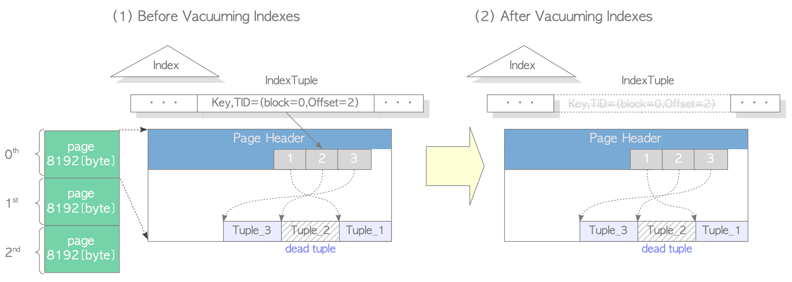
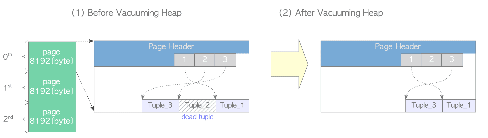
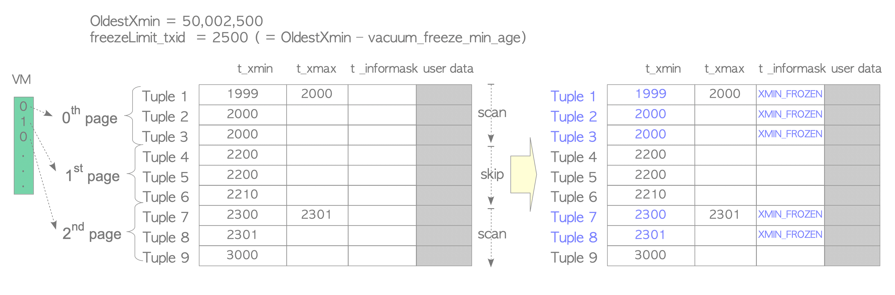
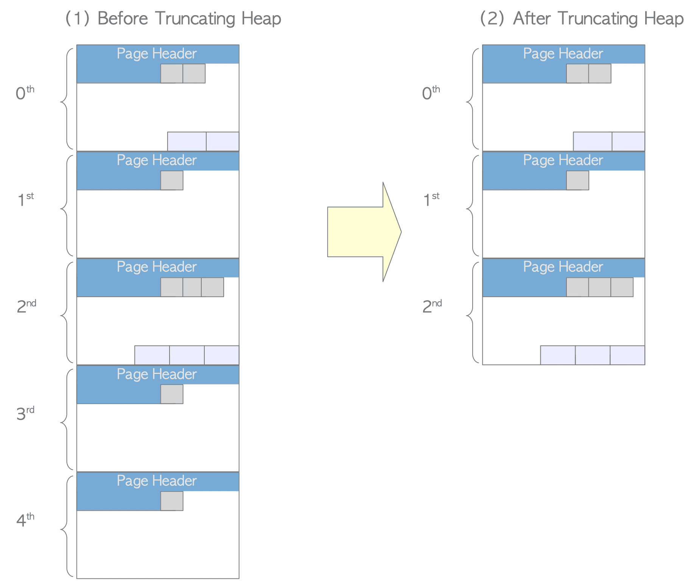
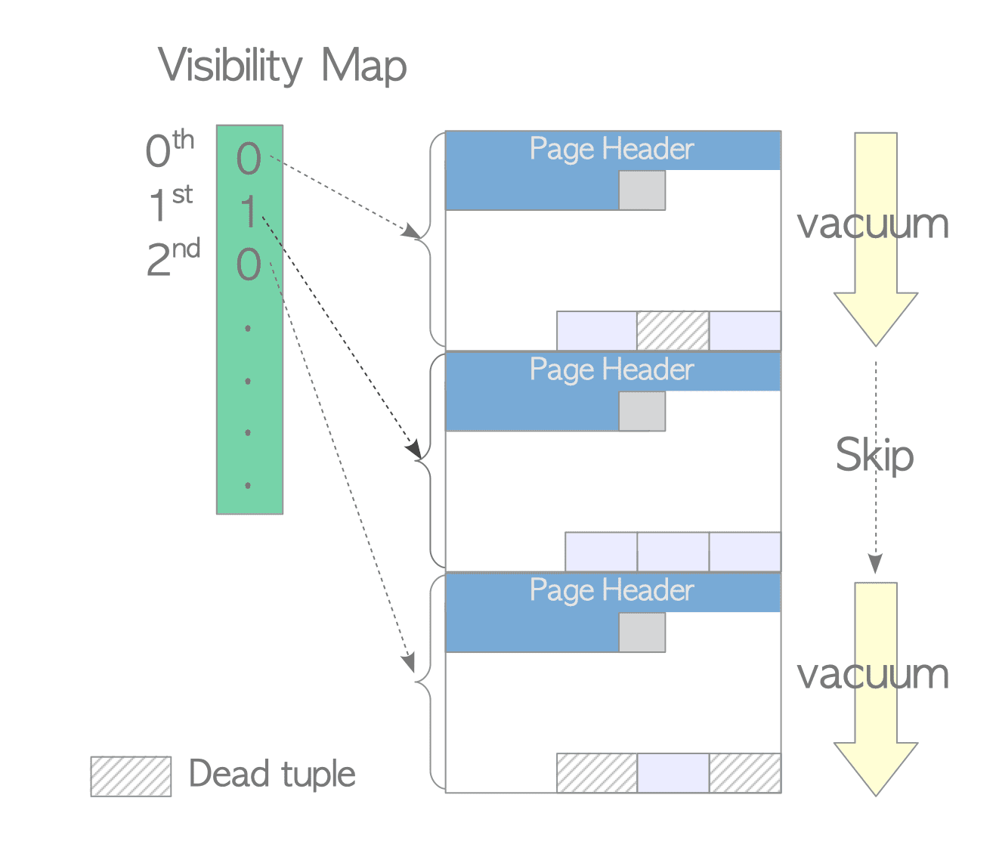
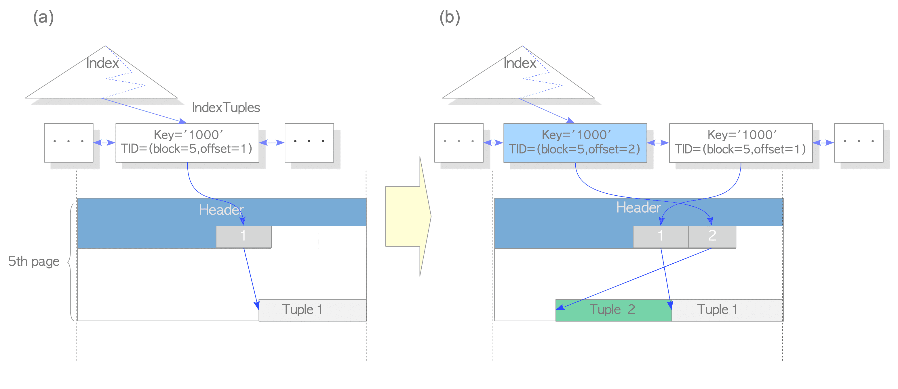
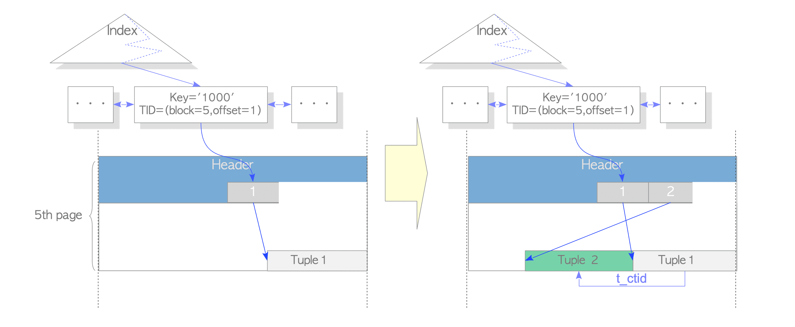
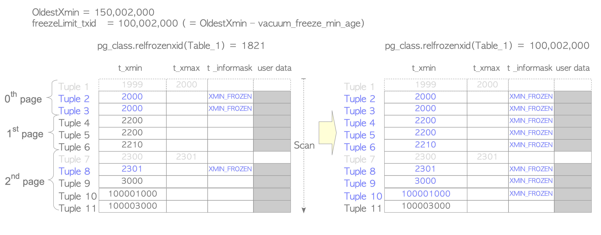
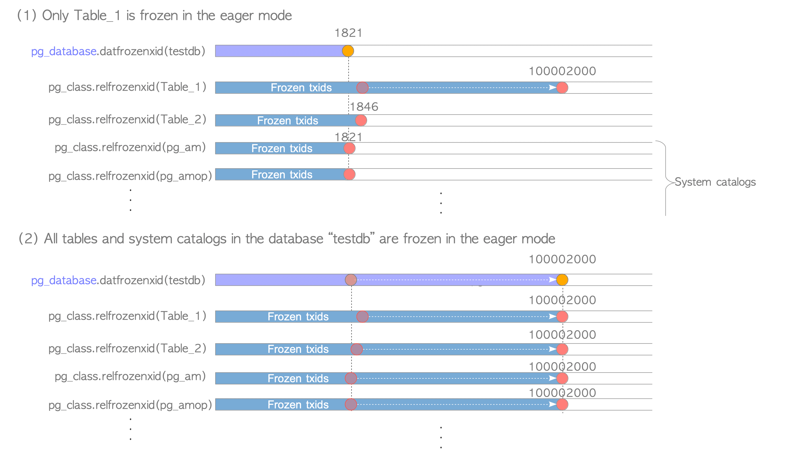

# VACUUM과 데이터 유지관리

## 한줄 요약

PostgreSQL은 MVCC로 인해 삭제/수정된 데이터가 즉시 사라지지 않고 "죽은 튜플(Dead Tuple)"로 남기 때문에, VACUUM 작업으로 이를 정리하고 공간을 재사용 가능하도록 표시해야 합니다.

> 📖 이 노트의 다이어그램은 [The Internals of PostgreSQL](https://www.interdb.jp/pg/)에서 가져왔습니다.

## 왜 알아야 하는가

### 실무에서 마주하는 문제들

1. **테이블 크기가 계속 증가**
   - 매일 수백만 건의 이벤트 로그 INSERT/DELETE
   - 실제 데이터는 일정한데 테이블 파일 크기만 커짐
   - 디스크 공간 부족 경고

2. **쿼리 성능 저하**
   - 같은 쿼리인데 점점 느려짐
   - Dead Tuple이 쌓여 Seq Scan 시간 증가
   - Index Bloat로 인한 인덱스 스캔 성능 저하

3. **Transaction ID Wraparound 에러**
   ```
   ERROR: database is not accepting commands to avoid wraparound data loss
   ```
   - 갑자기 데이터베이스가 읽기 전용 모드로 전환
   - 긴급 VACUUM 필요

4. **Autovacuum이 테이블을 따라잡지 못함**
   - 대용량 테이블에서 빈번한 UPDATE
   - n_dead_tup이 계속 증가
   - Autovacuum 튜닝 필요

5. **VACUUM FULL 후 다운타임**
   - 디스크 공간 회수를 위해 VACUUM FULL 실행
   - ACCESS EXCLUSIVE 락으로 서비스 중단
   - 더 나은 대안 필요 (pg_repack)

### VACUUM을 이해하지 못하면?

- 테이블 Bloat로 성능 저하
- 불필요한 디스크 I/O 증가
- Transaction ID Wraparound로 시스템 중단
- Index-Only Scan 최적화 불가
- 통계 정보 부정확으로 잘못된 실행 계획

## 핵심 개념

### 1. Dead Tuple이 생기는 과정


*Dead Tuple 누적 과정*

> **🔍 그림 해설**
>
> UPDATE나 DELETE를 하면 기존 행이 즉시 사라지지 않습니다. xmax 필드에 "삭제됨" 표시만 찍히고 유령처럼 남아있죠.
> 이게 바로 "Dead Tuple"입니다. 아무도 볼 수 없지만 파일에는 여전히 자리를 차지하고 있습니다.
> 시간이 지나면서 UPDATE/DELETE가 반복되면 Dead Tuple이 쌓입니다. 페이지가 유령들로 가득 차는 것이죠.
> 이것이 "테이블 bloat(부풀어오름)"입니다. 실제 데이터는 1만 건인데 파일엔 10만 건 크기만큼 공간을 차지합니다.
> VACUUM이 바로 이 유령들을 쫓아내는 "고스트버스터"입니다. Dead Tuple을 정리하고 공간을 재사용 가능하게 만들어줍니다.

**MVCC의 부작용:**

PostgreSQL은 MVCC를 위해 UPDATE/DELETE 시 기존 튜플을 즉시 삭제하지 않습니다.

```sql
-- 초기 상태
INSERT INTO users (user_id, username, email)
VALUES (1, 'alice', 'alice@example.com');
-- 물리적: [튜플1: xmin=1000, xmax=0, data='alice']

-- UPDATE 실행
BEGIN; -- XID=1001
UPDATE users SET email = 'newalice@example.com' WHERE user_id = 1;
COMMIT;
-- 물리적:
--   [튜플1: xmin=1000, xmax=1001, data='alice'] ← Dead Tuple
--   [튜플2: xmin=1001, xmax=0, data='newalice'] ← Live Tuple
```

**실제로 일어나는 일:**

1. UPDATE는 새 튜플 버전을 생성
2. 기존 튜플의 xmax를 현재 XID로 설정
3. 두 튜플 모두 테이블 파일에 존재
4. 트랜잭션 커밋 후:
   - 새 트랜잭션: 튜플2만 보임 (튜플1은 xmax=1001로 삭제됨)
   - 튜플1은 어떤 트랜잭션에도 보이지 않음 → Dead Tuple

**DELETE의 경우:**

```sql
DELETE FROM users WHERE user_id = 1;
-- 물리적:
--   [튜플2: xmin=1001, xmax=1002, data='newalice'] ← Dead Tuple
-- 새 튜플이 생성되지 않고, 기존 튜플만 xmax 표시
```

### 2. Dead Tuple 확인하기

```sql
-- pg_stat_user_tables 뷰로 확인
SELECT
    schemaname,
    relname,
    n_live_tup,        -- 살아있는 튜플 수
    n_dead_tup,        -- 죽은 튜플 수
    n_tup_ins,         -- 누적 INSERT 수
    n_tup_upd,         -- 누적 UPDATE 수
    n_tup_del,         -- 누적 DELETE 수
    last_vacuum,       -- 마지막 수동 VACUUM
    last_autovacuum,   -- 마지막 자동 VACUUM
    vacuum_count,      -- 수동 VACUUM 횟수
    autovacuum_count   -- 자동 VACUUM 횟수
FROM pg_stat_user_tables
WHERE relname = 'event_logs';

-- 예시 출력:
-- relname     | n_live_tup | n_dead_tup | n_tup_upd | last_autovacuum
-- ------------+------------+------------+-----------+------------------
-- event_logs  |   1000000  |    250000  |   500000  | 2026-01-31 10:00
```

**Dead Tuple 비율 계산:**

```sql
SELECT
    schemaname || '.' || relname AS table_name,
    n_live_tup,
    n_dead_tup,
    ROUND(n_dead_tup * 100.0 / NULLIF(n_live_tup + n_dead_tup, 0), 2) AS dead_pct,
    last_autovacuum
FROM pg_stat_user_tables
WHERE n_dead_tup > 0
ORDER BY n_dead_tup DESC
LIMIT 10;

-- dead_pct > 20%면 VACUUM 고려
```

### 3. VACUUM의 역할


*VACUUM 처리 과정*

> **🔍 그림 해설**
>
> VACUUM은 청소부처럼 모든 페이지를 돌아다니며 Dead Tuple(유령)을 찾아냅니다. "이 행은 어떤 트랜잭션도 더 이상 안 봐" 하고 확인되면
> 그 공간을 "재사용 가능" 스티커를 붙입니다. 실제로 데이터를 지우는 게 아니라, Free Space Map(FSM)에 "여기 빈 공간 있어요"라고 표시합니다.
> 나중에 누군가 INSERT를 하면 PostgreSQL은 FSM을 보고 "오, 이 페이지에 빈 공간이 있네?"하고 거기에 새 데이터를 넣습니다.
> 중요한 점: VACUUM은 파일 크기를 줄이지 않습니다! 마치 방을 정리해도 방 크기는 그대로인 것처럼요.
> 파일은 그대로 120MB인데, 내부적으로 60MB는 쓰고 60MB는 "빈 공간"으로 표시되어 있는 상태가 됩니다.

**VACUUM이 하는 일:**

1. **Dead Tuple 공간 재사용 표시**
   - Dead Tuple을 식별하여 "재사용 가능" 표시
   - 실제 파일에서 삭제하지 않음 (VACUUM FULL은 예외)
   - Free Space Map (FSM)에 빈 공간 기록

2. **Visibility Map 업데이트**
   - 페이지에 Dead Tuple이 없음을 표시
   - Index-Only Scan 최적화에 사용

3. **통계 정보 업데이트**
   - pg_class의 reltuples, relpages 갱신
   - 쿼리 플래너가 사용하는 정보

4. **Transaction ID Wraparound 방지**
   - 오래된 XID를 FrozenXID로 동결
   - pg_class의 relfrozenxid 갱신

**VACUUM이 하지 않는 일:**

- 디스크 공간 반환 (OS에게 돌려주지 않음)
- 파일 크기 축소 (VACUUM FULL만 가능)
- 인덱스 재구성 (REINDEX 필요)

### 4. VACUUM vs VACUUM FULL


*VACUUM vs VACUUM FULL 비교*

> **🔍 그림 해설**
>
> 일반 VACUUM은 방 안의 물건을 정리하는 것입니다. 서랍을 정리하고 쓰레기를 버리지만, 방 크기는 그대로입니다.
> VACUUM FULL은 아예 더 작은 아파트로 이사하는 것입니다. 모든 물건을 새 파일에 빽빽하게 다시 포장하고, 기존 파일은 버립니다.
> 일반 VACUUM: 서비스 계속 가능(shared lock), 빠름, 파일 크기 유지. 매일 하는 청소라고 생각하세요.
> VACUUM FULL: 서비스 중단 필요(exclusive lock), 느림, 파일 크기 축소. 그리고 디스크 공간이 테이블 크기의 2배 필요합니다(복사본 만들어야 하니까).
> 일반적으로 VACUUM FULL은 거의 쓰지 않습니다. Bloat이 극심할 때만요. 대신 pg_repack 같은 온라인 도구를 씁니다.

| 구분 | VACUUM | VACUUM FULL |
|------|--------|-------------|
| 락 레벨 | SHARE UPDATE EXCLUSIVE (SELECT 가능) | ACCESS EXCLUSIVE (모든 접근 차단) |
| 파일 크기 | 유지 (줄지 않음) | 축소 (최소 크기로) |
| 공간 재사용 | FSM에 표시 | 새 파일 생성 |
| 속도 | 빠름 | 느림 |
| 디스크 사용 | 테이블 크기만큼 | 테이블 크기 × 2 (임시 복사본) |
| 다운타임 | 없음 | 있음 |

**VACUUM 동작:**

```
기존 파일 (8KB 페이지 단위):
[Live][Dead][Live][Dead][Live][Dead]
              ↓ VACUUM 후
[Live][Free][Live][Free][Live][Free]
              ↓ 새 INSERT
[Live][Live][Live][New ][Live][New ]

파일 크기: 변화 없음
```

**VACUUM FULL 동작:**

```
기존 파일:
[Live][Dead][Live][Dead][Live][Dead]
              ↓ VACUUM FULL
새 파일 생성:
[Live][Live][Live]

파일 교체 (rename)
디스크 공간 회수
```

### 5. Free Space Map (FSM)


*Free Space Map (FSM)*

> **🔍 그림 해설**
>
> FSM은 주차장 안내판과 같습니다. "A 구역: 10대 가능, B 구역: 5대 가능, C 구역: 꽉참" 이런 식으로 각 페이지의 빈 공간 크기를 기록합니다.
> 트리 구조로 되어 있어서 빠르게 검색할 수 있습니다. 각 페이지당 하나의 항목이 있죠.
> 새 데이터를 INSERT할 때 PostgreSQL은 "어느 페이지에 넣을까?" 고민합니다. FSM을 보고 "오, 페이지 5번에 4KB 빈 공간이 있네!" 하고 바로 찾아갑니다.
> FSM이 없다면? 빈 공간 찾으려고 모든 페이지를 순차적으로 뒤져야 합니다. 100만 페이지면 100만 번 확인해야죠. 끔찍하게 느립니다.
> VACUUM이 FSM을 업데이트해주기 때문에, INSERT 성능이 빠르게 유지됩니다. 항상 최신 "주차 가능 정보"를 제공하는 셈이죠.

PostgreSQL은 각 테이블/인덱스마다 FSM 파일을 유지합니다.

```bash
# 데이터 디렉토리에서 확인
ls -lh $PGDATA/base/16384/
# 16385      ← 테이블 파일
# 16385_fsm  ← Free Space Map
# 16385_vm   ← Visibility Map
```

**FSM의 역할:**
- 각 페이지의 빈 공간 크기 기록
- INSERT 시 빈 공간이 있는 페이지 빠르게 찾기
- VACUUM이 업데이트

```sql
-- FSM 확인 (pg_freespacemap 확장 필요)
CREATE EXTENSION pg_freespacemap;

SELECT
    blkno,          -- 페이지 번호
    avail           -- 사용 가능한 바이트 수
FROM pg_freespace('users')
LIMIT 10;

-- 예시 출력:
-- blkno | avail
-- ------+------
--     0 |  1024  ← 페이지 0에 1KB 빈 공간
--     1 |  4096  ← 페이지 1에 4KB 빈 공간
--     2 |     0  ← 페이지 2는 꽉 참
```

### 6. Visibility Map (VM)


*Visibility Map (VM)*

> **🔍 그림 해설**
>
> VM은 "깨끗한 페이지" 표시기입니다. 각 페이지마다 1비트짜리 깃발이 있습니다. 깃발이 세워져 있으면 "이 페이지의 모든 행은 누구에게나 보여!"
> 왜 이게 중요할까요? 두 가지 최적화가 가능합니다. 첫째, VACUUM이 깨끗한 페이지는 건너뛸 수 있습니다. "여기 청소할 거 없어, 패스!"
> 둘째, Index-Only Scan이 가능해집니다. 인덱스에서 답을 찾았는데 보통은 테이블에 가서 "이 행이 내 트랜잭션에게 보이는지" 확인해야 합니다.
> 하지만 VM 비트가 켜져 있으면? "이 페이지는 모두에게 보이니까 테이블 안 가봐도 돼!" 하고 건너뜁니다. 엄청난 성능 향상이죠.
> VACUUM을 실행하면 VM이 업데이트되고, 그 결과 읽기 쿼리가 빨라집니다. VACUUM이 쓰기만 최적화하는 게 아니라 읽기도 빠르게 만듭니다!

각 페이지가 "모두 보이는 튜플만 있는지" 추적합니다.

```bash
# VM 파일
ls -lh $PGDATA/base/16384/16385_vm
```

**VM의 두 가지 비트:**

1. **All-Visible 비트**
   - 페이지의 모든 튜플이 모든 트랜잭션에게 보임
   - Index-Only Scan 가능 (테이블 접근 생략)

2. **All-Frozen 비트** (PostgreSQL 9.6+)
   - 페이지의 모든 튜플이 동결됨
   - Wraparound 방지 VACUUM 시 건너뛰기 가능

```sql
-- VM 확인 (pg_visibility 확장 필요)
CREATE EXTENSION pg_visibility;

SELECT
    blkno,
    all_visible,
    all_frozen
FROM pg_visibility_map('users')
LIMIT 10;

-- 예시:
-- blkno | all_visible | all_frozen
-- ------+-------------+------------
--     0 | t           | t          ← 최적화 가능
--     1 | t           | f          ← Index-Only Scan만 가능
--     2 | f           | f          ← 최적화 불가
```


*HOT (Heap-Only Tuple) 업데이트*

> **🔍 그림 해설**
>
> HOT은 자주 UPDATE되는 테이블을 위한 최적화입니다. 보통 UPDATE하면 인덱스도 다 업데이트해야 합니다.
> 하지만 인덱스에 없는 컬럼만 바꾼다면? 예를 들어 "마지막 로그인 시각" 컬럼을 업데이트하는데 인덱스는 이메일에만 걸려있다면?
> HOT은 새 튜플 버전을 같은 페이지 안에 만들고, 기존 튜플에서 체인으로 연결합니다. 인덱스는 건드리지 않고요!
> 인덱스 업데이트를 건너뛰니까 훨씬 빠릅니다. 그리고 인덱스 bloat도 안 생깁니다. UPDATE가 많은 테이블에서 성능이 크게 향상됩니다.
> 조건: 같은 페이지 안에 공간이 있어야 하고, 인덱스된 컬럼을 안 바꿔야 합니다. VACUUM이 공간을 확보해주면 HOT이 더 잘 작동합니다.


*Index-Only Scan과 VM*

> **🔍 그림 해설**
>
> 보통 인덱스에서 행을 찾으면 테이블에 가서 "이 행이 내 트랜잭션에 보이는가?" 확인해야 합니다(Heap Fetch).
> 하지만 Visibility Map에 "이 페이지는 모두에게 보임" 비트가 켜져 있으면? 테이블 방문을 건너뜁니다!
> 인덱스만 보고 답을 돌려줍니다. 이게 "Index-Only Scan"입니다. 테이블 I/O가 0이 되니까 엄청 빠릅니다.
> VM은 VACUUM이 업데이트해줍니다. 그래서 VACUUM을 실행하면 쓰기 성능뿐만 아니라 읽기 성능도 좋아집니다!
> SELECT 쿼리가 느려졌다면? VACUUM을 실행해보세요. VM이 갱신되면서 Index-Only Scan이 활성화될 수 있습니다.

**Index-Only Scan과의 관계:**

```sql
-- VM이 없으면
EXPLAIN (ANALYZE, BUFFERS)
SELECT email FROM users WHERE email = 'alice@example.com';
-- Index Scan + Heap Fetches (테이블 접근 필요)

-- VM이 있으면 (VACUUM 후)
VACUUM users;
EXPLAIN (ANALYZE, BUFFERS)
SELECT email FROM users WHERE email = 'alice@example.com';
-- Index Only Scan (테이블 접근 없음, 빠름!)
```

## OS/파일시스템 관점

### 1. VACUUM은 파일 크기를 줄이지 않음

**실습으로 확인:**

```sql
-- 1. 테이블 파일 위치 찾기
SELECT pg_relation_filepath('event_logs');
-- 출력: base/16384/16390

-- 2. 대량 데이터 삽입
INSERT INTO event_logs (user_id, event_type, event_data, created_at)
SELECT
    (random() * 1000)::int,
    'page_view',
    '{"page": "/products"}'::jsonb,
    NOW() - (random() * INTERVAL '30 days')
FROM generate_series(1, 1000000);
```

```bash
# OS 레벨에서 파일 크기 확인
ls -lh $PGDATA/base/16384/16390
# -rw------- 1 postgres postgres 120M Jan 31 10:00 16390
```

```sql
-- 3. 절반 삭제
DELETE FROM event_logs WHERE event_id % 2 = 0;

-- 4. Dead Tuple 확인
SELECT n_live_tup, n_dead_tup FROM pg_stat_user_tables
WHERE relname = 'event_logs';
-- n_live_tup=500000, n_dead_tup=500000
```

```bash
# 파일 크기는 여전히 120M
ls -lh $PGDATA/base/16384/16390
# -rw------- 1 postgres postgres 120M Jan 31 10:05 16390
```

```sql
-- 5. VACUUM 실행
VACUUM VERBOSE event_logs;
-- INFO: "event_logs": removed 500000 row versions in 15385 pages
-- INFO: "event_logs": found 500000 removable, 500000 nonremovable row versions
```

```bash
# VACUUM 후에도 파일 크기 동일!
ls -lh $PGDATA/base/16384/16390
# -rw------- 1 postgres postgres 120M Jan 31 10:10 16390
```

**왜 파일 크기가 안 줄어드나?**

- PostgreSQL은 OS에 파일 블록을 반환하지 않음
- 빈 공간을 FSM에 표시만 함
- 새로운 INSERT/UPDATE가 빈 공간 재사용
- 디스크 단편화 방지, 파일 확장 오버헤드 감소

**파일 크기를 줄이려면:**

```sql
-- 방법 1: VACUUM FULL (다운타임 필요)
VACUUM FULL event_logs;
```

```bash
# 파일 크기 축소 확인
ls -lh $PGDATA/base/16384/16390
# -rw------- 1 postgres postgres 60M Jan 31 10:15 16390
```

```sql
-- 방법 2: pg_repack (온라인, 확장 설치 필요)
-- CREATE EXTENSION pg_repack;
-- pg_repack -t event_logs
```

### 2. VACUUM FULL의 내부 동작

**파일 레벨에서 일어나는 일:**

1. **새 파일 생성**
   ```bash
   # VACUUM FULL 시작
   # 임시 파일 생성: 16390.1
   ls -lh $PGDATA/base/16384/
   # 16390      ← 기존 파일 (120M)
   # 16390.1    ← 새 파일 (0 → 60M로 증가)
   ```

2. **Live Tuple만 복사**
   - 기존 파일에서 Live Tuple 읽기
   - 새 파일에 순차적으로 쓰기
   - Dead Tuple은 건너뛰기

3. **파일 교체**
   ```bash
   # 복사 완료 후
   # rename(16390.1 → 16390)
   # 기존 파일 삭제
   ls -lh $PGDATA/base/16384/
   # 16390      ← 새 파일 (60M)
   ```

**디스크 공간 요구사항:**

- 테이블 크기 × 2 필요
- 120M 테이블 → 최소 120M 추가 공간
- 디스크 부족 시 VACUUM FULL 실패

**락 영향:**

```sql
-- 세션 1: VACUUM FULL 실행
VACUUM FULL event_logs;
-- ACCESS EXCLUSIVE 락 획득

-- 세션 2: 모든 작업 차단
SELECT * FROM event_logs; -- 대기
INSERT INTO event_logs ...; -- 대기
-- VACUUM FULL이 끝날 때까지 차단
```

### 3. Sparse File과의 차이

일부 파일 시스템은 "Sparse File" (구멍 뚫린 파일)을 지원하지만, PostgreSQL은 사용하지 않습니다.

**Sparse File:**
```bash
# 예시: 1GB 파일 생성하지만 실제 디스크는 0 사용
dd if=/dev/zero of=sparse.dat bs=1M seek=1024 count=0
ls -lh sparse.dat
# -rw-r--r-- 1 user user 1.0G Jan 31 10:00 sparse.dat
du -h sparse.dat
# 0       sparse.dat  ← 실제 디스크 사용량
```

**PostgreSQL이 Sparse File을 안 쓰는 이유:**

1. **예측 가능한 성능**
   - Sparse 영역 접근 시 갑작스런 디스크 할당 발생
   - 성능이 불안정

2. **디스크 공간 부족 위험**
   - 논리적 크기와 물리적 크기 차이
   - 갑작스런 "No space left on device" 에러

3. **파일 시스템 의존성**
   - 모든 FS가 Sparse 지원하는 것은 아님
   - 이식성 문제

### 4. VACUUM의 I/O 패턴

**순차 읽기 + 랜덤 쓰기:**

```
VACUUM 동작:
1. 테이블 순차 스캔 (Sequential Read)
   [페이지0][페이지1][페이지2]...

2. Dead Tuple 식별 및 FSM 업데이트

3. 인덱스 정리 (Random Write)
   인덱스 페이지의 포인터 제거

4. Visibility Map 업데이트
```

**I/O 영향 최소화:**

```sql
-- VACUUM 속도 제한 (IOPS 제한)
SET vacuum_cost_delay = 10;      -- 10ms 지연
SET vacuum_cost_limit = 200;     -- 비용 한계

-- 또는 테이블별 설정
ALTER TABLE event_logs SET (autovacuum_vacuum_cost_delay = 20);
```

**VACUUM 진행 상황 모니터링:**

```sql
SELECT
    pid,
    phase,
    heap_blks_total,
    heap_blks_scanned,
    heap_blks_vacuumed,
    index_vacuum_count,
    max_dead_tuples,
    num_dead_tuples
FROM pg_stat_progress_vacuum;

-- 예시 출력:
-- phase: scanning heap
-- heap_blks_scanned: 5000 / 15385
-- 진행률: 약 32%
```

## Autovacuum


*Autovacuum 워커*

> **🔍 그림 해설**
>
> Autovacuum은 자동 청소 로봇입니다. "런처(launcher)"라는 관리자가 모든 테이블을 감시하고 있습니다.
> 런처는 각 테이블의 "더러움 점수"를 계산합니다: Dead Tuple 개수를 셉니다. 임계값(threshold)을 넘으면?
> "워커(worker)" 프로세스를 파견합니다. "3번 워커, 저 event_logs 테이블 좀 청소하고 와!" 워커가 VACUUM을 실행하죠.
> 기본 설정은 "Dead Tuple이 50 + 전체 행 수의 20%"를 넘으면 청소합니다. 1000행 테이블이면 250개 Dead Tuple에서 트리거됩니다.
> 여러 워커가 동시에 다른 테이블을 청소할 수 있습니다. 직접 VACUUM 명령어를 칠 필요가 없어요. 자동으로 다 해줍니다!

### 1. Autovacuum 동작 원리

PostgreSQL은 백그라운드에서 자동으로 VACUUM을 실행합니다.

**Autovacuum Launcher:**
- postgresql.conf: `autovacuum = on` (기본값)
- 주기적으로 작업이 필요한 테이블 찾기
- Autovacuum Worker 프로세스 생성

**트리거 조건:**

테이블이 VACUUM되는 시점:
```
n_dead_tup > threshold + scale_factor * n_live_tup

기본값:
threshold = 50
scale_factor = 0.2

예시:
n_live_tup = 1000 → threshold = 50 + 0.2*1000 = 250
n_dead_tup > 250이면 VACUUM 실행
```

**설정 확인:**

```sql
-- 전역 설정
SHOW autovacuum_vacuum_threshold;  -- 50
SHOW autovacuum_vacuum_scale_factor; -- 0.2

-- 테이블별 설정
SELECT
    relname,
    reloptions
FROM pg_class
WHERE relname = 'event_logs';
-- reloptions: {autovacuum_vacuum_scale_factor=0.1}
```

### 2. Autovacuum 튜닝

**대용량 테이블 문제:**

```sql
-- 1억 건의 테이블
-- threshold = 50 + 0.2 * 100,000,000 = 20,000,050
-- 2천만 건이 Dead Tuple이 되어야 VACUUM!
-- → Bloat 심각

-- 해결: 테이블별 scale_factor 조정
ALTER TABLE event_logs SET (
    autovacuum_vacuum_scale_factor = 0.01,  -- 1%
    autovacuum_vacuum_threshold = 10000
);
-- 새 threshold = 10,000 + 0.01 * 100,000,000 = 1,010,000
```

**빈번한 UPDATE 테이블:**

```sql
-- inventory 테이블: 재고 변경 빈번
ALTER TABLE inventory SET (
    autovacuum_vacuum_scale_factor = 0.05,
    autovacuum_vacuum_threshold = 100,
    autovacuum_vacuum_cost_delay = 5  -- 더 자주, 빠르게
);
```

**거의 변경 없는 테이블:**

```sql
-- categories 테이블: 거의 정적
ALTER TABLE categories SET (
    autovacuum_vacuum_scale_factor = 0.5,  -- 덜 자주
    autovacuum_vacuum_threshold = 1000
);
```

### 3. Autovacuum Worker 설정

**postgresql.conf 주요 파라미터:**

```ini
# Worker 프로세스 수 (기본: 3)
autovacuum_max_workers = 6
# CPU 코어 수 고려, 너무 많으면 I/O 경쟁

# Autovacuum 실행 간격 (기본: 60초)
autovacuum_naptime = 30s
# 더 자주 체크 → 더 빠른 반응

# VACUUM 메모리 (기본: -1, maintenance_work_mem 사용)
autovacuum_work_mem = 1GB
# Dead Tuple ID 저장 메모리, 클수록 빠름

# VACUUM 비용 제한 (기본: -1, vacuum_cost_delay 사용)
autovacuum_vacuum_cost_delay = 2ms
# I/O 영향 최소화

autovacuum_vacuum_cost_limit = 200
# 비용 한계, 높을수록 빠르지만 I/O 영향 큼
```

**Worker 활동 확인:**

```sql
-- 현재 실행 중인 Autovacuum
SELECT
    pid,
    state,
    query,
    NOW() - query_start AS duration
FROM pg_stat_activity
WHERE query LIKE 'autovacuum:%'
ORDER BY query_start;

-- Autovacuum 통계
SELECT
    schemaname,
    relname,
    last_autovacuum,
    autovacuum_count,
    n_dead_tup,
    n_live_tup
FROM pg_stat_user_tables
ORDER BY last_autovacuum DESC NULLS LAST;
```

### 4. Autovacuum이 따라잡지 못하는 경우

**증상:**
- n_dead_tup이 계속 증가
- last_autovacuum이 오래됨
- 쿼리 성능 저하

**원인:**

1. **장시간 실행 트랜잭션**
   ```sql
   -- 오래된 트랜잭션은 VACUUM을 방해
   SELECT
       pid,
       usename,
       NOW() - xact_start AS duration,
       state,
       query
   FROM pg_stat_activity
   WHERE xact_start IS NOT NULL
   ORDER BY xact_start
   LIMIT 5;

   -- 1시간 이상 실행 중인 트랜잭션은 종료 고려
   SELECT pg_terminate_backend(pid) WHERE ...;
   ```

2. **Autovacuum이 자주 취소됨**
   ```sql
   -- 로그에서 확인
   -- LOG: automatic vacuum of table "db.schema.table" was canceled
   -- 원인: DDL (ALTER, DROP 등) 실행 시 Autovacuum 취소

   -- 해결: 수동 VACUUM 실행
   VACUUM (VERBOSE) event_logs;
   ```

3. **설정이 너무 보수적**
   ```sql
   -- scale_factor가 너무 높음
   ALTER TABLE event_logs SET (
       autovacuum_vacuum_scale_factor = 0.05  -- 0.2에서 낮춤
   );
   ```

4. **Worker 수 부족**
   ```ini
   # postgresql.conf
   autovacuum_max_workers = 10  # 3에서 증가
   ```

## Transaction ID Wraparound


*Transaction ID Wraparound 문제*

> **🔍 그림 해설**
>
> 트랜잭션 ID는 32비트 숫자라서 약 42억까지만 갑니다. 42억 번째 다음에는 다시 0으로 돌아갑니다(wraparound).
> 시계 바늘이 12에서 1로 넘어가듯이요. 문제는 PostgreSQL이 "과거/미래"를 XID 비교로 판단한다는 점입니다.
> XID=10인 행을 만들었는데, wraparound로 현재 XID가 100이 되면? 10<100이라 과거 데이터로 보입니다(정상).
> 하지만 계속 가서 현재 XID가 다시 0 근처로 오면? 갑자기 XID=10이 "미래" 데이터로 보이게 됩니다! 데이터가 사라지는 거죠.
> 해결책: VACUUM이 오래된 XID를 "FrozenXID(2)"로 바꿉니다. "이 행은 영원히 과거야"라고 표시하는 겁니다.
> 이래서 autovacuum을 절대 끄면 안 됩니다. Wraparound로 데이터베이스가 읽기 전용 모드로 강제 전환될 수 있어요!

### 1. Wraparound 문제란?

PostgreSQL의 XID는 32비트 정수입니다:
- 범위: 0 ~ 4,294,967,295 (약 42억)
- 순환: 42억 번째 트랜잭션 후 다시 0으로

**문제:**
- XID 비교는 "과거/미래" 판단에 사용
- Wraparound 후 과거 데이터가 "미래"로 보임
- 데이터가 갑자기 안 보이게 됨

**예시:**

```
XID=10 트랜잭션이 생성한 데이터
현재 XID=2,000,000,000

XID=10 < 2,000,000,000 → 과거 데이터 (보임)

Wraparound 후
현재 XID=100

XID=10 < 100 → 과거 데이터 (보임) ← 아직 OK

XID=2,000,000,000 < 100???
→ PostgreSQL: "2,000,000,000은 미래!"
→ 해당 데이터 안 보임 ← 문제!
```

### 2. Freezing으로 해결

**해결책: 오래된 XID를 FrozenXID(2)로 교체**

```sql
-- VACUUM은 오래된 튜플을 동결 (Freeze)
VACUUM (FREEZE, VERBOSE) users;
-- INFO: "users": found 10000 nonremovable row versions in 123 pages
-- INFO: frozen: 10000 pages
```

**Freezing 임계값:**

```sql
-- 전역 설정
SHOW vacuum_freeze_min_age;        -- 50,000,000 (5천만)
SHOW vacuum_freeze_table_age;      -- 150,000,000 (1억 5천만)

-- 의미:
-- XID가 5천만 이상 오래된 튜플은 VACUUM 시 동결
-- 테이블의 relfrozenxid가 1억 5천만 이상 오래되면 전체 스캔
```

**relfrozenxid 확인:**

```sql
SELECT
    c.oid::regclass AS table_name,
    age(c.relfrozenxid) AS xid_age,
    c.relfrozenxid,
    pg_size_pretty(pg_total_relation_size(c.oid)) AS size
FROM pg_class c
JOIN pg_namespace n ON c.relnamespace = n.oid
WHERE c.relkind IN ('r', 'm')  -- 테이블, materialized view
AND n.nspname NOT IN ('pg_catalog', 'information_schema')
ORDER BY age(c.relfrozenxid) DESC
LIMIT 10;

-- xid_age가 2억 넘으면 위험!
```

### 3. Autovacuum의 Wraparound 방지

**자동 개입:**

```sql
-- Autovacuum이 강제로 실행되는 시점
SHOW autovacuum_freeze_max_age;  -- 200,000,000 (2억)

-- relfrozenxid age가 2억 넘으면
-- 다른 설정 무시하고 무조건 VACUUM (FREEZE)
```

**긴급 상황:**

```
XID age > 2,000,000,000 (20억)
→ WARNING: database must be vacuumed within ... transactions

XID age > 2,100,000,000 (21억)
→ ERROR: database is not accepting commands to avoid wraparound data loss
→ 읽기 전용 모드 진입
```

**복구 방법:**

```sql
-- 1. 싱글 유저 모드로 PostgreSQL 시작
-- postgres --single -D /var/lib/postgresql/data dbname

-- 2. 각 테이블 VACUUM
VACUUM (FREEZE, VERBOSE) users;
VACUUM (FREEZE, VERBOSE) orders;
-- 모든 테이블 처리

-- 3. 정상 모드로 재시작
```

### 4. 예방 조치

```sql
-- 1. 정기적으로 age 모니터링
SELECT datname, age(datfrozenxid)
FROM pg_database
ORDER BY age(datfrozenxid) DESC;

-- 2. 문제 테이블 조기 VACUUM
SELECT c.oid::regclass, age(c.relfrozenxid)
FROM pg_class c
WHERE age(c.relfrozenxid) > 100000000  -- 1억 이상
ORDER BY age(c.relfrozenxid) DESC;

-- 3. 수동 VACUUM FREEZE
VACUUM (FREEZE, VERBOSE) problem_table;

-- 4. Autovacuum 튜닝
ALTER TABLE large_table SET (
    autovacuum_freeze_max_age = 100000000  -- 기본값보다 낮춤
);
```

## PostgreSQL 17의 개선사항

### 1. VACUUM 메모리 관리 개선

PostgreSQL 17은 VACUUM의 메모리 사용을 더 효율적으로 관리합니다.

**이전 버전 (≤16):**
- maintenance_work_mem 전체를 Dead Tuple ID 저장에 사용
- 메모리 부족 시 인덱스 정리를 여러 번 수행 (느림)

**PostgreSQL 17:**
- TID (Tuple Identifier) 저장 방식 개선
- 같은 메모리로 더 많은 Dead Tuple 추적 가능
- 대용량 테이블 VACUUM 성능 향상

```sql
-- 17에서 VACUUM 성능 비교
SET maintenance_work_mem = '1GB';

VACUUM (VERBOSE, PARALLEL 4) event_logs;
-- INFO: launched 4 parallel vacuum workers
-- INFO: "event_logs": removed 10000000 row versions in 153847 pages
-- 이전 버전보다 20-30% 빠름
```

### 2. 병렬 VACUUM 개선

```sql
-- 인덱스가 많은 테이블도 병렬 처리
CREATE INDEX idx1 ON event_logs(user_id);
CREATE INDEX idx2 ON event_logs(event_type);
CREATE INDEX idx3 ON event_logs(created_at);
CREATE INDEX idx4 ON event_logs((event_data->>'page'));

VACUUM (VERBOSE, PARALLEL 4) event_logs;
-- 4개 인덱스를 병렬로 정리
```

### 3. VACUUM 진행 상황 추적 개선

```sql
-- pg_stat_progress_vacuum 뷰에 새 컬럼 추가
SELECT
    phase,
    heap_blks_total,
    heap_blks_scanned,
    heap_blks_vacuumed,
    index_vacuum_count,
    max_dead_tuples,
    num_dead_tuples,
    -- PostgreSQL 17 추가
    parallel_workers_launched,
    parallel_workers_to_launch
FROM pg_stat_progress_vacuum;
```

## 실습 SQL

### 1. Dead Tuple 생성 및 관찰

```sql
-- 실습 테이블 생성
CREATE TABLE vacuum_test (
    id SERIAL PRIMARY KEY,
    data TEXT,
    updated_at TIMESTAMP DEFAULT NOW()
);

-- 초기 데이터 (10만 건)
INSERT INTO vacuum_test (data)
SELECT 'Initial data ' || i
FROM generate_series(1, 100000) AS i;

-- 통계 확인
SELECT
    n_live_tup,
    n_dead_tup,
    n_tup_upd,
    last_vacuum,
    last_autovacuum
FROM pg_stat_user_tables
WHERE relname = 'vacuum_test';
-- n_live_tup=100000, n_dead_tup=0

-- 전체 UPDATE (Dead Tuple 생성)
UPDATE vacuum_test SET data = 'Updated data', updated_at = NOW();

-- 다시 확인
SELECT n_live_tup, n_dead_tup FROM pg_stat_user_tables
WHERE relname = 'vacuum_test';
-- n_live_tup=100000, n_dead_tup=100000
-- 실제로는 20만 개 튜플이 파일에 존재!

-- 테이블 크기 확인
SELECT pg_size_pretty(pg_total_relation_size('vacuum_test'));
-- 예: 18 MB

-- VACUUM 실행
VACUUM VERBOSE vacuum_test;
-- INFO: "vacuum_test": removed 100000 row versions in 1370 pages
-- INFO: "vacuum_test": found 100000 removable, 100000 nonremovable

-- Dead Tuple 제거 확인
SELECT n_live_tup, n_dead_tup FROM pg_stat_user_tables
WHERE relname = 'vacuum_test';
-- n_live_tup=100000, n_dead_tup=0

-- 하지만 테이블 크기는 동일
SELECT pg_size_pretty(pg_total_relation_size('vacuum_test'));
-- 여전히 18 MB

-- VACUUM FULL 실행
VACUUM FULL vacuum_test;

-- 크기 축소 확인
SELECT pg_size_pretty(pg_total_relation_size('vacuum_test'));
-- 약 9 MB (절반으로 축소)
```

### 2. Autovacuum 트리거 실습

```sql
-- Autovacuum 설정 조정
ALTER TABLE vacuum_test SET (
    autovacuum_vacuum_threshold = 100,
    autovacuum_vacuum_scale_factor = 0.1
);
-- threshold = 100 + 0.1 * 100,000 = 10,100

-- 통계 초기화
SELECT pg_stat_reset_single_table_counters('vacuum_test'::regclass);

-- 15,000건 UPDATE (threshold 초과)
UPDATE vacuum_test SET updated_at = NOW() WHERE id <= 15000;

-- Dead Tuple 확인
SELECT n_dead_tup FROM pg_stat_user_tables WHERE relname = 'vacuum_test';
-- n_dead_tup=15000

-- Autovacuum 대기 (최대 60초)
SELECT pg_sleep(60);

-- Autovacuum 실행 확인
SELECT last_autovacuum FROM pg_stat_user_tables WHERE relname = 'vacuum_test';
-- 최근 시각으로 업데이트됨

-- Dead Tuple 정리 확인
SELECT n_dead_tup FROM pg_stat_user_tables WHERE relname = 'vacuum_test';
-- 0 또는 매우 작은 값
```

### 3. Visibility Map과 Index-Only Scan

```sql
-- 인덱스 생성
CREATE INDEX idx_vacuum_test_data ON vacuum_test(data);

-- Index Scan (VM 없음)
EXPLAIN (ANALYZE, BUFFERS)
SELECT data FROM vacuum_test WHERE data LIKE 'Updated%';
-- Index Scan + Heap Fetches (테이블 접근)

-- VACUUM으로 VM 설정
VACUUM (ANALYZE) vacuum_test;

-- Index Only Scan (VM 있음)
EXPLAIN (ANALYZE, BUFFERS)
SELECT data FROM vacuum_test WHERE data LIKE 'Updated%';
-- Index Only Scan
-- Heap Fetches: 0 (테이블 접근 없음!)

-- VM 직접 확인
CREATE EXTENSION IF NOT EXISTS pg_visibility;
SELECT COUNT(*) AS all_visible_pages
FROM pg_visibility_map('vacuum_test')
WHERE all_visible = true;
```

### 4. Bloat 측정

```sql
-- pgstattuple 확장 설치
CREATE EXTENSION pgstattuple;

-- Bloat 분석
SELECT
    schemaname,
    tablename,
    pg_size_pretty(pg_total_relation_size(schemaname||'.'||tablename)) AS size,
    pg_size_pretty((pg_total_relation_size(schemaname||'.'||tablename) -
                    pg_relation_size(schemaname||'.'||tablename))) AS index_size,
    (pgstattuple(schemaname||'.'||tablename)).dead_tuple_percent AS dead_pct,
    (pgstattuple(schemaname||'.'||tablename)).free_percent AS free_pct
FROM pg_tables
WHERE schemaname = 'public' AND tablename = 'vacuum_test';

-- 예시 출력:
-- tablename    | size   | index_size | dead_pct | free_pct
-- -------------+--------+------------+----------+---------
-- vacuum_test  | 18 MB  | 2192 kB    |    0.00  |   48.52
-- free_pct가 높으면 VACUUM FULL 고려
```

## 직접 확인해보기

### 1. VACUUM VERBOSE 출력 분석

```sql
VACUUM (VERBOSE, ANALYZE) event_logs;
```

**출력 예시:**
```
INFO:  vacuuming "public.event_logs"
INFO:  scanned index "event_logs_pkey" to remove 150000 row versions
DETAIL:  CPU: user: 0.45 s, system: 0.12 s, elapsed: 2.34 s
INFO:  scanned index "idx_event_logs_user_id" to remove 150000 row versions
DETAIL:  CPU: user: 0.38 s, system: 0.09 s, elapsed: 1.98 s
INFO:  "event_logs": removed 150000 row versions in 2308 pages
DETAIL:  CPU: user: 0.78 s, system: 0.23 s, elapsed: 5.12 s
INFO:  "event_logs": found 150000 removable, 850000 nonremovable row versions
DETAIL:  0 dead row versions cannot be removed yet.
Skipped 0 pages due to buffer pins, 0 frozen pages.
```

**분석:**
- `removed 150000 row versions`: Dead Tuple 제거 수
- `found ... removable, ... nonremovable`: Live vs Dead
- `CPU/elapsed time`: 성능 측정
- `Skipped ... pages`: 건너뛴 페이지 (락 등)

### 2. 파일 크기 전후 비교 스크립트

```bash
#!/bin/bash
# vacuum_compare.sh

DB="ecommerce"
TABLE="event_logs"

echo "=== Before VACUUM ==="
psql -d $DB -c "SELECT pg_size_pretty(pg_total_relation_size('$TABLE'))"
psql -d $DB -c "SELECT n_live_tup, n_dead_tup FROM pg_stat_user_tables WHERE relname='$TABLE'"

# 파일 시스템 크기
FILE=$(psql -d $DB -t -c "SELECT pg_relation_filepath('$TABLE')")
du -h $PGDATA/$FILE

echo "=== Running VACUUM ==="
psql -d $DB -c "VACUUM VERBOSE $TABLE"

echo "=== After VACUUM ==="
psql -d $DB -c "SELECT pg_size_pretty(pg_total_relation_size('$TABLE'))"
psql -d $DB -c "SELECT n_live_tup, n_dead_tup FROM pg_stat_user_tables WHERE relname='$TABLE'"
du -h $PGDATA/$FILE
```

### 3. Wraparound 위험 감지 쿼리

```sql
-- 위험한 테이블 찾기
SELECT
    c.oid::regclass AS table_name,
    age(c.relfrozenxid) AS xid_age,
    pg_size_pretty(pg_total_relation_size(c.oid)) AS size,
    CASE
        WHEN age(c.relfrozenxid) > 2000000000 THEN '🔴 CRITICAL'
        WHEN age(c.relfrozenxid) > 1500000000 THEN '🟠 WARNING'
        WHEN age(c.relfrozenxid) > 1000000000 THEN '🟡 CAUTION'
        ELSE '🟢 OK'
    END AS status
FROM pg_class c
JOIN pg_namespace n ON c.relnamespace = n.oid
WHERE c.relkind IN ('r', 'm')
AND n.nspname NOT IN ('pg_catalog', 'information_schema')
ORDER BY age(c.relfrozenxid) DESC;

-- 데이터베이스 전체 age
SELECT
    datname,
    age(datfrozenxid) AS db_age,
    CASE
        WHEN age(datfrozenxid) > 1500000000 THEN 'URGENT VACUUM NEEDED'
        WHEN age(datfrozenxid) > 1000000000 THEN 'VACUUM RECOMMENDED'
        ELSE 'OK'
    END AS recommendation
FROM pg_database
ORDER BY age(datfrozenxid) DESC;
```

## 실무 팁

### 1. 일일 점검 쿼리

```sql
-- 매일 아침 실행
WITH bloat_check AS (
    SELECT
        schemaname || '.' || relname AS table_name,
        n_live_tup,
        n_dead_tup,
        ROUND(n_dead_tup * 100.0 / NULLIF(n_live_tup + n_dead_tup, 0), 2) AS dead_pct,
        pg_size_pretty(pg_total_relation_size(schemaname||'.'||relname)) AS size,
        last_autovacuum,
        autovacuum_count
    FROM pg_stat_user_tables
    WHERE n_dead_tup > 10000  -- 1만 건 이상 Dead Tuple
)
SELECT
    table_name,
    n_live_tup,
    n_dead_tup,
    dead_pct,
    size,
    last_autovacuum,
    CASE
        WHEN dead_pct > 30 THEN '수동 VACUUM 권장'
        WHEN dead_pct > 20 THEN '모니터링 필요'
        ELSE 'OK'
    END AS action
FROM bloat_check
ORDER BY dead_pct DESC;
```

### 2. 야간 유지보수 스크립트

```sql
-- cron으로 매일 새벽 3시 실행
-- 0 3 * * * psql -d ecommerce -f /path/to/nightly_vacuum.sql

-- 대용량 테이블 수동 VACUUM
VACUUM (VERBOSE, ANALYZE, INDEX_CLEANUP ON) event_logs;
VACUUM (VERBOSE, ANALYZE) orders;
VACUUM (VERBOSE, ANALYZE) order_items;

-- 전체 데이터베이스 통계 업데이트
ANALYZE;

-- 결과 로깅
\echo 'Nightly VACUUM completed at ' :NOW
```

### 3. VACUUM FULL 대안: pg_repack

VACUUM FULL은 다운타임이 필요하므로, 온라인 대안인 pg_repack 사용을 고려하세요.

```bash
# 설치 (Ubuntu/Debian)
sudo apt-get install postgresql-17-repack

# 데이터베이스에 확장 설치
psql -d ecommerce -c "CREATE EXTENSION pg_repack"

# 테이블 재구성 (온라인, 서비스 중단 없음)
pg_repack -d ecommerce -t event_logs

# 전체 데이터베이스
pg_repack -d ecommerce

# 인덱스만
pg_repack -d ecommerce -t event_logs --index-only
```

**pg_repack 장점:**
- ACCESS EXCLUSIVE 락 최소화 (시작/종료 시점만)
- 서비스 중단 없이 Bloat 제거
- VACUUM FULL보다 빠름

**주의사항:**
- 디스크 공간 2배 필요 (VACUUM FULL과 동일)
- PK 또는 Unique 제약 필요

### 4. 파티션 테이블 VACUUM 전략

```sql
-- 월별 파티션 테이블
CREATE TABLE event_logs (
    event_id BIGSERIAL,
    user_id INT,
    event_type VARCHAR(50),
    created_at TIMESTAMP
) PARTITION BY RANGE (created_at);

CREATE TABLE event_logs_2026_01 PARTITION OF event_logs
    FOR VALUES FROM ('2026-01-01') TO ('2026-02-01');
CREATE TABLE event_logs_2026_02 PARTITION OF event_logs
    FOR VALUES FROM ('2026-02-01') TO ('2026-03-01');

-- 오래된 파티션만 VACUUM
VACUUM (VERBOSE) event_logs_2026_01;

-- 파티션별 Dead Tuple 확인
SELECT
    schemaname,
    relname,
    n_dead_tup,
    last_autovacuum
FROM pg_stat_user_tables
WHERE relname LIKE 'event_logs_%'
ORDER BY relname;

-- 오래된 파티션 DROP (VACUUM보다 빠름)
DROP TABLE event_logs_2025_01;
-- Dead Tuple 정리 없이 즉시 공간 회수
```

### 5. 모니터링 알림 설정

```sql
-- 위험 상황 감지 함수
CREATE OR REPLACE FUNCTION check_vacuum_health()
RETURNS TABLE (
    issue_type TEXT,
    object_name TEXT,
    severity TEXT,
    details TEXT
) AS $$
BEGIN
    -- Bloat 체크
    RETURN QUERY
    SELECT
        'High Dead Tuple Ratio'::TEXT,
        schemaname || '.' || relname,
        CASE
            WHEN n_dead_tup * 100.0 / NULLIF(n_live_tup, 0) > 50 THEN 'CRITICAL'
            WHEN n_dead_tup * 100.0 / NULLIF(n_live_tup, 0) > 30 THEN 'WARNING'
        END,
        format('Dead: %s, Live: %s, Ratio: %s%%',
            n_dead_tup, n_live_tup,
            ROUND(n_dead_tup * 100.0 / NULLIF(n_live_tup, 0), 2))
    FROM pg_stat_user_tables
    WHERE n_dead_tup * 100.0 / NULLIF(n_live_tup, 0) > 30;

    -- Wraparound 체크
    RETURN QUERY
    SELECT
        'XID Age High'::TEXT,
        c.oid::regclass::TEXT,
        CASE
            WHEN age(c.relfrozenxid) > 1500000000 THEN 'CRITICAL'
            WHEN age(c.relfrozenxid) > 1000000000 THEN 'WARNING'
        END,
        format('Age: %s', age(c.relfrozenxid))
    FROM pg_class c
    WHERE c.relkind = 'r'
    AND age(c.relfrozenxid) > 1000000000;
END;
$$ LANGUAGE plpgsql;

-- 실행
SELECT * FROM check_vacuum_health();
```

### 6. Autovacuum 디버깅

Autovacuum이 작동하지 않을 때:

```sql
-- 1. Autovacuum이 활성화되어 있는지
SHOW autovacuum;  -- on이어야 함

-- 2. 현재 실행 중인 Autovacuum
SELECT * FROM pg_stat_activity WHERE query LIKE 'autovacuum:%';

-- 3. 로그 레벨 상승 (postgresql.conf)
-- log_autovacuum_min_duration = 0  (모든 autovacuum 로깅)

-- 4. 수동 VACUUM으로 테스트
VACUUM (VERBOSE, ANALYZE) problem_table;

-- 5. 통계 수집기 작동 확인
SHOW track_counts;  -- on이어야 함

-- 6. 테이블 통계 강제 갱신
ANALYZE problem_table;
```

## 다이어그램 참조

이 노트와 함께 다음 다이어그램을 참고하세요:
- `diagrams/05-vacuum-lifecycle.drawio`: VACUUM 라이프사이클 및 Dead Tuple 처리 흐름

## 참고 링크

### 공식 문서
- [Chapter 24. Routine Database Maintenance](https://www.postgresql.org/docs/17/maintenance.html)
- [24.1. Routine Vacuuming](https://www.postgresql.org/docs/17/routine-vacuuming.html)
- [24.1.5. The Autovacuum Daemon](https://www.postgresql.org/docs/17/routine-vacuuming.html#AUTOVACUUM)
- [25.1.5. Preventing Transaction ID Wraparound Failures](https://www.postgresql.org/docs/17/routine-vacuuming.html#VACUUM-FOR-WRAPAROUND)
- [VACUUM Command Reference](https://www.postgresql.org/docs/17/sql-vacuum.html)

### 확장 및 도구
- [pgstattuple](https://www.postgresql.org/docs/17/pgstattuple.html) - Bloat 분석
- [pg_freespacemap](https://www.postgresql.org/docs/17/pgfreespacemap.html) - FSM 확인
- [pg_visibility](https://www.postgresql.org/docs/17/pgvisibility.html) - VM 확인
- [pg_repack](https://reorg.github.io/pg_repack/) - 온라인 테이블 재구성

### 심화 학습
- [PostgreSQL VACUUM Internals](https://www.postgresql.org/docs/17/routine-vacuuming.html)
- [Understanding Bloat](https://www.cybertec-postgresql.com/en/understanding-table-bloat/)
- [Autovacuum Tuning Basics](https://www.percona.com/blog/2018/08/10/tuning-autovacuum-postgresql/)

### PostgreSQL 17 릴리스 노트
- [Release 17 - Performance](https://www.postgresql.org/docs/17/release-17.html#RELEASE-17-PERFORMANCE)
- VACUUM 메모리 관리 개선 항목 참조

---

**다음 노트:** [06-indexes.md](./06-indexes.md)
**이전 노트:** [04-mvcc-and-concurrency.md](./04-mvcc-and-concurrency.md)
**목차로 돌아가기:** [README.md](../README.md)
