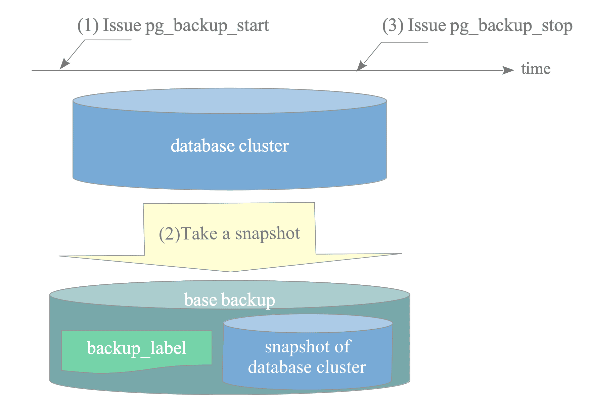
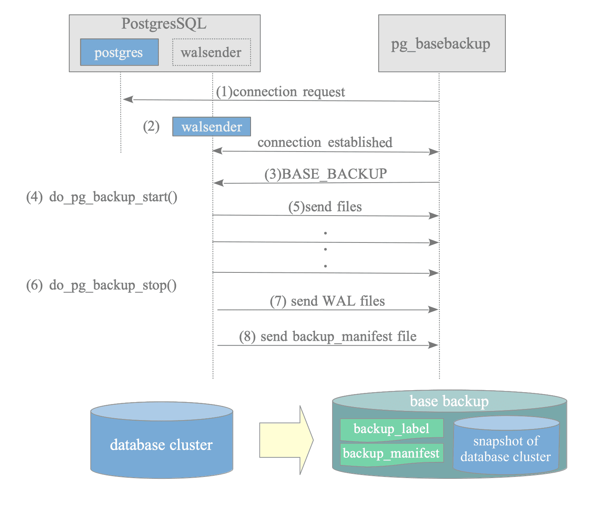
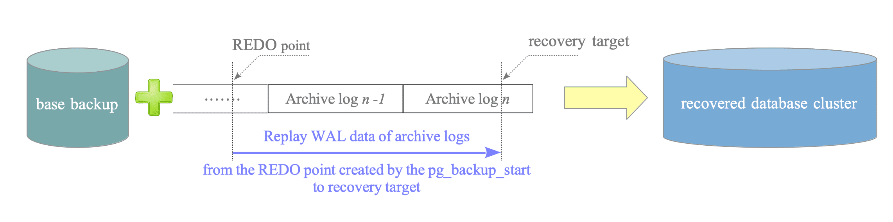
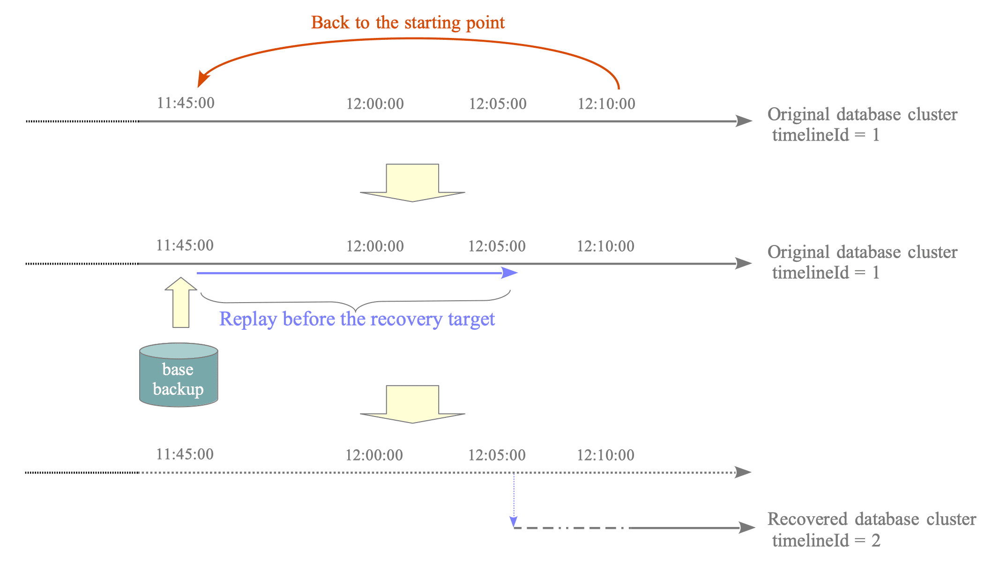
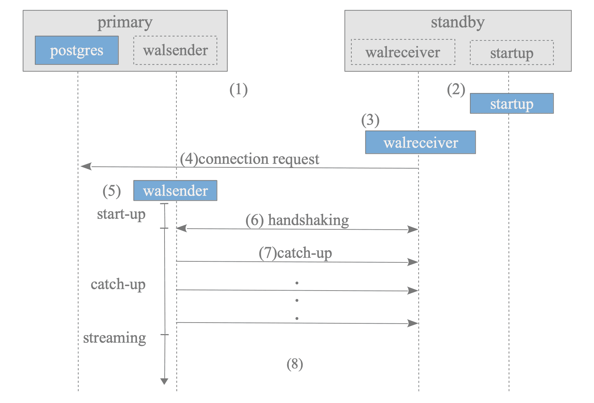
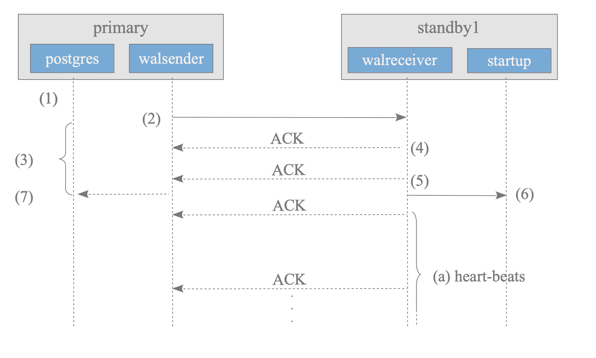
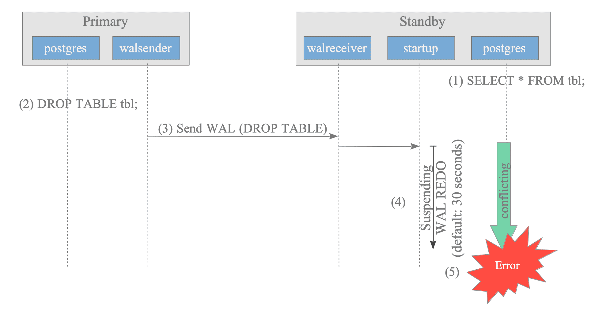
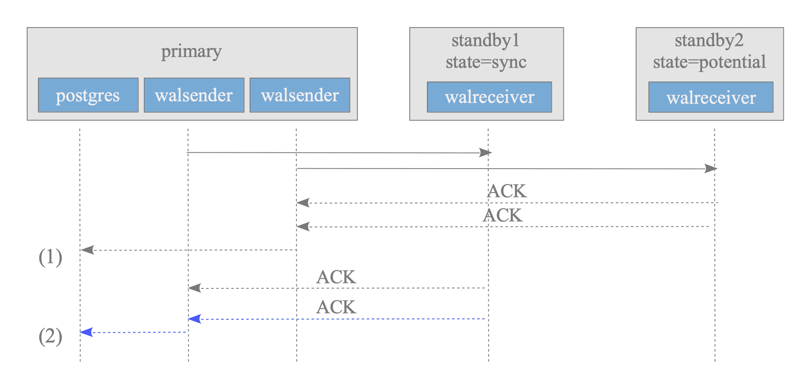
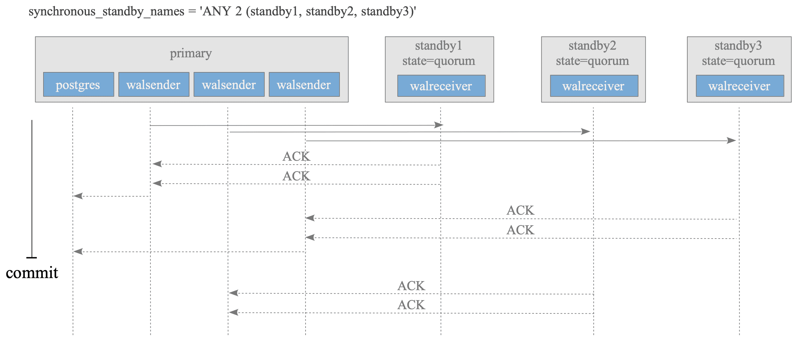

# 13. 백업, 복구, 복제

> 📖 이 노트의 다이어그램은 [The Internals of PostgreSQL](https://www.interdb.jp/pg/)에서 가져왔습니다.

## 한줄 요약
PostgreSQL의 백업(논리적/물리적), PITR 복구, 스트리밍 복제, 논리적 복제를 이해하고 고가용성 시스템을 구축할 수 있다.

## 왜 알아야 하는가

### 비즈니스 연속성
- **데이터 손실 방지**: 하드웨어 장애, 인적 오류, 랜섬웨어 공격 등으로부터 데이터 보호
- **서비스 중단 최소화**: 복제를 통한 고가용성으로 다운타임 제거
- **규정 준수**: GDPR, 개인정보보호법 등 데이터 백업 의무 충족

### 실제 사례
```sql
-- 이커머스 운영 중 발생 가능한 재난 시나리오
-- 1. 개발자 실수로 주문 데이터 삭제
DELETE FROM orders WHERE created_at > '2026-01-01';  -- WHERE 조건 누락!

-- 2. 랜섬웨어로 인한 데이터 암호화
-- 3. 디스크 장애로 PGDATA 손실
-- 4. 리전 장애로 전체 데이터센터 중단

-- 해결책: PITR로 5분 전 상태로 복구, Replica로 즉시 페일오버
```

### PostgreSQL 17의 새로운 기능
- **증분 백업**: `pg_combinebackup`으로 전체 백업 + 증분 백업 병합
- **논리적 복제 개선**: `pg_createsubscriber`로 물리적 복제본을 논리적 구독자로 변환
- **장애 조치 제어**: 논리적 복제에서 `failover` 옵션 지원

## 핵심 개념

### 백업의 종류

#### 1. 논리적 백업 (Logical Backup)
```
┌─────────────────────────────────────────┐
│         pg_dump / pg_dumpall            │
│                                         │
│  데이터베이스 → SQL 문장                │
│  ┌──────────┐      ┌──────────────┐   │
│  │  users   │ ───> │ CREATE TABLE │   │
│  │  orders  │      │ INSERT INTO  │   │
│  │  ...     │      │ ...          │   │
│  └──────────┘      └──────────────┘   │
│                                         │
│  장점: 버전 독립적, 부분 복구 가능     │
│  단점: 속도 느림, 대용량 DB 부적합     │
└─────────────────────────────────────────┘
```

#### 2. 물리적 백업 (Physical Backup)
```
┌─────────────────────────────────────────┐
│      pg_basebackup / 파일시스템         │
│                                         │
│  PGDATA 디렉토리 전체 복사              │
│  ┌──────────┐      ┌──────────────┐   │
│  │ base/    │ ───> │ base/        │   │
│  │ pg_wal/  │      │ pg_wal/      │   │
│  │ global/  │      │ global/      │   │
│  └──────────┘      └──────────────┘   │
│                                         │
│  장점: 속도 빠름, 대용량 적합           │
│  단점: 동일 버전 필요, 전체 복구만     │
└─────────────────────────────────────────┘
```

#### 3. 지속적 아카이빙 (Continuous Archiving)
```
┌─────────────────────────────────────────────────┐
│           WAL Archiving + PITR                  │
│                                                 │
│  WAL 세그먼트를 지속적으로 백업                 │
│  ┌─────────┐  ┌─────────┐  ┌─────────┐        │
│  │ WAL 001 │─>│ WAL 002 │─>│ WAL 003 │──>     │
│  └─────────┘  └─────────┘  └─────────┘        │
│       │            │            │              │
│       v            v            v              │
│  ┌─────────────────────────────────┐          │
│  │   Archive Directory             │          │
│  │   (S3, NFS, 로컬 디스크)        │          │
│  └─────────────────────────────────┘          │
│                                                 │
│  장점: 특정 시점 복구, RPO 최소화               │
│  단점: 관리 복잡, 스토리지 공간 필요            │
└─────────────────────────────────────────────────┘
```

### 복제의 종류

#### 1. 스트리밍 복제 (Streaming Replication)
```
┌──────────────────────────────────────────────────────┐
│                Physical Replication                  │
│                                                      │
│  Primary                       Replica              │
│  ┌─────────────┐              ┌─────────────┐      │
│  │   WAL       │  TCP 소켓    │   WAL       │      │
│  │  (쓰기)     │ ──────────> │  (재생)     │      │
│  │             │  16MB 단위   │             │      │
│  │  PGDATA     │              │  PGDATA     │      │
│  │  (동일)     │              │  (동일)     │      │
│  └─────────────┘              └─────────────┘      │
│                                                      │
│  특징: 바이트 단위 복제, 읽기 분산 가능              │
└──────────────────────────────────────────────────────┘
```

#### 2. 논리적 복제 (Logical Replication)
```
┌──────────────────────────────────────────────────────┐
│               Logical Replication                    │
│                                                      │
│  Publisher                    Subscriber            │
│  ┌─────────────┐              ┌─────────────┐      │
│  │  orders     │  논리 디코딩  │  orders     │      │
│  │  (INSERT)   │ ──────────> │  (INSERT)   │      │
│  │             │  SQL 재생    │             │      │
│  │  products   │              │  reports    │      │
│  │  (UPDATE)   │              │  (집계)     │      │
│  └─────────────┘              └─────────────┘      │
│                                                      │
│  특징: 테이블 단위 선택, 다른 스키마 가능            │
└──────────────────────────────────────────────────────┘
```

### 복구 목표 지표

#### RPO (Recovery Point Objective)
- **정의**: 장애 발생 시 복구 가능한 최대 데이터 손실 시간
- **예시**: RPO 1시간 = 최대 1시간치 데이터 손실 허용
- **구현**:
  - WAL 아카이빙: archive_timeout = 5분 → RPO 5분
  - 동기 복제: synchronous_commit = on → RPO 0초

#### RTO (Recovery Time Objective)
- **정의**: 장애 발생 시 서비스 복구까지 허용 가능한 최대 시간
- **예시**: RTO 30분 = 30분 내 서비스 재개 필요
- **구현**:
  - 스트리밍 복제: 자동 페일오버 → RTO 1분
  - PITR 복구: 시간 소요 → RTO 수십 분~수 시간

## OS/파일시스템 관점

### 왜 cp로 PGDATA를 복사하면 안 되는가?

#### 문제 1: 일관성 부재
```bash
# 잘못된 백업 방법
$ cp -r /var/lib/postgresql/17/main /backup/pgdata_backup

# 문제점:
# 1. PostgreSQL이 실행 중이면 파일이 지속적으로 변경됨
# 2. shared_buffers의 더티 페이지가 디스크에 아직 기록 안 됨
# 3. WAL과 데이터 파일의 시점이 불일치
```

#### OS 수준 분석
```bash
# PostgreSQL 실행 중 파일 변경 모니터링
$ sudo inotifywait -m -r /var/lib/postgresql/17/main/base
# 1초에 수십~수백 개 파일 변경 이벤트 발생

# 공유 메모리 상태 확인
$ ipcs -m | grep postgres
key        shmid      owner      perms      bytes      nattch
0x00040e33 65536      postgres   600        140378112  47

# 47개 프로세스가 공유 메모리(shared_buffers) 사용 중
# 이 메모리의 더티 페이지는 cp로 복사 불가!
```

#### 일관성 보장 메커니즘
```
┌─────────────────────────────────────────────────────┐
│         PostgreSQL Consistent Backup                │
│                                                     │
│  1. CHECKPOINT 강제 실행                            │
│     ┌──────────────────┐                           │
│     │ shared_buffers   │                           │
│     │  (더티 페이지)   │                           │
│     └────────┬─────────┘                           │
│              │ fsync()                              │
│              v                                      │
│     ┌──────────────────┐                           │
│     │   디스크 파일    │  <─ 일관성 보장 시점      │
│     └──────────────────┘                           │
│                                                     │
│  2. 백업 시작 LSN 기록                              │
│     Start WAL Location: 0/3000028                  │
│                                                     │
│  3. 파일 복사 + 동시 WAL 수집                       │
│     base/* → 백업 디렉토리                         │
│     pg_wal/* → 백업 디렉토리                       │
│                                                     │
│  4. 백업 종료 LSN 기록                              │
│     Stop WAL Location: 0/3000138                   │
│                                                     │
│  5. backup_label 파일 생성                          │
│     복구 시 시작점 지정                             │
└─────────────────────────────────────────────────────┘
```

### pg_basebackup 내부 동작

#### 시스템 콜 추적
```bash
# pg_basebackup의 시스템 콜 모니터링
$ strace -e trace=network,file pg_basebackup -D /backup/base -Fp -Xs -P 2>&1 | head -50

# 주요 동작:
socket(AF_INET, SOCK_STREAM, IPPROTO_TCP) = 3
connect(3, {sa_family=AF_INET, sin_port=htons(5432)}, 16) = 0
sendto(3, "IDENTIFY_SYSTEM", ...) = ...
recvfrom(3, "systemid | timeline | xlogpos", ...) = ...

sendto(3, "BASE_BACKUP LABEL 'pg_basebackup'", ...) = ...
# 서버가 CHECKPOINT 실행
recvfrom(3, "CHECKPOINT complete", ...) = ...

# 파일 수신 및 저장
open("/backup/base/base.tar", O_WRONLY|O_CREAT, 0600) = 4
recvfrom(3, <tar stream>, 32768, 0, ...) = 32768
write(4, <tar stream>, 32768) = 32768
# 반복...
```

#### pg_basebackup 프로토콜
```
Client (pg_basebackup)          Server (PostgreSQL)
      │                               │
      │──── IDENTIFY_SYSTEM ─────────>│
      │<──── systemid, timeline ──────│
      │                               │
      │──── BASE_BACKUP ─────────────>│
      │                               │ CHECKPOINT IMMEDIATE
      │                               │ (모든 더티 페이지 → 디스크)
      │                               │
      │<──── TAR Stream (base/) ──────│
      │      ┌──────────────┐         │
      │      │ PG_VERSION   │         │
      │      │ global/      │         │
      │      │ base/16384/  │         │
      │      │ ...          │         │
      │      └──────────────┘         │
      │                               │
      │<──── TAR Stream (pg_wal/) ────│
      │                               │
      │──── 백업 완료 확인 ──────────>│
```

### 파일시스템 스냅샷 백업

#### LVM 스냅샷
```bash
# 1. LVM 볼륨에 PostgreSQL 데이터 저장
$ sudo lvs
  LV     VG     Attr       LSize   Pool Origin
  pgdata vgdata -wi-ao---- 100.00g

# 2. 백업 시작 명령 (일관성 체크포인트 생성)
$ sudo -u postgres psql -c "SELECT pg_start_backup('lvm_snapshot', true);"
 pg_start_backup
-----------------
 0/4000028
(1 row)

# 3. LVM 스냅샷 생성 (순간적, I/O 블록 없음)
$ sudo lvcreate -L10G -s -n pgdata_snapshot /dev/vgdata/pgdata
  Logical volume "pgdata_snapshot" created.

# 스냅샷 생성 시간: 1초 미만 (메타데이터만 복사)

# 4. 백업 종료
$ sudo -u postgres psql -c "SELECT pg_stop_backup();"

# 5. 스냅샷 마운트 및 복사
$ sudo mkdir /mnt/snapshot
$ sudo mount /dev/vgdata/pgdata_snapshot /mnt/snapshot
$ sudo rsync -a /mnt/snapshot/ /backup/lvm_backup_$(date +%Y%m%d)/

# 6. 스냅샷 정리
$ sudo umount /mnt/snapshot
$ sudo lvremove -f /dev/vgdata/pgdata_snapshot
```

#### ZFS 스냅샷
```bash
# 1. ZFS 풀에 PostgreSQL 데이터 저장
$ zfs list
NAME                USED  AVAIL  REFER  MOUNTPOINT
tank/pgdata        45.2G  54.8G  45.2G  /var/lib/postgresql

# 2. 원자적 스냅샷 생성 (COW 메커니즘)
$ sudo -u postgres psql -c "SELECT pg_start_backup('zfs_snapshot', true);"
$ sudo zfs snapshot tank/pgdata@backup_20260131_1430
$ sudo -u postgres psql -c "SELECT pg_stop_backup();"

# 스냅샷 크기: 초기 0 바이트 (쓰기 시 차등 증가)

# 3. 스냅샷 복제 (백업 서버로 전송)
$ sudo zfs send tank/pgdata@backup_20260131_1430 | \
  ssh backup-server 'zfs recv tank/pgdata_backup'

# 4. 증분 스냅샷 (이전 스냅샷 이후 변경분만)
$ sudo zfs snapshot tank/pgdata@backup_20260131_1630
$ sudo zfs send -i @backup_20260131_1430 tank/pgdata@backup_20260131_1630 | \
  ssh backup-server 'zfs recv tank/pgdata_backup'
```

### WAL 파일 시스템 구조

```bash
# WAL 디렉토리 구조
$ tree -L 2 /var/lib/postgresql/17/main/pg_wal
/var/lib/postgresql/17/main/pg_wal
├── 000000010000000000000001  # 16MB WAL 세그먼트 파일
├── 000000010000000000000002
├── 000000010000000000000003
├── archive_status            # 아카이빙 상태 추적
│   ├── 000000010000000000000001.done
│   └── 000000010000000000000002.ready
└── ...

# WAL 파일명 구조
# 00000001 0000 0000 00000001
# ↑        ↑    ↑    ↑
# Timeline Log  Seg  SegNo
#          File No
```

#### WAL 세그먼트 내부 구조
```
┌─────────────────────────────────────────────────────┐
│      WAL Segment (16MB = 16777216 bytes)            │
│                                                     │
│  ┌─────────────────────────────────────────┐       │
│  │ Page Header (24 bytes)                  │       │
│  │  - magic: 0xD110                        │       │
│  │  - xlp_info: flags                      │       │
│  │  - xlp_tli: timeline ID                 │       │
│  │  - xlp_pageaddr: page address           │       │
│  ├─────────────────────────────────────────┤       │
│  │ WAL Record 1                            │       │
│  │  ┌──────────────────────────────┐       │       │
│  │  │ xl_tot_len: 64 bytes         │       │       │
│  │  │ xl_xid: 1001                 │       │       │
│  │  │ xl_rmid: RM_HEAP (INSERT)    │       │       │
│  │  │ xl_info: XLOG_HEAP_INSERT    │       │       │
│  │  │ xl_prev: 0/3000028           │       │       │
│  │  │ Data: (table oid, tuple)     │       │       │
│  │  └──────────────────────────────┘       │       │
│  ├─────────────────────────────────────────┤       │
│  │ WAL Record 2                            │       │
│  │ ...                                     │       │
│  └─────────────────────────────────────────┘       │
│                                                     │
│  총 2048개 페이지 (8192 bytes/page)                 │
└─────────────────────────────────────────────────────┘
```

## 실습 SQL

### 1. 논리적 백업 - pg_dump


*베이스 백업 프로세스: pg_basebackup이 체크포인트를 강제 실행한 후 모든 데이터 파일을 복사하며, 복사 중 생성된 WAL을 캡처합니다.*

> **🔍 그림 해설**
>
> pg_basebackup은 "움직이는 대상을 사진 찍는" 것과 같습니다. 데이터베이스가 계속 변경되는 상황에서 일관된 백업을 만들어야 하니까요. 먼저 체크포인트를 실행해 메모리의 더티 페이지를 디스크에 기록하여 명확한 시작점을 만듭니다. 그 후 전체 데이터 파일을 복사하는데, 복사하는 동안에도 새로운 변경이 발생합니다. 이 변경들은 WAL(Write-Ahead Log)에 기록되어 함께 보관됩니다. 나중에 복원할 때는 기본 복사본을 먼저 놓고, 그 위에 WAL을 재생하면 정확히 일관된 상태가 됩니다. 마치 건물 설계도(기본 백업)와 시공 일지(WAL)를 함께 보관하는 것처럼, 두 가지가 합쳐져야 완전한 복구가 가능합니다.

#### 전체 데이터베이스 백업
```bash
# 1. 기본 SQL 형식 백업
$ pg_dump -U postgres -d ecommerce -f /backup/ecommerce_20260131.sql

# 생성된 SQL 파일 내용 확인
$ head -50 /backup/ecommerce_20260131.sql
--
-- PostgreSQL database dump
--

-- Dumped from database version 17.2
-- Dumped by pg_dump version 17.2

SET statement_timeout = 0;
SET lock_timeout = 0;
SET client_encoding = 'UTF8';
...

CREATE TABLE public.users (
    id bigint NOT NULL,
    email character varying(255) NOT NULL,
    name character varying(100),
    ...
);

-- 데이터 INSERT 문
COPY public.users (id, email, name, created_at) FROM stdin;
1	user1@example.com	홍길동	2026-01-15 10:30:00
2	user2@example.com	김철수	2026-01-16 11:20:00
...
\.
```

#### 압축 백업 (대용량 데이터)
```bash
# 2. 커스텀 포맷 (압축, 병렬 복구 지원)
$ pg_dump -U postgres -d ecommerce -Fc -f /backup/ecommerce_20260131.dump

# 파일 크기 비교
$ ls -lh /backup/ecommerce_20260131.*
-rw-r--r-- 1 postgres postgres 2.3G Jan 31 14:00 ecommerce_20260131.sql
-rw-r--r-- 1 postgres postgres 450M Jan 31 14:05 ecommerce_20260131.dump

# 압축률: ~80% 감소
```

#### 특정 테이블만 백업
```bash
# 3. 주문 관련 테이블만 백업
$ pg_dump -U postgres -d ecommerce \
  -t orders -t order_items -t payments \
  -f /backup/orders_20260131.sql

# 4. 스키마만 백업 (데이터 제외)
$ pg_dump -U postgres -d ecommerce --schema-only \
  -f /backup/ecommerce_schema.sql

# 5. 데이터만 백업 (스키마 제외)
$ pg_dump -U postgres -d ecommerce --data-only \
  -f /backup/ecommerce_data.sql
```

#### 복구
```bash
# SQL 포맷 복구
$ psql -U postgres -d ecommerce_new -f /backup/ecommerce_20260131.sql

# 커스텀 포맷 복구 (병렬 처리)
$ pg_restore -U postgres -d ecommerce_new -j 4 /backup/ecommerce_20260131.dump
# -j 4: 4개 작업자로 병렬 복구 (테이블별 동시 처리)
```

### 2. 물리적 백업 - pg_basebackup

#### 기본 백업
```bash
# 1. 백업 디렉토리 생성
$ mkdir -p /backup/base_20260131

# 2. pg_basebackup 실행
$ pg_basebackup -D /backup/base_20260131 \
  -Fp -Xs -P -v \
  -U postgres

# 옵션 설명:
# -D: 백업 디렉토리
# -Fp: plain 포맷 (디렉토리 구조 그대로)
# -Xs: WAL 스트리밍 방식 포함
# -P: 진행률 표시
# -v: 상세 로그

# 실행 결과:
# pg_basebackup: initiating base backup, waiting for checkpoint to complete
# pg_basebackup: checkpoint completed
# pg_basebackup: write-ahead log start point: 0/5000028 on timeline 1
# pg_basebackup: starting background WAL receiver
# 156234/156234 kB (100%), 1/1 tablespace
# pg_basebackup: write-ahead log end point: 0/5000138
# pg_basebackup: base backup completed
```

#### 백업 디렉토리 구조
```bash
$ tree -L 2 /backup/base_20260131
/backup/base_20260131
├── backup_label          # 백업 메타데이터
├── backup_manifest       # 파일 체크섬 (v13+)
├── base                  # 데이터베이스 파일
│   ├── 1
│   ├── 16384            # ecommerce DB
│   └── ...
├── global                # 전역 테이블
├── pg_wal                # WAL 파일
│   └── 000000010000000000000005
├── postgresql.conf       # 설정 파일
└── ...

# backup_label 내용
$ cat /backup/base_20260131/backup_label
START WAL LOCATION: 0/5000028 (file 000000010000000000000005)
CHECKPOINT LOCATION: 0/5000060
BACKUP METHOD: streamed
BACKUP FROM: primary
START TIME: 2026-01-31 14:30:15 KST
LABEL: pg_basebackup base backup
START TIMELINE: 1
```

#### TAR 포맷 백업
```bash
# TAR 압축 백업 (네트워크 전송 시 유용)
$ pg_basebackup -D - -Ft -z -U postgres | \
  ssh backup-server 'cat > /remote/backup/base_20260131.tar.gz'

# 로컬 TAR 백업
$ pg_basebackup -D /backup -Ft -z -U postgres
# 생성 파일: base.tar.gz, pg_wal.tar.gz
```

### 3. 증분 백업 (PostgreSQL 17 신기능)

#### 전체 백업 생성
```bash
# 1. 첫 번째 전체 백업
$ pg_basebackup -D /backup/full_backup \
  -Fp -Xs -P -v -U postgres

# 백업 시간: 45분 (100GB 데이터)
# 백업 크기: 100GB
```

#### 증분 백업 생성
```bash
# 2. 증분 백업 생성 (변경된 블록만)
$ pg_basebackup -D /backup/incr_backup_1 \
  -Fp -Xs -P -v -U postgres \
  --incremental /backup/full_backup/backup_manifest

# 백업 시간: 5분
# 백업 크기: 8GB (변경된 블록만)

# 3. 두 번째 증분 백업 (첫 번째 증분 이후 변경분)
$ pg_basebackup -D /backup/incr_backup_2 \
  -Fp -Xs -P -v -U postgres \
  --incremental /backup/incr_backup_1/backup_manifest

# 백업 시간: 3분
# 백업 크기: 5GB
```

#### 증분 백업 병합
```bash
# 4. 전체 + 증분 백업 병합 (복구 가능한 단일 백업 생성)
$ pg_combinebackup /backup/full_backup \
  /backup/incr_backup_1 \
  /backup/incr_backup_2 \
  -o /backup/combined_backup

# 병합 시간: 10분
# 결과: 복구 가능한 완전한 백업

# 5. 병합된 백업으로 복구
$ pg_ctl -D /backup/combined_backup start
```

### 4. PITR (Point-in-Time Recovery)


*PITR 복구: 베이스 백업 복원 → 아카이브된 WAL 파일 재생 → 목표 타임스탬프에서 중지*

> **🔍 그림 해설**
>
> PITR(Point-In-Time Recovery)은 마치 게임의 세이브 파일과 플레이 기록을 함께 가지고 있는 것과 같습니다. 베이스 백업은 특정 시점의 "세이브 파일"이고, WAL 아카이브는 그 이후의 "플레이 기록"입니다. 복구하려면 먼저 세이브 파일을 불러온 후(베이스 백업 복원), 기록된 플레이를 차례대로 재생합니다(WAL 재생). 핵심은 원하는 시점에 정확히 멈출 수 있다는 것입니다. "어제 오후 3시 직전 상태로 돌려줘"라고 하면, 그 시각까지만 WAL을 재생하고 멈춥니다. 실수로 오후 3시에 데이터를 삭제했다면, 3시 1분 전으로 복구하여 삭제가 일어나기 직전 상태를 복원할 수 있습니다. 이것이 "시점 복구"의 핵심입니다.


*타임라인과 아카이빙: PITR 복구 후 WAL 타임라인 분기, archive_command가 WAL 세그먼트를 아카이브 디렉토리로 복사하는 과정*

> **🔍 그림 해설**
>
> PITR로 복구하면 새로운 "타임라인"이 생성됩니다. 영화에서 시간여행으로 과거를 바꾸면 평행 우주가 생기는 것과 같은 원리입니다. 원래 타임라인에서 "월요일 → 화요일 → 수요일"로 진행되다가, 화요일로 복구하면 거기서부터 "화요일' → 수요일'"로 새로운 이력이 시작됩니다. 각 타임라인은 독립적인 WAL 파일 시퀀스를 가지며, archive_command는 WAL 세그먼트가 가득 찰 때마다 안전한 아카이브 위치로 복사합니다. 이렇게 아카이빙된 WAL 덕분에 언제든지 원하는 시점으로 복구할 수 있고, 여러 타임라인을 추적할 수 있습니다. 타임라인 ID는 복구할 때마다 1씩 증가합니다(1 → 2 → 3...).


#### 아카이빙 설정
```sql
-- postgresql.conf 수정
-- WAL 아카이빙 활성화
wal_level = replica                    -- 최소 replica 필요
archive_mode = on                      -- 아카이빙 활성화
archive_command = 'test ! -f /archive/wal/%f && cp %p /archive/wal/%f'
-- %p: WAL 파일 전체 경로, %f: WAL 파일명
archive_timeout = 300                  -- 5분마다 WAL 스위치 (RPO 5분)

-- 설정 적용
$ sudo systemctl reload postgresql
```


*WAL 아카이빙 설정: archive_command가 완료된 WAL 세그먼트를 pg_wal/에서 아카이브 디렉토리로 복사*

> **🔍 그림 해설**
>
> WAL 아카이빙은 데이터베이스의 "자동 백업 시스템"입니다. PostgreSQL은 모든 변경을 WAL 파일에 기록하는데, 각 WAL 세그먼트는 16MB 크기입니다. 한 세그먼트가 가득 차면, archive_command가 자동으로 실행되어 그 파일을 안전한 별도 위치(아카이브 디렉토리, S3, 네트워크 스토리지 등)로 복사합니다. 이 과정은 마치 자동으로 중요 문서를 금고에 보관하는 것과 같습니다. pg_wal/ 디렉토리의 WAL 파일은 일정 시간이 지나면 재사용되거나 삭제될 수 있지만, 아카이브에 복사된 파일은 안전하게 보존됩니다. 이 아카이브가 있어야 PITR이 가능하며, 베이스 백업 시점 이후의 모든 변경을 재생할 수 있습니다.

#### 프로덕션 WAL 아카이빙 전략

로컬 `cp`는 실습용입니다. 같은 디스크가 고장나면 데이터와 아카이브가 동시에 유실됩니다. 프로덕션에서는 반드시 원격 스토리지로 보내야 합니다.

**방법 1: S3/R2로 직접 전송 (단순하지만 한계 있음)**

```bash
# AWS S3
archive_command = 'aws s3 cp %p s3://my-backup-bucket/wal/%f'

# Cloudflare R2 (S3 호환 API, egress 비용 없음 → 복구 시 유리)
archive_command = 'aws s3 cp %p s3://my-r2-bucket/wal/%f --endpoint-url https://ACCOUNT.r2.cloudflarestorage.com'
```

한계: 네트워크 실패 시 재시도 로직 없음, 압축/암호화를 직접 처리해야 함

**방법 2: pgBackRest 사용 (프로덕션 권장)**

```bash
archive_command = 'pgbackrest --stanza=main archive-push %p'
```

pgBackRest가 처리하는 것들:
- **압축** (zstd/lz4) → WAL 16MB → 수백KB로 줄어듦
- **암호화** → 저장 시 AES-256
- **병렬 전송** → 여러 WAL을 동시에 전송
- **재시도** → 네트워크 실패 시 자동 재시도
- **S3/R2/GCS/Azure 모두 지원**

**방법 3: barman**

```bash
archive_command = 'barman-wal-archive backup-server main %p'
```

**복구 시 흐름 (S3 예시):**

```
서버 유실
  → 새 서버에 pg_basebackup 복원 (풀 백업)
  → restore_command = 'aws s3 cp s3://my-bucket/wal/%f %p'
  → recovery_target_time = '2026-02-21 14:29:59'
  → PostgreSQL이 S3에서 WAL을 하나씩 가져와 재생
  → 지정 시점까지 복원 완료
```

**비교:**

| 방식 | 안전성 | 비용 | 복잡도 |
|------|--------|------|--------|
| 같은 디스크 (`cp`) | 낮음 | 무료 | 없음 (실습용) |
| S3/R2 직접 전송 | 높음 | 저렴 | 중간 (프로덕션 최소) |
| pgBackRest + S3 | 매우 높음 | 저렴 | 중간 (프로덕션 권장) |

> WAL 파일은 압축하면 매우 작아지므로 (16MB → 수백KB), 오브젝트 스토리지 비용은 거의 무시할 수 있는 수준입니다.
> R2는 egress 비용이 없어서 복구 시 대량 다운로드에도 추가 비용이 발생하지 않습니다.

#### 아카이브 디렉토리 준비 (로컬 실습용)
```bash
# 아카이브 디렉토리 생성
$ sudo mkdir -p /archive/wal
$ sudo chown postgres:postgres /archive/wal
$ sudo chmod 700 /archive/wal

# 아카이빙 동작 확인
$ sudo -u postgres psql -c "SELECT pg_switch_wal();"
 pg_switch_wal
---------------
 0/6000138

$ ls -lh /archive/wal/
-rw------- 1 postgres postgres 16M Jan 31 14:40 000000010000000000000005
-rw------- 1 postgres postgres 16M Jan 31 14:45 000000010000000000000006
```

#### 재난 시나리오 및 복구

```sql
-- 1. 정상 데이터 삽입 (14:50)
INSERT INTO orders (user_id, status, total_amount, created_at)
VALUES (1001, 'pending', 125000, '2026-01-31 14:50:00');

INSERT INTO order_items (order_id, product_variant_id, quantity, price)
VALUES (currval('orders_id_seq'), 501, 2, 62500);

-- 현재 시각 확인
SELECT now();
           now
--------------------------
 2026-01-31 14:50:30+09

-- 2. 기준 백업 생성 (14:51)
-- 터미널에서
$ pg_basebackup -D /backup/pitr_base -Fp -Xs -P -v -U postgres

-- 3. 추가 데이터 (복구할 데이터) (14:55)
INSERT INTO orders (user_id, status, total_amount, created_at)
VALUES (1002, 'pending', 250000, '2026-01-31 14:55:00');

INSERT INTO order_items (order_id, product_variant_id, quantity, price)
VALUES (currval('orders_id_seq'), 502, 5, 50000);

-- 4. 재난 발생 (14:58) - 실수로 테이블 삭제
DROP TABLE order_items CASCADE;
DROP TABLE orders CASCADE;

-- 5. 데이터 확인 불가
SELECT * FROM orders;
-- ERROR:  relation "orders" does not exist

-- 목표: 14:57 시점으로 복구 (재난 직전, 모든 주문 데이터 보존)
```

#### 복구 절차
```bash
# 1. PostgreSQL 중지
$ sudo systemctl stop postgresql

# 2. 기존 PGDATA 백업 (안전장치)
$ sudo mv /var/lib/postgresql/17/main /var/lib/postgresql/17/main.old

# 3. 베이스 백업 복원
$ sudo cp -r /backup/pitr_base /var/lib/postgresql/17/main
$ sudo chown -R postgres:postgres /var/lib/postgresql/17/main

# 4. WAL 아카이브 복구 설정 (recovery.signal 생성)
$ sudo -u postgres touch /var/lib/postgresql/17/main/recovery.signal

# 5. postgresql.conf에 복구 설정 추가
$ sudo -u postgres tee -a /var/lib/postgresql/17/main/postgresql.conf > /dev/null <<EOF
restore_command = 'cp /archive/wal/%f %p'
recovery_target_time = '2026-01-31 14:57:00'
recovery_target_action = 'promote'
EOF

# 6. PostgreSQL 시작 (자동 복구 시작)
$ sudo systemctl start postgresql

# 복구 로그 모니터링
$ sudo tail -f /var/log/postgresql/postgresql-17-main.log
# 2026-01-31 15:00:15.123 KST [12345] LOG:  starting point-in-time recovery to 2026-01-31 14:57:00+09
# 2026-01-31 15:00:15.234 KST [12345] LOG:  restored log file "000000010000000000000006" from archive
# 2026-01-31 15:00:15.345 KST [12345] LOG:  redo starts at 0/6000028
# 2026-01-31 15:00:16.456 KST [12345] LOG:  restored log file "000000010000000000000007" from archive
# ...
# 2026-01-31 15:00:18.567 KST [12345] LOG:  recovery stopping before commit of transaction 1234, time 2026-01-31 14:58:23.123+09
# 2026-01-31 15:00:18.678 KST [12345] LOG:  recovery has paused
# 2026-01-31 15:00:18.789 KST [12345] LOG:  paused at log position 0/70001A8
# 2026-01-31 15:00:18.890 KST [12345] LOG:  redo done at 0/7000170
# 2026-01-31 15:00:19.001 KST [12345] LOG:  selected new timeline ID: 2
# 2026-01-31 15:00:19.234 KST [12345] LOG:  archive recovery complete
# 2026-01-31 15:00:19.345 KST [12345] LOG:  database system is ready to accept connections
```

#### 복구 확인
```sql
-- 7. 데이터 확인
SELECT * FROM orders ORDER BY created_at DESC LIMIT 5;
 id  | user_id | status  | total_amount |     created_at
-----+---------+---------+--------------+--------------------
 102 |    1002 | pending |       250000 | 2026-01-31 14:55:00
 101 |    1001 | pending |       125000 | 2026-01-31 14:50:00
 ...

-- 14:55에 생성된 주문까지 복구 완료!
-- 14:58의 DROP TABLE은 실행되지 않음

SELECT * FROM order_items WHERE order_id IN (101, 102);
 id  | order_id | product_variant_id | quantity | price
-----+----------+--------------------+----------+-------
 201 |      101 |                501 |        2 | 62500
 202 |      102 |                502 |        5 | 50000

-- 8. 타임라인 확인
SELECT * FROM pg_control_checkpoint();
 checkpoint_lsn | redo_lsn | timeline_id
----------------+----------+-------------
 0/7000170      | 0/7000138|           2
-- timeline_id가 2로 변경됨 (복구 후 새로운 이력 시작)
```

### 5. 스트리밍 복제 구성


*스트리밍 복제 아키텍처: Primary 서버의 WAL sender 프로세스 → TCP 네트워크 → Standby 서버의 WAL receiver 프로세스 → startup 프로세스가 WAL 재생*

> **🔍 그림 해설**
>
> 스트리밍 복제는 "실시간 방송"과 같습니다. Primary 서버가 방송국이라면, Standby 서버는 수신기입니다. Primary에서 데이터 변경이 발생하면 WAL sender 프로세스가 방송국 송출기처럼 WAL 레코드를 TCP 네트워크를 통해 실시간으로 전송합니다. Standby의 WAL receiver 프로세스는 이를 받아 로컬 pg_wal/ 디렉토리에 기록하고, startup 프로세스가 받는 즉시 재생하여 데이터에 반영합니다. 이 과정이 몇 초(또는 밀리초) 단위로 일어나므로 거의 실시간으로 Primary와 Standby가 동기화됩니다. 덕분에 Primary 장애 시 Standby를 즉시 승격시켜 서비스를 계속할 수 있고, 읽기 쿼리를 Standby에 분산하여 부하를 줄일 수도 있습니다.


*WAL sender와 WAL receiver: 두 프로세스의 상세 동작 — WAL sender가 pg_wal/에서 읽어 TCP로 전송, WAL receiver가 standby의 pg_wal/에 기록하고 startup 프로세스가 재생*

> **🔍 그림 해설**
>
> WAL sender와 receiver는 전용 "핫라인"으로 연결된 한 쌍의 프로세스입니다. Primary의 WAL sender는 pg_wal/ 디렉토리에서 새로운 WAL 레코드를 읽어 즉시 네트워크로 보냅니다. Standby의 WAL receiver는 이를 받아 자신의 pg_wal/ 디렉토리에 기록하고, startup 프로세스에게 신호를 보냅니다. startup 프로세스는 WAL을 하나씩 재생하여 실제 데이터 파일에 변경을 적용합니다. 이 파이프라인이 끊기면(네트워크 장애, Standby 다운) 복제 지연이 발생합니다. 그래서 pg_stat_replication 뷰로 sent_lsn, write_lsn, flush_lsn, replay_lsn을 모니터링하여 각 단계의 지연을 추적합니다. 지연이 커지면 문제의 원인(네트워크? 디스크? CPU?)을 파악할 수 있습니다.


#### 복제 아키텍처
```
참조: diagrams/13-replication-architecture.drawio

┌───────────────────────────────────────────────────────────┐
│                  Streaming Replication                    │
│                                                           │
│  ┌─────────────────┐                ┌─────────────────┐  │
│  │    Primary      │                │    Replica      │  │
│  │  (읽기/쓰기)    │                │   (읽기 전용)   │  │
│  │                 │                │                 │  │
│  │  PostgreSQL     │                │  PostgreSQL     │  │
│  │   :5432         │                │   :5433         │  │
│  │                 │                │                 │  │
│  │  WAL Sender ────┼────TCP 소켓───>│  WAL Receiver   │  │
│  │   (walsender)   │   (16MB 청크) │   (walreceiver) │  │
│  │                 │                │                 │  │
│  │  pg_wal/        │                │  pg_wal/        │  │
│  │  ├─ 00...07     │                │  ├─ 00...07     │  │
│  │  ├─ 00...08 ────┼────복사───────>│  ├─ 00...08     │  │
│  │  └─ 00...09     │                │  └─ (복제 중)   │  │
│  │                 │                │                 │  │
│  │  Startup 프로세스│                │  Startup 프로세스│  │
│  │  (WAL 쓰기)     │                │  (WAL 재생)     │  │
│  └─────────────────┘                └─────────────────┘  │
│                                                           │
│  클라이언트 연결:                                         │
│  쓰기 → Primary (5432)                                    │
│  읽기 → Replica (5433) 또는 Primary                       │
└───────────────────────────────────────────────────────────┘
```

#### Docker Compose 환경 구성

```yaml
# docker-compose.repl.yml
version: '3.8'

services:
  primary:
    image: postgres:17
    container_name: pg_primary
    environment:
      POSTGRES_USER: postgres
      POSTGRES_PASSWORD: postgres
      POSTGRES_DB: ecommerce
    volumes:
      - primary_data:/var/lib/postgresql/data
      - ./init-primary.sh:/docker-entrypoint-initdb.d/init-primary.sh
    ports:
      - "5432:5432"
    command:
      - "postgres"
      - "-c"
      - "wal_level=replica"
      - "-c"
      - "max_wal_senders=3"
      - "-c"
      - "max_replication_slots=3"
      - "-c"
      - "hot_standby=on"
    networks:
      - pg_network

  replica:
    image: postgres:17
    container_name: pg_replica
    environment:
      PGUSER: postgres
      PGPASSWORD: postgres
    volumes:
      - replica_data:/var/lib/postgresql/data
      - ./init-replica.sh:/docker-entrypoint-initdb.d/init-replica.sh
    ports:
      - "5433:5432"
    depends_on:
      - primary
    networks:
      - pg_network

volumes:
  primary_data:
  replica_data:

networks:
  pg_network:
    driver: bridge
```

#### Primary 초기화 스크립트

```bash
# init-primary.sh
#!/bin/bash
set -e

# 복제 사용자 생성
psql -v ON_ERROR_STOP=1 --username "$POSTGRES_USER" <<-EOSQL
    CREATE ROLE replicator WITH REPLICATION LOGIN PASSWORD 'repl_password';
EOSQL

# pg_hba.conf에 복제 연결 허용
echo "host replication replicator 0.0.0.0/0 md5" >> "$PGDATA/pg_hba.conf"

# 설정 재로드
psql -v ON_ERROR_STOP=1 --username "$POSTGRES_USER" -c "SELECT pg_reload_conf();"

echo "Primary initialized for replication"
```

#### Replica 초기화 스크립트

```bash
# init-replica.sh
#!/bin/bash
set -e

# PGDATA 초기화 방지
if [ -s "$PGDATA/PG_VERSION" ]; then
    echo "Replica already initialized"
    exit 0
fi

# Primary에서 베이스 백업 (pg_basebackup)
pg_basebackup -h pg_primary -D ${PGDATA} -U replicator -v -P -W -R

# -R 옵션: standby.signal + 복제 설정 자동 생성

echo "Replica initialized from primary"
```

#### 복제 시작 및 확인

```bash
# 1. 환경 시작
$ docker-compose -f docker-compose.repl.yml up -d

# 2. Primary 상태 확인
$ docker exec -it pg_primary psql -U postgres -c "SELECT * FROM pg_stat_replication;"
 pid  | usesysid | usename    | application_name | client_addr | state     | sent_lsn  | write_lsn | flush_lsn | replay_lsn | sync_state
------+----------+------------+------------------+-------------+-----------+-----------+-----------+-----------+------------+------------
 1234 |    16384 | replicator | walreceiver      | 172.18.0.3  | streaming | 0/8000140 | 0/8000140 | 0/8000140 | 0/8000140  | async

# state: streaming = 정상 복제 중
# sent_lsn = replay_lsn = 복제 지연 없음

# 3. Replica 상태 확인
$ docker exec -it pg_replica psql -U postgres -c "SELECT pg_is_in_recovery(), pg_last_wal_receive_lsn(), pg_last_wal_replay_lsn();"
 pg_is_in_recovery | pg_last_wal_receive_lsn | pg_last_wal_replay_lsn
-------------------+-------------------------+------------------------
 t                 | 0/8000140               | 0/8000140

# pg_is_in_recovery = true: Replica 모드
# receive_lsn = replay_lsn: 지연 없음
```

#### 복제 테스트

```sql
-- Primary에서 데이터 삽입
$ docker exec -it pg_primary psql -U postgres ecommerce

INSERT INTO users (email, name, created_at)
VALUES ('test_replication@example.com', '복제테스트', now());

SELECT * FROM users WHERE email = 'test_replication@example.com';
 id  |           email           |   name   |      created_at
-----+---------------------------+----------+---------------------
 1001| test_replication@...      | 복제테스트| 2026-01-31 15:30:00

-- Replica에서 데이터 확인 (1초 내 복제됨)
$ docker exec -it pg_replica psql -U postgres ecommerce

SELECT * FROM users WHERE email = 'test_replication@example.com';
 id  |           email           |   name   |      created_at
-----+---------------------------+----------+---------------------
 1001| test_replication@...      | 복제테스트| 2026-01-31 15:30:00

-- Replica에서 쓰기 시도 (실패)
INSERT INTO users (email, name) VALUES ('fail@example.com', 'Fail');
-- ERROR:  cannot execute INSERT in a read-only transaction
```

#### 동기 복제 (Synchronous Replication)


*복제 슬롯: Standby가 아직 소비하지 않은 WAL 세그먼트를 Primary가 삭제하지 못하게 하여 "WAL already removed" 오류 방지*

> **🔍 그림 해설**
>
> 복제 슬롯은 극장에서 "자리 예약"하는 것과 같습니다. Standby가 네트워크 문제로 잠시 연결이 끊겼을 때, Primary는 계속해서 새로운 WAL을 생성합니다. 복제 슬롯이 없으면 Primary는 오래된 WAL을 자동으로 삭제하는데, Standby가 돌아왔을 때 필요한 WAL이 이미 사라져 복제가 깨집니다. 복제 슬롯은 Standby가 "나는 여기까지 읽었어"라고 표시해두고, Primary가 그 이후의 WAL을 삭제하지 못하게 막습니다. 하지만 Standby가 장시간 다운되면 WAL이 계속 쌓여 디스크가 가득 찰 수 있습니다. 그래서 max_slot_wal_keep_size로 최대 보관 크기를 제한하여, 임계값을 넘으면 오래된 WAL을 삭제하고 슬롯을 무효화합니다. 이는 안전장치로, Primary의 디스크 공간을 보호합니다.


*동기 복제: Primary는 Standby가 WAL 쓰기/플러시를 확인할 때까지 기다린 후 클라이언트에게 COMMIT 응답*

> **🔍 그림 해설**
>
> 동기 복제는 Primary가 "신중한 은행원"처럼 행동합니다. 고객(클라이언트)이 입금(COMMIT)을 요청하면, 은행원은 먼저 본점(Standby)에 "이 거래 기록했나요?"라고 확인 받을 때까지 기다립니다. Standby가 "네, WAL을 디스크에 안전하게 기록했어요"라고 응답하면, 그제야 고객에게 "입금 완료되었습니다"라고 말합니다. 이 방식은 Primary가 갑자기 고장 나도 Standby가 정확히 같은 데이터를 가지고 있으므로, 데이터 손실이 전혀 없습니다(RPO = 0). 하지만 네트워크 왕복 시간만큼 커밋이 느려지는 단점이 있습니다. 은행 거래, 결제 시스템처럼 절대 데이터를 잃으면 안 되는 경우에 사용합니다.

```sql
-- Primary에서 설정 변경
ALTER SYSTEM SET synchronous_standby_names = 'walreceiver';
SELECT pg_reload_conf();

-- 동기 복제 상태 확인
SELECT application_name, sync_state FROM pg_stat_replication;
 application_name | sync_state
------------------+------------
 walreceiver      | sync

-- 이제 COMMIT은 Replica에 WAL이 기록된 후 완료됨
-- 성능: 약간 느림 (네트워크 왕복 시간)
-- 데이터 안정성: RPO = 0 (데이터 손실 없음)
```


*비동기 복제: Primary는 Standby 확인을 기다리지 않고 즉시 클라이언트에게 COMMIT 응답*

> **🔍 그림 해설**
>
> 비동기 복제는 Primary가 "빠른 편의점 점원"처럼 행동합니다. 고객이 계산을 하면 즉시 영수증을 주고 "감사합니다" 하며 다음 손님을 받습니다. 그 후 백그라운드에서 본사(Standby)에 거래 내역을 전송하지만, 고객은 이미 떠난 상태입니다. 이 방식은 매우 빠르지만, Primary가 갑자기 고장 나면 Standby에 아직 전송되지 않은 마지막 몇 초의 거래가 유실될 수 있습니다. 예를 들어 Primary가 오후 3시 정각에 다운되면, 2시 59분 55초에서 3시 사이의 데이터가 Standby에 없을 수 있습니다. 하지만 성능이 중요하고 약간의 데이터 손실이 허용되는 경우(로그 수집, 분석 시스템)에는 비동기 복제가 적합합니다.

### 6. 논리적 복제 (Logical Replication)

#### 논리적 vs 물리적 복제 비교

```
┌────────────────────────────────────────────────────────┐
│              물리적 복제 (Streaming)                   │
│  - 전체 데이터베이스 복제                              │
│  - 동일한 PostgreSQL 버전 필요                         │
│  - Replica는 읽기 전용                                 │
│  - 바이트 단위 복제 (빠름)                             │
└────────────────────────────────────────────────────────┘

┌────────────────────────────────────────────────────────┐
│             논리적 복제 (Logical)                      │
│  - 테이블/데이터베이스 단위 선택 복제                  │
│  - 다른 PostgreSQL 버전 가능 (업그레이드)              │
│  - Subscriber도 쓰기 가능                              │
│  - 논리 디코딩 (느림), 필터링/변환 가능                │
└────────────────────────────────────────────────────────┘
```

#### Publication 생성 (Publisher)

```sql
-- Primary에서 Publication 생성

-- 1. wal_level 확인 (logical 필요)
SHOW wal_level;
 wal_level
-----------
 replica

-- logical로 변경 필요
ALTER SYSTEM SET wal_level = 'logical';
-- PostgreSQL 재시작 필요
SELECT pg_reload_conf();  -- 재시작 필요하므로 즉시 적용 안 됨

-- 재시작 후:
-- $ sudo systemctl restart postgresql

-- 2. 특정 테이블만 발행
CREATE PUBLICATION orders_pub FOR TABLE orders, order_items;

-- 3. 모든 테이블 발행
CREATE PUBLICATION all_tables_pub FOR ALL TABLES;

-- 4. 특정 작업만 발행 (INSERT, UPDATE만)
CREATE PUBLICATION insert_update_pub FOR TABLE products
    WITH (publish = 'insert,update');

-- 5. WHERE 조건부 발행 (v15+)
CREATE PUBLICATION premium_users_pub FOR TABLE users
    WHERE (subscription_tier = 'premium');

-- Publication 확인
SELECT * FROM pg_publication;
 oid  | pubname       | pubowner | puballtables | pubinsert | pubupdate | pubdelete
------+---------------+----------+--------------+-----------+-----------+-----------
16401 | orders_pub    |       10 | f            | t         | t         | t

SELECT * FROM pg_publication_tables;
 pubname    | schemaname | tablename
------------+------------+-----------
 orders_pub | public     | orders
 orders_pub | public     | order_items
```

#### Subscription 생성 (Subscriber)

```sql
-- Replica 또는 별도 DB에서 Subscription 생성

-- 1. 동일한 테이블 스키마 생성 (필수)
CREATE TABLE orders (
    id BIGSERIAL PRIMARY KEY,
    user_id BIGINT NOT NULL,
    status VARCHAR(50),
    total_amount DECIMAL(10,2),
    created_at TIMESTAMP DEFAULT now()
);

CREATE TABLE order_items (
    id BIGSERIAL PRIMARY KEY,
    order_id BIGINT REFERENCES orders(id),
    product_variant_id BIGINT,
    quantity INTEGER,
    price DECIMAL(10,2)
);

-- 2. Subscription 생성
CREATE SUBSCRIPTION orders_sub
    CONNECTION 'host=pg_primary port=5432 dbname=ecommerce user=postgres password=postgres'
    PUBLICATION orders_pub;

-- 3. Subscription 상태 확인
SELECT * FROM pg_stat_subscription;
 subid | subname    | pid   | relid | received_lsn | last_msg_send_time       | latest_end_lsn | last_msg_receipt_time
-------+------------+-------+-------+--------------+--------------------------+----------------+-----------------------
 16402 | orders_sub | 12345 |       | 0/9000140    | 2026-01-31 16:00:15+09   | 0/9000140      | 2026-01-31 16:00:15+09


-- 4. 복제 슬롯 확인 (Publisher에서)
SELECT * FROM pg_replication_slots;
 slot_name              | slot_type | database  | active | restart_lsn
------------------------+-----------+-----------+--------+-------------
 orders_sub             | logical   | ecommerce | t      | 0/9000108
```

#### 논리적 복제 테스트

```sql
-- Publisher에서 데이터 삽입
INSERT INTO orders (user_id, status, total_amount)
VALUES (2001, 'pending', 350000);

INSERT INTO order_items (order_id, product_variant_id, quantity, price)
VALUES (currval('orders_id_seq'), 601, 3, 116666.67);

-- Subscriber에서 확인 (1초 이내 복제)
SELECT * FROM orders WHERE user_id = 2001;
 id  | user_id | status  | total_amount |      created_at
-----+---------+---------+--------------+---------------------
 201 |    2001 | pending |    350000.00 | 2026-01-31 16:05:00

SELECT * FROM order_items WHERE order_id = 201;
 id  | order_id | product_variant_id | quantity |   price
-----+----------+--------------------+----------+-----------
 301 |      201 |                601 |        3 | 116666.67

-- Subscriber에서도 쓰기 가능 (물리적 복제와 차이점)
INSERT INTO orders (user_id, status, total_amount)
VALUES (2002, 'completed', 150000);
-- 성공! (단, Publisher에는 복제 안 됨 - 단방향)
```

#### PostgreSQL 17: pg_createsubscriber

```bash
# 물리적 복제본을 논리적 구독자로 변환 (v17 신기능)

# 1. 물리적 Standby 준비 (기존 스트리밍 복제 환경)
# Primary: pg_primary (5432)
# Standby: pg_standby (5433)

# 2. Standby를 논리적 구독자로 변환
$ pg_createsubscriber -D /var/lib/postgresql/17/standby \
  -P "host=pg_primary port=5432 dbname=ecommerce user=postgres" \
  -d ecommerce -s orders_sub -p orders_pub

# 실행 결과:
# pg_createsubscriber: stopping the standby server
# pg_createsubscriber: creating subscription "orders_sub"
# pg_createsubscriber: starting the subscriber server
# pg_createsubscriber: enabling subscription
# pg_createsubscriber: done

# 이제 Standby는 논리적 복제로 전환됨 (쓰기 가능)
```

#### 논리적 복제 장애 조치 (v17 failover)

```sql
-- v17: Subscription에 failover 옵션 추가

-- Primary 장애 시 Standby로 자동 전환
CREATE SUBSCRIPTION orders_sub_failover
    CONNECTION 'host=pg_primary port=5432 dbname=ecommerce user=postgres password=postgres'
    PUBLICATION orders_pub
    WITH (failover = true);

-- 장애 발생 시:
-- 1. Primary 다운
-- 2. Standby가 자동으로 새로운 Publisher로 승격
-- 3. Subscription이 새로운 Publisher로 재연결
-- 4. 데이터 손실 없이 복제 계속
```

## 직접 확인해보기

### 1. WAL 크기 모니터링

```sql
-- WAL 생성 속도 측정
CREATE TABLE wal_monitoring (
    check_time TIMESTAMP,
    current_lsn PG_LSN,
    wal_size BIGINT
);

-- 초기 기록
INSERT INTO wal_monitoring
SELECT now(), pg_current_wal_lsn(), pg_wal_lsn_diff(pg_current_wal_lsn(), '0/0');

-- 대량 INSERT (WAL 생성)
INSERT INTO event_logs (user_id, event_type, event_data, created_at)
SELECT
    (random() * 10000)::BIGINT,
    (ARRAY['page_view', 'click', 'purchase'])[floor(random() * 3 + 1)],
    jsonb_build_object('session', gen_random_uuid()),
    now() - (random() * interval '30 days')
FROM generate_series(1, 1000000);  -- 100만 건

-- 다시 기록
INSERT INTO wal_monitoring
SELECT now(), pg_current_wal_lsn(), pg_wal_lsn_diff(pg_current_wal_lsn(), '0/0');

-- WAL 생성 속도 계산
SELECT
    check_time,
    current_lsn,
    wal_size / 1024 / 1024 AS wal_mb,
    wal_size - LAG(wal_size) OVER (ORDER BY check_time) AS bytes_generated,
    (wal_size - LAG(wal_size) OVER (ORDER BY check_time)) / 1024 / 1024 AS mb_generated,
    EXTRACT(EPOCH FROM (check_time - LAG(check_time) OVER (ORDER BY check_time))) AS seconds_elapsed,
    (wal_size - LAG(wal_size) OVER (ORDER BY check_time)) /
        EXTRACT(EPOCH FROM (check_time - LAG(check_time) OVER (ORDER BY check_time))) / 1024 / 1024 AS mb_per_second
FROM wal_monitoring
ORDER BY check_time;

/*
      check_time       | current_lsn | wal_mb | mb_generated | seconds_elapsed | mb_per_second
-----------------------+-------------+--------+--------------+-----------------+---------------
 2026-01-31 16:10:00   | 0/A000028   |   160  |              |                 |
 2026-01-31 16:12:30   | 0/1C000138  |   448  |          288 |             150 |          1.92

 100만 건 INSERT → 288MB WAL 생성 → 평균 1.92 MB/s
*/
```

### 2. 복제 지연 모니터링

```sql
-- Primary에서 실행: 복제 지연 확인
SELECT
    application_name,
    client_addr,
    state,
    sync_state,
    pg_wal_lsn_diff(pg_current_wal_lsn(), sent_lsn) AS send_lag_bytes,
    pg_wal_lsn_diff(sent_lsn, write_lsn) AS write_lag_bytes,
    pg_wal_lsn_diff(write_lsn, flush_lsn) AS flush_lag_bytes,
    pg_wal_lsn_diff(flush_lsn, replay_lsn) AS replay_lag_bytes,
    pg_wal_lsn_diff(pg_current_wal_lsn(), replay_lsn) AS total_lag_bytes,
    write_lag,
    flush_lag,
    replay_lag
FROM pg_stat_replication;

/*
 application_name | client_addr | state     | send_lag_bytes | total_lag_bytes | replay_lag
------------------+-------------+-----------+----------------+-----------------+------------
 walreceiver      | 172.18.0.3  | streaming |              0 |               0 | 00:00:00
 -- 지연 없음

 -- 네트워크 문제 시:
 walreceiver      | 172.18.0.3  | streaming |         524288 |          524288 | 00:00:03.456
 -- 512KB 지연, 3.5초 뒤처짐
*/

-- Replica에서 실행: 복제 지연 확인
SELECT
    now() - pg_last_xact_replay_timestamp() AS replication_lag,
    pg_is_in_recovery(),
    pg_last_wal_receive_lsn(),
    pg_last_wal_replay_lsn(),
    pg_wal_lsn_diff(pg_last_wal_receive_lsn(), pg_last_wal_replay_lsn()) AS receive_replay_diff
FROM pg_stat_replication;

/*
 replication_lag | pg_is_in_recovery | receive_replay_diff
-----------------+-------------------+---------------------
 00:00:00.123    | t                 |                   0
 -- 123ms 지연 (정상)
*/
```

### 3. 백업 검증

```bash
# pg_verifybackup: backup_manifest 검증 (v13+)
$ pg_verifybackup /backup/base_20260131

# 출력:
# backup successfully verified
# manifest checksum: OK
# backup size: 102345678 bytes
# verified files: 12345

# 손상된 백업 감지
$ echo "corrupted" >> /backup/base_20260131/base/16384/1259
$ pg_verifybackup /backup/base_20260131
# pg_verifybackup: error: file "base/16384/1259" has incorrect checksum
# expected: abcd1234, actual: ef567890
# pg_verifybackup: backup verification failed
```

### 4. 복제 슬롯 모니터링

```sql
-- 복제 슬롯 상태 확인
SELECT
    slot_name,
    slot_type,
    database,
    active,
    pg_wal_lsn_diff(pg_current_wal_lsn(), restart_lsn) AS retained_bytes,
    pg_size_pretty(pg_wal_lsn_diff(pg_current_wal_lsn(), restart_lsn)) AS retained_size,
    temporary
FROM pg_replication_slots;

/*
 slot_name  | slot_type | database  | active | retained_bytes | retained_size
------------+-----------+-----------+--------+----------------+---------------
 orders_sub | logical   | ecommerce | t      |       16777216 | 16 MB

 -- 비활성 슬롯 (위험):
 old_sub    | logical   | ecommerce | f      |    10737418240 | 10 GB
 -- 10GB WAL 누적! 디스크 공간 낭비, 삭제 필요
*/

-- 사용하지 않는 슬롯 삭제
SELECT pg_drop_replication_slot('old_sub');
```

## 실무 팁

### 1. 백업 전략 설계 (3-2-1 규칙)

```
┌────────────────────────────────────────────────────────┐
│              3-2-1 백업 규칙                           │
│                                                        │
│  3개 복사본 유지                                       │
│  ┌──────────┐  ┌──────────┐  ┌──────────┐           │
│  │ 운영 DB  │  │  백업 1  │  │  백업 2  │           │
│  │ (Primary)│  │ (로컬)   │  │ (원격)   │           │
│  └──────────┘  └──────────┘  └──────────┘           │
│                                                        │
│  2가지 매체                                            │
│  ┌──────────┐  ┌──────────┐                          │
│  │   디스크 │  │   S3/GCS │                          │
│  └──────────┘  └──────────┘                          │
│                                                        │
│  1개는 오프사이트 (다른 지역)                          │
│  ┌──────────┐                                         │
│  │ us-west  │ → │ us-east  │ (재해 복구)             │
│  └──────────┘                                         │
└────────────────────────────────────────────────────────┘
```

#### 실무 백업 스케줄 예시

```bash
# cron 설정: /etc/cron.d/postgresql-backup

# 1. 전체 백업 (주 1회, 일요일 02:00)
0 2 * * 0 postgres /usr/local/bin/full-backup.sh

# full-backup.sh
#!/bin/bash
BACKUP_DIR="/backup/weekly"
DATE=$(date +\%Y\%m\%d)

pg_basebackup -D ${BACKUP_DIR}/base_${DATE} -Fp -Xs -P -z
aws s3 sync ${BACKUP_DIR}/base_${DATE} s3://company-backups/postgresql/weekly/${DATE}/

# 30일 이상 백업 삭제
find ${BACKUP_DIR} -type d -mtime +30 -exec rm -rf {} \;

# 2. 증분 백업 (매일 02:00)
0 2 * * 1-6 postgres /usr/local/bin/incremental-backup.sh

# incremental-backup.sh
#!/bin/bash
BACKUP_DIR="/backup/daily"
DATE=$(date +\%Y\%m\%d)
LAST_FULL=$(ls -t /backup/weekly/base_*/backup_manifest | head -1)

pg_basebackup -D ${BACKUP_DIR}/incr_${DATE} -Fp -Xs -P --incremental ${LAST_FULL}
aws s3 sync ${BACKUP_DIR}/incr_${DATE} s3://company-backups/postgresql/daily/${DATE}/

# 3. WAL 아카이빙 (지속적)
archive_command = 'aws s3 cp %p s3://company-backups/postgresql/wal/%f'

# 4. 논리적 백업 (매일 03:00, 특정 테이블)
0 3 * * * postgres pg_dump -t orders -t payments -Fc | gzip > /backup/daily/critical_$(date +\%Y\%m\%d).dump.gz
```

### 2. 복제 토폴로지 선택

#### 단순 Primary-Replica (읽기 분산)
```
                  ┌─────────────┐
                  │   Primary   │
                  │  (쓰기 전용) │
                  └──────┬──────┘
                         │
         ┌───────────────┼───────────────┐
         │               │               │
    ┌────▼────┐     ┌────▼────┐     ┌────▼────┐
    │ Replica1│     │ Replica2│     │ Replica3│
    │ (읽기)  │     │ (읽기)  │     │ (읽기)  │
    └─────────┘     └─────────┘     └─────────┘

용도: 읽기 부하 분산 (전체 부하의 80%가 읽기)
```

#### 캐스케이드 복제 (대역폭 절약)
```
    ┌─────────────┐
    │   Primary   │
    └──────┬──────┘
           │
    ┌──────▼──────┐
    │  Replica1   │ (중간 계층)
    └──────┬──────┘
           │
    ┌──────┼──────┐
    │      │      │
┌───▼──┐ ┌─▼───┐ ┌─▼───┐
│Rep2  │ │Rep3 │ │Rep4 │
└──────┘ └─────┘ └─────┘

용도: 여러 지역, 대역폭 제한 환경
Primary → Replica1: 트래픽 1x
Replica1 → Rep2/3/4: 트래픽 3x (Primary 부하 감소)
```

#### 논리적 복제 - 다중 데이터센터
```
┌─────────────────────┐        ┌─────────────────────┐
│   Seoul Primary     │        │    Tokyo Primary    │
│                     │        │                     │
│  orders (pub) ──────┼───────>│  orders (sub)       │
│  users (sub) <──────┼────────│  users (pub)        │
│                     │        │                     │
└─────────────────────┘        └─────────────────────┘

용도: 다중 마스터, 지역별 데이터 분산, 양방향 복제
주의: 충돌 해결 메커니즘 필요 (타임스탬프, 시퀀스 번호)
```

### 3. 복구 시간 단축 기법

#### 병렬 복구 (pg_restore)
```bash
# 단일 스레드 복구: 2시간
$ pg_restore -d ecommerce /backup/ecommerce.dump

# 병렬 복구 (8 작업자): 20분 (6배 빠름)
$ pg_restore -d ecommerce -j 8 /backup/ecommerce.dump
# -j 8: 8개 테이블 동시 복구

# CPU 사용률: 단일 스레드 12% → 병렬 85%
```

#### 복구 최적화 설정
```sql
-- 복구 중 임시 설정 (postgresql.conf)
-- 체크포인트 빈도 감소
checkpoint_timeout = '1h'          -- 기본 5분
max_wal_size = '10GB'              -- 기본 1GB

-- WAL 쓰기 최소화
wal_level = minimal                -- 복구 후 replica로 변경
archive_mode = off                 -- 복구 후 on으로 변경

-- 동시성 제한 (복구 중 사용자 접속 차단)
max_connections = 10               -- 기본 100

-- 인덱스 재생성 (COPY 후)
ALTER TABLE orders SET (autovacuum_enabled = false);
-- 데이터 COPY
COPY orders FROM '/backup/orders.csv';
-- 인덱스 생성
CREATE INDEX CONCURRENTLY idx_orders_user_id ON orders(user_id);
-- autovacuum 재활성화
ALTER TABLE orders SET (autovacuum_enabled = true);
```

### 4. 비용 절감 전략

#### S3 Glacier로 오래된 백업 이동
```bash
# S3 Lifecycle 정책
# - 7일: Standard (즉시 접근)
# - 30일: Intelligent-Tiering (자동 최적화)
# - 90일: Glacier Flexible Retrieval (3-5시간 복구)
# - 365일: Glacier Deep Archive (12시간 복구)

# AWS CLI로 정책 설정
$ cat > lifecycle-policy.json <<EOF
{
  "Rules": [
    {
      "Id": "PostgreSQL-Backup-Lifecycle",
      "Status": "Enabled",
      "Transitions": [
        {"Days": 7, "StorageClass": "INTELLIGENT_TIERING"},
        {"Days": 30, "StorageClass": "GLACIER"},
        {"Days": 90, "StorageClass": "DEEP_ARCHIVE"}
      ],
      "Expiration": {"Days": 2555}
    }
  ]
}
EOF

$ aws s3api put-bucket-lifecycle-configuration \
  --bucket company-backups \
  --lifecycle-configuration file://lifecycle-policy.json

# 비용 예시 (1TB 백업):
# Standard: $23/월
# Glacier: $4/월 (83% 절감)
# Deep Archive: $1/월 (96% 절감)
```

#### 증분 백업으로 스토리지 절약
```bash
# 기존: 매일 전체 백업
# 월~일: 7 × 100GB = 700GB

# 개선: 주 1회 전체 + 매일 증분
# 일요일: 100GB (전체)
# 월~토: 6 × 10GB = 60GB (증분, 변경분만)
# 합계: 160GB (77% 절감)
```

### 5. 장애 대응 플레이북

#### Scenario 1: Primary 디스크 장애
```bash
# 1. 장애 감지 (모니터링 알림)
# Alert: Primary DB not responding

# 2. 빠른 판단 (30초 이내)
$ ssh primary-db
$ df -h  # 디스크 가득 참 확인

# 3. Replica를 Primary로 승격 (1분)
$ ssh replica-db
$ sudo -u postgres pg_ctl promote -D /var/lib/postgresql/17/main

# 4. 애플리케이션 DB 연결 변경 (1분)
# HAProxy / Consul / Patroni 자동 전환
# 또는 수동 DNS 변경

# 5. 구 Primary 복구 후 Replica로 재구성 (30분)
$ pg_basebackup -h new-primary -D /var/lib/postgresql/17/main -U replicator -R

# 총 다운타임: 2분
# 데이터 손실: 0 (동기 복제 사용 시)
```

#### Scenario 2: 잘못된 DELETE 쿼리 실행
```sql
-- 16:30 - 실수로 실행
DELETE FROM orders;  -- WHERE 절 누락!
-- DELETE 500000
-- 50만 건 주문 삭제됨!

-- 즉시 대응:
-- 1. 추가 쿼리 중단 (트랜잭션 미커밋 상태라면)
ROLLBACK;  -- 하지만 이미 COMMIT된 상태...

-- 2. 삭제 시각 확인
SELECT now();
-- 2026-01-31 16:30:45

-- 3. PITR 복구 결정 (16:30 이전 시점으로)
-- 복구 목표: 16:29:00 (1분 45초 데이터 손실)

-- 4. 별도 서버에 복구 (운영 DB 유지)
$ pg_basebackup 또는 최신 백업 복원
$ recovery.signal 생성
$ postgresql.conf 설정:
  restore_command = 'cp /archive/wal/%f %p'
  recovery_target_time = '2026-01-31 16:29:00'

-- 5. 삭제된 데이터 추출
$ psql -h recovery-db -c "COPY orders TO '/tmp/recovered_orders.csv' CSV HEADER"

-- 6. 운영 DB에 재삽입
$ psql -h primary-db -c "COPY orders FROM '/tmp/recovered_orders.csv' CSV HEADER"

-- 총 복구 시간: 30분
-- 데이터 손실: 1분 45초치 주문 (WAL 아카이브 간격에 따라)
```

### 6. 고가용성 도구

#### Patroni (자동 페일오버)
```yaml
# patroni.yml
scope: postgres-cluster
namespace: /service/
name: node1

restapi:
  listen: 0.0.0.0:8008
  connect_address: 192.168.1.101:8008

etcd:
  hosts: 192.168.1.201:2379,192.168.1.202:2379,192.168.1.203:2379

bootstrap:
  dcs:
    ttl: 30
    loop_wait: 10
    retry_timeout: 10
    maximum_lag_on_failover: 1048576
    postgresql:
      use_pg_rewind: true
      parameters:
        wal_level: replica
        hot_standby: on
        max_wal_senders: 5
        max_replication_slots: 5

postgresql:
  listen: 0.0.0.0:5432
  connect_address: 192.168.1.101:5432
  data_dir: /var/lib/postgresql/17/main
  authentication:
    replication:
      username: replicator
      password: repl_password
    superuser:
      username: postgres
      password: postgres_password

tags:
  nofailover: false
  noloadbalance: false
  clonefrom: false
```

```bash
# Patroni 클러스터 상태
$ patronictl -c /etc/patroni.yml list postgres-cluster

+ Cluster: postgres-cluster ----+----+-----------+-----------------+
| Member | Host         | Role   | State   | TL | Lag in MB | Tags |
+--------+--------------+--------+---------+----+-----------+------+
| node1  | 192.168.1.101| Leader | running | 1  |           |      |
| node2  | 192.168.1.102| Replica| running | 1  |         0 |      |
| node3  | 192.168.1.103| Replica| running | 1  |         0 |      |
+--------+--------------+--------+---------+----+-----------+------+

# 수동 페일오버
$ patronictl -c /etc/patroni.yml failover postgres-cluster
# node2로 승격됨 (5초 이내)

# 자동 페일오버 테스트
$ systemctl stop postgresql@17-main  # node1에서
# 10초 후 자동으로 node2가 Leader로 승격
```

#### pgBackRest (엔터프라이즈 백업 도구)
```bash
# pgbackrest.conf
[global]
repo1-path=/backup/pgbackrest
repo1-retention-full=4
repo1-retention-diff=4
compress-level=3

[ecommerce]
pg1-path=/var/lib/postgresql/17/main
pg1-port=5432

# 전체 백업
$ pgbackrest --stanza=ecommerce --type=full backup
# INFO: backup command begin
# INFO: execute non-exclusive backup start
# INFO: backup start archive = 00000001000000000000000A
# INFO: full backup size = 102.3GB, file total = 12345
# INFO: backup command end: completed successfully (45min 23s)

# 차등 백업 (전체 백업 이후 변경분)
$ pgbackrest --stanza=ecommerce --type=diff backup

# 복구
$ pgbackrest --stanza=ecommerce --type=time \
  --target="2026-01-31 16:29:00" \
  --target-action=promote restore
```

## 참고 링크

### PostgreSQL 17 공식 문서
- **Chapter 25. Backup and Restore**
  https://www.postgresql.org/docs/17/backup.html
  - 25.1 SQL Dump
  - 25.2 File System Level Backup
  - 25.3 Continuous Archiving and Point-in-Time Recovery (PITR)
  - 25.4 Incremental Backup (v17 신기능)

- **Chapter 26. High Availability, Load Balancing, and Replication**
  https://www.postgresql.org/docs/17/high-availability.html
  - 26.2 Log-Shipping Standby Servers
  - 26.5 Streaming Replication
  - 26.6 Cascading Replication

- **Chapter 29. Logical Replication**
  https://www.postgresql.org/docs/17/logical-replication.html
  - 29.2 Subscription
  - 29.3 Row Filters (v15+)
  - 29.7 Configuration Settings
  - 29.10 Failover Control (v17 신기능)

- **pg_basebackup**
  https://www.postgresql.org/docs/17/app-pgbasebackup.html
  - --incremental 옵션 (v17)

- **pg_combinebackup**
  https://www.postgresql.org/docs/17/app-pgcombinebackup.html
  - v17 증분 백업 병합 도구

- **pg_createsubscriber**
  https://www.postgresql.org/docs/17/app-pgcreatesubscriber.html
  - v17 물리적→논리적 복제 변환

### 고가용성 도구
- **Patroni**
  https://github.com/zalando/patroni
  - HA 클러스터 관리, 자동 페일오버

- **pg_auto_failover**
  https://github.com/hapostgres/pg_auto_failover
  - Microsoft의 자동 페일오버 솔루션

- **pgBackRest**
  https://pgbackrest.org/
  - 엔터프라이즈급 백업/복구 도구

### 실습 자료
- **다이어그램**: `diagrams/13-replication-architecture.drawio`
  - 복제 아키텍처 시각화
  - Primary-Replica 흐름도
  - 논리적 복제 구조

- **Docker Compose**: `docker-compose.repl.yml`
  - Primary + Replica 환경
  - 로컬 복제 실습 환경

### 블로그/튜토리얼
- **PostgreSQL Replication Tutorial**
  https://www.percona.com/blog/postgresql-streaming-replication/

- **PITR Deep Dive**
  https://wiki.postgresql.org/wiki/Point_In_Time_Recovery

- **Logical Replication Best Practices**
  https://www.2ndquadrant.com/en/blog/logical-replication-postgresql-10/

---

## 다음 단계
- **14-monitoring-and-tuning.md**: 모니터링과 성능 튜닝
  - OS 자원과 PostgreSQL 설정 연계
  - pg_stat_* 뷰 활용
  - pgbench 벤치마크
