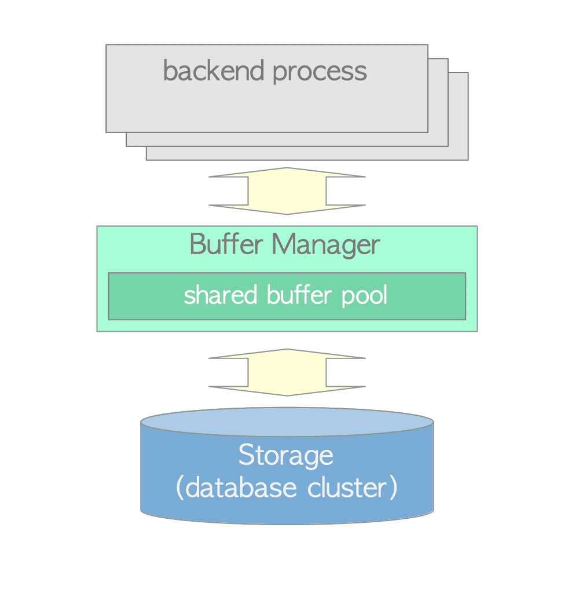
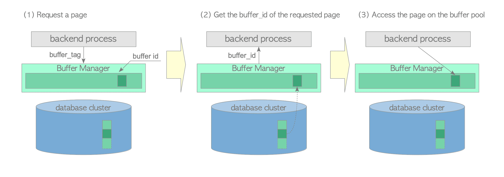
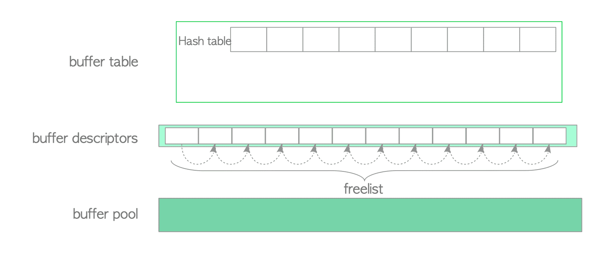
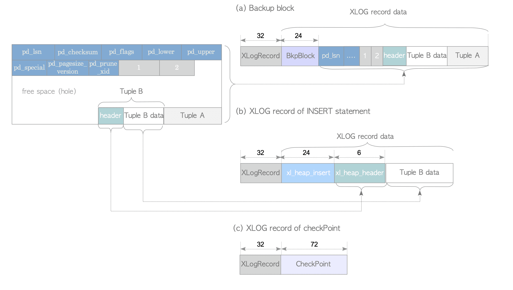

# 14. 모니터링과 성능 튜닝

> 📖 이 노트의 다이어그램은 [The Internals of PostgreSQL](https://www.interdb.jp/pg/)에서 가져왔습니다.

## 한줄 요약
PostgreSQL의 핵심 설정과 OS 자원의 관계를 이해하고, 통계 뷰와 벤치마크를 활용하여 시스템 성능을 최적화할 수 있다.

## 왜 알아야 하는가

### 성능 문제의 근본 원인
```
사용자 불만: "주문 조회가 느려요!"
     ↓
쿼리 로그 분석: SELECT * FROM orders ... (5초 소요)
     ↓
실행 계획 확인: Seq Scan on orders (cost=0.00..1234567.00)
     ↓
통계 확인: pg_stat_user_tables.n_live_tup = 50,000,000
     ↓
OS 확인: vmstat - swap 사용 중 (메모리 부족)
     ↓
근본 원인: shared_buffers 설정이 너무 작음 (128MB)
     ↓
해결책: shared_buffers를 8GB로 증가, work_mem 조정
     ↓
결과: 5초 → 0.3초 (94% 개선)
```

### 비즈니스 영향
- **사용자 경험**: 페이지 로딩 시간 1초 증가 → 전환율 7% 감소 (Google 연구)
- **운영 비용**: 잘못된 설정으로 서버 3대 운영 → 최적화 후 1대로 감축
- **장애 예방**: 메모리 부족 조기 감지 → OOM Killer 회피

### PostgreSQL 17의 개선사항
- **io_combine_limit**: I/O 병합 제한 설정으로 대량 쓰기 최적화
- **transaction_timeout**: 장기 실행 트랜잭션 자동 종료
- **pg_stat_checkpointer**: 체크포인트 통계 독립 뷰 (기존 pg_stat_bgwriter에서 분리)
- **pg_wait_events**: 대기 이벤트 상세 정보 (v17에서 확장)

## 핵심 개념

### PostgreSQL 프로세스 아키텍처와 메모리

```
┌────────────────────────────────────────────────────────────┐
│                    OS 메모리 (64GB)                        │
│                                                            │
│  ┌──────────────────────────────────────────────────────┐ │
│  │         공유 메모리 (Shared Memory)                  │ │
│  │  ┌────────────────────────────────────────────────┐  │ │
│  │  │  shared_buffers (16GB)                         │  │ │
│  │  │  - 데이터 페이지 캐시                          │  │ │
│  │  │  - 모든 백엔드가 공유                          │  │ │
│  │  │  - OS 공유 메모리(ipcs -m)로 할당             │  │ │
│  │  └────────────────────────────────────────────────┘  │ │
│  │  ┌────────────────────────────────────────────────┐  │ │
│  │  │  WAL buffers (16MB)                            │  │ │
│  │  │  - WAL 쓰기 전 버퍼링                          │  │ │
│  │  └────────────────────────────────────────────────┘  │ │
│  └──────────────────────────────────────────────────────┘ │
│                                                            │
│  ┌──────────────────────────────────────────────────────┐ │
│  │         프로세스 전용 메모리 (Per-Process)           │ │
│  │                                                      │ │
│  │  Backend 1      Backend 2      ...   Backend 100    │ │
│  │  ┌──────────┐  ┌──────────┐         ┌──────────┐   │ │
│  │  │ work_mem │  │ work_mem │         │ work_mem │   │ │
│  │  │  (4MB)   │  │  (4MB)   │   ...   │  (4MB)   │   │ │
│  │  │          │  │          │         │          │   │ │
│  │  │ 정렬, 해시│  │ 조인, 집계│         │ 서브쿼리 │   │ │
│  │  └──────────┘  └──────────┘         └──────────┘   │ │
│  │                                                      │ │
│  │  총 사용량: 100 connections × 4MB = 400MB           │ │
│  │  (복잡한 쿼리는 work_mem × N번 할당 가능)            │ │
│  └──────────────────────────────────────────────────────┘ │
│                                                            │
│  ┌──────────────────────────────────────────────────────┐ │
│  │         OS 페이지 캐시 (40GB)                        │ │
│  │  - PostgreSQL 데이터 파일 캐시                       │ │
│  │  - shared_buffers와 중복 캐싱                        │ │
│  │  - effective_cache_size로 옵티마이저에 힌트          │ │
│  └──────────────────────────────────────────────────────┘ │
│                                                            │
│  ┌──────────────────────────────────────────────────────┐ │
│  │         maintenance_work_mem (2GB)                   │ │
│  │  - VACUUM, CREATE INDEX 작업 시 사용                 │ │
│  │  - 동시 실행 작업 수 적음 (autovacuum_max_workers)  │ │
│  └──────────────────────────────────────────────────────┘ │
└────────────────────────────────────────────────────────────┘

계산 예시 (64GB RAM 서버):
- shared_buffers: 16GB (RAM의 25%)
- work_mem: 4MB (100 connections 가정)
- maintenance_work_mem: 2GB
- OS 페이지 캐시: ~40GB (남은 공간)
- effective_cache_size: 56GB (shared_buffers + OS 캐시)
```

### 핵심 설정 파라미터

#### 1. shared_buffers


*버퍼 매니저 아키텍처: 공유 버퍼 풀과 버퍼 디스크립터, 버퍼 테이블(tag→buffer_id 매핑용 해시 테이블), 그리고 실제 버퍼 페이지들*

> **🔍 그림 해설**
>
> 버퍼 매니저는 PostgreSQL의 "캐시 시스템" 사령부입니다. 도서관의 대출 데스크에 비유할 수 있습니다. 버퍼 테이블(해시 테이블)은 "어떤 책(페이지)이 어느 선반(슬롯)에 있는지" 빠르게 찾는 목록입니다. 버퍼 디스크립터는 각 슬롯의 상태 카드로, "누가 읽고 있는지(pin count)", "얼마나 자주 읽히는지(usage count)", "내용이 수정되었는지(dirty bit)" 등을 기록합니다. 실제 버퍼 페이지는 8KB 크기의 슬롯 배열로, 디스크에서 읽어온 데이터를 메모리에 캐싱합니다. 쿼리가 데이터를 요청하면, 버퍼 매니저는 버퍼 테이블을 검색하여 이미 메모리에 있는지 확인합니다. 있으면 즉시 반환(버퍼 히트)하고, 없으면 디스크에서 읽어 빈 슬롯에 넣습니다(버퍼 미스). 이 구조 덕분에 디스크 I/O를 크게 줄일 수 있습니다.


*공유 버퍼 풀 구조: 버퍼 페이지 배열(각 8KB), 참조 카운트와 사용 카운트를 가진 버퍼 디스크립터, 디스크 페이지와의 매핑 관계*

> **🔍 그림 해설**
>
> shared_buffers는 고정 크기의 8KB 슬롯 배열로 구성됩니다. 각 슬롯에는 참조 카운트(reference count)와 사용 카운트(usage count)라는 두 가지 중요한 숫자가 있습니다. 참조 카운트는 "현재 이 페이지를 사용하는 프로세스 수"로, 0보다 크면 해당 슬롯을 다른 페이지로 교체할 수 없습니다(pin으로 고정됨). 사용 카운트는 "최근 얼마나 자주 접근되었는지"를 나타내며, 페이지에 접근할 때마다 증가하고 Clock Sweep 알고리즘이 돌 때마다 감소합니다. 버퍼가 가득 차서 새 페이지를 불러와야 할 때, 참조 카운트가 0이고 사용 카운트도 0인 "인기 없는" 슬롯을 찾아 교체합니다. 이 메커니즘 덕분에 자주 사용되는 데이터는 메모리에 오래 남고, 드물게 사용되는 데이터는 빨리 쫓겨납니다.


```
┌──────────────────────────────────────────────────────────┐
│              shared_buffers 역할                         │
│                                                          │
│  쿼리 실행 흐름:                                         │
│  1. SELECT * FROM orders WHERE id = 12345;               │
│     ↓                                                    │
│  2. shared_buffers에서 페이지 검색                       │
│     ├─ HIT: 메모리에서 즉시 반환 (0.01ms)               │
│     └─ MISS: 디스크에서 읽기 (5ms) → shared_buffers에 캐시│
│                                                          │
│  설정 지침:                                              │
│  - RAM이 작은 경우 (≤4GB): 512MB ~ 1GB (25%)            │
│  - 중간 (8~32GB): 2GB ~ 8GB (25%)                       │
│  - 대형 (64GB+): 16GB ~ 32GB (25~50%)                   │
│  - 최대: 40% 이상은 비효율 (OS 캐시와 중복)             │
│                                                          │
│  OS 수준 확인:                                           │
│  $ ipcs -m                                               │
│  key        shmid   bytes       nattch                   │
│  0x00040e33 65536   17179869184 47                       │
│              ↑                                           │
│         16GB = shared_buffers                            │
└──────────────────────────────────────────────────────────┘
```

#### 2. work_mem
```
┌──────────────────────────────────────────────────────────┐
│                work_mem 동작                             │
│                                                          │
│  정렬 작업 예시:                                         │
│  SELECT * FROM orders ORDER BY created_at DESC LIMIT 100;│
│                                                          │
│  work_mem = 4MB (작음):                                  │
│  ┌─────────────────────────┐                            │
│  │ 메모리 정렬 (4MB 초과)  │                            │
│  └─────────┬───────────────┘                            │
│            ↓ 오버플로우                                  │
│  ┌─────────────────────────┐                            │
│  │ 디스크 임시 파일 생성   │ ← 느림! (10초)             │
│  │ /tmp/pgsql_tmp/...      │                            │
│  └─────────────────────────┘                            │
│                                                          │
│  work_mem = 64MB (충분):                                 │
│  ┌─────────────────────────┐                            │
│  │ 메모리 정렬 완료        │ ← 빠름! (0.5초)            │
│  └─────────────────────────┘                            │
│                                                          │
│  주의사항:                                               │
│  - 복잡한 쿼리는 work_mem × N번 사용                     │
│    (예: 3개 조인 → 3 × 64MB = 192MB/쿼리)               │
│  - 동시 쿼리 100개 → 100 × 192MB = 19.2GB!              │
│  - OOM(Out of Memory) 위험!                              │
│                                                          │
│  권장 설정:                                              │
│  - OLTP (많은 동시 연결): 4MB ~ 16MB                    │
│  - OLAP (분석, 적은 연결): 64MB ~ 256MB                 │
│  - 세션별 동적 변경 가능:                                │
│    SET work_mem = '256MB';                               │
└──────────────────────────────────────────────────────────┘
```

#### 3. effective_cache_size
```
┌──────────────────────────────────────────────────────────┐
│          effective_cache_size 역할                       │
│                                                          │
│  이 설정은 실제 메모리를 할당하지 않음!                  │
│  옵티마이저에게 "이 정도 캐시가 있어요"라고 알려줌       │
│                                                          │
│  쿼리 플래너 판단:                                       │
│  SELECT * FROM orders WHERE user_id = 1001;              │
│                                                          │
│  effective_cache_size = 4GB (작게 설정):                 │
│  "캐시가 작으니 인덱스 스캔보다 Seq Scan이 나을 수도..." │
│  → Seq Scan 선택 (느림)                                  │
│                                                          │
│  effective_cache_size = 56GB (실제 캐시 크기):           │
│  "캐시가 크니 인덱스 페이지도 메모리에 있을 것"          │
│  → Index Scan 선택 (빠름)                                │
│                                                          │
│  계산 방법:                                              │
│  effective_cache_size = shared_buffers + OS 페이지 캐시  │
│                                                          │
│  예시 (64GB RAM):                                        │
│  shared_buffers = 16GB                                   │
│  OS 캐시 = 64GB - 16GB - 4GB(기타) = 44GB               │
│  effective_cache_size = 16GB + 44GB = 60GB               │
│                                                          │
│  확인:                                                   │
│  $ free -h                                               │
│        total  used  free  shared  buff/cache  available  │
│  Mem:  64Gi   16Gi  4Gi   16Gi    44Gi        60Gi       │
│                                    ↑          ↑          │
│                              OS 캐시   실제 사용 가능    │
└──────────────────────────────────────────────────────────┘
```

#### 4. wal_buffers
```
┌──────────────────────────────────────────────────────────┐
│               wal_buffers 동작                           │
│                                                          │
│  WAL 쓰기 흐름:                                          │
│  1. INSERT/UPDATE 실행                                   │
│     ↓                                                    │
│  2. WAL 레코드 생성                                      │
│     ↓                                                    │
│  3. wal_buffers에 쓰기 (메모리)                          │
│     ↓ 버퍼 가득 참 또는 COMMIT                           │
│  4. 디스크(pg_wal/) 쓰기 (fsync)                         │
│                                                          │
│  wal_buffers = 16MB (기본):                              │
│  ┌──────────────┐                                       │
│  │ 16MB 버퍼    │ → 대량 INSERT 시 자주 플러시           │
│  └──────────────┘    (fsync 호출 증가 → 느림)           │
│                                                          │
│  wal_buffers = 64MB (대량 쓰기 환경):                    │
│  ┌──────────────┐                                       │
│  │ 64MB 버퍼    │ → 배치 처리, fsync 감소                │
│  └──────────────┘    (쓰기 성능 향상)                    │
│                                                          │
│  권장 설정:                                              │
│  - 기본: 16MB (자동 계산: shared_buffers의 1/32)         │
│  - 대량 쓰기: 32MB ~ 64MB                                │
│  - 최대: 1GB (과도한 설정은 불필요)                      │
│                                                          │
│  모니터링:                                               │
│  SELECT * FROM pg_stat_wal;                              │
│  wal_buffers_full | 버퍼 부족 횟수                       │
│  (높으면 wal_buffers 증가 고려)                          │
└──────────────────────────────────────────────────────────┘
```

#### 5. huge_pages (OS Huge Pages)
```
┌──────────────────────────────────────────────────────────┐
│              Huge Pages 최적화                           │
│                                                          │
│  일반 메모리 페이지:                                     │
│  ┌─────┬─────┬─────┬─────┬ ... (4096개)                │
│  │ 4KB │ 4KB │ 4KB │ 4KB │                              │
│  └─────┴─────┴─────┴─────┴                              │
│  16GB shared_buffers = 4,194,304 페이지                  │
│  ↓                                                       │
│  TLB(Translation Lookaside Buffer) 미스 빈번             │
│  가상 주소 → 물리 주소 변환 오버헤드                     │
│                                                          │
│  Huge Pages (2MB):                                       │
│  ┌──────────┬──────────┬ ... (8개)                      │
│  │   2MB    │   2MB    │                                │
│  └──────────┴──────────┴                                │
│  16GB shared_buffers = 8,192 페이지                      │
│  ↓                                                       │
│  TLB 미스 99.8% 감소                                     │
│  성능 향상: 5~10% (대규모 메모리 환경)                   │
│                                                          │
│  Linux 설정:                                             │
│  # 1. Huge Pages 크기 계산                               │
│  $ grep ^VmPeak /proc/$(pgrep -f "postgres: checkpointer")/status│
│  VmPeak: 17203456 kB  # 16.4GB                           │
│                                                          │
│  # 2. 필요한 Huge Pages 수 계산                          │
│  # 17203456 kB / 2048 kB(2MB) = 8400 페이지              │
│                                                          │
│  # 3. OS 설정                                            │
│  $ sudo sysctl -w vm.nr_hugepages=8400                   │
│  $ sudo sysctl -w vm.hugetlb_shm_group=999  # postgres GID│
│                                                          │
│  # 4. PostgreSQL 설정                                    │
│  huge_pages = on  # postgresql.conf                      │
│                                                          │
│  # 5. 재시작 후 확인                                     │
│  $ grep Huge /proc/meminfo                               │
│  HugePages_Total:    8400                                │
│  HugePages_Free:       42                                │
│  HugePages_Rsvd:        0                                │
│  HugePages_Surp:        0                                │
│  Hugepagesize:       2048 kB                             │
│  # 8358 페이지 사용 중 (8400 - 42)                       │
└──────────────────────────────────────────────────────────┘
```

#### 6. PostgreSQL 17 신규 설정

##### io_combine_limit
```sql
-- WAL 쓰기 시 여러 I/O를 병합하는 크기 제한
-- 기본값: 128kB

-- 대량 쓰기 환경 (배치 처리, 대규모 INSERT)
ALTER SYSTEM SET io_combine_limit = '1MB';
-- 효과: 작은 WAL 쓰기들을 1MB 단위로 묶어서 디스크에 기록
-- 결과: fsync 횟수 감소, 쓰기 처리량 향상

-- SSD/NVMe 환경에서는 더 큰 값도 효과적
ALTER SYSTEM SET io_combine_limit = '4MB';

-- 확인
SHOW io_combine_limit;
 io_combine_limit
------------------
 1MB
```

##### transaction_timeout
```sql
-- 트랜잭션 최대 실행 시간 제한 (v17 신규)
-- 기본값: 0 (무제한)

-- 장기 실행 트랜잭션 방지 (락 대기 줄이기)
ALTER SYSTEM SET transaction_timeout = '30min';

-- 시나리오:
BEGIN;
UPDATE orders SET status = 'processing' WHERE id = 12345;
-- ... 개발자가 커밋을 잊고 30분 경과 ...
-- ERROR:  transaction timeout

-- 자동 ROLLBACK, 다른 세션의 락 대기 해소

-- 확인
SELECT
    pid,
    xact_start,
    now() - xact_start AS duration,
    state,
    query
FROM pg_stat_activity
WHERE xact_start IS NOT NULL
  AND now() - xact_start > interval '25 minutes'
ORDER BY xact_start;

-- 오래된 트랜잭션 경고 → 5분 후 자동 종료됨
```

### 체크포인트와 I/O 분산


*Clock Sweep 알고리즘: 원형 버퍼 풀을 "시계 바늘"이 순회하며 사용 카운트를 감소시키고, 카운트가 0인 페이지를 교체 대상으로 선택*

> **🔍 그림 해설**
>
> Clock Sweep은 버퍼가 가득 찼을 때 어떤 페이지를 내보낼지 결정하는 알고리즘입니다. 시계의 초침처럼 바늘이 원형 버퍼를 계속 돕니다. 각 슬롯을 방문할 때마다, 참조 카운트(pin count)가 0인지 확인합니다. 0이 아니면 다른 프로세스가 사용 중이므로 건너뜁니다. 0이면 사용 카운트를 1씩 줄입니다. 사용 카운트가 0이 된 슬롯을 만나면, "이 페이지는 최근에 사용되지 않았구나"라고 판단하고 교체합니다. 자주 사용되는 페이지는 카운트가 계속 증가하므로 오래 살아남고, 드물게 사용되는 페이지는 카운트가 빠르게 0으로 떨어져 먼저 쫓겨납니다. LRU(Least Recently Used)보다 구현이 간단하면서도 비슷한 성능을 내며, 메모리 오버헤드도 작습니다.

```
┌──────────────────────────────────────────────────────────┐
│              Checkpoint 동작                             │
│                                                          │
│  목적: 메모리(shared_buffers)의 더티 페이지를 디스크에  │
│        기록하여 복구 시간 단축                           │
│                                                          │
│  타임라인:                                               │
│  ├───────────────┬───────────────┬──────────────┤       │
│  0s             5min           10min          15min      │
│  │               │               │               │       │
│  ├ checkpoint_timeout = 5min                     │       │
│  │               ↓                               │       │
│  │          Checkpoint 시작                      │       │
│  │          ┌────────────┐                       │       │
│  │          │ 더티 페이지│                       │       │
│  │          │   500MB    │ ──→ 디스크 쓰기       │       │
│  │          └────────────┘     (30초 소요)       │       │
│  │                                               │       │
│  ├ max_wal_size = 1GB 도달                       │       │
│  │                               ↓               │       │
│  │                          Checkpoint 시작      │       │
│  │                          (강제 발동)          │       │
│                                                          │
│  설정 최적화:                                            │
│  1. checkpoint_timeout                                   │
│     - 기본: 5분 (너무 짧음 → I/O 스파이크)              │
│     - 권장: 15분 ~ 30분                                  │
│     - 대형 DB: 30분 ~ 1시간                              │
│                                                          │
│  2. max_wal_size                                         │
│     - 기본: 1GB (부족)                                   │
│     - 권장: 4GB ~ 16GB (디스크 여유 있으면)              │
│     - 효과: Checkpoint 빈도 감소                         │
│                                                          │
│  3. checkpoint_completion_target                         │
│     - 기본: 0.9 (90%)                                    │
│     - 의미: Checkpoint를 간격의 90% 시간에 걸쳐 분산     │
│     - 예: timeout=15분, target=0.9 → 13.5분에 걸쳐 쓰기 │
│     - 효과: I/O 스파이크 완화 (부드러운 쓰기)            │
│                                                          │
│  I/O 패턴 비교:                                          │
│  completion_target = 0.1 (나쁨):                         │
│  I/O ▁▁▁▁▁▁▁▁▁▁▁▁▁██████████▁▁▁▁▁▁▁▁▁▁▁▁▁             │
│       ↑ 짧은 시간에 집중 쓰기 (디스크 병목)              │
│                                                          │
│  completion_target = 0.9 (좋음):                         │
│  I/O ▁▂▂▃▃▄▄▅▅▆▆▇▇▇▇▇▇▇▆▆▅▅▄▄▃▃▂▂▁▁▁▁                 │
│       ↑ 긴 시간에 걸쳐 분산 쓰기 (안정적)                │
└──────────────────────────────────────────────────────────┘
```

## OS/파일시스템 관점

### OS 모니터링 도구

#### vmstat (가상 메모리 통계)
```bash
# 1초마다 10회 측정
$ vmstat 1 10

procs -----------memory---------- ---swap-- -----io---- -system-- ------cpu-----
 r  b   swpd   free   buff  cache   si   so    bi    bo   in   cs us sy id wa st
 2  0      0 8234560 524288 45678912   0    0   128  2048 4567 8901 25  5 68  2  0
 3  1      0 8123456 524288 45689012   0    0   256  4096 4890 9123 30  8 60  2  0
 5  2   4096 7900123 524288 45698765   1    2  1024 16384 5234 9876 45 15 35  5  0
                ↑                      ↑    ↑    ↑     ↑
            swap 사용              swap in/out  disk I/O
            (문제!)                (문제!)      (높음)

# 열 설명:
# r: 실행 대기 중인 프로세스 수 (CPU 코어 수의 2배 이상이면 과부하)
# b: I/O 대기 중인 프로세스 수 (블록 I/O)
# swpd: 사용 중인 swap 메모리 (0이 아니면 메모리 부족)
# si/so: swap in/out 속도 (초당 KB) - 0이 아니면 심각한 문제
# bi/bo: block in/out (디스크 읽기/쓰기, 초당 KB)
# wa: I/O 대기 CPU 비율 (5% 이상이면 디스크 병목)

# 문제 상황 (위 3번째 줄):
# - swpd = 4096 KB (swap 사용 시작)
# - si/so = 1/2 KB/s (swap I/O 발생 → 매우 느림)
# - r = 5 (CPU 대기 큐 길어짐)
# - wa = 5% (I/O 대기 증가)
# 해결: shared_buffers 또는 work_mem 감소, RAM 증설
```

#### iostat (I/O 통계)
```bash
# 디스크별 I/O 상세 통계
$ iostat -x 1 5

Device  r/s    w/s   rkB/s   wkB/s  await  svctm  %util
sda     15.3   48.7  1234.5  9876.2   3.2    2.1   12.5
sdb    123.4  456.8 12345.6 45678.9  15.8   12.3   89.2
        ↑      ↑      ↑       ↑       ↑      ↑      ↑
     초당 읽기 쓰기  읽기KB  쓰기KB  평균   평균   사용률
                                    대기   서비스
                                    시간   시간

# 열 설명:
# r/s, w/s: 초당 읽기/쓰기 요청 수
# rkB/s, wkB/s: 초당 읽기/쓰기 데이터 양
# await: 평균 요청 대기 시간 (ms) - 큐잉 + 서비스
# svctm: 평균 서비스 시간 (ms) - 실제 처리 시간
# %util: 디스크 사용률 (100%에 가까우면 병목)

# 문제 판단 (sdb):
# - %util = 89.2% (디스크 거의 포화)
# - await = 15.8ms (느림, HDD는 정상이지만 SSD는 과부하)
# - w/s = 456.8 (쓰기 요청 폭주)
# 원인: Checkpoint 시 대량 쓰기
# 해결: checkpoint_completion_target 증가, SSD로 업그레이드

# PostgreSQL 데이터 디렉토리별 확인
$ iostat -x -p sda 1

Device  r/s   w/s
sda1    12.3  45.6  # /var/lib/postgresql (PGDATA)
sda2     2.1   3.4  # /backup (백업 디렉토리)
```

#### top / htop (프로세스별 자원 사용)
```bash
# PostgreSQL 프로세스 필터링
$ top -u postgres

  PID USER      PR  NI    VIRT    RES    SHR S  %CPU  %MEM     TIME+ COMMAND
12345 postgres  20   0 17.2g   15.8g  15.6g S  89.3  24.7 123:45.67 postgres: checkpointer
12346 postgres  20   0 17.2g   2.3g   2.1g S  45.2   3.6  45:23.12 postgres: user ecommerce SELECT
12347 postgres  20   0 17.2g   1.8g   1.6g S  32.1   2.8  34:56.78 postgres: user ecommerce INSERT
12348 postgres  20   0 17.2g   15.7g  15.5g S   0.3  24.5   1:23.45 postgres: walwriter

# 열 설명:
# VIRT: 가상 메모리 (17.2GB = shared_buffers 포함)
# RES: 실제 메모리 (Resident)
# SHR: 공유 메모리 (대부분 shared_buffers)
# %CPU: CPU 사용률
# %MEM: 메모리 사용률

# 분석:
# - checkpointer: CPU 89% (Checkpoint 진행 중)
# - 여러 백엔드가 RES 1~2GB (work_mem 많이 사용)
# - 모든 프로세스가 SHR 15.6GB (shared_buffers 공유)

# htop에서 트리 뷰 (F5)
postgres───postgres: postgres ecommerce [local] idle
       ├─postgres: checkpointer
       ├─postgres: background writer
       ├─postgres: walwriter
       ├─postgres: autovacuum launcher
       ├─postgres: logical replication launcher
       └─postgres: user ecommerce SELECT
```

#### free (메모리 사용)
```bash
$ free -h

              total        used        free      shared  buff/cache   available
Mem:           64Gi        18Gi        4Gi        16Gi        42Gi        60Gi
Swap:           8Gi         0Bi        8Gi

# 분석:
# - total: 64GB (전체 RAM)
# - used: 18GB (프로세스 사용 중)
#   ├─ PostgreSQL shared_buffers: 16GB
#   └─ 기타 프로세스: 2GB
# - buff/cache: 42GB (OS 페이지 캐시)
#   ├─ PostgreSQL 데이터 파일 캐시
#   └─ 기타 파일 캐시
# - available: 60GB (실제 사용 가능)
#   = free + buff/cache (캐시는 필요 시 해제 가능)
# - Swap: 0B 사용 (정상, swap 사용은 성능 저하)

# effective_cache_size 계산:
# shared_buffers + buff/cache = 16GB + 42GB = 58GB
# 여유 고려하여 56GB로 설정
```

### 파일시스템 수준 최적화

#### 파일시스템 선택
```bash
# 1. ext4 (범용, 안정적)
$ sudo mkfs.ext4 -m 0 -T largefile4 /dev/sdb1
$ sudo tune2fs -o journal_data_writeback /dev/sdb1
# journal_data_writeback: 메타데이터만 저널링 (PostgreSQL이 WAL로 관리)

# 2. XFS (대용량, 병렬 I/O 우수)
$ sudo mkfs.xfs -f -d agcount=64 /dev/sdb1
$ sudo mount -o noatime,nodiratime,logbufs=8,logbsize=256k /dev/sdb1 /var/lib/postgresql

# 마운트 옵션:
# - noatime: 파일 접근 시간 갱신 안 함 (쓰기 감소)
# - nodiratime: 디렉토리 접근 시간 갱신 안 함
# - logbufs=8, logbsize=256k: XFS 로그 버퍼 증가 (쓰기 성능)

# 3. ZFS (Copy-on-Write, 스냅샷, 압축)
$ sudo zfs create -o compression=lz4 \
                  -o recordsize=8k \
                  -o atime=off \
                  tank/pgdata
# recordsize=8k: PostgreSQL 페이지 크기에 맞춤
# compression=lz4: 빠른 압축 (CPU 오버헤드 낮음)
```

#### I/O 스케줄러 최적화
```bash
# HDD: deadline 스케줄러 (순차 I/O 최적화)
$ echo deadline | sudo tee /sys/block/sda/queue/scheduler
$ cat /sys/block/sda/queue/scheduler
noop [deadline] cfq

# SSD/NVMe: noop 또는 none (스케줄링 불필요)
$ echo noop | sudo tee /sys/block/nvme0n1/queue/scheduler
$ cat /sys/block/nvme0n1/queue/scheduler
[noop] deadline cfq

# /etc/udev/rules.d/60-scheduler.rules 영구 설정
ACTION=="add|change", KERNEL=="sd[a-z]", ATTR{queue/scheduler}="deadline"
ACTION=="add|change", KERNEL=="nvme[0-9]n[0-9]", ATTR{queue/scheduler}="noop"
```

## 실습 SQL

### 1. 통계 뷰 - pg_stat_user_tables

```sql
-- 테이블별 통계 확인
SELECT
    schemaname,
    relname AS table_name,
    seq_scan,                     -- 순차 스캔 횟수
    seq_tup_read,                 -- 순차 스캔으로 읽은 행 수
    idx_scan,                     -- 인덱스 스캔 횟수
    idx_tup_fetch,                -- 인덱스 스캔으로 가져온 행 수
    n_tup_ins,                    -- INSERT된 행 수
    n_tup_upd,                    -- UPDATE된 행 수
    n_tup_del,                    -- DELETE된 행 수
    n_live_tup,                   -- 살아있는 행 수
    n_dead_tup,                   -- 죽은 행 수 (VACUUM 필요)
    last_vacuum,                  -- 마지막 VACUUM 시각
    last_autovacuum,              -- 마지막 auto-VACUUM 시각
    vacuum_count,                 -- VACUUM 실행 횟수
    autovacuum_count              -- auto-VACUUM 실행 횟수
FROM pg_stat_user_tables
ORDER BY seq_scan DESC
LIMIT 10;

/*
 table_name   | seq_scan | seq_tup_read | idx_scan | idx_tup_fetch | n_live_tup | n_dead_tup
--------------+----------+--------------+----------+---------------+------------+------------
 event_logs   |     1234 |  123456789   |      456 |       456789  |   50000000 |    5000000
 orders       |      234 |    2345678   |    45678 |      3456789  |     500000 |      50000
 products     |      123 |     123456   |    12345 |       123456  |      10000 |       1000

문제 발견:
1. event_logs:
   - seq_scan 1234회 (순차 스캔 과다)
   - n_dead_tup 5M (죽은 행 10%, VACUUM 필요)
   - 해결: 인덱스 추가, VACUUM 실행

2. orders:
   - idx_scan 45678회 (인덱스 활용 좋음)
   - n_dead_tup 50K (10%, VACUUM 자동 실행될 듯)
*/

-- 순차 스캔 비율 높은 테이블 (인덱스 누락 의심)
SELECT
    relname,
    seq_scan,
    idx_scan,
    seq_scan::FLOAT / NULLIF(seq_scan + idx_scan, 0) AS seq_scan_ratio,
    n_live_tup,
    pg_size_pretty(pg_relation_size(schemaname||'.'||relname)) AS table_size
FROM pg_stat_user_tables
WHERE seq_scan + idx_scan > 100  -- 최소 사용 빈도 필터
  AND n_live_tup > 10000         -- 작은 테이블 제외
ORDER BY seq_scan_ratio DESC
LIMIT 10;

/*
 relname      | seq_scan | idx_scan | seq_scan_ratio | n_live_tup | table_size
--------------+----------+----------+----------------+------------+------------
 event_logs   |     1234 |      456 |           0.73 |   50000000 | 12 GB
 reviews      |      567 |      234 |           0.71 |    1000000 | 450 MB

해석:
- event_logs: 73% 순차 스캔 (12GB 테이블에서 비효율)
- 조치: WHERE절 분석 → 인덱스 추가
  CREATE INDEX idx_event_logs_user_event ON event_logs(user_id, event_type);
*/

-- VACUUM 필요 테이블
SELECT
    relname,
    n_live_tup,
    n_dead_tup,
    n_dead_tup::FLOAT / NULLIF(n_live_tup + n_dead_tup, 0) AS dead_ratio,
    last_autovacuum,
    pg_size_pretty(pg_relation_size(schemaname||'.'||relname)) AS table_size
FROM pg_stat_user_tables
WHERE n_dead_tup > 10000
ORDER BY dead_ratio DESC
LIMIT 10;

/*
 relname    | n_live_tup | n_dead_tup | dead_ratio | last_autovacuum      | table_size
------------+------------+------------+------------+----------------------+------------
 cart_items |    1000000 |     500000 |       0.33 | 2026-01-30 10:23:45  | 256 MB
 orders     |     500000 |      50000 |       0.09 | 2026-01-31 02:15:32  | 128 MB

해석:
- cart_items: 죽은 행 33% (높음!)
- 원인: 장바구니 상품 빈번한 추가/삭제
- 조치: 수동 VACUUM 실행
  VACUUM VERBOSE cart_items;
- 예방: autovacuum_vacuum_scale_factor 조정 (기본 0.2 → 0.1)
*/
```

### 2. 통계 뷰 - pg_stat_statements (쿼리 통계)

```sql
-- pg_stat_statements 확장 활성화 (최초 1회)
CREATE EXTENSION IF NOT EXISTS pg_stat_statements;

-- postgresql.conf 설정 (재시작 필요)
-- shared_preload_libraries = 'pg_stat_statements'
-- pg_stat_statements.track = all

-- 가장 느린 쿼리 TOP 10
SELECT
    queryid,
    substring(query, 1, 80) AS short_query,
    calls,                                    -- 실행 횟수
    total_exec_time / 1000 AS total_sec,      -- 총 실행 시간 (초)
    mean_exec_time AS avg_ms,                 -- 평균 실행 시간 (ms)
    max_exec_time AS max_ms,                  -- 최대 실행 시간 (ms)
    stddev_exec_time AS stddev_ms,            -- 표준편차 (ms)
    rows / calls AS avg_rows,                 -- 평균 반환 행 수
    shared_blks_hit,                          -- 버퍼 캐시 히트
    shared_blks_read,                         -- 디스크 읽기
    shared_blks_hit::FLOAT /
        NULLIF(shared_blks_hit + shared_blks_read, 0) AS cache_hit_ratio
FROM pg_stat_statements
ORDER BY total_exec_time DESC
LIMIT 10;

/*
 queryid |              short_query               | calls | total_sec | avg_ms | max_ms | cache_hit_ratio
---------+----------------------------------------+-------+-----------+--------+--------+-----------------
 1234567 | SELECT * FROM event_logs WHERE user... |  5000 |    12500  |  2500  |  8900  |            0.65
 2345678 | SELECT o.*, u.name FROM orders o JOI...|  8900 |     8900  |  1000  |  3400  |            0.92
 3456789 | INSERT INTO event_logs (user_id, eve...|450000 |     4500  |    10  |   450  |            0.99

분석:
1. Query 1234567 (가장 느림):
   - 평균 2.5초, 최대 8.9초 (매우 느림)
   - 캐시 히트율 65% (낮음, 디스크 읽기 많음)
   - 조치: EXPLAIN ANALYZE 실행 → 인덱스 추가

2. Query 3456789 (빈번함):
   - 45만 회 실행 (로그 삽입)
   - 평균 10ms (빠름)
   - 캐시 히트율 99% (좋음)
   - 조치: 파티셔닝으로 테이블 크기 관리
*/

-- 가장 많이 호출되는 쿼리
SELECT
    substring(query, 1, 100) AS short_query,
    calls,
    total_exec_time / 1000 AS total_sec,
    mean_exec_time AS avg_ms,
    calls::FLOAT / EXTRACT(EPOCH FROM (now() - stats_reset)) AS calls_per_sec
FROM pg_stat_statements
ORDER BY calls DESC
LIMIT 10;

/*
              short_query              | calls  | total_sec | avg_ms | calls_per_sec
---------------------------------------+--------+-----------+--------+---------------
 INSERT INTO event_logs ...            | 450000 |      4500 |     10 |          5.21
 SELECT * FROM products WHERE id = $1  | 234000 |      2340 |     10 |          2.71
 SELECT * FROM users WHERE email = $1  | 189000 |      1890 |     10 |          2.19

분석:
- 초당 5.21회 로그 삽입 (높은 쓰기 부하)
- 초당 2.71회 상품 조회 (읽기 부하)
- 대부분 10ms 이내 (성능 양호)
*/

-- 캐시 히트율 낮은 쿼리 (디스크 I/O 과다)
SELECT
    substring(query, 1, 100) AS short_query,
    calls,
    shared_blks_hit AS cache_hits,
    shared_blks_read AS disk_reads,
    shared_blks_hit::FLOAT / NULLIF(shared_blks_hit + shared_blks_read, 0) AS cache_hit_ratio
FROM pg_stat_statements
WHERE shared_blks_read > 0
ORDER BY cache_hit_ratio ASC
LIMIT 10;

/*
              short_query              | calls | cache_hits | disk_reads | cache_hit_ratio
---------------------------------------+-------+------------+------------+-----------------
 SELECT * FROM event_logs WHERE ...    |  5000 |    1300000 |    700000  |            0.65
 SELECT * FROM reviews WHERE produc... |  2300 |     450000 |    150000  |            0.75

분석:
- event_logs 쿼리: 35% 디스크 읽기 (shared_buffers 부족 의심)
- 조치:
  1. shared_buffers 증가 (16GB → 24GB)
  2. 쿼리 최적화 (필요한 컬럼만 SELECT)
  3. 파티셔닝 (오래된 로그 분리)
*/

-- 통계 초기화 (테스트 후)
SELECT pg_stat_statements_reset();
```

### 3. 통계 뷰 - pg_stat_activity (현재 세션)

```sql
-- 현재 실행 중인 쿼리
SELECT
    pid,
    usename,
    application_name,
    client_addr,
    state,
    wait_event_type,
    wait_event,
    query_start,
    now() - query_start AS duration,
    substring(query, 1, 100) AS query
FROM pg_stat_activity
WHERE state != 'idle'
  AND pid != pg_backend_pid()  -- 현재 세션 제외
ORDER BY query_start;

/*
  pid  | usename  | application_name | client_addr | state  | wait_event_type | wait_event | query_start         | duration    | query
-------+----------+------------------+-------------+--------+-----------------+------------+---------------------+-------------+-------
 12345 | ecom_app | web-server-1     | 192.168.1.5 | active | IO              | DataFileRead| 2026-01-31 16:30:00| 00:01:23.45 | SELECT * FROM event_logs WHERE ...
 12346 | ecom_app | web-server-2     | 192.168.1.6 | active | Lock            | tuple      | 2026-01-31 16:30:45| 00:00:38.12 | UPDATE orders SET status = 'comp...
 12347 | ecom_app | worker-1         | 192.168.1.7 | active | Client          | ClientRead | 2026-01-31 16:31:00| 00:00:23.00 | INSERT INTO order_items ...

분석:
1. PID 12345:
   - 1분 23초 실행 중 (느림)
   - wait_event: DataFileRead (디스크 I/O 대기)
   - 조치: EXPLAIN ANALYZE → 인덱스 추가

2. PID 12346:
   - 38초 실행 중
   - wait_event: tuple (행 잠금 대기)
   - 조치: 다른 세션의 장기 트랜잭션 확인 (아래 쿼리)

3. PID 12347:
   - wait_event: ClientRead (클라이언트 응답 대기)
   - 정상 (애플리케이션 처리 중)
*/

-- 장기 실행 트랜잭션 (락 원인)
SELECT
    pid,
    usename,
    xact_start,
    now() - xact_start AS xact_duration,
    state,
    substring(query, 1, 100) AS query
FROM pg_stat_activity
WHERE xact_start IS NOT NULL
  AND state = 'idle in transaction'  -- 트랜잭션 시작 후 유휴
ORDER BY xact_start;

/*
  pid  | usename  | xact_start          | xact_duration | state                | query
-------+----------+---------------------+---------------+----------------------+-------
 12340 | ecom_app | 2026-01-31 15:45:00 | 00:45:30.123  | idle in transaction  | UPDATE orders SET status = 'processing' WHERE id = 12345;

문제:
- 45분 동안 트랜잭션 유지 (COMMIT 누락)
- orders 테이블의 특정 행에 배타적 락 유지
- 다른 세션들이 해당 행 업데이트 시 대기

조치:
1. 애플리케이션 코드 확인 (COMMIT 누락)
2. 수동 종료:
   SELECT pg_terminate_backend(12340);
*/

-- 락 대기 체인 분석
SELECT
    blocking.pid AS blocking_pid,
    blocking.usename AS blocking_user,
    blocking.query AS blocking_query,
    blocked.pid AS blocked_pid,
    blocked.usename AS blocked_user,
    blocked.query AS blocked_query,
    now() - blocked.query_start AS blocked_duration
FROM pg_stat_activity AS blocked
JOIN pg_locks AS blocked_locks ON blocked.pid = blocked_locks.pid
JOIN pg_locks AS blocking_locks ON
    blocked_locks.locktype = blocking_locks.locktype
    AND blocked_locks.database IS NOT DISTINCT FROM blocking_locks.database
    AND blocked_locks.relation IS NOT DISTINCT FROM blocking_locks.relation
    AND blocked_locks.page IS NOT DISTINCT FROM blocking_locks.page
    AND blocked_locks.tuple IS NOT DISTINCT FROM blocking_locks.tuple
    AND blocked_locks.virtualxid IS NOT DISTINCT FROM blocking_locks.virtualxid
    AND blocked_locks.transactionid IS NOT DISTINCT FROM blocking_locks.transactionid
    AND blocked_locks.classid IS NOT DISTINCT FROM blocking_locks.classid
    AND blocked_locks.objid IS NOT DISTINCT FROM blocking_locks.objid
    AND blocked_locks.objsubid IS NOT DISTINCT FROM blocking_locks.objsubid
    AND blocked_locks.pid != blocking_locks.pid
JOIN pg_stat_activity AS blocking ON blocking.pid = blocking_locks.pid
WHERE NOT blocked_locks.granted;

/*
 blocking_pid | blocking_user | blocking_query              | blocked_pid | blocked_user | blocked_query           | blocked_duration
--------------+---------------+-----------------------------+-------------+--------------+-------------------------+-----------------
        12340 | ecom_app      | UPDATE orders SET status... |       12346 | ecom_app     | UPDATE orders SET sta...| 00:00:38.12

락 체인:
PID 12340 (45분 전 시작)
    ↓ 블로킹
PID 12346 (38초 대기 중)

해결:
SELECT pg_terminate_backend(12340);
-- PID 12346의 쿼리가 즉시 실행됨
*/

-- 동시 연결 수 모니터링
SELECT
    state,
    count(*) AS count
FROM pg_stat_activity
GROUP BY state
ORDER BY count DESC;

/*
      state      | count
-----------------+-------
 idle            |    78
 active          |    15
 idle in transaction |  3
 idle in transaction (aborted) | 1

분석:
- idle: 78개 (연결 풀에서 대기 중, 정상)
- active: 15개 (쿼리 실행 중)
- idle in transaction: 3개 (주의! 트랜잭션 누수 가능성)
- max_connections = 200이면 여유 있음
*/
```

### 4. PostgreSQL 17 통계 뷰

#### pg_stat_checkpointer (체크포인트 통계)
```sql
-- v17에서 pg_stat_bgwriter에서 분리됨
SELECT
    num_timed,                  -- timeout으로 발생한 체크포인트 수
    num_requested,              -- 요청으로 발생한 체크포인트 수
    write_time / 1000 AS write_sec,  -- 파일 쓰기 시간 (초)
    sync_time / 1000 AS sync_sec,    -- fsync 시간 (초)
    buffers_written,            -- 쓰여진 버퍼 수
    buffers_written * 8 / 1024 / 1024 AS written_gb,  -- 쓰여진 데이터 (GB)
    stats_reset                 -- 통계 초기화 시각
FROM pg_stat_checkpointer;

/*
 num_timed | num_requested | write_sec | sync_sec | buffers_written | written_gb |      stats_reset
-----------+---------------+-----------+----------+-----------------+------------+---------------------
       456 |            23 |    12345  |     2345 |       1234567   |       9.68 | 2026-01-25 10:00:00

분석:
- num_timed: 456회 (checkpoint_timeout으로 발생)
- num_requested: 23회 (max_wal_size 초과로 발생)
- 비율: 456 : 23 = 95% : 5% (좋음, 대부분 timeout으로 예정대로 발생)
- 만약 requested가 많으면 max_wal_size 증가 필요

- write_sec: 12345초 (3.4시간)
- 6일간 누적 → 평균 34분/일 (checkpoint_timeout=15분, 일 96회 중 456회/6일=76회)
- sync_sec: 2345초 (fsync 대기, write의 19%)

- written_gb: 9.68GB
- 6일간 총 쓰기량 → 평균 1.6GB/일

조치:
- num_requested가 num_timed의 20% 이상이면:
  ALTER SYSTEM SET max_wal_size = '8GB';  -- 기본 1GB에서 증가
*/

-- 체크포인트 빈도 계산
SELECT
    num_timed + num_requested AS total_checkpoints,
    EXTRACT(EPOCH FROM (now() - stats_reset)) / 3600 AS hours_elapsed,
    (num_timed + num_requested)::FLOAT /
        (EXTRACT(EPOCH FROM (now() - stats_reset)) / 3600) AS checkpoints_per_hour,
    3600 / ((num_timed + num_requested)::FLOAT /
        (EXTRACT(EPOCH FROM (now() - stats_reset)) / 3600)) / 60 AS avg_interval_minutes
FROM pg_stat_checkpointer;

/*
 total_checkpoints | hours_elapsed | checkpoints_per_hour | avg_interval_minutes
-------------------+---------------+----------------------+----------------------
               479 |           144 |                 3.33 |                18.02

분석:
- 시간당 3.33회 체크포인트 → 평균 18분마다 발생
- checkpoint_timeout=15분 설정과 비슷 (정상)
- 만약 5분마다 발생하면 너무 빈번 → checkpoint_timeout 증가
*/
```

#### pg_stat_wal (WAL 통계)


*WAL 통계와 모니터링: WAL 관련 통계 뷰들과 WAL 생성 속도 및 체크포인트 빈도를 모니터링하는 방법*

> **🔍 그림 해설**
>
> WAL 모니터링은 데이터베이스의 "심박수 측정"과 같습니다. WAL 생성 속도(wal_bytes)가 갑자기 높아지면 쓰기 부하가 증가한 것이고, 체크포인트가 너무 자주 발생하면(pg_stat_checkpointer) max_wal_size를 늘려야 합니다. wal_buffers_full이 높으면 wal_buffers 설정을 증가시켜야 하고, wal_sync_time이 길면 디스크 I/O가 병목입니다. pg_stat_wal과 pg_stat_checkpointer(PostgreSQL 17)를 함께 보면 전체 그림이 보입니다. 예를 들어 "체크포인트가 5분마다 발생하고 매번 2GB WAL을 쓴다"는 것을 알면, max_wal_size를 4GB로 늘려 체크포인트 빈도를 10분으로 줄일 수 있습니다. 이는 I/O 스파이크를 완화하고 전체 시스템 성능을 향상시킵니다.

```sql
SELECT
    wal_records,                      -- 생성된 WAL 레코드 수
    wal_fpi,                          -- Full Page Image 수
    wal_bytes,                        -- 생성된 WAL 바이트
    pg_size_pretty(wal_bytes) AS wal_size,
    wal_buffers_full,                 -- wal_buffers 부족 횟수
    wal_write,                        -- WAL 쓰기 횟수
    wal_sync,                         -- WAL fsync 횟수
    wal_write_time / 1000 AS write_sec,  -- WAL 쓰기 시간 (초)
    wal_sync_time / 1000 AS sync_sec,    -- WAL fsync 시간 (초)
    stats_reset
FROM pg_stat_wal;

/*
 wal_records | wal_fpi | wal_size | wal_buffers_full | wal_write | wal_sync | write_sec | sync_sec | stats_reset
-------------+---------+----------+------------------+-----------+----------+-----------+----------+-------------
  45678901   | 1234567 | 345 GB   |              123 |     56789 |    45678 |      234  |      123 | 2026-01-25

분석:
- wal_bytes: 345GB (6일간 생성)
  → 일평균 57.5GB
  → 시간당 2.4GB
  → 분당 40MB

- wal_buffers_full: 123회 (wal_buffers 부족)
  → wal_buffers 증가 고려
  ALTER SYSTEM SET wal_buffers = '64MB';  -- 기본 16MB

- wal_sync: 45678회
  → 6일간 → 일평균 7613회 → 분당 5.3회
  → 정상 (트랜잭션 커밋마다 fsync)

- sync_sec: 123초
  → 평균 fsync 시간: 123초 / 45678회 = 2.7ms
  → SSD 정상 범위 (HDD는 10~20ms)
*/

-- WAL 생성 속도 모니터링
CREATE TABLE wal_monitoring (
    check_time TIMESTAMP DEFAULT now(),
    current_lsn PG_LSN,
    wal_bytes BIGINT
);

-- 1분마다 기록 (cron 또는 pg_cron)
INSERT INTO wal_monitoring
SELECT now(), pg_current_wal_lsn(), wal_bytes FROM pg_stat_wal;

-- 속도 분석
SELECT
    check_time,
    pg_wal_lsn_diff(current_lsn, LAG(current_lsn) OVER (ORDER BY check_time)) AS bytes_per_interval,
    pg_size_pretty(pg_wal_lsn_diff(current_lsn, LAG(current_lsn) OVER (ORDER BY check_time))) AS size_per_interval,
    EXTRACT(EPOCH FROM (check_time - LAG(check_time) OVER (ORDER BY check_time))) AS seconds_elapsed,
    pg_wal_lsn_diff(current_lsn, LAG(current_lsn) OVER (ORDER BY check_time)) /
        EXTRACT(EPOCH FROM (check_time - LAG(check_time) OVER (ORDER BY check_time))) / 1024 / 1024 AS mb_per_second
FROM wal_monitoring
ORDER BY check_time DESC
LIMIT 10;

/*
      check_time       | bytes_per_interval | size_per_interval | seconds_elapsed | mb_per_second
-----------------------+--------------------+-------------------+-----------------+---------------
 2026-01-31 16:35:00   |          125829120 | 120 MB            |              60 |          1.99
 2026-01-31 16:34:00   |          104857600 | 100 MB            |              60 |          1.66
 2026-01-31 16:33:00   |          209715200 | 200 MB            |              60 |          3.32

분석:
- 평균 2 MB/s WAL 생성
- 16:33 시점에 3.32 MB/s (급증)
  → 대량 INSERT 또는 UPDATE 발생
  → pg_stat_activity에서 해당 시간의 쿼리 확인
*/
```

#### pg_wait_events (대기 이벤트)
```sql
-- v17에서 대기 이벤트 정보 확장
SELECT
    type,
    name,
    description
FROM pg_wait_events
ORDER BY type, name;

/*
   type   |        name        |                    description
----------+--------------------+----------------------------------------------------
 IO       | DataFileRead       | Waiting for a read from a data file.
 IO       | WALWrite           | Waiting for a write to a WAL file.
 Lock     | relation           | Waiting to acquire a lock on a relation.
 Lock     | tuple              | Waiting to acquire a lock on a tuple.
 Client   | ClientRead         | Waiting to read data from the client.
 IPC      | MessageQueueSend   | Waiting to send a message to a shared message queue.
 ...

활용:
- pg_stat_activity.wait_event_type과 wait_event 컬럼 해석
- 성능 문제 디버깅 시 대기 이벤트 분석
*/

-- 대기 이벤트별 세션 수
SELECT
    wait_event_type,
    wait_event,
    count(*) AS sessions,
    array_agg(DISTINCT substring(query, 1, 50)) AS sample_queries
FROM pg_stat_activity
WHERE wait_event IS NOT NULL
GROUP BY wait_event_type, wait_event
ORDER BY sessions DESC;

/*
 wait_event_type |  wait_event  | sessions |                sample_queries
-----------------+--------------+----------+-----------------------------------------------
 IO              | DataFileRead |       12 | {SELECT * FROM event_logs WHERE..., SELECT * FROM orders...}
 Lock            | tuple        |        5 | {UPDATE orders SET status = 'completed'...}
 Client          | ClientRead   |        3 | {INSERT INTO event_logs...}

분석:
- DataFileRead: 12개 세션 (디스크 I/O 대기)
  → shared_buffers 부족 또는 대량 스캔
  → 캐시 히트율 확인 (pg_stat_statements)

- tuple: 5개 세션 (행 잠금 대기)
  → 장기 트랜잭션 확인 (pg_stat_activity)
*/
```

### 5. 버퍼 캐시 분석 (pg_buffercache)

```sql
-- pg_buffercache 확장 설치
CREATE EXTENSION IF NOT EXISTS pg_buffercache;

-- shared_buffers 사용 현황
SELECT
    c.relname,
    count(*) AS buffers,
    pg_size_pretty(count(*) * 8192) AS size,
    round(100.0 * count(*) / (SELECT setting::INTEGER FROM pg_settings WHERE name='shared_buffers')::NUMERIC, 2) AS percent
FROM pg_buffercache b
JOIN pg_class c ON b.relfilenode = pg_relation_filenode(c.oid)
WHERE b.reldatabase = (SELECT oid FROM pg_database WHERE datname = current_database())
  AND b.relfilenode IS NOT NULL
GROUP BY c.relname
ORDER BY buffers DESC
LIMIT 20;

/*
  relname   | buffers |  size   | percent
------------+---------+---------+---------
 event_logs | 1234567 | 9.68 GB |   47.23
 orders     |  234567 | 1.84 GB |    8.97
 products   |   12345 | 96 MB   |    0.47
 users      |    5678 | 44 MB   |    0.22

분석:
- event_logs가 shared_buffers의 47% 차지
- 이커머스 앱에서 로그 조회가 빈번함
- shared_buffers 크기 적절성 검토:
  - 16GB shared_buffers
  - 주요 테이블들이 70% 사용 (11.2GB)
  - 여유 30% (4.8GB) 있음 → 적절

- 만약 여유가 없으면 (95% 이상 사용):
  ALTER SYSTEM SET shared_buffers = '24GB';
  -- PostgreSQL 재시작 필요
*/

-- 버퍼 캐시 히트율 (전체)
SELECT
    sum(heap_blks_hit) AS heap_hit,
    sum(heap_blks_read) AS heap_read,
    sum(heap_blks_hit) / NULLIF(sum(heap_blks_hit) + sum(heap_blks_read), 0) AS cache_hit_ratio
FROM pg_statio_user_tables;

/*
 heap_hit  | heap_read | cache_hit_ratio
-----------+-----------+-----------------
 123456789 |  12345678 |            0.91

분석:
- 캐시 히트율 91% (양호)
- 목표: 95% 이상 (운영 환경)
- 90% 미만이면:
  1. shared_buffers 증가
  2. 쿼리 최적화 (전체 스캔 줄이기)
  3. effective_cache_size 조정 (플래너 힌트)
*/
```

## 직접 확인해보기

### 1. OS 자원과 설정 변경 실험

```bash
# 실험 환경: 테스트 서버 (운영 서버 금지!)

# 1. 초기 설정 백업
$ sudo cp /etc/postgresql/17/main/postgresql.conf \
         /etc/postgresql/17/main/postgresql.conf.bak

# 2. 작은 shared_buffers로 시작 (128MB)
$ sudo -u postgres psql -c "ALTER SYSTEM SET shared_buffers = '128MB';"
$ sudo systemctl restart postgresql

# 3. pgbench 초기화 (테스트 데이터 생성)
$ sudo -u postgres createdb pgbench_test
$ sudo -u postgres pgbench -i -s 100 pgbench_test
# scale=100: 약 1.5GB 데이터

# 4. 벤치마크 실행 (1분)
$ sudo -u postgres pgbench -c 10 -j 2 -T 60 pgbench_test
# -c 10: 10개 동시 연결
# -j 2: 2개 스레드
# -T 60: 60초 실행

# 결과:
transaction type: <builtin: TPC-B (sort of)>
scaling factor: 100
number of clients: 10
number of threads: 2
duration: 60 s
number of transactions actually processed: 12345
latency average = 48.6 ms
tps = 205.75 (including connections establishing)

# 5. OS 메모리 확인
$ free -h
              total        used        free      shared  buff/cache   available
Mem:           32Gi        2.5Gi        1.2Gi       128Mi        28.3Gi        29Gi

# shared_buffers 128MB만 사용, OS 캐시 28GB 활용

# 6. shared_buffers 증가 (8GB)
$ sudo -u postgres psql -c "ALTER SYSTEM SET shared_buffers = '8GB';"
$ sudo systemctl restart postgresql

# 7. 재시작 후 메모리 확인
$ free -h
              total        used        free      shared  buff/cache   available
Mem:           32Gi        10Gi         1.5Gi        8Gi        20.5Gi        21Gi
                           ↑                         ↑
                    PostgreSQL 프로세스        shared_buffers

$ ipcs -m | grep postgres
key        shmid      owner      perms      bytes      nattch
0x00040e33 65536      postgres   600        8589934592 23
                                             ↑
                                         8GB (8589934592 bytes)

# 8. 동일한 벤치마크 재실행
$ sudo -u postgres pgbench -c 10 -j 2 -T 60 pgbench_test

# 결과:
latency average = 32.1 ms   # 48.6ms → 32.1ms (34% 개선)
tps = 311.52                # 205.75 → 311.52 (51% 개선)

# 9. 캐시 히트율 확인
$ sudo -u postgres psql -d pgbench_test -c "
SELECT
    sum(heap_blks_hit) AS hit,
    sum(heap_blks_read) AS read,
    sum(heap_blks_hit) / NULLIF(sum(heap_blks_hit) + sum(heap_blks_read), 0) AS ratio
FROM pg_statio_user_tables;"

# shared_buffers=128MB:
 hit  | read | ratio
------+------+-------
 1.2M | 450K | 0.73

# shared_buffers=8GB:
 hit  | read | ratio
------+------+-------
 2.8M | 180K | 0.94

# 캐시 히트율: 73% → 94% (28% 향상)
```

### 2. work_mem과 정렬 성능

```sql
-- 이커머스 DB에서 실험

-- 1. 작은 work_mem (4MB) 설정
SET work_mem = '4MB';

-- 2. 대량 정렬 쿼리
EXPLAIN (ANALYZE, BUFFERS)
SELECT
    user_id,
    count(*) AS order_count,
    sum(total_amount) AS total_sales
FROM orders
GROUP BY user_id
ORDER BY total_sales DESC
LIMIT 100;

/*
                                                    QUERY PLAN
-------------------------------------------------------------------------------------------------------------------
 Limit  (cost=45678.90..45678.92 rows=100 width=24) (actual time=8234.567..8234.589 rows=100 loops=1)
   Buffers: shared hit=12345 read=23456, temp read=5678 written=5890
   ->  Sort  (cost=45678.90..46789.01 rows=50000 width=24) (actual time=8234.560..8234.575 rows=100 loops=1)
         Sort Key: (sum(total_amount)) DESC
         Sort Method: external merge  Disk: 45568kB
                     ↑ 디스크 사용 (느림!)
         Buffers: shared hit=12345 read=23456, temp read=5678 written=5890
         ->  HashAggregate  (cost=34567.89..35678.90 rows=50000 width=24) (actual time=7123.456..7890.123 rows=50000 loops=1)
               Group Key: user_id
               Buffers: shared hit=12345 read=23456

 Planning Time: 1.234 ms
 Execution Time: 8234.678 ms
                ↑ 8.2초 (느림)
*/

-- temp read=5678 written=5890: 디스크 임시 파일 사용

-- 3. work_mem 증가 (64MB)
SET work_mem = '64MB';

EXPLAIN (ANALYZE, BUFFERS)
SELECT
    user_id,
    count(*) AS order_count,
    sum(total_amount) AS total_sales
FROM orders
GROUP BY user_id
ORDER BY total_sales DESC
LIMIT 100;

/*
                                                    QUERY PLAN
-------------------------------------------------------------------------------------------------------------------
 Limit  (cost=38901.23..38901.25 rows=100 width=24) (actual time=1234.567..1234.589 rows=100 loops=1)
   Buffers: shared hit=12345 read=23456
   ->  Sort  (cost=38901.23..39012.34 rows=50000 width=24) (actual time=1234.560..1234.575 rows=100 loops=1)
         Sort Key: (sum(total_amount)) DESC
         Sort Method: quicksort  Memory: 5890kB
                     ↑ 메모리 사용 (빠름!)
         Buffers: shared hit=12345 read=23456
         ->  HashAggregate  (cost=34567.89..35678.90 rows=50000 width=24) (actual time=1123.456..1189.123 rows=50000 loops=1)

 Execution Time: 1234.678 ms
                ↑ 1.2초 (85% 개선!)
*/

-- 임시 파일 사용 제거됨

-- 4. 전역 설정 (주의: 동시 연결 고려!)
-- max_connections = 100
-- work_mem = 64MB
-- 최악: 100 connections × 64MB = 6.4GB
-- 복잡한 쿼리는 × N배

-- 안전한 설정:
ALTER SYSTEM SET work_mem = '16MB';  -- 보수적
-- 분석 쿼리만 세션별 증가:
SET work_mem = '256MB';
```

### 3. 체크포인트 튜닝

```sql
-- 1. 체크포인트 빈도 확인
SELECT
    num_timed,
    num_requested,
    num_requested::FLOAT / NULLIF(num_timed + num_requested, 0) AS requested_ratio,
    buffers_written * 8 / 1024 / 1024 AS written_gb
FROM pg_stat_checkpointer;

/*
 num_timed | num_requested | requested_ratio | written_gb
-----------+---------------+-----------------+------------
       123 |            45 |            0.27 |       5.67

분석:
- requested_ratio = 27% (높음!)
- 27%는 max_wal_size 초과로 강제 발생
- 목표: 10% 이하
*/

-- 2. 설정 변경 전 I/O 모니터링
-- 터미널에서
$ iostat -x 5 12  # 5초마다 12회 (1분)

# Checkpoint 발생 시 패턴:
Device  r/s    w/s   %util
sda     12.3   234.5  45.6  # 평상시
sda     15.8   1234.8 98.7  # Checkpoint 시작 (I/O 급증)
sda     13.2   1456.9 99.5  # 계속
sda     11.9   1298.4 97.3
sda     10.5    234.2 42.1  # Checkpoint 종료 (I/O 정상화)

# 3. 설정 최적화
ALTER SYSTEM SET checkpoint_timeout = '15min';       -- 기본 5min
ALTER SYSTEM SET max_wal_size = '4GB';               -- 기본 1GB
ALTER SYSTEM SET checkpoint_completion_target = 0.9; -- 기본 0.9 (유지)

SELECT pg_reload_conf();

-- 4. 1시간 후 재확인
SELECT
    num_timed,
    num_requested,
    num_requested::FLOAT / NULLIF(num_timed + num_requested, 0) AS requested_ratio,
    buffers_written * 8 / 1024 / 1024 AS written_gb
FROM pg_stat_checkpointer;

/*
 num_timed | num_requested | requested_ratio | written_gb
-----------+---------------+-----------------+------------
       127 |            46 |            0.27 |       5.78

# 아직 변화 없음 (통계 초기화 안 됨)

-- 통계 초기화 후 재측정
*/

-- 24시간 후:
/*
 num_timed | num_requested | requested_ratio | written_gb
-----------+---------------+-----------------+------------
        96 |             7 |            0.07 |       12.3

분석:
- requested_ratio: 27% → 7% (개선!)
- 하루 103회 체크포인트
  → 평균 14분마다 (checkpoint_timeout=15min과 일치)
- written_gb 증가: 5.78 → 12.3
  → Checkpoint당 쓰기량 증가 (한 번에 더 많이 처리)
  → 디스크 I/O 분산 효과
*/
```

## 실무 팁

### 1. 설정 템플릿 (서버 크기별)

#### 소형 서버 (4GB RAM, 2 vCPU)
```conf
# postgresql.conf

# 메모리
shared_buffers = 1GB                    # RAM의 25%
effective_cache_size = 3GB              # RAM의 75%
work_mem = 4MB                          # 보수적 (동시 연결 많음)
maintenance_work_mem = 256MB

# WAL
wal_buffers = 16MB
checkpoint_timeout = 10min
max_wal_size = 2GB

# 동시성
max_connections = 100

# 쿼리 플래너
random_page_cost = 1.1                  # SSD
effective_io_concurrency = 200          # SSD

# 로깅
log_min_duration_statement = 1000       # 1초 이상 쿼리 로깅
```

#### 중형 서버 (32GB RAM, 8 vCPU)
```conf
# 메모리
shared_buffers = 8GB
effective_cache_size = 24GB
work_mem = 16MB
maintenance_work_mem = 2GB

# WAL
wal_buffers = 32MB
checkpoint_timeout = 15min
max_wal_size = 4GB

# 동시성
max_connections = 200
max_worker_processes = 8
max_parallel_workers_per_gather = 4
max_parallel_workers = 8

# 쿼리 플래너
random_page_cost = 1.1
effective_io_concurrency = 200

# 로깅
log_min_duration_statement = 500
```

#### 대형 서버 (128GB RAM, 32 vCPU)
```conf
# 메모리
shared_buffers = 32GB                   # RAM의 25%
effective_cache_size = 96GB             # RAM의 75%
work_mem = 32MB
maintenance_work_mem = 4GB

# WAL
wal_buffers = 64MB
checkpoint_timeout = 30min
max_wal_size = 16GB
io_combine_limit = 1MB                  # v17

# 동시성
max_connections = 500
max_worker_processes = 32
max_parallel_workers_per_gather = 8
max_parallel_workers = 16

# Huge Pages (OS 설정 필요)
huge_pages = on

# 쿼리 플래너
random_page_cost = 1.1
effective_io_concurrency = 300          # NVMe

# 로깅
log_min_duration_statement = 200

# v17 신규
transaction_timeout = 30min
```

### 2. 모니터링 대시보드 구축

```sql
-- 종합 모니터링 뷰 생성
CREATE OR REPLACE VIEW monitoring_dashboard AS
SELECT
    -- 데이터베이스 정보
    current_database() AS database,
    pg_database_size(current_database()) AS db_size_bytes,
    pg_size_pretty(pg_database_size(current_database())) AS db_size,

    -- 현재 활동
    (SELECT count(*) FROM pg_stat_activity WHERE state = 'active') AS active_queries,
    (SELECT count(*) FROM pg_stat_activity WHERE state = 'idle in transaction') AS idle_in_xact,
    (SELECT max(now() - query_start) FROM pg_stat_activity WHERE state = 'active') AS longest_query,

    -- 캐시 히트율
    (SELECT round(sum(heap_blks_hit)::NUMERIC / NULLIF(sum(heap_blks_hit) + sum(heap_blks_read), 0), 4)
     FROM pg_statio_user_tables) AS cache_hit_ratio,

    -- 체크포인트
    (SELECT num_timed + num_requested FROM pg_stat_checkpointer) AS total_checkpoints,
    (SELECT num_requested::FLOAT / NULLIF(num_timed + num_requested, 0) FROM pg_stat_checkpointer) AS checkpoint_requested_ratio,

    -- WAL
    (SELECT pg_size_pretty(wal_bytes) FROM pg_stat_wal) AS total_wal,
    (SELECT wal_buffers_full FROM pg_stat_wal) AS wal_buffers_full,

    -- 락
    (SELECT count(*) FROM pg_locks WHERE NOT granted) AS blocked_queries,

    -- 복제 지연 (있을 경우)
    (SELECT max(pg_wal_lsn_diff(pg_current_wal_lsn(), replay_lsn))
     FROM pg_stat_replication) AS max_replication_lag_bytes,

    -- 통계 초기화 시각
    (SELECT stats_reset FROM pg_stat_database WHERE datname = current_database()) AS stats_reset;

-- 사용
SELECT * FROM monitoring_dashboard;

/*
 database  | db_size | active_queries | idle_in_xact | longest_query | cache_hit_ratio | total_checkpoints | ...
-----------+---------+----------------+--------------+---------------+-----------------+-------------------+-----
 ecommerce | 45 GB   |             12 |            2 | 00:00:23.45   |          0.9456 |               234 | ...
*/

-- Grafana 또는 Metabase에서 시각화
-- 1분마다 조회 → 시계열 그래프
```

### 3. 성능 저하 시 체크리스트

```sql
-- 1단계: 즉시 확인 (1분)
-- 1.1 현재 실행 중인 느린 쿼리
SELECT pid, now() - query_start AS duration, state, wait_event_type, wait_event, substring(query, 1, 100)
FROM pg_stat_activity
WHERE state != 'idle' AND now() - query_start > interval '10 seconds'
ORDER BY duration DESC;

-- 1.2 락 대기
SELECT count(*) FROM pg_locks WHERE NOT granted;

-- 1.3 캐시 히트율
SELECT round(sum(heap_blks_hit)::NUMERIC / NULLIF(sum(heap_blks_hit) + sum(heap_blks_read), 0), 4)
FROM pg_statio_user_tables;

-- 2단계: 상세 분석 (10분)
-- 2.1 가장 느린 쿼리 (pg_stat_statements)
SELECT substring(query, 1, 100), calls, mean_exec_time, max_exec_time
FROM pg_stat_statements
ORDER BY mean_exec_time DESC
LIMIT 10;

-- 2.2 순차 스캔 과다 테이블
SELECT relname, seq_scan, seq_tup_read, idx_scan, n_live_tup
FROM pg_stat_user_tables
WHERE seq_scan > 1000 AND n_live_tup > 100000
ORDER BY seq_scan DESC;

-- 2.3 VACUUM 필요 테이블
SELECT relname, n_live_tup, n_dead_tup,
       n_dead_tup::FLOAT / NULLIF(n_live_tup + n_dead_tup, 0) AS dead_ratio
FROM pg_stat_user_tables
WHERE n_dead_tup > 10000
ORDER BY dead_ratio DESC;

-- 3단계: OS 확인 (5분)
-- 3.1 메모리
$ free -h
-- swap 사용 중이면 심각

-- 3.2 디스크 I/O
$ iostat -x 1 5
-- %util > 90%이면 디스크 병목

-- 3.3 CPU
$ top
-- wa% > 20%이면 I/O 대기

-- 4단계: 조치
-- 4.1 즉각 조치 (긴급)
SELECT pg_terminate_backend(pid) FROM pg_stat_activity WHERE ...;  -- 문제 쿼리 종료
VACUUM VERBOSE table_name;                                         -- 즉시 VACUUM

-- 4.2 단기 조치 (1일 이내)
CREATE INDEX ...;                                                  -- 누락 인덱스 추가
ALTER SYSTEM SET work_mem = '32MB';                                -- 설정 조정

-- 4.3 장기 조치 (1주일 이내)
-- 파티셔닝, 아키텍처 변경, 하드웨어 업그레이드
```

### 4. pgbench 활용 (성능 기준선)

```bash
# benchmarks/14-tuning-pgbench.md 참조

# 1. 초기화 (1GB 데이터)
$ pgbench -i -s 100 ecommerce

# 2. 기본 벤치마크 (TPC-B)
$ pgbench -c 50 -j 4 -T 300 ecommerce
# -c 50: 50개 동시 클라이언트
# -j 4: 4개 스레드
# -T 300: 5분 실행

# 결과:
transaction type: <builtin: TPC-B (sort of)>
scaling factor: 100
number of clients: 50
number of threads: 4
duration: 300 s
number of transactions actually processed: 345678
latency average = 43.2 ms
initial connection time = 123.456 ms
tps = 1152.26 (without initial connection time)

# 3. 설정 변경 후 재실행 → 비교
# shared_buffers: 8GB → 16GB
# tps: 1152.26 → 1456.78 (26% 개선)

# 4. 커스텀 워크로드 (이커머스)
$ cat benchmark_ecommerce.sql
\set user_id random(1, 1000000)
\set product_id random(1, 100000)
SELECT * FROM users WHERE id = :user_id;
SELECT * FROM products WHERE id = :product_id;
INSERT INTO event_logs (user_id, event_type, created_at) VALUES (:user_id, 'page_view', now());

$ pgbench -c 50 -j 4 -T 300 -f benchmark_ecommerce.sql ecommerce

# 5. 결과 저장 및 비교
$ pgbench ... > results/baseline_20260131.txt
$ pgbench ... > results/tuned_20260131.txt
$ diff -u results/baseline_20260131.txt results/tuned_20260131.txt
```

### 5. 자동화된 모니터링 (pg_cron)

```sql
-- pg_cron 확장 설치
CREATE EXTENSION pg_cron;

-- 1분마다 느린 쿼리 로그
SELECT cron.schedule(
    'log_slow_queries',
    '* * * * *',  -- 매분
    $$
    INSERT INTO slow_query_log (query_time, query_text, captured_at)
    SELECT
        now() - query_start,
        query,
        now()
    FROM pg_stat_activity
    WHERE state = 'active'
      AND now() - query_start > interval '5 seconds'
    $$
);

-- 테이블 생성
CREATE TABLE slow_query_log (
    id SERIAL PRIMARY KEY,
    query_time INTERVAL,
    query_text TEXT,
    captured_at TIMESTAMP
);

-- 매일 02:00에 통계 스냅샷
SELECT cron.schedule(
    'daily_stats_snapshot',
    '0 2 * * *',  -- 매일 02:00
    $$
    INSERT INTO pg_stat_snapshot (
        snapshot_time,
        cache_hit_ratio,
        total_checkpoints,
        active_connections
    )
    SELECT
        now(),
        (SELECT round(sum(heap_blks_hit)::NUMERIC / NULLIF(sum(heap_blks_hit) + sum(heap_blks_read), 0), 4)
         FROM pg_statio_user_tables),
        (SELECT num_timed + num_requested FROM pg_stat_checkpointer),
        (SELECT count(*) FROM pg_stat_activity WHERE state = 'active')
    $$
);

-- 스냅샷 테이블
CREATE TABLE pg_stat_snapshot (
    id SERIAL PRIMARY KEY,
    snapshot_time TIMESTAMP,
    cache_hit_ratio NUMERIC,
    total_checkpoints INTEGER,
    active_connections INTEGER
);

-- 트렌드 분석 (7일)
SELECT
    date_trunc('day', snapshot_time) AS day,
    avg(cache_hit_ratio) AS avg_cache_hit,
    max(active_connections) AS peak_connections
FROM pg_stat_snapshot
WHERE snapshot_time > now() - interval '7 days'
GROUP BY date_trunc('day', snapshot_time)
ORDER BY day;
```

## 참고 링크

### PostgreSQL 17 공식 문서
- **Chapter 19. Server Configuration**
  https://www.postgresql.org/docs/17/runtime-config.html
  - 19.4 Resource Consumption (shared_buffers, work_mem)
  - 19.5 Write Ahead Log (wal_buffers, checkpoint_timeout, v17: io_combine_limit)
  - 19.11 Client Connection Defaults (transaction_timeout - v17 신규)

- **Chapter 27. Monitoring Database Activity**
  https://www.postgresql.org/docs/17/monitoring.html
  - 27.2 The Cumulative Statistics System
  - 27.2.2 pg_stat_activity
  - 27.2.3 pg_stat_replication
  - 27.2.8 pg_stat_statements
  - 27.2.14 pg_stat_checkpointer (v17 신규, 기존 pg_stat_bgwriter에서 분리)
  - 27.2.15 pg_stat_wal
  - 27.4 Progress Reporting
  - 27.5 Dynamic Tracing

- **Chapter 28. Monitoring Disk Usage**
  https://www.postgresql.org/docs/17/diskusage.html

### 모니터링 도구
- **pgAdmin**
  https://www.pgadmin.org/
  - GUI 기반 모니터링, 쿼리 실행 계획 시각화

- **pg_top (pg_activity)**
  https://github.com/dalibo/pg_activity
  - PostgreSQL용 top 도구

- **Grafana + Prometheus + postgres_exporter**
  https://github.com/prometheus-community/postgres_exporter
  - 시계열 메트릭 수집 및 시각화

- **Datadog PostgreSQL Integration**
  https://docs.datadoghq.com/integrations/postgres/

### 성능 튜닝 가이드
- **PostgreSQL Wiki: Tuning**
  https://wiki.postgresql.org/wiki/Tuning_Your_PostgreSQL_Server

- **PGTune (설정 추천)**
  https://pgtune.leopard.in.ua/
  - 서버 사양 입력 → 권장 설정 자동 생성

- **pgbench 가이드**
  https://www.postgresql.org/docs/17/pgbench.html

### OS 최적화
- **Linux Huge Pages**
  https://www.postgresql.org/docs/17/kernel-resources.html#LINUX-HUGE-PAGES

- **I/O Scheduler**
  https://wiki.postgresql.org/wiki/Tuning_Your_PostgreSQL_Server#Disk_Setup

### 실습 자료
- **벤치마크**: `benchmarks/14-tuning-pgbench.md`
  - pgbench 시나리오
  - 설정 변경 전후 비교
  - 이커머스 워크로드 시뮬레이션

---

## 다음 단계
- **복습**: 13-backup-replication.md (백업, 복구, 복제)
- **심화**: PostgreSQL 소스 코드 분석 (shared_buffers, Checkpoint 구현)
- **실전**: 운영 DB 모니터링 대시보드 구축
